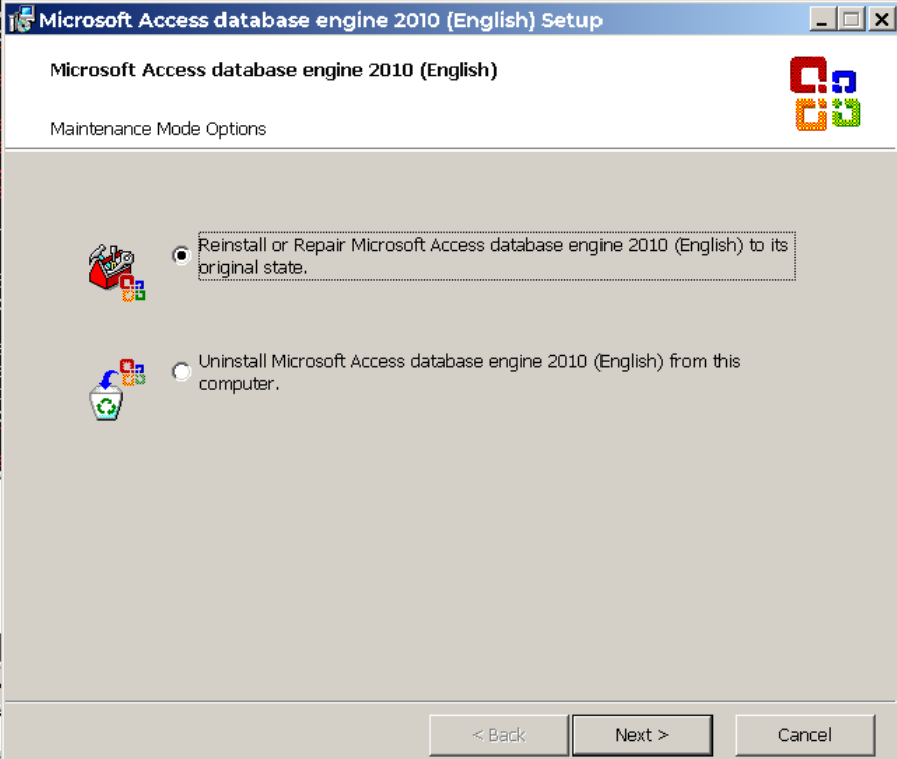
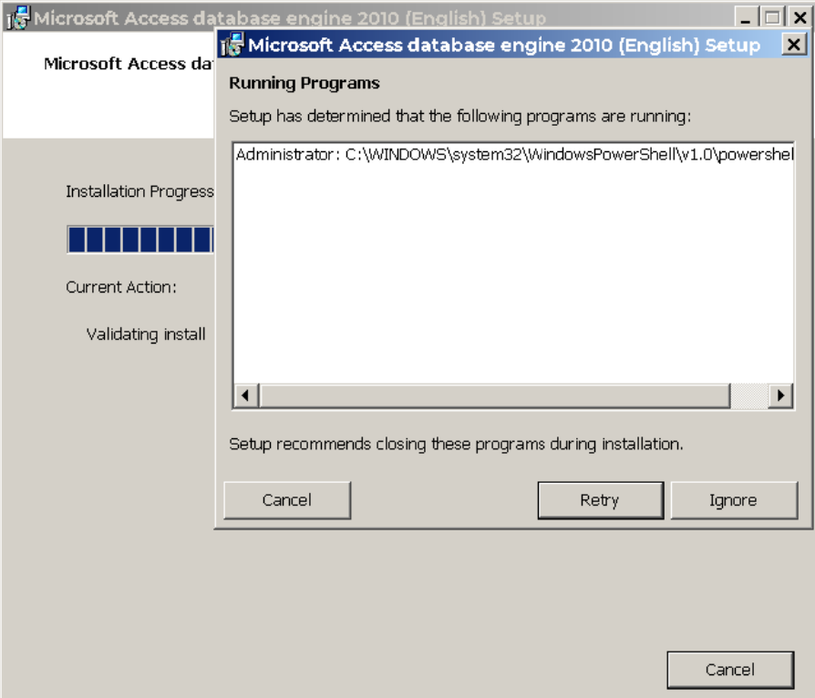

* install / reinstall __Microsoft Access Database Engine__ __2010__ (AccessDatabaseEngine 14.0.6119.5000): 





resulting in refresh of the class registration
```text
HKEY_CLASSES_ROOT\Microsoft.ACE.OLEDB.12.0
CLLSID {3BE786A0-0366-4F5C-9434-25CF162E475E}
```

```text
 REGEDIT4

[HKEY_CLASSES_ROOT\CLSID\{3BE786A0-0366-4F5C-9434-25CF162E475E}]
"OLEDB_SERVICES"=dword:fffffffe
@="Microsoft.ACE.OLEDB.12.0"

[HKEY_CLASSES_ROOT\CLSID\{3BE786A0-0366-4F5C-9434-25CF162E475E}\ExtendedErrors]
@="Microsoft.ACE.OLEDBErrors.12.0"

[HKEY_CLASSES_ROOT\CLSID\{3BE786A0-0366-4F5C-9434-25CF162E475E}\ExtendedErrors\{3BE786A0-0366-4F5C-9434-25CF162E475F}]
@="Microsoft.ACE.OLEDBErrors.12.0"

[HKEY_CLASSES_ROOT\CLSID\{3BE786A0-0366-4F5C-9434-25CF162E475E}\InprocServer32]
@="C:\\Program Files\\Common Files\\Microsoft Shared\\OFFICE14\\ACEOLEDB.DLL"
"ThreadingModel"="Both"

[HKEY_CLASSES_ROOT\CLSID\{3BE786A0-0366-4F5C-9434-25CF162E475E}\OLE DB Provider]
@="Microsoft Office 12.0 Access Database Engine OLE DB Provider"

[HKEY_CLASSES_ROOT\CLSID\{3BE786A0-0366-4F5C-9434-25CF162E475E}\ProgID]
@="Microsoft.ACE.OLEDB.12.0"

```

```text
 Directory of C:\Program Files\Common Files\Microsoft Shared\OFFICE14

03/08/2013  04:59 PM           378,072 ACEOLEDB.DLL
               1 File(s)        378,072 bytes
               0 Dir(s)   4,501,422,080 bytes free

```
```powershell
. .\excel_data_source.ps1
```
````text
row:1
row:

Name        Value
----        -----
id          4
destination Alaska
guid
booking_url ''
port        Seattle, WA
route
date
done        FALSE
server


row:2
row:

Name        Value
----        -----
id          5
destination Hawaii
guid
booking_url ''
port        Los Angeles, CA
route
date
done        -1
server


row:3
row:

Name        Value
----        -----
id          6
destination Bermuda
guid
booking_url ''
port        Miami, FL
route
date
done        -1
server


row:4
row:

Name        Value
----        -----
id          7
destination Caribbean
guid
booking_url
port        Los Angeles, CA
route
date
done        -1
server


Setting guild to f3a35940-8da7-4306-b71c-7f4907a83756 for id = 7
prepare: UPDATE [TestConfiguration$] SET [guid] = @guid WHERE [id] = @id where column SQL: @id
update column: @guid
Update query: UPDATE [TestConfiguration$] SET [guid] = f3a35940-8da7-4306-b71c-
7f4907a83756 WHERE [id] = 7
Update result: 1
1
prepare: UPDATE [TestConfiguration$] SET [booking_url] = @booking_url WHERE [guid] = @guid
where column SQL: @guid
update column: @booking_url
Update query: UPDATE [TestConfiguration$] SET [booking_url] = http://www.carnival.com/itinerary/2-day-baja-mexico-cruise/los-angeles/imagination/2-days/la0/?nmGuests=2&destination=all-destinations&dest=any&datFrom=032015&datTo=042017 WHERE [guid] = f3a35940-8da7-4306-b71c-7f4907a83756
Update result: 1
1
prepare: UPDATE [TestConfiguration$] SET [done] = @done WHERE [guid] = @guid where column SQL: @guid
update column: @done
Update query: UPDATE [TestConfiguration$] SET [done] = True WHERE [guid] = f3a3
5940-8da7-4306-b71c-7f4907a83756
Update result: 1
1

````
NORE: cannot run multiple instances

if the second console is run, the error is:

```text

Exception calling "Fill" with "1" argument(s): "The Microsoft Access database engine cannot open or write to the file ''. It is already opened exclusively byanother user, or you need permission to view and write its data."
At C:\developer\sergueik\powershell_samples\excel_data_source.ps1:143 char:29
+   [void]$ole_db_adapter.Fill <<<< ($local:data_table)
    + CategoryInfo          : NotSpecified: (:) [], MethodInvocationException
    + FullyQualifiedErrorId : DotNetMethodException


// the script continues to run ignoring the error

Exception calling "Open" with "0" argument(s): "The Microsoft Access database engine cannot open or write to the file ''. It is already opened exclusively by another user, or you need permission to view and write its data."
At C:\developer\sergueik\powershell_samples\excel_data_source.ps1:147 char:25
+   $local:connection.open <<<< ()
    + CategoryInfo          : NotSpecified: (:) [], MethodInvocationException
    + FullyQualifiedErrorId : DotNetMethodException

Exception calling "ExecuteReader" with "0" argument(s): "ExecuteReader requires an open and available Connection. The connection's current state is closed."
At C:\developer\sergueik\powershell_samples\excel_data_source.ps1:149 char:53
+   $global:data_reader = $local:command.ExecuteReader <<<< ()
    + CategoryInfo          : NotSpecified: (:) [], MethodInvocationException
    + FullyQualifiedErrorId : DotNetMethodException

You cannot call a method on a null-valued expression.
```
after the concurrent powershell console window is closed, repeating the command produces the healthy result
