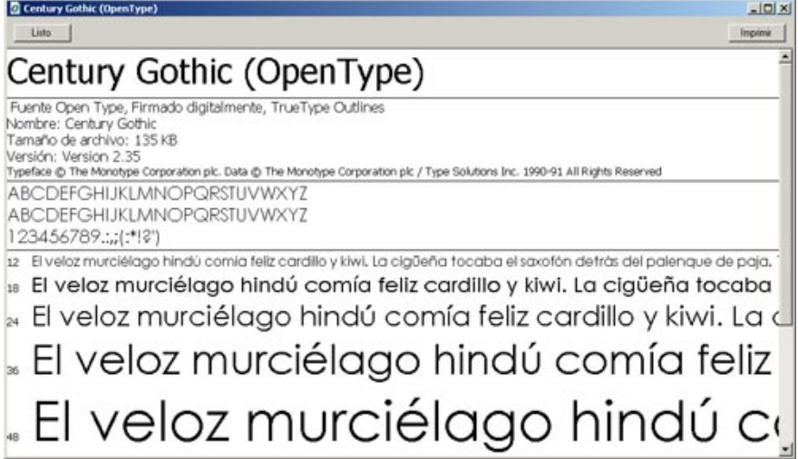
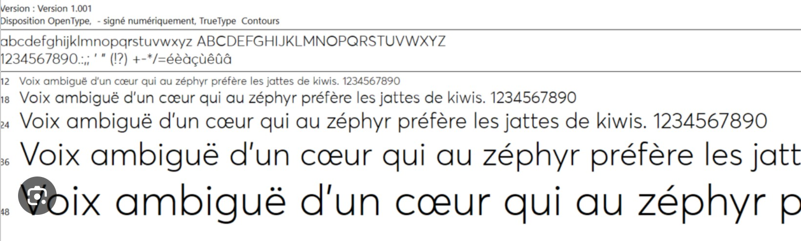
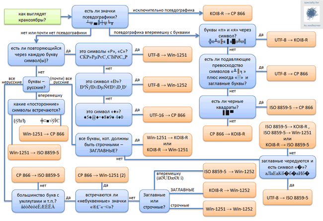

### Info

console tool to convert EBCDIC files to ASCII and vice versa

### Usage

```cmd
.\aec.exe -help
```
```text
Usage: aec -operation=[encode|decode] -data=<string> -inputfile=<filename> -outputfile=<filename>
```


```cmd
.\aec.exe -data=12345 -operation=encode
```
```text
EBCDIC bytes (hex): F1F2F3F4F5
```
```sh
.\aec.exe -data=F1F2F3F4F5 -operation=decode
```
```text
Converted back to ASCII: 12345
```

```cmd
echo 1234567890abcdefghijklmnopqrstuvwxyz>example.txt
```
.\aec.exe -inputfile=example.txt -operation=encode -outputfile=result.txt
```
```text
EBCDIC bytes (hex): F1F2F3F4F5F6F7F8F9F0818283848586878889919293949596979899A2A3A4A5A6A7A8A90D25
```

```cmd
type result.txt
```
```text
≥≤⌠⌡÷≈°∙≡üéâäàåçêëæÆôöòûùÿÖóúñѪº¿⌐
```


```cmd
.\aec.exe -inputfile=result.txt -operation=decode
```
```text
Converted back to ASCII: 1234567890abcdefghijklmnopqrstuvwxyz
```
#### Upstream Version


update `aec.exe.config` XML:
```xml
<configuration>
  <startup>
    <supportedRuntime version="v4.0" sku=".NETFramework,Version=v4.5" />
  </startup>
  <appSettings>
    <add key="sourcefilename" value="source.txt" />
    <add key="outputfilename" value="destination.txt" />
    <!-- ascii|ebcdic-->
    <add key="convertto" value="ascii" />

    <!-- ebcdic codepage-->
    <add key="codepage" value="IBM037" />

    <!-- for linebreak after n bytes -->
    <add key="crlf" value="true" />
    <add key="skipbytesforcrlf" value="3000" />
  </appSettings>
</configuration>
```
e.g.
```powershell
cd '.\bin\Debug'
$name = 'aec.exe.config'
$xml = [xml](get-content -path $name )
$xml.Normalize()
$xml.configuration.appSettings.add | where-object { $_.key -eq 'crlf'} | foreach-object { $_.value = 'false' }
$xml.SelectSingleNode(('/configuration/appSettings/add[@key="{0}"]' -f 'crlf')).value     = 'false'

$xml.configuration.appSettings.add | where-object { $_.key -eq 'convertto'} | foreach-object { $_.value = 'ebcdic' }
$xml.configuration.appSettings.add | where-object { $_.key -eq 'sourcefilename'} | foreach-object { $_.value = 'example.txt' }	
$xml.configuration.appSettings.add | where-object { $_.key -eq 'outputfilename'} | foreach-object { $_.value = 'output.txt' }
# display
$xml.configuration.appSettings.add
# Note: saves into wrong directory
$xml.Save( $name )
cd '..\..'
```
this will print
```text
key              value
---              -----
sourcefilename   example.txt
outputfilename   output.txt
convertto        ebcdic
codepage         IBM037
crlf             false
skipbytesforcrlf 3000
```
create a dummy text file 'example.txt':
```powershell
$sourcefilename = 'example.txt'
out-file -filepath $sourcefilename  -inputobject '0123456789abcdefghijklmnopqrstuvwxyz' -encoding ascii -force
get-content -path $sourcefilename
```
this will print
```text
0123456789abcdefghijklmnopqrstuvwxyz
```

### Building in IDE less Environment
```cmd
path=%path%;c:\Windows\Microsoft.NET\Framework\v4.0.30319
```
```cmd
msbuild.exe basic-ascii-ebcdic.sln /t:clean,build
```
```text
Done Building Project "Utils\Utils.csproj" (default targets).
Done Building Project "Program.csproj" (default targets).
Done Building Project "basic-ascii-ebcdic.sln" (clean;build target(s)).
```
run
```
bin\Debug\aec.exe
```
### CopyBook Processing Challenges

Why __EBCDIC__→ __ASCII__  Alone Is Insufficient for __COBOL__ Data Files.

When converting mainframe COBOL data files to a readable format, it is incorrect to assume the data contains plain text that can be safely decoded using a simple __EBCDIC__→ __ASCII__ conversion.

A __COBOL__ data file is typically a binary structured record, whose interpretation is entirely defined by its copybook. Example of real copybook data definition
```text
000100*                                                                        
000200*   DTAR020 IS THE OUTPUT FROM DTAB020 FROM THE IML                      
000300*   CENTRAL REPORTING SYSTEM                                             
000400*                                                                        
000500*   CREATED BY BRUCE ARTHUR  19/12/90                                    
000600*                                                                        
000700*   RECORD LENGTH IS 27.                                                 
000800*                                                                        
000900        03  DTAR020-KCODE-STORE-KEY.                                     
001000            05 DTAR020-KEYCODE-NO      PIC X(08).                        
001100            05 DTAR020-STORE-NO        PIC S9(03)   COMP-3.              
001200        03  DTAR020-DATE               PIC S9(07)   COMP-3.              
001300        03  DTAR020-DEPT-NO            PIC S9(03)   COMP-3.              
001400        03  DTAR020-QTY-SOLD           PIC S9(9)    COMP-3.              
001500        03  DTAR020-SALE-PRICE         PIC S9(9)V99 COMP-3.              
```

Only fields defined as DISPLAY (e.g. `PIC X`, `PIC 9`) contain __EBCDIC__-encoded text or zoned decimal data that can be meaningfully converted to __ASCII__.
Many other fields — especially those defined as `COMP`,`COMP-3` (packed decimal),`COMP-5`but also binary counters, flags, or redefined areas are not text at all and must never be decoded as __ASCII__.

Attempting a blanket __EBCDIC__→ __ASCII__ conversion across the entire record will inevitably produce:

unreadable characters, control symbols, apparently viewable as a  *corrupted* output:
```text
66664028< ????*68654621< ????*63694264< ?c
                                          r*63604361< ????62634259< ????62634259< ????60684429< ??<??60684037< ??<r*69694875< ??<r*69694875< ??<r*69694875< ??<r*69694875< ??<r)69694875< ??<r)69694875< ??<r)63604108< ???*63694928< ??<??60634765< ??<??69664668< ??i*
```
even though the underlying data is perfectly valid. The Correct conversion therefore requires:

* Exact knowledge of the copybook structure
* Byte-accurate field offsets and lengths
* Field-type-aware decoding

DISPLAY → EBCDIC → ASCII

COMP / COMP-3 → binary / packed decimal decoding

In practice, the copybook is not optional metadata — it is the schema of the file.
Without it, the data cannot be interpreted correctly.

This is precisely why tools such as 

 * [coboltojson](https://github.com/bmTas/CobolToJson)
 * [cb2xml](https://github.com/bmTas/cb2xml)
 * [JRecord](https://github.com/bmTas/JRecord)
 * [Cobrix](https://github.com/AbsaOSS/cobrix)
 * [LegStar](https://github.com/legsem/legstar-core2) 


exist: they apply copybook semantics to transform raw mainframe datasets into meaningful, readable representations (JSON, XML, relational rows).


### Packed Decimal `COMP-3` - Why It Matters

When working with mainframe COBOL data files, many numeric fields are stored using packed decimal, also known as `COMP-3`.

These fields do *NOT* contain text and must *NEVER* be decoded using an
 __EBCDIC__ → __ASCII__ code page based conversion (converting String to Byte and back).

---

### What Is `COMP-3`?

`COMP-3` is a binary numeric storage format that preserves exact decimal precision while using less space than character representations.

Key properties:

- Each decimal digit occupies one 4-bit nibble
- Two digits are packed into one byte
- The last nibble stores the sign

Sign nibbles:
- `C` = positive
- `D` = negative
- `F` = unsigned (commonly treated as positive)

---

### Storage Size Rule

The number of bytes occupied by a `COMP-3` field is calculated as: `bytes = ceil((number_of_digits + 1) / 2)`

The extra `+1` accounts for the sign nibble.

---

### Simple Example

__COBOL__ definition:
```
    PIC S9(7) COMP-3
```
says:

- 7 digits + sign nibble = 8 nibbles
- 8 nibbles / 2 = 4 bytes

For example a value: `+1234567`

Stored as hexadecimal bytes: `12 34 56 7C`
Nibble interpretation:
```text
    1 | 2 | 3 | 4 | 5 | 6 | 7 | C
```
---

### Implied Decimal Example

__COBOL__ definition:
```
    PIC S9(9)V99 COMP3
```
means:

- Total digits: 11
- Stored bytes: 6
- Decimal point is implied, not stored

Example stored value `00000123456C`  is  `1234.56`

---

### Why `COMP-3` Appears as "Garbage" in ASCII

Packed decimal bytes do not represent characters.

If `COMP-3` data is decoded as __ASCII__ or __EBCDIC__ , the output will contain:

- punctuation
- control characters
- unreadable symbols

This is *NOT* data corruption — it is binary numeric data being misinterpreted as text.

---

### Critical Rule

Only `DISPLAY` fields may be decoded as text.
`COMP-3` fields must be decoded numerically first.

Correct processing flow:
```text
    Raw bytes
      ├─ DISPLAY        → EBCDIC → ASCII
      └─ COMP / COMP-3  → binary numeric decode
                           ↓
                       formatted text (JSON / CSV / logs)
```


---

### Why the Copybook Is Mandatory

The copybook defines:
- field offsets
- field lengths
- storage formats (`DISPLAY` vs `COMP-3`)
- implied decimals
- signed vs unsigned values

Without the copybook, a __COBOL__ data file cannot be correctly interpreted.

The copybook is not documentation — it is __the__ schema.

---

### Practical Consequence

Blind __EBCDIC__ → __ASCII__ conversion of a COBOL data file will:

- partially work for `DISPLAY` fields
- always fail for `COMP-3` fields
- produce misleading output

This is why copybook-aware tools exist:

- [coboltojson](https://github.com/bmTas/CobolToJson)
- [cb2xml](https://github.com/bmTas/cb2xml)
- [JRecord](https://github.com/bmTas/JRecord)
- [Cobrix](https://github.com/AbsaOSS/cobrix)
- [LegStar](https://github.com/legsem/legstar-core2) 

### Illustration

Consider the following *visual* copybook with a single `DISPLAY` field that repeats clearly, followed by one `COMP-3` field.

```text
01 VISUAL-RECORD.
   05 VIS-TEXT     PIC X(8).
   05 VIS-AMOUNT   PIC S9(7)V99 COMP-3.
```

it will contain
```text
VIS-TEXT   = "69684558"
VIS-AMOUNT = +12345.67
```   

HEX:
```hex
F6 F9 F6 F8 F4 F5 F5 F8   12 34 56 7C
```

Breakdown:

| Bytes	              | Meaning                                  |
| ------------------- | ---------------------------------------- |
| `F6..F8`            | EBCDIC digits -&gt; readable after ASCII |
| `12` `34` `56` `7C` | COMP-3 packed decimal                    |

a blanket blind blank converison will show (the `COMP-3` part is console-encoding sensitive):
```txt
69684558??E?
69684558??E?
69684558??E?
```

### Validate

```cmd
.\aec.exe -operation:validate -codepage:IBM037 -data:F1F2F3F4F5F6F7F8F9 -debug
```
```text
valid
```


```cmd
.\aec.exe -operation:validate -codepage:IBM037 -data:F1F2F3F4F5F6F7F8F9F021 -debug
```
```text
invalid
invalid EBCDIC character 0x21 on 10
```
### Technical Details

EBCDIC has a weird layout but text tends to cluster:


```txt
space             :	0x40
lowercase letters :	0x81–0x89, 0x91–0x99, 0xA2–0xA9
uppercase letters : 0xC1–0xC9, 0xD1–0xD9, 0xE2–0xE9
digits            : 0xF0–0xF9
punctuation       : ~0x4A–0x6F
```			
This leads to  the following "in the range" probe:

```c#
    bool valid =
        charCode == 0x40 ||                     // space
        (charCode >= 0xF0 && charCode <= 0xF9) || // digits
        (charCode >= 0xC1 && charCode <= 0xC9) || // uppercase
        (charCode >= 0xD1 && charCode <= 0xD9) ||
        (charCode >= 0xE2 && charCode <= 0xE9) ||
        (charCode >= 0x81 && charCode <= 0x89) || // lowercase
        (charCode >= 0x91 && charCode <= 0x99) ||
        (charCode >= 0xA2 && charCode <= 0xA9) ||
        (charCode >= 0x4A && charCode <= 0x6F);  // punctuation window
```

### Full European Character Scan

to construct a full alphabet covering phrase in Eutopean languages, one may pick that language equivalent of "the quick brown fox" phrase:





to workaround unrecognized fallback character code errors, one has to provid additional accepted character codes:
```c#
	private static readonly Predicate<int> isEbcdicChar =
			delegate(int charCode) {
					return
		// space
		charCode == 0x40 ||
		// digits
		(charCode >= 0xF0 && charCode <= 0xF9) ||
		// uppercase letters
		(charCode >= 0xC1 && charCode <= 0xC9) || (charCode >= 0xD1 && charCode <= 0xD9)
		|| (charCode >= 0xE2 && charCode <= 0xE9) ||
		// lowercase letters
		(charCode >= 0x81 && charCode <= 0x89) || (charCode >= 0x91 && charCode <= 0x99)
		|| (charCode >= 0xA2 && charCode <= 0xA9) ||
		// basic punctuation
		(charCode >= 0x4A && charCode <= 0x6F) ||
		// generic fallback bytes for Western European characters
	    // NOTE: these represent accented letters or symbols outside ASCII,
		charCode == 0x45 ||charCode == 0xCE || charCode == 0xE9 || charCode == 0xD3 || charCode == 0xC7;
		};
```
this makes the tests pass:
```c#
		[Test]
		// NOTE: TestName is not supported prior to Nunit 3.x
		// [TestName("EBCDIC validation")]
		public void test3() {
			object[,] arguments = {
				{ "Spanish accented characters in CP1047", "El veloz murciélago hindú comía feliz cardillo y kixwi; la cigüeña tocaba el saxofón detrás del palenque de paja", true },
				{ "Canadian French accented characters in CP1047", "Voix ambiguë d’un cœur qui au zéphyr préfère les jattes de kiwi", true },
				// A typographic quote ’ or Euro sign € are not present in CP1047.
				// however they get replaced and tests pass
				 { "European banking text with Euro sign", "La banque européenne a reçu 100€ pour le dépôt", true },
				 { "European smart quote", "Voix ambiguë d’un cœur", true}

			};

			for (int i = 0; i < arguments.GetLength(0); i++) {

				string comment = (string)arguments[i, 0];
				string data = (string)arguments[i, 1];
				string codePage = "IBM037";
				bool result = (bool)arguments[i, 2];

				validate5(data, codePage, result, String.Format("{0} data={1}", comment, data));
			}
		}
		public void validate5(string input, string codePage, bool status, string comment){
		    byte[] data = Encoding.GetEncoding(codePage).GetBytes(input);
		    string hex = BitConverter.ToString(data).Replace("-", "");
		    ValidationResult result = Convertor.validateCore(data, codePage, Utils.Convertor.decodeEBCDIC, Utils.Convertor.getPredicate(codePage), .90);
		    Assert.IsNotNull(result);
		    Assert.AreEqual(status, result.Valid, String.Format("{0} input={1} hex={2} error={3}", comment, input, hex, result.Message));
		}

```

### See Also

  * [ASCII EBCDIC translation tables](http://www.simotime.com/asc2ebc1.htm)
  * [wiki](http://en.wikipedia.org/wiki/EBCDIC)
  * Online ASCII and EBCDIC bytes (in hex), and vice versa  [convertor](https://www.longpelaexpertise.com.au/toolsCode.php) and help recource
  * nodejs [module](https://github.com/Voakie/ebcdic-ascii) for converting between EBCDIC and ASCII (ISO-8859-1)
  * [ASCII-EBCDIC-Converter](https://github.com/adnanmasood/ASCII-EBCDIC-Converter) console tool
  * [how to convert between ASCII and EBCDIC character code](https://mskb.pkisolutions.com/kb/216399) with explicit convesion table (VB.net)
  * https://stackoverflow.com/questions/12490458/vb-net-c-ascii-to-ebcdic
  * https://learn.microsoft.com/en-us/host-integration-server/core/convert2
  * EBCDIC Converter [VS Code Extension](https://marketplace.visualstudio.com/items?itemName=coderAllan.vscode-ebcdicconverter) and [source](https://github.com/CoderAllan/vscode-ebcdicconverter) (nodejs)

  * famous chaos links

     + https://czyborra.com/charsets/cyrillic.html
     + https://www.i18nqa.com/debug/utf8-debug.html


     

Originalr:  __Кракозябры__ (means “gibberish / weird symbols”)
Broken versions:

 * __йПЮЙНГЪАПШ__ 
 * __Кракозябры__
 * __Êðàêîçÿáðû__

> NOTE: these *funny* epic strings come from interpreting the __same__ bytes under *different* arong ANSI Code Pages and produce *completely different glyphs depending on charset*
> NOTE: The __KOI8__ stripping turns Cyrillic into weird pseudo-English:
 “Код Обмена Информацией” → kOD oBMENA iNFORMACIEJ

An anecdotal story of A person becomes so used to mojibake that they can read it fluently

#### Code Pages

* DOS world (__CP866__)
* Unix world (__KOI8-R__)
* ISO attempt (__ISO-8859-5__)
* Windows takeover (__CP1251__)

Plus two unicode pages:

* __UTF-8__ - universaldefault, *except* Windows
* __UTF16__ - Windows default

In addition a lot of silent auto-conversion of clipboard text between Windows Unicode __UTF16__ and the "current OEM Code Page" or "system locale" (ACP) depending on context
```cmd
for /F %%f in ('dir /b') do echo %%f
```
Pipeline:

  * `dir` produces output using __OEM__ code page (e.g., __CP866__)
  * `for /F` parses text via __ANSI__ code page (__ACP__, e.g., __CP1251__ or worse __CP1252__)


### Author

[Serguei Kouzmine](mailto:kouzmine_serguei@yahoo.com)
