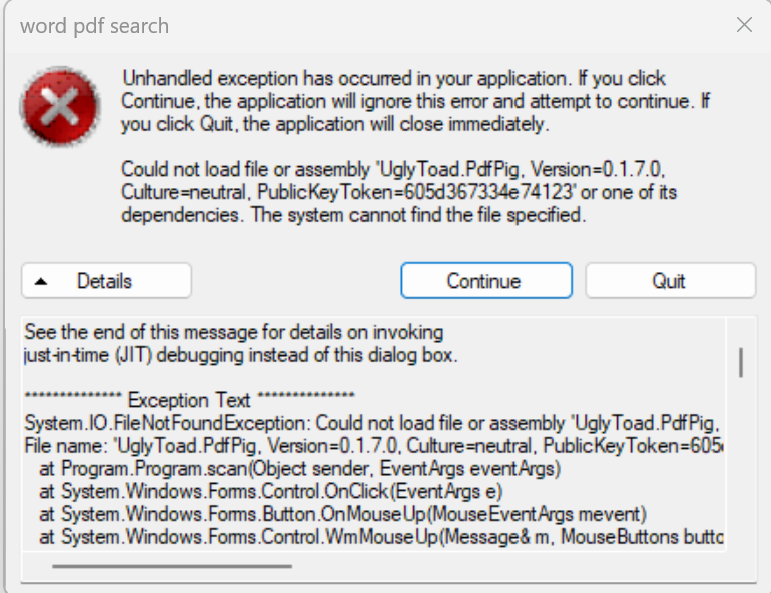
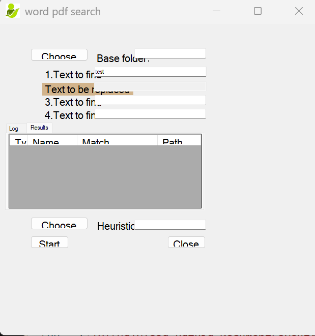
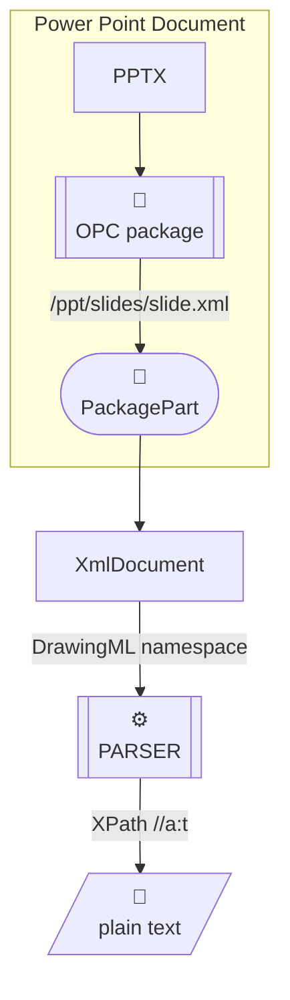

### Info

### Background

The missing input isn't really another search criterion. It is a search budget / termination policy.
bounded asynchronous filesystem traversal engine with pluggable result sinks
> NOTE: cancellation and inaccessible folders/files as first-class outcomes, immediate children of the selected root: concept it becomes a set of global counters + events. the traversal itself doesn't need to know why it has stopped

What to search

* Root folder — `BrowseForFolder`
* File mask —  e.g. `*.xml`, `invoice*.pdf`, etc.
* Content condition — literal text, regex, perhaps eventually metadata/size/date conditions.

**When to stop**

|Mode|Input|Meaning|
|----|-----|-------|
|File limit|N files|Stop after examining N files|
|Folder limit|N folders|Stop after visiting N top level directories, recursively|
|Time limit|N seconds/minutes|Stop when the elapsed-time budget expires|
|Unlimited|—|Search until the entire reachable tree is exhausted|

these condition could be composable, rather than mutually exclusive:

*Stop when any limit is reached*.

For example:

Search `\\server\share\department`, recursively, for `*.xml` containing `CUSTOMER_ID`, for up to 5,000 files, 10 top level folders, or 60 seconds — *whichever occurs first*.

That is much more appropriate for an SMB environment than pretending the user is doing a normal local Windows Explorer search.

### NPOI

> NOTE: __NPOI__ cannot read or process `.PDF` files (is designed exclusively to read, write, and manipulate Office documents without requiring Microsoft Office Interop) and despite what its official project description claims, is weak in handling `.PPT`/`.PPTX` files

### PdfPig
```sh
export V=0.1.7
curl -skLo ~/Downloads/pdfpig.$V.zip  https://www.nuget.org/api/v2/package/PdfPig/$V
unzip -ql ~/Downloads/pdfpig.$V.zip lib/net45/*
```
```text
  Length      Date    Time    Name
---------  ---------- -----   ----
    11776  2022-12-13 01:14   lib/net45/UglyToad.PdfPig.Package.pdb
    38400  2022-12-13 01:13   lib/net45/UglyToad.PdfPig.Core.dll
  4078080  2022-12-13 01:13   lib/net45/UglyToad.PdfPig.dll
   242688  2022-12-13 01:13   lib/net45/UglyToad.PdfPig.DocumentLayoutAnalysis.dll
  1068032  2022-12-13 01:13   lib/net45/UglyToad.PdfPig.Fonts.dll
    19968  2022-12-13 01:13   lib/net45/UglyToad.PdfPig.Tokenization.dll
    42496  2022-12-13 01:13   lib/net45/UglyToad.PdfPig.Tokens.dll
    13936  2022-12-13 01:13   lib/net45/UglyToad.PdfPig.Core.pdb
    59973  2022-12-13 01:13   lib/net45/UglyToad.PdfPig.Core.xml
    83760  2022-12-13 01:13   lib/net45/UglyToad.PdfPig.DocumentLayoutAnalysis.pdb
   383110  2022-12-13 01:13   lib/net45/UglyToad.PdfPig.DocumentLayoutAnalysis.xml
   101580  2022-12-13 01:13   lib/net45/UglyToad.PdfPig.Fonts.pdb
   246421  2022-12-13 01:13   lib/net45/UglyToad.PdfPig.Fonts.xml
     9032  2022-12-13 01:13   lib/net45/UglyToad.PdfPig.Tokenization.pdb
     9962  2022-12-13 01:13   lib/net45/UglyToad.PdfPig.Tokenization.xml
    11024  2022-12-13 01:13   lib/net45/UglyToad.PdfPig.Tokens.pdb
    37338  2022-12-13 01:13   lib/ne
   249992  2022-12-13 01:13   lib/net45/UglyToad.PdfPig.pdb
   577595  2022-12-13 01:13   lib/net45/UglyToad.PdfPig.xml
     4608  2022-12-13 01:14   lib/net45/UglyToad.PdfPig.Package.dll
      148  2022-12-13 01:14   lib/net45/UglyToad.PdfPig.Package.xml
```
```sh
mkdir -p packages/PdfPig.0.1.7/lib/net45
unzip -d packages/PdfPig.0.1.7 ~/Downloads/pdfpig.$V.zip lib/net45/*
```
```sh
find  packages/PdfPig.0.1.7/lib/net45/ -iname '*dll' -exec basename {} \;
```
```text
UglyToad.PdfPig.Core.dll
UglyToad.PdfPig.dll
UglyToad.PdfPig.DocumentLayoutAnalysis.dll
UglyToad.PdfPig.Fonts.dll
UglyToad.PdfPig.Package.dll
UglyToad.PdfPig.Tokenization.dll
UglyToad.PdfPig.Tokens.dll
```
For this tool it is not necessary to tarrget 64 bit, otherwise update to
```cmd
path=%path%;c:\Windows\Microsoft.NET\Framework\v4.0.30319
msuilb.exe WordFile.sln /T:Clean,Build
```

```cmd
Program\bin\Debug\WordFile.exe
```

### Troubleshooting

```xml
Log Name:      Application
Source:        Windows Error Reporting
Date:          10/4/2026 10:27:09 AM
Event ID:      1001
Task Category: None
Level:         Information
Keywords:      
User:          SERGUEIK59\kouzm
Computer:      sergueik59
Description:
Fault bucket 2018061923199287820, type 5
Event Name: PowerShell
Response: Not available
Cab Id: 0

Problem signature:
P1: powershell.exe
P2: 10.0.26100.9444
P3: System.IO.FileNotFoundException
P4: System.IO.FileNotFoundException
P5: unknown
P6: gram+<>c__DisplayClass1.<btnReplaceText_Click>b__0
P7: unknown
P8: 
P9: 
P10: 

Attached files:
\\?\C:\ProgramData\Microsoft\Windows\WER\Temp\WER.5ce829e5-df4e-4f5b-a57a-ad938245fe28.tmp.WERInternalMetadata.xml
\\?\C:\ProgramData\Microsoft\Windows\WER\Temp\WER.e4a4b3e8-0e04-4d04-a869-657d52abadb3.tmp.csv
\\?\C:\ProgramData\Microsoft\Windows\WER\Temp\WER.da1ebb52-25d5-4b8a-80c8-7ff12b474a5a.tmp.txt
\\?\C:\ProgramData\Microsoft\Windows\WER\Temp\WER.a824c9f5-d750-4dbe-8986-924a898b4da0.tmp.xml

These files may be available here:
\\?\C:\ProgramData\Microsoft\Windows\WER\ReportArchive\Critical_powershell.exe_1ec53acccea1864ea40be61c4bb92aeebea84e0_00000000_09707fbf-9632-4ad8-8aaf-fa8ff4b8fc78

Analysis symbol: 
Rechecking for solution: 0
Report Id: 09707fbf-9632-4ad8-8aaf-fa8ff4b8fc78
Report Status: 268435456
Hashed bucket: 8b36dee2444a2a6f8c0198a08309020c
Cab Guid: 0
Event Xml:
<Event xmlns="http://schemas.microsoft.com/win/2004/08/events/event">
  <System>
    <Provider Name="Windows Error Reporting" Guid="{0ead09bd-2157-539a-8d6d-c87f95b64d70}" />
    <EventID>1001</EventID>
    <Version>0</Version>
    <Level>4</Level>
    <Task>0</Task>
    <Opcode>0</Opcode>
    <Keywords>0x8000000000000000</Keywords>
    <TimeCreated SystemTime="2026-10-04T14:27:09.8247958Z" />
    <EventRecordID>39872</EventRecordID>
    <Correlation />
    <Execution ProcessID="18036" ThreadID="21568" />
    <Channel>Application</Channel>
    <Computer>sergueik59</Computer>
    <Security UserID="S-1-5-21-664078621-855368299-4271440980-1002" />
  </System>
  <EventData>
    <Data Name="Bucket">2018061923199287820</Data>
    <Data Name="BucketType">5</Data>
    <Data Name="EventName">PowerShell</Data>
    <Data Name="Response">Not available</Data>
    <Data Name="CabId">0</Data>
    <Data Name="P1">powershell.exe</Data>
    <Data Name="P2">10.0.26100.9444</Data>
    <Data Name="P3">System.IO.FileNotFoundException</Data>
    <Data Name="P4">System.IO.FileNotFoundException</Data>
    <Data Name="P5">unknown</Data>
    <Data Name="P6">gram+&lt;&gt;c__DisplayClass1.&lt;btnReplaceText_Click&gt;b__0</Data>
    <Data Name="P7">unknown</Data>
    <Data Name="P8">
    </Data>
    <Data Name="P9">
    </Data>
    <Data Name="P10">
    </Data>
    <Data Name="AttachedFiles">
\\?\C:\ProgramData\Microsoft\Windows\WER\Temp\WER.5ce829e5-df4e-4f5b-a57a-ad938245fe28.tmp.WERInternalMetadata.xml
\\?\C:\ProgramData\Microsoft\Windows\WER\Temp\WER.e4a4b3e8-0e04-4d04-a869-657d52abadb3.tmp.csv
\\?\C:\ProgramData\Microsoft\Windows\WER\Temp\WER.da1ebb52-25d5-4b8a-80c8-7ff12b474a5a.tmp.txt
\\?\C:\ProgramData\Microsoft\Windows\WER\Temp\WER.a824c9f5-d750-4dbe-8986-924a898b4da0.tmp.xml</Data>
    <Data Name="StorePath">\\?\C:\ProgramData\Microsoft\Windows\WER\ReportArchive\Critical_powershell.exe_1ec53acccea1864ea40be61c4bb92aeebea84e0_00000000_09707fbf-9632-4ad8-8aaf-fa8ff4b8fc78</Data>
    <Data Name="AnalysisSymbol">
    </Data>
    <Data Name="Rechecking">0</Data>
    <Data Name="ReportId">09707fbf-9632-4ad8-8aaf-fa8ff4b8fc78</Data>
    <Data Name="ReportStatus">268435456</Data>
    <Data Name="HashedBucket">8b36dee2444a2a6f8c0198a08309020c</Data>
    <Data Name="CabGuid">0</Data>
  </EventData>
</Event>
```
the referenced WER files are not always present: 
```text
Directory of C:\ProgramData\Microsoft\Windows\WER\ReportArchive

10/04/2026  10:27 AM    <DIR>          .
10/04/2026  10:27 AM    <DIR>          ..
10/04/2026  10:27 AM    <DIR>          Critical_powershell.exe_1ec53acccea1864ea40be61c4bb92aeebea84e0_00000000_09707fbf-9632-4ad8-8aaf-fa8ff4b8fc78
               0 File(s)              0 bytes
```
replacing the 
```powershell
$shared_assemblies  = @(
  'ICSharpCode.SharpZipLib.dll',
  'NPOI.OOXML.dll',
  'NPOI.OpenXml4Net.dll',
  'NPOI.dll',
  'UglyToad.PdfPig.DocumentLayoutAnalysis.dll',
  'UglyToad.PdfPig.dll'
)

```
with
```powershell
$shared_assemblies  = @(
  'ICSharpCode.SharpZipLib.dll',
  'NPOI.OOXML.dll',
  'NPOI.OpenXml4Net.dll',
  'NPOI.OpenXmlFormats.dll',
  'NPOI.dll',
  'UglyToad.PdfPig.Core.dll',
  'UglyToad.PdfPig.DocumentLayoutAnalysis.dll',
  'UglyToad.PdfPig.Fonts.dll',
  'UglyToad.PdfPig.Package.dll',
  'UglyToad.PdfPig.Tokenization.dll',
  'UglyToad.PdfPig.Tokens.dll',
  'UglyToad.PdfPig.dll'
)

```
finally the exception was made visible:



```text
See the end of this message for details on invoking 
just-in-time (JIT) debugging instead of this dialog box.

************** Exception Text **************
System.IO.FileNotFoundException: Could not load file or assembly 'UglyToad.PdfPig, Version=0.1.7.0, Culture=neutral, PublicKeyToken=605d367334e74123' or one of its dependencies. The system cannot find the file specified.
File name: 'UglyToad.PdfPig, Version=0.1.7.0, Culture=neutral, PublicKeyToken=605d367334e74123'
   at Program.Program.scan(Object sender, EventArgs eventArgs)
   at System.Windows.Forms.Control.OnClick(EventArgs e)
   at System.Windows.Forms.Button.OnMouseUp(MouseEventArgs mevent)
   at System.Windows.Forms.Control.WmMouseUp(Message& m, MouseButtons button, Int32 clicks)
   at System.Windows.Forms.Control.WndProc(Message& m)
   at System.Windows.Forms.ButtonBase.WndProc(Message& m)
   at System.Windows.Forms.Button.WndProc(Message& m)
   at System.Windows.Forms.NativeWindow.Callback(IntPtr hWnd, Int32 msg, IntPtr wparam, IntPtr lparam)

WRN: Assembly binding logging is turned OFF.
To enable assembly bind failure logging, set the registry value [HKLM\Software\Microsoft\Fusion!EnableLog] (DWORD) to 1.
Note: There is some performance penalty associated with assembly bind failure logging.
To turn this feature off, remove the registry value [HKLM\Software\Microsoft\Fusion!EnableLog].


************** Loaded Assemblies **************
mscorlib
    Assembly Version: 4.0.0.0
    Win32 Version: 4.8.9345.0 built by: NET481REL1LAST_25H2_C
    CodeBase: file:///C:/Windows/Microsoft.NET/Framework64/v4.0.30319/mscorlib.dll
----------------------------------------
Microsoft.PowerShell.ConsoleHost
    Assembly Version: 3.0.0.0
    Win32 Version: 10.0.26100.9278
    CodeBase: file:///C:/WINDOWS/Microsoft.Net/assembly/GAC_MSIL/Microsoft.PowerShell.ConsoleHost/v4.0_3.0.0.0__31bf3856ad364e35/Microsoft.PowerShell.ConsoleHost.dll
----------------------------------------
System
    Assembly Version: 4.0.0.0
    Win32 Version: 4.8.9340.0 built by: NET481REL1LAST_25H2_B
    CodeBase: file:///C:/WINDOWS/Microsoft.Net/assembly/GAC_MSIL/System/v4.0_4.0.0.0__b77a5c561934e089/System.dll
----------------------------------------
System.Core
    Assembly Version: 4.0.0.0
    Win32 Version: 4.8.9347.0 built by: NET481REL1LAST_25H2_B
    CodeBase: file:///C:/WINDOWS/Microsoft.Net/assembly/GAC_MSIL/System.Core/v4.0_4.0.0.0__b77a5c561934e089/System.Core.dll
----------------------------------------
System.Management.Automation
    Assembly Version: 3.0.0.0
    Win32 Version: 10.0.26100.9444
    CodeBase: file:///C:/WINDOWS/Microsoft.Net/assembly/GAC_MSIL/System.Management.Automation/v4.0_3.0.0.0__31bf3856ad364e35/System.Management.Automation.dll
----------------------------------------
Microsoft.Management.Infrastructure
    Assembly Version: 1.0.0.0
    Win32 Version: 10.0.26100.7309
    CodeBase: file:///C:/WINDOWS/Microsoft.Net/assembly/GAC_MSIL/Microsoft.Management.Infrastructure/v4.0_1.0.0.0__31bf3856ad364e35/Microsoft.Management.Infrastructure.dll
----------------------------------------
System.Xml
    Assembly Version: 4.0.0.0
    Win32 Version: 4.8.9340.0 built by: NET481REL1LAST_25H2_B
    CodeBase: file:///C:/WINDOWS/Microsoft.Net/assembly/GAC_MSIL/System.Xml/v4.0_4.0.0.0__b77a5c561934e089/System.Xml.dll
----------------------------------------
System.Management
    Assembly Version: 4.0.0.0
    Win32 Version: 4.8.9221.0 built by: NET481REL1LAST_25H2
    CodeBase: file:///C:/WINDOWS/Microsoft.Net/assembly/GAC_MSIL/System.Management/v4.0_4.0.0.0__b03f5f7f11d50a3a/System.Management.dll
----------------------------------------
System.DirectoryServices
    Assembly Version: 4.0.0.0
    Win32 Version: 4.8.9221.0 built by: NET481REL1LAST_25H2
    CodeBase: file:///C:/WINDOWS/Microsoft.Net/assembly/GAC_MSIL/System.DirectoryServices/v4.0_4.0.0.0__b03f5f7f11d50a3a/System.DirectoryServices.dll
----------------------------------------
System.Numerics
    Assembly Version: 4.0.0.0
    Win32 Version: 4.8.9221.0 built by: NET481REL1LAST_25H2
    CodeBase: file:///C:/WINDOWS/Microsoft.Net/assembly/GAC_MSIL/System.Numerics/v4.0_4.0.0.0__b77a5c561934e089/System.Numerics.dll
----------------------------------------
System.Data
    Assembly Version: 4.0.0.0
    Win32 Version: 4.8.9221.0 built by: NET481REL1LAST_25H2
    CodeBase: file:///C:/WINDOWS/Microsoft.Net/assembly/GAC_64/System.Data/v4.0_4.0.0.0__b77a5c561934e089/System.Data.dll
----------------------------------------
System.Configuration
    Assembly Version: 4.0.0.0
    Win32 Version: 4.8.9221.0 built by: NET481REL1LAST_25H2
    CodeBase: file:///C:/WINDOWS/Microsoft.Net/assembly/GAC_MSIL/System.Configuration/v4.0_4.0.0.0__b03f5f7f11d50a3a/System.Configuration.dll
----------------------------------------
Anonymously Hosted DynamicMethods Assembly
    Assembly Version: 0.0.0.0
    Win32 Version: 4.8.9345.0 built by: NET481REL1LAST_25H2_C
    CodeBase: file:///C:/WINDOWS/Microsoft.Net/assembly/GAC_64/mscorlib/v4.0_4.0.0.0__b77a5c561934e089/mscorlib.dll
----------------------------------------
Microsoft.PowerShell.Security
    Assembly Version: 3.0.0.0
    Win32 Version: 10.0.26100.1
    CodeBase: file:///C:/WINDOWS/Microsoft.Net/assembly/GAC_MSIL/Microsoft.PowerShell.Security/v4.0_3.0.0.0__31bf3856ad364e35/Microsoft.PowerShell.Security.dll
----------------------------------------
System.Transactions
    Assembly Version: 4.0.0.0
    Win32 Version: 4.8.9221.0 built by: NET481REL1LAST_25H2
    CodeBase: file:///C:/WINDOWS/Microsoft.Net/assembly/GAC_64/System.Transactions/v4.0_4.0.0.0__b77a5c561934e089/System.Transactions.dll
----------------------------------------
Microsoft.PowerShell.PSReadLine
    Assembly Version: 3.0.0.0
    Win32 Version: 10.0.26100.9278
    CodeBase: file:///C:/Program%20Files/WindowsPowerShell/Modules/PSReadLine/2.0.0/Microsoft.PowerShell.PSReadLine.dll
----------------------------------------
Microsoft.CSharp
    Assembly Version: 4.0.0.0
    Win32 Version: 4.8.9221.0
    CodeBase: file:///C:/WINDOWS/Microsoft.Net/assembly/GAC_MSIL/Microsoft.CSharp/v4.0_4.0.0.0__b03f5f7f11d50a3a/Microsoft.CSharp.dll
----------------------------------------
Microsoft.PowerShell.Commands.Management
    Assembly Version: 3.0.0.0
    Win32 Version: 10.0.26100.9278
    CodeBase: file:///C:/WINDOWS/Microsoft.Net/assembly/GAC_MSIL/Microsoft.PowerShell.Commands.Management/v4.0_3.0.0.0__31bf3856ad364e35/Microsoft.PowerShell.Commands.Management.dll
----------------------------------------
System.Configuration.Install
    Assembly Version: 4.0.0.0
    Win32 Version: 4.8.9221.0 built by: NET481REL1LAST_25H2
    CodeBase: file:///C:/WINDOWS/Microsoft.Net/assembly/GAC_MSIL/System.Configuration.Install/v4.0_4.0.0.0__b03f5f7f11d50a3a/System.Configuration.Install.dll
----------------------------------------
Microsoft.PowerShell.Commands.Utility
    Assembly Version: 3.0.0.0
    Win32 Version: 10.0.26100.9278
    CodeBase: file:///C:/WINDOWS/Microsoft.Net/assembly/GAC_MSIL/Microsoft.PowerShell.Commands.Utility/v4.0_3.0.0.0__31bf3856ad364e35/Microsoft.PowerShell.Commands.Utility.dll
----------------------------------------
vubv2qfv
    Assembly Version: 0.0.0.0
    Win32 Version: 4.8.9340.0 built by: NET481REL1LAST_25H2_B
    CodeBase: file:///C:/WINDOWS/Microsoft.Net/assembly/GAC_MSIL/System/v4.0_4.0.0.0__b77a5c561934e089/System.dll
----------------------------------------
System.Windows.Forms
    Assembly Version: 4.0.0.0
    Win32 Version: 4.8.9325.0 built by: NET481REL1LAST_25H2_C
    CodeBase: file:///C:/WINDOWS/Microsoft.Net/assembly/GAC_MSIL/System.Windows.Forms/v4.0_4.0.0.0__b77a5c561934e089/System.Windows.Forms.dll
----------------------------------------
System.Drawing
    Assembly Version: 4.0.0.0
    Win32 Version: 4.8.9221.0 built by: NET481REL1LAST_25H2
    CodeBase: file:///C:/WINDOWS/Microsoft.Net/assembly/GAC_MSIL/System.Drawing/v4.0_4.0.0.0__b03f5f7f11d50a3a/System.Drawing.dll
----------------------------------------
Accessibility
    Assembly Version: 4.0.0.0
    Win32 Version: 4.8.9221.0 built by: NET481REL1LAST_25H2
    CodeBase: file:///C:/WINDOWS/Microsoft.Net/assembly/GAC_MSIL/Accessibility/v4.0_4.0.0.0__b03f5f7f11d50a3a/Accessibility.dll
----------------------------------------

************** JIT Debugging **************
To enable just-in-time (JIT) debugging, the .config file for this
application or computer (machine.config) must have the
jitDebugging value set in the system.windows.forms section.
The application must also be compiled with debugging
enabled.

For example:

<configuration>
    <system.windows.forms jitDebugging="true" />
</configuration>

When JIT debugging is enabled, any unhandled exception
will be sent to the JIT debugger registered on the computer
rather than be handled by this dialog box.


```
does not help
### Packaging Notes

* The scanner/searcher has a deliberately narrow responsibility: traverse files, inspect what is necessary, and dump runs/results as plain text.
* It does not need to become an Office automation framework, document-generation framework, PDF-processing platform, etc.
* Therefore every *additional* dependency should have a concrete *reason to exist* in that component.
* If NPOI is sufficient for the Office-reading/writing portion, there is little architectural value in continuously chasing every new NPOI release merely because releases exist.
* Also, A PDF dependency can remain undecided until the actual PDF requirement is established.
* The fact that NPOI continues to evolve does not automatically mean that the scanner should continuously evolve with it
* the actual scanner logic may be almost embarrassingly small:
```
document
   │
   ▼
POI proxy
   │
   └── ToString()
         │
         ├── useful text → emit
         │
         └── otherwise → known Regex matcher
```

When filling the candidate slot for PDF, it is good to remember:

**PDF reading ≠ PDF engineering.**

If the QA tool already has a PDF helper library to confirm “yes, this downloaded object is a valid PDF,” that same library is quite possibly capable of producing a textual dump of a PDF.

No reason to consider a heavyweight PDF creation/manipulation framework merely because there is a need to “grep” a PDF.

### Running From Powershell ISE

```sh
cp WordFileTool/packages/NPOI.2.5.0/lib/net45/*dll .
cp WordFileTool/packages/SharpZipLib.1.2.0/lib/net45/*dll .
cp WordFileTool/packages/PdfPig.0.1.7/lib/net45/*dll .
```
launch Powershell console

```powershell
. .\wordfiletool.ps1
```
ignore the error message:
```text
Add-Type : Unable to load one or more of the requested types. Retrieve the LoaderExceptions property for more information.
At ..\wordfiletool.ps1:32 char:5
+     Add-Type -Path $_
+     ~~~~~~~~~~~~~~~~~
    + CategoryInfo          : NotSpecified: (:) [Add-Type], ReflectionTypeLoad
   Exception
    + FullyQualifiedErrorId : System.Reflection.ReflectionTypeLoadException,Microsoft.PowerShell.Commands.AddTypeCommand

```
> NOTE: only first launch succeeds drawing theform. The subsqeuent runs print error
```text
Exception calling "Main" with "0" argument(s): "SetCompatibleTextRenderingDefault must be called before the first IWin32Window object is created in the application."
At ..\wordfiletool.ps1:460 char:1
+ [Program.Program]::Main()
```


Open Powershell ISE. Paste the script into Edit pane and run.

> NOTE: screen dimensions are wrong:



### Printing Power Point Slides


### See Also

  * https://github.com/hanzhaoxin/ExcelReport - currently on .netstandard, but commit [f3988](https://github.com/hanzhaoxin/ExcelReport/tree/f3988ec14003d2a167552144f458d2a774bcd4bd/ExcelReport) - is .net 4.0 version and see also [project documentation](http://www.cnblogs.com/hanzhaoxin/tag/ExcelReport)
  * [nuget npoi 2.8.1](https://www.nuget.org/packages/npoi/#supportedframeworks-body-tab) supports .Net __4.7.2__. For [Npoi.Extend](https://www.nuget.org/packages/NPOI.Extend/1.0.4) one has to use much older version __1.0.4__ - latest is __1.1.3__ but only list __netstandard 2.0__ which is basically the same but incompatible

  * https://github.com/WuLex/WordFileTool
  * https://github.com/ToolsByXLG/NPOI.Word2Html
  * https://github.com/IS4Code/npoi -
  * https://www.nuget.org/packages/npoi/
  * [nissl-lab/POIFSExplorer](https://github.com/nissl-lab/POIFSExplorer) - NPOI based tool helps you explore internal structure of OLE2(ActiveX) documents, including
    + `.xls` __Excel__ document
    + `.doc` __Word__ document
    + `.ppt` __Powerpoint__ document
  * [nissl-lab/OLE2Storage](https://github.com/nissl-lab/OLE2Storage) -  straight (pure-no COM interop) .NET IStorge interface library to read/write __OLE2__(ActiveX) document

  * https://hackernoon.com/comparing-apache-npoi-and-ironxl-in-c-a-complete-guide
  * For Text Extraction & Parsing - best option is [PdfPig](https://www.nuget.org/packages/PdfPig/0.1.7#supportedframeworks-body-tab)
  * [PdfPig Wiki](https://github.com/UglyToad/PdfPig/wiki)
  * [NPOI Tutorials](https://nissl-lab.github.io/npoi/) - non-free
     + Extract text from XLSX
  * https://github.com/nissl-lab/npoi-tutorial/blob/main/advanced-examples-list.md - non-free
     + `ExtractStringsFromXls`
     + `ExtractTextFromXlsx`
  * [toxy](https://github.com/nissl-lab/toxy) - newer versions that [1.6.1.1](https://www.nuget.org/packages/Toxy/1.6.1.1) do not support .Net Framework
     + `Powerpoint2007TextParserTest.cs`
     + `Powerpoint2007SlideshowParserTest.cs`
  * https://github.com/nissl-lab/npoi has some support for PPTX:
     + `TestPOIXMLDocument.cs`

---
### TLDR
[Neuschwanstein Castle](https://en.wikipedia.org/wiki/Neuschwanstein_Castle) in southern Germany is the famous
fairytale palace that inspired Disney's [Cinderella](https://en.wikipedia.org/wiki/Cinderella_Castle) and [Sleeping Beauty](https://en.wikipedia.org/wiki/Sleeping_Beauty_Castle) Magic
Kindom Orlando Disney World castles

---
### Author
[Serguei Kouzmine](mailto:kouzmine_serguei@yahoo.com)
