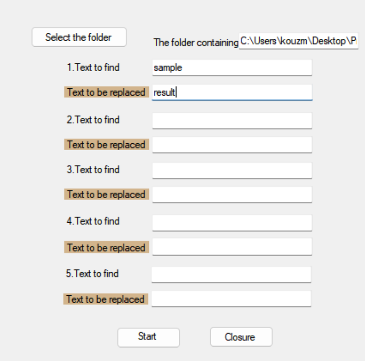
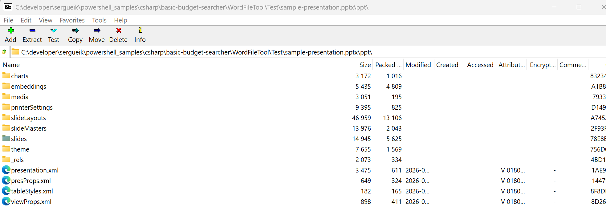
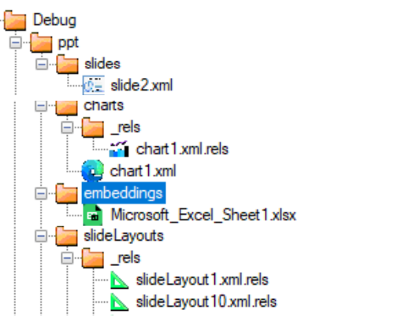
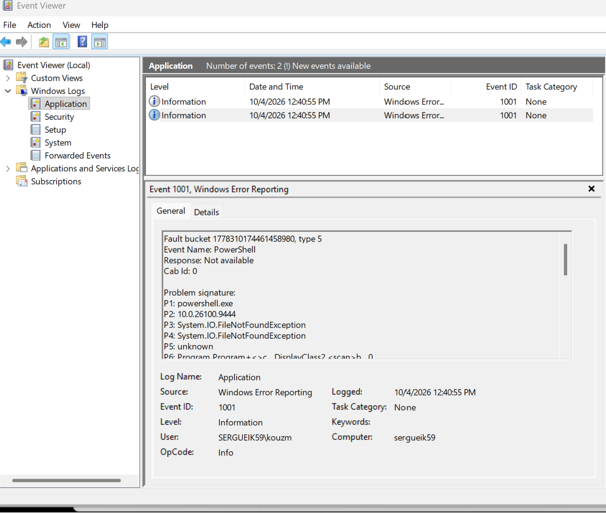
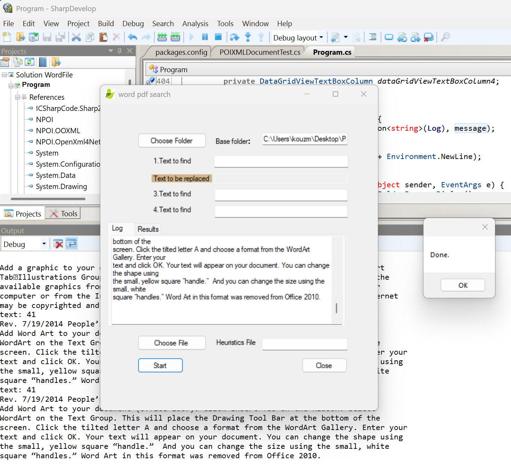
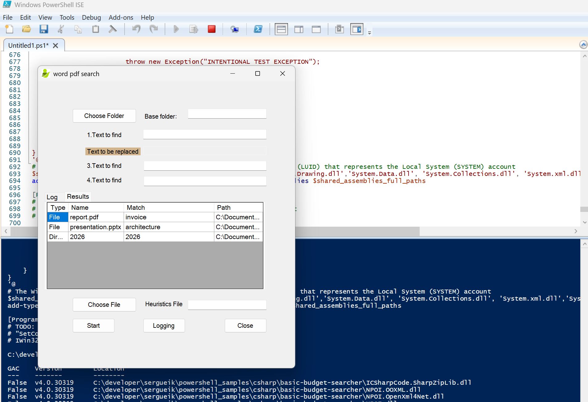
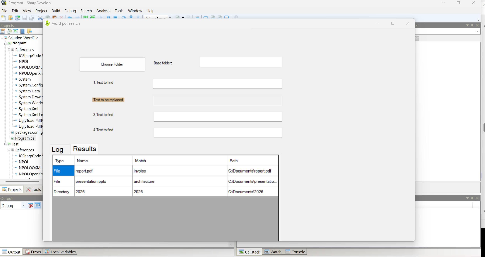

### Info



The Office document formats are themselves hierarchical object/package systems, and most of the objects are 
__structural__ rather 
than __business-data-bearing__.

| Enterprise artifact       | Dominant structure                                                            | Where the interesting data tends to live                                |
| ------------------------- | ----------------------------------------------------------------------------- | ----------------------------------------------------------------------- |
| SharePoint directory      | Deep hierarchy of folders/files                                               | Individual files                                                        |
| Enterprise Excel workbook | Workbook → worksheets → rows/columns → cells, plus filters/charts/tables      | **Cells and formulas**, with a lot of presentation/metadata around them |
| Word document             | Package → document parts → sections → paragraphs → runs → relationships, etc. | **Text/content-bearing runs, tables, images**                           |
| PowerPoint                | Presentation → slides → shapes → text runs/tables/charts/images, etc.         | **Text inside shapes, tables, chart data, images**                      |
| Visio                     | Document/package → pages → shapes → masters → relationships/data properties   | **Shape text, properties, connectors, geometry/data**                   |


| Enterprise artifact       | Dominant structure                                                            | Where the interesting data tends to live                                |
| ------------------------- | ----------------------------------------------------------------------------- | ----------------------------------------------------------------------- |
| SharePoint directory      | Deep hierarchy of folders/files                                               | Individual files                                                        |
| Enterprise Excel workbook | Workbook → worksheets → rows/columns → cells, plus filters/charts/tables      | **Cells and formulas**, with a lot of presentation/metadata around them |
| Word document             | Package → document parts → sections → paragraphs → runs → relationships, etc. | **Text/content-bearing runs, tables, images**                           |
| PowerPoint                | Presentation → slides → shapes → text runs/tables/charts/images, etc.         | **Text inside shapes, tables, chart data, images**                      |
| Visio                     | Document/package → pages → shapes → masters → relationships/data properties   | **Shape text, properties, connectors, geometry/data**                   |

```text
A       B       C       D       ...       AI
┌───────┬───────┬───────┬───────┬─────────┐
│ Dept  │ Owner │ Status│ Date  │ ...     │
├───────┼───────┼───────┼───────┼─────────┤
│ ...                                          
│ ...                                          
└───────┴───────┴───────┴───────┴─────────┘

             ↓

       filters / views
             ↓
       boss's expected view
```


A typical enterprise Excel workbook has the feel of a vintage object: dozens of columns, filters, views, formatting, protection and accumulated conventions wrapped around relatively simple data. Its complexity is not necessarily algorithmic complexity; it is accumulated operational complexity

Office-format version of compilation:

A huge amount of representation machinery can describe a relatively small semantic object


Serialized complexity, presentation complexity, and semantic complexity are three different quantities.

OPC/XML complexity ≠ document semantic complexity ≠ business-process complexity.

In some cases, the ratio can indeed feel comically large — 10 MB of Office machinery → a hundred lines of Mermaid that tell you what the thing actually does.


invisible machinery physically observable.

The experiment is almost comically simple:

* Open a nontrivial Visio diagram
* Select *anything*  with the mouse
* Drag it a *tiny distance*
* Wait for __AutoSave__ do its thing
* Compare the file before and after

The surprising result is that a microscopic human action can cause a disproportionate amount of document machinery to be rewritten.

What moved on screen?

One shape, perhaps three pixels.

What Visio has to maintain?

> Shape position, page geometry, relationships, layout state, XML serialization, package parts, possibly timestamps/metadata, and whatever dependent structures Visio considers necessary to preserve the document's consistency.

And this is particularly good evidence for your broader point because you didn't ask Visio to do any of that explicitly. You didn't say

Visio has the serialization complexity of a sophisticated execution-oriented system without having the execution semantics that would justify it.

| Artifact                     | Looks like                  | What the underlying system is actually optimized to provide |
| ---------------------------- | --------------------------- | ----------------------------------------------------------- |
| Visio diagram                | Flow/process                | **A drawing**                                               |
| Jenkins pipeline             | Flow/process                | **Reliable execution of automation**                        |
| Blue Prism / UiPath workflow | Flow/process                | **Reliable execution of automation**                        |
| GitOps configuration         | Declarative structure/graph | **Reproducible system state and controlled deployment**     |
| n8n workflow                 | Flow diagram                | **Executable integration**                                  |


Key Reasons for the Switch

• Version Control & Auditability: Traditional XML job configurations lived inside the Jenkins controller's internal database or UI. Moving to a Groovy-based Jenkinsfile allowed teams to store build logic directly in Git alongside their application source code.
• Resilience and Restart Recovery: Groovy pipelines use a Continuation-Passing Style (CPS) engine. This lets Jenkins save execution state after every step, meaning a long-running job can resume right where it left off if the Jenkins master crashes or restarts.
• Reusability and Shared Libraries: XML configurations led to massive code and step duplication across hundreds of jobs. Groovy enables custom shared libraries, loops, conditional logic, and functions that can be imported and reused across multiple pipelines.
• Complex Flow Control: Freestyle and XML jobs struggled with multi-branch logic, dynamic parallel stages, and complex dependency chains. Groovy-based pipelines provide native support for parallel execution, error handling (try/catch/finally or post blocks), and dynamic parameterization.
• Multi-User Collaboration: Editing jobs via the Jenkins web GUI made it hard to track who changed what or test changes safely. Writing Groovy in a local IDE allows developers to review, branch, and test pipeline changes through pull requests.

concentration" is exactly the interesting metric here, with one historical qualification: Jenkins did not literally replace all XML with Groovy. Jenkins still has XML internally and historically used Jelly for UI/plugin views. The important architectural shift was moving the user-authored definition of automation toward Groovy-based Pipeline/Job DSL and, crucially, into source-controlled code.

That produced a remarkable change in the ratio:

semantic content / total representation

A useful conceptual comparison is:
__Visio__:

```
large serialized artifact
    ↓
lots of geometry
styles
relationships
IDs
layout
metadata
package machinery
    ↓
relatively small process meaning

```
__Jenkins Pipeline__:
```
Jenkinsfile
    ↓
stages
steps
conditions
parallelism
agents
credentials
post-actions
    ↓
very high semantic density
```


And it also explains why Jenkins' move was perceived as such a large architectural step: the artifact became much closer to the thing it describes.

A Visio diagram says:

* *"Here is a picture representing this process."*

A `Jenkinsfile` says, approximately:

* *"Here is the process." *

That is a huge difference in semantic concentration.


"Military intelligence" evokes a large apparatus of collection, classification, reporting, clearance, protocols, and bureaucracy surrounding what may ultimately be a relatively small amount of actionable knowledge.

That maps nicely onto the distinction you've been building:

a large volume of machinery surrounding a small semantic payload.

So you could use it as a deliberately playful analogy:

Jelly-era Jenkins was a little like "military intelligence": a lot of machinery and protocol around a relatively small amount of operational knowledge. The move toward Groovy/Pipeline-as-Code increased the concentration of that knowledge in the artifact itself.

And that is more precise than saying simply "XML was verbose." The issue isn't verbosity by itself. It's:

How much of the artifact is actually expressing the thing you care about?

__Visio__:  large machinery → emembers IDE state, supports extra functionality like live collaboration - relatively small semantic description

__Jenkins 1.x__/__Jelly__: large "SOAP rank" machinery/protocol → relatively small behavioral description

__Jenkins 2.x__  / `Jenkinsfile`: relatively compact "code style" artifact  → comparatively dense behavioral semantics

| Artifact                        | Representation overhead                                                                                                | Semantic concentration                       |
| ------------------------------- | ---------------------------------------------------------------------------------------------------------------------- | -------------------------------------------- |
| **Visio**                       | Large machinery → remembers IDE/document state, layout, geometry, relationships, collaboration and other functionality | **Relatively small semantic description**    |
| **Jenkins 1.x / Jelly**         | Large **enterprise/SOAP-era machinery and protocol** → UI/configuration machinery around the job                       | **Relatively small behavioral description**  |
| **Jenkins 2.x / `Jenkinsfile`** | Relatively compact, **code-style artifact**                                                                            | **Comparatively dense behavioral semantics** |


A sole developer may reasonably think:

"I have a diagram. I want to edit it and save it."

They don't necessarily need the system to maintain a sophisticated collaborative state such as:
> 
```code
sequenceDiagram
  participant Alice
  participant Bob

  Alice->>Bob: "😵‍💫 Hey!<br/>Do not touch that node."
  Bob->>Alice: "😐 I am not touching it."
  Bob-->>Bob: "😕 I am dragging it."
  Alice-->>Alice: "🥱 I can see Bob dragging it.<br/>I'll wait."
  Bob->>Alice: "😌 Hold on - I haven't dropped it yet."
```
```mermaid
sequenceDiagram
  participant Alice
  participant Bob

  Alice->>Bob: "😵‍💫 Hey!<br/>Do not touch that node."
  Bob->>Alice: "😐 I am not touching it."
  Bob-->>Bob: "😕 I am dragging it."
  Alice-->>Alice: "🥱 I can see Bob dragging it.<br/>I'll wait."
  Bob->>Alice: "😌 Hold on - I haven't dropped it yet."
  ```

> unlike an abstract architectural diagram, this example is immediately recognizable to anyone who has experienced collaborative editing. The absurdity is precisely that "Bob is dragging it but hasn't dropped it" is a transient UI state that nevertheless has to be represented, synchronized, rendered and communicated to Alice.

```text
A ---> B ---> C
      business process

       ↑
       |
  "That's Bob."
       |
   [photo from 5 years ago]
       |
   HR / identity / directory
       |
   migrations / synchronization /
   profile provisioning / SSO /
   collaboration infrastructure
```
That is an impressive product capability — but it illustrates your semantic-density point beautifully

> System can spend enormous engineering effort making an interaction reliable without 
> making the underlying business process any more meaningful, executable, or valuable

The artifact/system may carry substantial machinery for:
  
  * live presence
  * concurrent editing
  * transient object state
  * conflict handling
  * synchronization
  * permissions
  * persistence
  * undo/redo
  * layout
  * rendering
  * relationships
  * compatibility

Yet the business meaning of the diagram might still be:

```mermaid
flowchart LR

A --> B --> C
````
The Visio collaboration machinery can be enormous; the semantic description of the collaboration scenario is five lines of Mermaid.

That makes your broader argument almost self-demonstrating:

A large artifact can contain an enormous amount of machinery around a surprisingly small amount of meaning.


He'd already posted for the 20th; apparently he was saving the next post for when the anniversary became a square.

Wake up. It's the 25th anniversary.
Hmm. I already used the really good anniversary post on the 20th.
Nothing particularly new has happened in the intervening five years.
But I'm still proud of that moment, so why not point back to it?

pattern is:

Make the Office application the center of the universe, then make every surrounding requirement its responsibility.

So Visio becomes responsible for:

drawing;
document persistence;
layout;
collaboration;
undo/history;
object identity;
protection;
compatibility;
presentation;
embedded objects;
metadata;
synchronization;
etc.

And Word/PowerPoint accumulate analogous universes of responsibility.

That produces the combination you are calling:

grand unification + geocentric illusion

hereas the newer tooling ecosystems tend to split the concerns:

Git          → history / identity / collaboration
CI/CD        → execution
GitOps       → desired state / deployment
workflow     → orchestration
database     → structured data
diagram      → visualization
document     → presentation

Him: “Please open the document — click here, go to this sheet, scroll down… so I can see you edit it.”

Me: facepalm - accepts the fortune

### Catalog of Power Point Inner Directory

|Document Part  | Content Type |
|---------------|--------------|
|`/ppt/charts/chart1.xml`|`application/vnd.openxmlformats-officedocument.drawingml.chart+xml`|
|`/ppt/embeddings/Microsoft_Excel_Sheet1.xlsx`|`application/vnd.openxmlformats-officedocument.spreadsheetml.sheet`|
|`/ppt/media/image1.png`|`image/png`|
|`/ppt/presProps.xml`|`application/vnd.openxmlformats-officedocument.presentationml.presProps+xml`|
|`/ppt/printerSettings/printerSettings1.bin`|`application/vnd.openxmlformats-officedocument.presentationml.printerSettings`|
|`/ppt/slideLayouts/slideLayout1.xml`|`application/vnd.openxmlformats-officedocument.presentationml.slideLayout+xml`|
|`/ppt/slideLayouts/slideLayout10.xml`|`application/vnd.openxmlformats-officedocument.presentationml.slideLayout+xml`|
|`/ppt/slideMasters/slideMaster1.xml`|`application/vnd.openxmlformats-officedocument.presentationml.slideMaster+xml`|
|`/ppt/slides/slide1.xml`|`application/vnd.openxmlformats-officedocument.presentationml.slide+xml`|
|`/ppt/slides/slide2.xml`|`application/vnd.openxmlformats-officedocument.presentationml.slide+xml`|
|`/ppt/tableStyles.xml`|`application/vnd.openxmlformats-officedocument.presentationml.tableStyles+xml`|
|`/ppt/theme/theme1.xml`|`application/vnd.openxmlformats-officedocument.theme+xml`|
|`/ppt/viewProps.xml`|`application/vnd.openxmlformats-officedocument.presentationml.viewProps+xml`|

to explicitly confirm



```cmd
"c:\Program Files\7-Zip\7z.exe" l sample-presentation.pptx | awk.exe "{print $NF}"
```

produces listing

```text
sample-presentation.pptx


Name
------------------------
[Content_Types].xml
_rels\.rels
docProps\core.xml
docProps\app.xml
ppt\presentation.xml
ppt\_rels\presentation.xml.rels
ppt\presProps.xml
ppt\viewProps.xml
ppt\theme\theme1.xml
ppt\tableStyles.xml
ppt\slideMasters\slideMaster1.xml
ppt\slideMasters\_rels\slideMaster1.xml.rels
ppt\slideLayouts\slideLayout11.xml
ppt\slideLayouts\_rels\slideLayout11.xml.rels
ppt\slideLayouts\slideLayout1.xml
ppt\slideLayouts\_rels\slideLayout1.xml.rels
ppt\slideLayouts\slideLayout2.xml
ppt\slideLayouts\_rels\slideLayout2.xml.rels
ppt\slideLayouts\slideLayout3.xml
ppt\slideLayouts\_rels\slideLayout3.xml.rels
ppt\slideLayouts\slideLayout4.xml
ppt\slideLayouts\_rels\slideLayout4.xml.rels
ppt\slideLayouts\slideLayout5.xml
ppt\slideLayouts\_rels\slideLayout5.xml.rels
ppt\slideLayouts\slideLayout6.xml
ppt\slideLayouts\_rels\slideLayout6.xml.rels
ppt\slideLayouts\slideLayout7.xml
ppt\slideLayouts\_rels\slideLayout7.xml.rels
ppt\slideLayouts\slideLayout8.xml
ppt\slideLayouts\_rels\slideLayout8.xml.rels
ppt\slideLayouts\slideLayout9.xml
ppt\slideLayouts\_rels\slideLayout9.xml.rels
ppt\slideLayouts\slideLayout10.xml
ppt\slideLayouts\_rels\slideLayout10.xml.rels
ppt\printerSettings\printerSettings1.bin
ppt\slides\slide1.xml
ppt\slides\_rels\slide1.xml.rels
ppt\slides\slide2.xml
ppt\slides\_rels\slide2.xml.rels
ppt\slides\slide3.xml
ppt\slides\_rels\slide3.xml.rels
ppt\slides\slide4.xml
ppt\slides\_rels\slide4.xml.rels
ppt\slides\slide5.xml
ppt\slides\_rels\slide5.xml.rels
ppt\charts\chart1.xml
ppt\charts\_rels\chart1.xml.rels
ppt\embeddings\Microsoft_Excel_Sheet1.xlsx
ppt\slides\slide6.xml
ppt\slides\_rels\slide6.xml.rels
ppt\media\image1.png
ppt\slides\slide7.xml
ppt\slides\_rels\slide7.xml.rels
ppt\slides\slide8.xml
ppt\slides\_rels\slide8.xml.rels
docProps\thumbnail.jpeg
```

look into one of slides:
```cmd
"c:\Program Files\7-Zip\7z.exe" x sample-presentation.pptx ppt\slides\slide2.xml
```
> NOTE: `x` will recreate folders; `e` will flatten




```text
Scanning the drive for archives:
1 file, 41840 bytes (41 KiB)

Extracting archive: sample-presentation.pptx
--
Path = sample-presentation.pptx
Type = zip
Physical Size = 41840

Everything is Ok

Size:       1145
Compressed: 41840

```
```cmd
xml fo ppt\slides\slide2.xml

```
```xml
<?xml version="1.0" encoding="UTF-8" standalone="yes"?>
<p:sld xmlns:a="http://schemas.openxmlformats.org/drawingml/2006/main" 
       xmlns:p="http://schemas.openxmlformats.org/presentationml/2006/main" 
       xmlns:r="http://schemas.openxmlformats.org/officeDocument/2006/relationships">
  <p:cSld>
    <p:spTree>
      <p:nvGrpSpPr>
        <p:cNvPr id="1" name=""/>
        <p:cNvGrpSpPr/>
        <p:nvPr/>
      </p:nvGrpSpPr>
      <p:grpSpPr/>
      <p:sp>
        <p:nvSpPr>
          <p:cNvPr id="2" name="Title 1"/>
          <p:cNvSpPr>
            <a:spLocks noGrp="1"/>
          </p:cNvSpPr>
          <p:nvPr>
            <p:ph type="title"/>
          </p:nvPr>
        </p:nvSpPr>
        <p:spPr/>
        <p:txBody>
          <a:bodyPr/>
          <a:lstStyle/>
          <a:p>
            <a:r>
              <a:t>Agenda</a:t>
            </a:r>
          </a:p>
        </p:txBody>
      </p:sp>
      <p:sp>
        <p:nvSpPr>
          <p:cNvPr id="3" name="Content Placeholder 2"/>
          <p:cNvSpPr>
            <a:spLocks noGrp="1"/>
          </p:cNvSpPr>
          <p:nvPr>
            <p:ph idx="1"/>
          </p:nvPr>
        </p:nvSpPr>
        <p:spPr/>
        <p:txBody>
          <a:bodyPr/>
          <a:lstStyle/>
          <a:p>
            <a:r>
              <a:t>Introduction</a:t>
            </a:r>
          </a:p>
          <a:p>
            <a:r>
              <a:t>Project goals</a:t>
            </a:r>
          </a:p>
          <a:p>
            <a:r>
              <a:t>Quarterly results</a:t>
            </a:r>
          </a:p>
          <a:p>
            <a:r>
              <a:t>Roadmap</a:t>
            </a:r>
          </a:p>
          <a:p>
            <a:r>
              <a:t>Questions &amp; answers</a:t>
            </a:r>
          </a:p>
        </p:txBody>
      </p:sp>
    </p:spTree>
  </p:cSld>
  <p:clrMapOvr>
    <a:masterClrMapping/>
  </p:clrMapOvr>
</p:sld>
```

```cmd
xml.exe sel -t -v "//*[.=\"Product A\"]" chart1.xml
```

```xml
Product A
Product A
Product A
```
```cmd
xml.exe sel -t -c "//*[.=\"Product A\"]" chart1.xml
```
```xml
<c:strCache 
  xmlns:c="http://schemas.openxmlformats.org/drawingml/2006/chart" 
  xmlns:a="http://schemas.openxmlformats.org/drawingml/2006/main" 
  xmlns:r="http://schemas.openxmlformats.org/officeDocument/2006/relationships">
    <c:ptCount val="1"/>
      <c:pt idx="0">
        <c:v>Product A</c:v>
      </c:pt>
    </c:strCache>
<c:pt 
  xmlns:c="http://schemas.openxmlformats.org/drawingml/2006/chart" 
  xmlns:a="http://schemas.openxmlformats.org/drawingml/2006/main" 
  xmlns:r="http://schemas.openxmlformats.org/officeDocument/2006/relationships" idx="0">
    <c:v>Product A</c:v>
  </c:pt>
<c:v 
  xmlns:c="http://schemas.openxmlformats.org/drawingml/2006/chart" 
  xmlns:a="http://schemas.openxmlformats.org/drawingml/2006/main" 
  xmlns:r="http://schemas.openxmlformats.org/officeDocument/2006/relationships">Product A</c:v>

```

that the conceptual storage model survived the transition almost intact; what changed dramatically was the container/access mechanism.

The code makes that visible because the old world is not merely “a file containing some binary stuff.” It exposes a storage hierarchy through IStorage / IStream, with enumeration, opening streams, opening nested storages, etc. For example, your code literally does EnumElements() and then OpenStream() on the returned element names.

I would construct the table around conceptual model vs. physical/container technology:

| Aspect                            | Legacy Structured Storage / OLE Compound File                              | OOXML / Open XML                                                      | What actually changed?                        |
| --------------------------------- | -------------------------------------------------------------------------- | --------------------------------------------------------------------- | --------------------------------------------- |
| **Document model**                | Container holding named internal objects                                   | Container holding named internal parts                                | **Very little conceptually**                  |
| **Mental model**                  | “A file system inside a file”                                              | “A directory tree inside a file”                                      | Essentially the same useful abstraction       |
| **Internal organization**         | Storages and streams                                                       | Directories and files/parts                                           | **Vocabulary and implementation changed**     |
| **Hierarchy**                     | `IStorage` can contain streams and other `IStorage` objects                | ZIP entries have hierarchical path names such as `/word/document.xml` | Same tree-like idea                           |
| **Directory enumeration**         | `IStorage.EnumElements()`                                                  | ZIP central directory / ZIP API enumeration                           | Same operation at a higher level              |
| **Read an internal object**       | `IStorage.OpenStream(name, ...)`                                           | Open ZIP entry and read its bytes                                     | Same basic operation                          |
| **Extract an internal object**    | Read `IStream` through COM                                                 | Extract/read ZIP entry                                                | Much simpler modern interface                 |
| **Create a container**            | `StgCreateDocfile()`                                                       | Create a ZIP package                                                  | Different container technology                |
| **Nested container**              | `OpenStorage()`                                                            | Path prefix / directory-like ZIP entries                              | Similar hierarchy, different representation   |
| **Object metadata**               | `STATSTG`: name, type, size, timestamps, etc.                              | ZIP entry metadata + OPC/package metadata                             | Similar infrastructure role                   |
| **Object types**                  | `STGTY_STORAGE`, `STGTY_STREAM`, `STGTY_ILOCKBYTES`, etc.                  | Files/entries plus XML relationships                                  | OOXML uses much simpler primitives            |
| **Navigation API**                | COM interfaces, HRESULTs, marshaling, `STATSTG`, explicit resource release | Ordinary ZIP APIs / streams                                           | **Huge simplification**                       |
| **Access technology**             | Windows COM / Structured Storage                                           | Standard ZIP tooling + XML APIs                                       | **Major modernization**                       |
| **Typical programmer experience** | “Talk to a storage system”                                                 | “Open a ZIP and read files”                                           | Dramatically more accessible                  |
| **Portability**                   | Strongly tied to Microsoft/OLE technology                                  | ZIP/XML are broadly standardized technologies                         | Major improvement                             |
| **Document semantics**            | Mostly opaque application-defined streams                                  | XML parts + explicit relationships                                    | **This is where OOXML really adds structure** |
| **Application-level structure**   | Embedded binary streams and application-specific formats                   | XML parts, relationships, media, metadata, etc.                       | Much more inspectable/interoperable           |


### Historical background

During the 1990s and early 2000s, Microsoft had strong incentives to preserve rather than redesign many established document technologies.

The company was simultaneously moving its operating-system base from DOS/Windows 9x toward the NT lineage and Windows 2000/XP, maintaining compatibility across old and new APIs, supporting multiple processor architectures, and dealing with the associated compatibility layers, calling-convention changes, and **thunking** between execution environments. At the same time, Office had an enormous installed base and a very large ecosystem of documents, applications, macros, integrations, and third-party tooling.

In that environment, a complete reinvention of the Office document container was not necessarily the highest-value engineering project. Office still had to ship new releases, while preserving compatibility with an enormous amount of existing content.

This helps explain an interesting continuity between the generations of Office formats.

The older Office formats used Microsoft's **Structured Storage / Compound File** technology: a document was effectively a container holding named internal storages and streams. The programming model exposed that hierarchy through COM interfaces such as `IStorage`, `IStream`, and `IEnumSTATSTG`.

The newer Open XML formats changed the container technology dramatically, but retained the useful high-level idea: **an Office document is a package containing many independently addressable internal parts**.

The important difference was that the new package used an ordinary ZIP container rather than the much more specialized Microsoft Structured Storage machinery.

In other words:

> **Microsoft changed the shipping container without abandoning the idea of shipping a document as a collection of internal parts.**

The old API could enumerate elements, open a named stream, read it through an `IStream`, and expose metadata through `STATSTG`. For example, the legacy code in this project opens a Structured Storage document, enumerates its elements, and then opens individual streams by name.

The modern equivalent is conceptually much less exotic:

```text
ZIP package
    |
    +-- list entries
    |
    +-- open entry
    |
    +-- read bytes
    |
    +-- extract entry
```

Thus, the most important continuity is not that the old and new Office formats are technically identical. They are not. The continuity is the **package/container view of a document**:

```text
        DOCUMENT
           |
     collection of parts
           |
    +------+------+
    |             |
  old           new
    |             |
Compound File    ZIP
Structured       Open XML /
Storage          OPC
    |             |
IStorage         ZIP/package APIs
IStream          ordinary streams
COM              ordinary files/entries
```

The newer format therefore looks radically more modern at the API level while preserving a surprisingly familiar underlying document-storage metaphor.

There was also a substantial amount of engineering effort spent carrying the Microsoft software stack across processor architectures. DEC Alpha was an ambitious move onto a fundamentally different 64-bit architecture, but never became a mainstream desktop platform. It was followed by Itanium, another technically ambitious 64-bit architecture that ultimately had little relevance to ordinary Office users. By the time AMD64/x86-64 arrived, the problem looked much more practical: retain the enormous x86 software investment while extending the architecture to 64 bits.

From the perspective of Office, much of this work was infrastructure rather than visible product improvement. The application still had to ship, compatibility still mattered, and the platform underneath it kept changing. There was therefore considerable incentive to keep the established document machinery working rather than spend a release cycle replacing a container technology that, although ugly and proprietary, was already doing its job.

I would actually not say “finally AMD solved 32/64” in the README. The technically interesting distinction is tha

Alpha → Itanium → AMD64 was not merely a sequence of CPU releases; it represented three very different answers to the 64-bit transition. Alpha and Itanium required Microsoft to support architectures substantially foreign to the enormous x86 software ecosystem. AMD64/x86-64 finally offered a much more economical path: extend x86 while preserving the existing programming model and investment. Once that transition was underway, another complete reinvention of Office's document container was hardly the obvious place to spend scarce engineering effort.


Microsoft repeatedly preferred evolutionary compatibility when the installed base was enormous.

|OS/platform side       |          Office/document side     |
|-----------------------|-----------------------------------|
|DOS → NT → 2000 → XP <br/>compatibility     |         Compound Storage → OOXML<br/>compatibility  |
| x86 → Alpha → Itanium <br/>↘ <br/>AMD64        |    old Office formats<br/>↘ <br/> ZIP/Open XML |
|                                big investment in <br/>existing software | preserve the useful<br/>document/package model |
                
“thunking” belongs in that story: all those transitions weren't just recompiling code. 
There were compatibility boundaries, ABI/calling-convention issues, data-model differences, 16/32-bit transitions, and architecture-specific adaptation layers. So your intuition about the era being full of “make the old world continue to work while we move underneath it” is quite apt.


Engineering capacity was being consumed by several extraordinarily difficult platform transitions, some of which produced little visible benefit to an Office user.

That is a much more interesting argument.

And then you can make your "feature degradation" point:

Where the engineering effort went
Where the engineering effort went

It is easy, looking backward from modern software, to underestimate how expensive the platform transitions of the 1990s and early 2000s were.

Supporting a new processor architecture is not ordinary application development. It involves compilers, ABIs, calling conventions, operating-system kernels, drivers, debuggers, runtime libraries, binary compatibility, data models, and compatibility layers. Microsoft pursued several such transitions, including the difficult and ultimately unsuccessful Alpha and Itanium directions, before AMD64/x86-64 provided a much more evolutionary path from the enormous existing x86 software base.

The point here is not that Microsoft lacked talented engineers or money. Quite the opposite: these were areas where Microsoft could afford to employ exceptionally specialized engineering teams. The point is that even a very large engineering organization has finite attention. An engineer working on a CPU architecture transition, kernel compatibility, security infrastructure, or a new application platform is not simultaneously redesigning an Office document container.

The history of Windows Vista/Longhorn provides a useful contemporary illustration. Terry Crowley, writing from his experience in the Windows/Office organizations, describes major Windows engineering resources being consumed by the Windows XP security response and the transition to 64-bit computing, while another large organization was pursuing a new managed-code Windows platform. He also describes the subsequent realization that major Longhorn components were nowhere near ready and that removing them from the release effectively left the project starting over.

The result was not necessarily a shortage of engineering talent. It was a resource-allocation problem at enormous scale.

This provides useful context for seemingly conservative decisions elsewhere in the Microsoft product stack. A feature can remain old, awkward, or technically inelegant not because nobody knows how to improve it, but because the organization has repeatedly decided that other engineering problems have higher priority.

That is one possible explanation for why apparently unrelated parts of the Microsoft software stack could remain technologically conservative for surprisingly long periods.

In this context, the persistence of Structured Storage becomes less mysterious. The technology was proprietary and awkward to program, but it worked, Office depended on it, and replacing it competed for engineering resources with much larger platform transitions.

The eventual OOXML transition therefore looks less like:

“Microsoft finally discovered that documents should be collections of files.”

and more like:

“Microsoft finally had an opportunity to replace an exotic internal container mechanism with a conventional package format while retaining the basic document-as-a-package architecture.”

And the Vista article gives you a second, even stronger argument

The article isn't merely saying “lots of engineers were busy.” It describes competing grand projects:

64-bit Windows
security overhaul
managed C# infrastructure
WinFS
Avalon/WPF
WCF
universal storage / presentation infrastructure
and the existing Win32/Windows compatibility burden.

Crowley's description is particularly revealing because he says that the new infrastructure was being layered on top of existing OS infrastructure, making its performance costs additive rather than replacing the old system.

That gives you a nice conceptual distinction:
```text
                    MICROSOFT ENGINEERING CAPACITY
                              |
             +----------------+----------------+
             |                                 |
      PLATFORM TRANSITION                PRODUCT EVOLUTION
             |                                 |
     CPU architectures                 Office features
     64-bit Windows                    Office UI
     security                          Office internals
     managed code                      document formats
     WinFS / Avalon                    ...
     WCF
     compatibility
             |
             v
      extremely expensive
      specialized work
```
These were unusually specialized, capital-intensive engineering programs with very long feedback cycles.


### Background

The missing input isn't really another search criterion. It is a search budget / termination policy.
bounded asynchronous filesystem traversal engine with pluggable result sinks
> NOTE: cancellation and inaccessible folders/files as first-class outcomes, immediate children of the selected root: concept it becomes a set of global counters + events. the traversal itself doesn't need to know why it has stopped

What to search

* Root folder — `BrowseForFolder`
* File mask —  e.g. `*.xml`, `invoice*.pdf`, etc.
* Content condition — literal text, regex, perhaps eventually metadata/size/date conditions.

**When to stop**

|Mode|Input|Meaning|
|----|-----|-------|
|File limit|N files|Stop after examining N files|
|Folder limit|N folders|Stop after visiting N top level directories, recursively|
|Time limit|N seconds/minutes|Stop when the elapsed-time budget expires|
|Unlimited|—|Search until the entire reachable tree is exhausted|

these condition could be composable, rather than mutually exclusive:

*Stop when any limit is reached*.

For example:

Search `\\server\share\department`, recursively, for `*.xml` containing `CUSTOMER_ID`, for up to 5,000 files, 10 top level folders, or 60 seconds — *whichever occurs first*.

That is much more appropriate for an SMB environment than pretending the user is doing a normal local Windows Explorer search.

### NPOI

> NOTE: __NPOI__ cannot read or process `.PDF` files (is designed exclusively to read, write, and manipulate Office documents without requiring Microsoft Office Interop) and despite what its official project description claims, is weak in handling `.PPT`/`.PPTX` files

### PdfPig
```sh
export V=0.1.7
curl -skLo ~/Downloads/pdfpig.$V.zip  https://www.nuget.org/api/v2/package/PdfPig/$V
unzip -ql ~/Downloads/pdfpig.$V.zip lib/net45/*
```
```text
  Length      Date    Time    Name
---------  ---------- -----   ----
    11776  2022-12-13 01:14   lib/net45/UglyToad.PdfPig.Package.pdb
    38400  2022-12-13 01:13   lib/net45/UglyToad.PdfPig.Core.dll
  4078080  2022-12-13 01:13   lib/net45/UglyToad.PdfPig.dll
   242688  2022-12-13 01:13   lib/net45/UglyToad.PdfPig.DocumentLayoutAnalysis.dll
  1068032  2022-12-13 01:13   lib/net45/UglyToad.PdfPig.Fonts.dll
    19968  2022-12-13 01:13   lib/net45/UglyToad.PdfPig.Tokenization.dll
    42496  2022-12-13 01:13   lib/net45/UglyToad.PdfPig.Tokens.dll
    13936  2022-12-13 01:13   lib/net45/UglyToad.PdfPig.Core.pdb
    59973  2022-12-13 01:13   lib/net45/UglyToad.PdfPig.Core.xml
    83760  2022-12-13 01:13   lib/net45/UglyToad.PdfPig.DocumentLayoutAnalysis.pdb
   383110  2022-12-13 01:13   lib/net45/UglyToad.PdfPig.DocumentLayoutAnalysis.xml
   101580  2022-12-13 01:13   lib/net45/UglyToad.PdfPig.Fonts.pdb
   246421  2022-12-13 01:13   lib/net45/UglyToad.PdfPig.Fonts.xml
     9032  2022-12-13 01:13   lib/net45/UglyToad.PdfPig.Tokenization.pdb
     9962  2022-12-13 01:13   lib/net45/UglyToad.PdfPig.Tokenization.xml
    11024  2022-12-13 01:13   lib/net45/UglyToad.PdfPig.Tokens.pdb
    37338  2022-12-13 01:13   lib/ne
   249992  2022-12-13 01:13   lib/net45/UglyToad.PdfPig.pdb
   577595  2022-12-13 01:13   lib/net45/UglyToad.PdfPig.xml
     4608  2022-12-13 01:14   lib/net45/UglyToad.PdfPig.Package.dll
      148  2022-12-13 01:14   lib/net45/UglyToad.PdfPig.Package.xml
```
```sh
mkdir -p packages/PdfPig.0.1.7/lib/net45
unzip -d packages/PdfPig.0.1.7 ~/Downloads/pdfpig.$V.zip lib/net45/*
```
```sh
find  packages/PdfPig.0.1.7/lib/net45/ -iname '*dll' -exec basename {} \;
```
```text
UglyToad.PdfPig.Core.dll
UglyToad.PdfPig.dll
UglyToad.PdfPig.DocumentLayoutAnalysis.dll
UglyToad.PdfPig.Fonts.dll
UglyToad.PdfPig.Package.dll
UglyToad.PdfPig.Tokenization.dll
UglyToad.PdfPig.Tokens.dll
```
For this tool it is not necessary to tarrget 64 bit, otherwise update to
```cmd
path=%path%;c:\Windows\Microsoft.NET\Framework\v4.0.30319
msuilb.exe WordFile.sln /T:Clean,Build
```

```cmd
Program\bin\Debug\WordFile.exe
```

### Troubleshooting



The error 
```xml
Log Name:      Application
Source:        Windows Error Reporting
Date:          10/4/2026 10:27:09 AM
Event ID:      1001
Task Category: None
Level:         Information
Keywords:      
User:          SERGUEIK59\kouzm
Computer:      sergueik59
Description:
Fault bucket 2018061923199287820, type 5
Event Name: PowerShell
Response: Not available
Cab Id: 0

Problem signature:
P1: powershell.exe
P2: 10.0.26100.9444
P3: System.IO.FileNotFoundException
P4: System.IO.FileNotFoundException
P5: unknown
P6: gram+<>c__DisplayClass1.<btnReplaceText_Click>b__0
P7: unknown
P8: 
P9: 
P10: 

Attached files:
\\?\C:\ProgramData\Microsoft\Windows\WER\Temp\WER.5ce829e5-df4e-4f5b-a57a-ad938245fe28.tmp.WERInternalMetadata.xml
\\?\C:\ProgramData\Microsoft\Windows\WER\Temp\WER.e4a4b3e8-0e04-4d04-a869-657d52abadb3.tmp.csv
\\?\C:\ProgramData\Microsoft\Windows\WER\Temp\WER.da1ebb52-25d5-4b8a-80c8-7ff12b474a5a.tmp.txt
\\?\C:\ProgramData\Microsoft\Windows\WER\Temp\WER.a824c9f5-d750-4dbe-8986-924a898b4da0.tmp.xml

These files may be available here:
\\?\C:\ProgramData\Microsoft\Windows\WER\ReportArchive\Critical_powershell.exe_1ec53acccea1864ea40be61c4bb92aeebea84e0_00000000_09707fbf-9632-4ad8-8aaf-fa8ff4b8fc78

Analysis symbol: 
Rechecking for solution: 0
Report Id: 09707fbf-9632-4ad8-8aaf-fa8ff4b8fc78
Report Status: 268435456
Hashed bucket: 8b36dee2444a2a6f8c0198a08309020c
Cab Guid: 0
Event Xml:
<Event xmlns="http://schemas.microsoft.com/win/2004/08/events/event">
  <System>
    <Provider Name="Windows Error Reporting" Guid="{0ead09bd-2157-539a-8d6d-c87f95b64d70}" />
    <EventID>1001</EventID>
    <Version>0</Version>
    <Level>4</Level>
    <Task>0</Task>
    <Opcode>0</Opcode>
    <Keywords>0x8000000000000000</Keywords>
    <TimeCreated SystemTime="2026-10-04T14:27:09.8247958Z" />
    <EventRecordID>39872</EventRecordID>
    <Correlation />
    <Execution ProcessID="18036" ThreadID="21568" />
    <Channel>Application</Channel>
    <Computer>sergueik59</Computer>
    <Security UserID="S-1-5-21-664078621-855368299-4271440980-1002" />
  </System>
  <EventData>
    <Data Name="Bucket">2018061923199287820</Data>
    <Data Name="BucketType">5</Data>
    <Data Name="EventName">PowerShell</Data>
    <Data Name="Response">Not available</Data>
    <Data Name="CabId">0</Data>
    <Data Name="P1">powershell.exe</Data>
    <Data Name="P2">10.0.26100.9444</Data>
    <Data Name="P3">System.IO.FileNotFoundException</Data>
    <Data Name="P4">System.IO.FileNotFoundException</Data>
    <Data Name="P5">unknown</Data>
    <Data Name="P6">gram+&lt;&gt;c__DisplayClass1.&lt;btnReplaceText_Click&gt;b__0</Data>
    <Data Name="P7">unknown</Data>
    <Data Name="P8">
    </Data>
    <Data Name="P9">
    </Data>
    <Data Name="P10">
    </Data>
    <Data Name="AttachedFiles">
\\?\C:\ProgramData\Microsoft\Windows\WER\Temp\WER.5ce829e5-df4e-4f5b-a57a-ad938245fe28.tmp.WERInternalMetadata.xml
\\?\C:\ProgramData\Microsoft\Windows\WER\Temp\WER.e4a4b3e8-0e04-4d04-a869-657d52abadb3.tmp.csv
\\?\C:\ProgramData\Microsoft\Windows\WER\Temp\WER.da1ebb52-25d5-4b8a-80c8-7ff12b474a5a.tmp.txt
\\?\C:\ProgramData\Microsoft\Windows\WER\Temp\WER.a824c9f5-d750-4dbe-8986-924a898b4da0.tmp.xml</Data>
    <Data Name="StorePath">\\?\C:\ProgramData\Microsoft\Windows\WER\ReportArchive\Critical_powershell.exe_1ec53acccea1864ea40be61c4bb92aeebea84e0_00000000_09707fbf-9632-4ad8-8aaf-fa8ff4b8fc78</Data>
    <Data Name="AnalysisSymbol">
    </Data>
    <Data Name="Rechecking">0</Data>
    <Data Name="ReportId">09707fbf-9632-4ad8-8aaf-fa8ff4b8fc78</Data>
    <Data Name="ReportStatus">268435456</Data>
    <Data Name="HashedBucket">8b36dee2444a2a6f8c0198a08309020c</Data>
    <Data Name="CabGuid">0</Data>
  </EventData>
</Event>
```
the referenced WER files are not always present: 
```text
Directory of C:\ProgramData\Microsoft\Windows\WER\ReportArchive

10/04/2026  10:27 AM    <DIR>          .
10/04/2026  10:27 AM    <DIR>          ..
10/04/2026  10:27 AM    <DIR>          Critical_powershell.exe_1ec53acccea1864ea40be61c4bb92aeebea84e0_00000000_09707fbf-9632-4ad8-8aaf-fa8ff4b8fc78
               0 File(s)              0 bytes
```
replacing the

```powershell
$shared_assemblies  = @(
  'ICSharpCode.SharpZipLib.dll',
  'NPOI.OOXML.dll',
  'NPOI.OpenXml4Net.dll',
  'NPOI.dll',
  'UglyToad.PdfPig.DocumentLayoutAnalysis.dll',
  'UglyToad.PdfPig.dll'
)

```
with
```powershell
$shared_assemblies  = @(
  'ICSharpCode.SharpZipLib.dll',
  'NPOI.OOXML.dll',
  'NPOI.OpenXml4Net.dll',
  'NPOI.OpenXmlFormats.dll',
  'NPOI.dll',
  'UglyToad.PdfPig.Core.dll',
  'UglyToad.PdfPig.DocumentLayoutAnalysis.dll',
  'UglyToad.PdfPig.Fonts.dll',
  'UglyToad.PdfPig.Package.dll',
  'UglyToad.PdfPig.Tokenization.dll',
  'UglyToad.PdfPig.Tokens.dll',
  'UglyToad.PdfPig.dll'
)
```
does not help

finally the exception was made visible after extensively adding try-catch in the failing code:


```text
See the end of this message for details on invoking 
just-in-time (JIT) debugging instead of this dialog box.

************** Exception Text **************
System.IO.FileNotFoundException: Could not load file or assembly 'UglyToad.PdfPig, Version=0.1.7.0, Culture=neutral, PublicKeyToken=605d367334e74123' or one of its dependencies. The system cannot find the file specified.
File name: 'UglyToad.PdfPig, Version=0.1.7.0, Culture=neutral, PublicKeyToken=605d367334e74123'
   at Program.Program.scan(Object sender, EventArgs eventArgs)
   at System.Windows.Forms.Control.OnClick(EventArgs e)
   at System.Windows.Forms.Button.OnMouseUp(MouseEventArgs mevent)
   at System.Windows.Forms.Control.WmMouseUp(Message& m, MouseButtons button, Int32 clicks)
   at System.Windows.Forms.Control.WndProc(Message& m)
   at System.Windows.Forms.ButtonBase.WndProc(Message& m)
   at System.Windows.Forms.Button.WndProc(Message& m)
   at System.Windows.Forms.NativeWindow.Callback(IntPtr hWnd, Int32 msg, IntPtr wparam, IntPtr lparam)

WRN: Assembly binding logging is turned OFF.
To enable assembly bind failure logging, set the registry value [HKLM\Software\Microsoft\Fusion!EnableLog] (DWORD) to 1.
Note: There is some performance penalty associated with assembly bind failure logging.
To turn this feature off, remove the registry value [HKLM\Software\Microsoft\Fusion!EnableLog].


************** Loaded Assemblies **************
mscorlib
    Assembly Version: 4.0.0.0
    Win32 Version: 4.8.9345.0 built by: NET481REL1LAST_25H2_C
    CodeBase: file:///C:/Windows/Microsoft.NET/Framework64/v4.0.30319/mscorlib.dll
----------------------------------------
Microsoft.PowerShell.ConsoleHost
    Assembly Version: 3.0.0.0
    Win32 Version: 10.0.26100.9278
    CodeBase: file:///C:/WINDOWS/Microsoft.Net/assembly/GAC_MSIL/Microsoft.PowerShell.ConsoleHost/v4.0_3.0.0.0__31bf3856ad364e35/Microsoft.PowerShell.ConsoleHost.dll
----------------------------------------
System
    Assembly Version: 4.0.0.0
    Win32 Version: 4.8.9340.0 built by: NET481REL1LAST_25H2_B
    CodeBase: file:///C:/WINDOWS/Microsoft.Net/assembly/GAC_MSIL/System/v4.0_4.0.0.0__b77a5c561934e089/System.dll
----------------------------------------
System.Core
    Assembly Version: 4.0.0.0
    Win32 Version: 4.8.9347.0 built by: NET481REL1LAST_25H2_B
    CodeBase: file:///C:/WINDOWS/Microsoft.Net/assembly/GAC_MSIL/System.Core/v4.0_4.0.0.0__b77a5c561934e089/System.Core.dll
----------------------------------------
System.Management.Automation
    Assembly Version: 3.0.0.0
    Win32 Version: 10.0.26100.9444
    CodeBase: file:///C:/WINDOWS/Microsoft.Net/assembly/GAC_MSIL/System.Management.Automation/v4.0_3.0.0.0__31bf3856ad364e35/System.Management.Automation.dll
----------------------------------------
Microsoft.Management.Infrastructure
    Assembly Version: 1.0.0.0
    Win32 Version: 10.0.26100.7309
    CodeBase: file:///C:/WINDOWS/Microsoft.Net/assembly/GAC_MSIL/Microsoft.Management.Infrastructure/v4.0_1.0.0.0__31bf3856ad364e35/Microsoft.Management.Infrastructure.dll
----------------------------------------
...

************** JIT Debugging **************
To enable just-in-time (JIT) debugging, the .config file for this
application or computer (machine.config) must have the
jitDebugging value set in the system.windows.forms section.
The application must also be compiled with debugging
enabled.

For example:

<configuration>
    <system.windows.forms jitDebugging="true" />
</configuration>

When JIT debugging is enabled, any unhandled exception
will be sent to the JIT debugger registered on the computer
rather than be handled by this dialog box.

```
The real fix was in replacing 
```powershell
add-type $shared_assembly
```
Powershell cmdlet with
```powershell
[Reflection.Assembly]::LoadFrom($shared_assembly)
```
### Packaging Notes

* The scanner/searcher has a deliberately narrow responsibility: traverse files, inspect what is necessary, and dump runs/results as plain text.
* It does not need to become an Office automation framework, document-generation framework, PDF-processing platform, etc.
* Therefore every *additional* dependency should have a concrete *reason to exist* in that component.
* If NPOI is sufficient for the Office-reading/writing portion, there is little architectural value in continuously chasing every new NPOI release merely because releases exist.
* Also, A PDF dependency can remain undecided until the actual PDF requirement is established.
* The fact that NPOI continues to evolve does not automatically mean that the scanner should continuously evolve with it
* the actual scanner logic may be almost embarrassingly small:
```
document
   │
   ▼
POI proxy
   │
   └── ToString()
         │
         ├── useful text → emit
         │
         └── otherwise → known Regex matcher
```

When filling the candidate slot for PDF, it is good to remember:

**PDF reading ≠ PDF engineering.**

If the QA tool already has a PDF helper library to confirm “yes, this downloaded object is a valid PDF,” that same library is quite possibly capable of producing a textual dump of a PDF.

No reason to consider a heavyweight PDF creation/manipulation framework merely because there is a need to “grep” a PDF.

### Running From Powershell ISE

```sh
cp WordFileTool/packages/NPOI.2.5.0/lib/net45/*dll .
cp WordFileTool/packages/SharpZipLib.1.2.0/lib/net45/*dll .
cp WordFileTool/packages/PdfPig.0.1.7/lib/net45/*dll .
```
launch Powershell console

```powershell
. .\wordfiletool.ps1
```
ignore the error message:
```text
Add-Type : Unable to load one or more of the requested types. Retrieve the LoaderExceptions property for more information.
At ..\wordfiletool.ps1:32 char:5
+     Add-Type -Path $_
+     ~~~~~~~~~~~~~~~~~
    + CategoryInfo          : NotSpecified: (:) [Add-Type], ReflectionTypeLoad
   Exception
    + FullyQualifiedErrorId : System.Reflection.ReflectionTypeLoadException,Microsoft.PowerShell.Commands.AddTypeCommand

```
> NOTE: only first launch succeeds drawing theform. The subsqeuent runs print error
```text
Exception calling "Main" with "0" argument(s): "SetCompatibleTextRenderingDefault must be called before the first IWin32Window object is created in the application."
At ..\wordfiletool.ps1:460 char:1
+ [Program.Program]::Main()
```


Open Powershell ISE. Paste the script into Edit pane and run.

> NOTE: screen dimensions are wrong:


#### Fixing The Dimensions

* adding the explicit fonts
```c#
font1 = new Font("Microsoft Sans Serif", 16F, FontStyle.Regular, GraphicsUnit.Point, ((byte)(0)));
font2 = new Font("Microsoft Sans Serif", 9F, FontStyle.Regular, GraphicsUnit.Point, ((byte)(0)));
...
txtDocDirectory.Font = font1;
...
dataGridView.DefaultCellStyle.Font = font2;
dataGridView.RowTemplate.Height = 32;
dataGridView.Font = font2;
```
 and setting  
```c#
this.AutoScaleMode = AutoScaleMode.None;

``` is work in progress:
 
 




 

### Design Guidelines

“Tell, Don’t Ask” correctly.

It is a design principle closely associated with object-oriented design, and your Excel example is actually a very good illustration.

The basic idea is:

*Tell an object what you want it to do, rather than asking it for its internal data and then making the decision yourself*

The "Ask" version

Suppose your helper gives the caller a giant workbook object:
```
var workbook = ExcelHelper.Load(file);

foreach (var sheet in workbook.Sheets)
{
    foreach (var row in sheet.Rows)
    {
        foreach (var cell in row.Cells)
        {
            if (cell.Text.Contains(searchText))
            {
                // caller figures everything out
            }
        }
    }
}
```
The caller is asking the domain object for all its internals and then taking responsibility for the domain operation.

That's the smell you were describing.

The "Tell" version

Instead:
```
var matches = ExcelHelper.Find(file, searchText);
```
and the returned objects already carry the meaningful result:
```
ExcelMatch
    File
    SheetName
    CellAddress
    Text
```
You're telling the Excel component:

*Find the matches*

You aren't telling it:

*Give me your entire internal structure and I'll figure out what a match means*

Why this connects directly to your "anemic domain model"

The two ideas overlap, but they're not identical.

An anemic domain model is roughly:

>  * Objects = data containers
>  * Business behavior = somewhere else
 
the oject has no real behavior just data transfer

Tell Don't Ask says:

> Behavior that belongs to the object/domain
  should preferably be performed by that object/domain,
  rather than extracted and performed externally

proposed wrong architecture:
```
Excel helper
    ↓
"Here is the whole workbook"
    ↓
caller
    ↓
figures out searching/filtering/location
```
suffer from both problems:

__Anemic model__: the object mostly carries data while useful domain behavior lives elsewhere.
__Tell Don't Ask__ (often abbreviated __TDA__), violation: — the caller extracts the data and makes decisions that could belong to the Excel/search abstraction.

And there's an even more famous OO principle lurking nearby:

> __Law of Demeter__ — "only talk to your immediate friends."


### Printing Power Point Slides

* setting data
```
curl -skLo https://samplelib.com/ppt/sample-blank.pptx
```

```curl
pushd Test
curl -skLO https://samplelib.com/ppt/sample-presentation.pptx
```
```powershell
Invoke-WebRequest -Uri "https://samplelib.com/ppt/sample-presentation.pptx" -OutFile "sample-presentation.pptx"
```
> NOTE: making this done by `Test.csproj` is a work in progress

### Automating Test Setup

Test data download design
=========================

Goal:
  Keep sample-presentation.pptx as ordinary test data, but make obtaining
  it from Samplelib an explicit developer action rather than an implicit
  build dependency.

OPTION 1 — Manual download, simplest and most transparent
-----------------------------------------------------------

Developer runs:

  curl -skLO https://samplelib.com/ppt/sample-presentation.pptx

or PowerShell:

  Invoke-WebRequest `
      -Uri "https://samplelib.com/ppt/sample-presentation.pptx" `
      -OutFile "sample-presentation.pptx"

Then:

  msbuild Test.csproj

Advantages:
  - Absolutely no network access during build.
  - No MSBuild customization.
  - Enterprise build sees an ordinary local test fixture.
  - Very easy to understand and audit.
  - Developer explicitly decides when Samplelib is contacted.

This is probably the most "Big Lebowski" solution:
  "The build does not download anything. I download the thing when I want it."


OPTION 2 — Put the manual download in a separate script
---------------------------------------------------------

For example:

  download-test-data.ps1

containing:

  $url = "https://samplelib.com/ppt/sample-presentation.pptx"
  $output = Join-Path $PSScriptRoot "sample-presentation.pptx"

  Invoke-WebRequest -Uri $url -OutFile $output

Developer explicitly runs:

  powershell .\download-test-data.ps1

Then:

  msbuild Test.csproj

Advantages:
  - Still zero network access during build.
  - The source URL is documented in the repository.
  - One command instead of remembering the URL.
  - Easy to replace Samplelib later.
  - Enterprise can simply ignore/remove the script.
  - No special MSBuild machinery.

This is probably my preferred solution for your project.


OPTION 3 — MSBuild target, but explicitly invoked
-------------------------------------------------

The project can contain a target such as:

  <Target Name="DownloadTestData">

      ...

  </Target>

but it should NOT be:

  BeforeTargets="Build"

and should NOT be automatically invoked.

The developer explicitly invokes:

  msbuild Test.csproj /t:DownloadTestData

After that:

  msbuild Test.csproj

Advantages:
  - The download operation is discoverable from the project.
  - Still no network activity during an ordinary build.
  - Explicit action is required.
  - Enterprise can simply never invoke the target.

Disadvantage:
  - More MSBuild complexity for something PowerShell does very easily.


OPTION 4 — Property-controlled automatic download
--------------------------------------------------

For example:

  <DownloadTestData Condition="'$(DownloadTestData)' == ''">
      false
  </DownloadTestData>

and a target:

  <Target Name="DownloadTestData"
          BeforeTargets="Build"
          Condition="'$(DownloadTestData)' == 'true'">

      ...

  </Target>

Normal build:

  msbuild Test.csproj

does NOT download.

Developer explicitly requests:

  msbuild Test.csproj /p:DownloadTestData=true

Advantages:
  - Convenient.
  - Default remains safe.
  - Can be controlled from CI/build infrastructure.

Disadvantage:
  - The build now contains network behavior.
  - Somebody eventually has to understand the property/target interaction.
  - Easier for a future maintainer to accidentally turn it into an eager
    dependency.


OPTION 5 — Checked-in fixture
----------------------------

Download the PPTX once and commit:

  sample-presentation.pptx

Then the project contains:

  <None Include="sample-presentation.pptx">
      <CopyToOutputDirectory>PreserveNewest</CopyToOutputDirectory>
  </None>

Build:

  msbuild Test.csproj

requires no network whatsoever.

Advantages:
  - Most reproducible.
  - Tests work offline.
  - Enterprise build has no external dependency.
  - No download mechanism needed.

Disadvantages:
  - Repository contains a binary fixture.
  - Updating the fixture requires an intentional commit.
  - You need to consider whether the source/license permits redistribution.


OPTION 6 — Enterprise-approved internal copy
---------------------------------------------

Samplelib is treated only as the original public source.

Developer can obtain:

  sample-presentation.pptx

manually, but the enterprise version can come from:

  Nexus / internal artifact store / approved shared location

The .csproj remains:
```
  <None Include="sample-presentation.pptx">
      <CopyToOutputDirectory>PreserveNewest</CopyToOutputDirectory>
  </None>
```
No knowledge of Samplelib is required by the build.

This is particularly clean if the enterprise does not want developer/test
builds contacting arbitrary Internet sites.


RECOMMENDATION
--------------

For this particular NPOI experiment:

  1. Keep sample-presentation.pptx as a normal <None> item.
  2. Keep CopyToOutputDirectory="PreserveNewest".
  3. Have a small download-test-data.ps1 script for developer convenience.
  4. Do NOT make the build invoke the download.
  5. If the enterprise dislikes Samplelib, they simply do not run the script.
  6. If the fixture later moves to Nexus, change the script/source procedure,
     not the test/build semantics.

Result:
```
  download-test-data.ps1
          |
          | explicit human action
          v
  sample-presentation.pptx
          |
          | ordinary MSBuild input
          v
  bin\Debug\sample-presentation.pptx
          |
          v
  POIXMLDocumentTest

```
The important architectural distinction is:

 * "The test requires this FILE"

rather than:

 * "The test requires this WEBSITE."

The .csproj should express the first.
The developer convenience script can optionally provide the second.


Exactly. In that environment, a .ps1 convenience script is actually the wrong abstraction. If PowerShell execution is completely prohibited, you've created a developer convenience that the enterprise cannot use.

What you're really after is a manually invoked MSBuild action, because MSBuild is already part of the build toolchain and does not depend on PowerShell script execution.

I would narrow the options to these:

Exactly. In that environment, a .ps1 convenience script is actually the wrong abstraction. If PowerShell execution is completely prohibited, you've created a developer convenience that the enterprise cannot use.

What you're really after is a manually invoked MSBuild action, because MSBuild is already part of the build toolchain and does not depend on PowerShell script execution.

I would narrow the options to these:


DESIRED DESIGN
==============

Normal build:
    msbuild Test.csproj

        |
        +--> compile tests
        +--> copy existing sample-presentation.pptx
        |
        +--> NO network access
        +--> NO download
        +--> NO PowerShell


Explicit developer action:
    msbuild Test.csproj /t:DownloadTestData

        |
        +--> explicitly contacts Samplelib
        +--> downloads sample-presentation.pptx
        |
        +--> developer chose to do this


OPTION A — MSBuild Exec + curl
==============================

If curl is available:

<Target Name="DownloadTestData">

  <Exec Command='curl -skL -o "$(MSBuildProjectDirectory)\sample-presentation.pptx" "https://samplelib.com/ppt/sample-presentation.pptx"' />

</Target>

Invocation:

    msbuild Test.csproj /t:DownloadTestData

Advantages:
    - No PowerShell.
    - No automatic network access.
    - Extremely obvious what the target does.
    - Easy for security/build people to inspect.
    - curl is already a familiar enterprise command-line tool.

Disadvantage:
    - Requires curl to exist on the machine.


OPTION B — MSBuild Exec + certutil
==================================

On older Windows environments, certutil may be available:

<Target Name="DownloadTestData">

  <Exec Command='certutil -urlcache -split -f "https://samplelib.com/ppt/sample-presentation.pptx" "$(MSBuildProjectDirectory)\sample-presentation.pptx"' />

</Target>

Invocation:

    msbuild Test.csproj /t:DownloadTestData

No PowerShell is involved.

However, this is more of a Windows-specific trick and I would prefer curl
if curl is already part of the environment.


OPTION C — A tiny custom MSBuild task
=====================================

The project can invoke a small .NET executable/task which performs the
download.

This gives maximum control but is probably overengineering for a single PPTX.


OPTION D — MSBuild target using an available built-in task
===========================================================

If the particular MSBuild installation has an appropriate download task
available, use that.

The important point is still:

    DO NOT attach it to Build.

Use:

    <Target Name="DownloadTestData">

rather than:

    <Target Name="DownloadTestData" BeforeTargets="Build">


THE KEY PROPERTY
================

The project should retain:

    <None Include="sample-presentation.pptx">
        <CopyToOutputDirectory>PreserveNewest</CopyToOutputDirectory>
    </None>

That means the actual test has no concept of downloading anything.

The optional target merely populates the file.


WHY THIS FITS THE ENTERPRISE MODEL
==================================

There are now two completely separate operations:
```
    Build
       |
       +--> deterministic
       +--> offline
       +--> no external site
       +--> no scripting
       +--> works under restrictive policy


    DownloadTestData
       |
       +--> explicit
       +--> visible in build log
       +--> requires deliberate invocation
       +--> can be prohibited simply by not invoking it

```
And importantly:
```
    enterprise policy
          |
          +--> "No external Internet"
          |
          +--> ordinary build still works
```

There is no hidden:
```
    Build
      -> target
         -> PowerShell
            -> Internet
```

Instead:

>    Developer explicitly says:
>  ```cmd
>          msbuild Test.csproj /t:DownloadTestData
>  ```

That is much closer to your "manual action" requirement.

For your old-style `.csproj`, I would probably choose **Option A if `curl.exe` is reliably available**, because the resulting MSBuild target is almost comically transparent. It also mirrors exactly the command you started with:

    curl -skLO https://samplelib.com/ppt/sample-presentation.pptx

without introducing another scripting runtime or package dependency.

```
NT 4 / 2000
    |
    +-- Resource Kit / Support Tools
    |
    +-- lots of useful utilities available separately
    |
XP / Server 2003
    |
    +-- Support Tools
    +-- Resource Kit
    +-- increasingly sophisticated admin/developer utilities
    |
Vista / Server 2008
    |
    +-- some Resource Kit functionality migrates into the OS
    |
later Windows
    |
    +-- tooling becomes increasingly segmented
    +-- SDK / WDK / Visual Studio / Sysinternals / PowerShell etc.
```

Microsoft repeatedly  observed to spend enormous resources creating and maintaining an entire computing platform
that isn't particularly relevant to someone writing a WinForms/NPOI/PdfPig enterprise utility.

### Archtecture 


```sh
curl -skLO https://samplelib.com/xls/sample-simple-2.xls
```

`DownloadTestData.ps1`:
```powershell
# download script is pure shell around the stock `invoke-webrequest` and created to illustrate bad practices
param (
  [string]$Url,
  [string]$OutFile
)
Invoke-WebRequest -Uri $Url -OutFile $OutFile

```
and invoke Powershell custom user script by invoking Powershell theough Exec task from custom MSbuild Target:
```xml
<Target Name="DownloadTestData"
        BeforeTargets="Build"
        Condition="'$(DownloadTestData)' == 'true'">

  <PropertyGroup>
    <TestDataPath>$(MSBuildProjectDirectory)\$(TestDataFile)</TestDataPath>
    <DownloadScript>$(MSBuildProjectDirectory)\DownloadTestData.ps1</DownloadScript>
  </PropertyGroup>

  <Message Text="Downloading $(TestDataFile) from $(TestDataUrl)"
           Importance="high" />

  <Exec Command="powershell.exe -NoProfile -ExecutionPolicy Bypass -File &quot;$(DownloadScript)&quot; -Url &quot;$(TestDataUrl)&quot; -OutputFile &quot;$(TestDataPath)&quot;" />
</Target>

```
```powershell
$env:PATH="${env:PATH};C:\Windows\Microsoft.NET\Framework\v4.0.30319"
msbuild.exe  .\Test.csproj /t:DownloadTestData /property:DownloadTestData=true
```

```text
Microsoft (R) Build Engine version 4.8.9221.0
[Microsoft .NET Framework, version 4.0.30319.42000]
Copyright (C) Microsoft Corporation. All rights reserved.

Build started 10/9/2026 9:44:28 AM.
Project "C:\developer\sergueik\powershell_samples\csharp\basic-budget-searcher\WordFileTool\Test\Test.csproj" on node 1 (DownloadTestData target(s)).
DownloadTestData:
  Downloading sample-simple-2.xls from https://samplelib.com/xls/sample-simple-2.xls
  powershell.exe -NoProfile -ExecutionPolicy Bypass -File "C:\developer\sergueik\powershell_samples\csharp\basic-budget-searcher\WordFileTool\Test\DownloadTestData.ps1" -Url "https://samplelib.com/xls/sample-simple-2.xls" -OutputFile
   "C:\developer\sergueik\powershell_samples\csharp\basic-budget-searcher\WordFileTool\Test\sample-simple-2.xls"
  Invoke-WebRequest : Object reference not set to an instance of an object.
  At C:\developer\sergueik\powershell_samples\csharp\basic-budget-searcher\Word
  FileTool\Test\DownloadTestData.ps1:6 char:1
  + Invoke-WebRequest -Uri $Url -OutFile $OutFile
  + ~~~~~~~~~~~~~~~~~~~~~~~~~~~~~~~~~~~~~~~~~~~~~
      + CategoryInfo          : NotSpecified: (:) [Invoke-WebRequest], NullReferenceException
      + FullyQualifiedErrorId : System.NullReferenceException,Microsoft.PowerShell.Commands.InvokeWebRequestCommand

Done Building Project "C:\developer\sergueik\powershell_samples\csharp\basic-budget-searcher\WordFileTool\Test\Test.csproj" (DownloadTestData target(s)).


Build succeeded.
    0 Warning(s)
    0 Error(s)

```
the undertlying defect is easy to overlook: parameter mismatch (`OutFile` vs. `OutputFile` ) which is highest risk when inroducing multiple inter dependent files .

The stock cmdlet `nvoke-WebRequest` apparentyl receives an invalid output path and apparently dereferences an internal null object 
instead of handling that input cleanly.

the propagation of the error is yet another, smaller mistake. to fix it one simply adds the
```powershell
$ErrorActionPreference = 'Stop'
```
anywhere before the line
```powershell
Invoke-WebRequest -Uri $Url -OutFile $OutFile
```
or right in the clike as an option

```powershell
Invoke-WebRequest -Uri $Url -OutFile $OutFile -ErrorAction Stop
```

this will change the execution to

```powershell
msbuild.exe .\Test.csproj /t:DownloadTestData /property:DownloadTestData=true
```
```
Microsoft (R) Build Engine version 4.8.9221.0
[Microsoft .NET Framework, version 4.0.30319.42000]
Copyright (C) Microsoft Corporation. All rights reserved.

Build started 10/9/2026 11:24:15 AM.
Project "C:\developer\sergueik\powershell_samples\csharp\basic-budget-searcher\
WordFileTool\Test\Test.csproj" on node 1 (DownloadTestData target(s)).
DownloadTestData:
  Downloading sample-simple-2.xls from https://samplelib.com/xls/sample-simple-
  2.xls
  powershell.exe -NoProfile -ExecutionPolicy Bypass -File "C:\developer\serguei  k\powershell_samples\csharp\basic-budget-searcher\WordFileTool\Test\DownloadTestData.ps1" -Url "https://samplelib.com/xls/sample-simple-2.xls" -OutputFile   "C:\developer\sergueik\powershell_samples\csharp\basic-budget-searcher\WordFileTool\Test\sample-simple-2.xls"
  Invoke-WebRequest : Object reference not set to an instance of an object.
  At C:\developer\sergueik\powershell_samples\csharp\basic-budget-searcher\WordFileTool\Test\DownloadTestData.ps1:8 char:1
  + Invoke-WebRequest -Uri $Url -OutFile $OutFile
  + ~~~~~~~~~~~~~~~~~~~~~~~~~~~~~~~~~~~~~~~~~~~~~
      + CategoryInfo          : NotSpecified: (:) [Invoke-WebRequest], NullReferenceException
      + FullyQualifiedErrorId : System.NullReferenceException,Microsoft.PowerShell.Commands.InvokeWebRequestCommand

C:\developer\sergueik\powershell_samples\csharp\basic-budget-searcher\WordFileTool\Test\Test.csproj(130,3): error MSB3073: The command "powershell.exe -NoProfile -ExecutionPolicy Bypass -File "C:\developer\sergueik\powershell_samples\csharp\basic-budget-searcher\WordFileTool\Test\DownloadTestData.ps1" -Url "https:/
/samplelib.com/xls/sample-simple-2.xls" -OutputFile "C:\developer\sergueik\powershell_samples\csharp\basic-budget-searcher\WordFileTool\Test\sample-simple-2.xls"" exited with code 1.
Done Building Project "C:\developer\sergueik\powershell_samples\csharp\basic-budget-searcher\WordFileTool\Test\Test.csproj" (DownloadTestData target(s)) -- FAILED.


Build FAILED.

"C:\developer\sergueik\powershell_samples\csharp\basic-budget-searcher\WordFile
Tool\Test\Test.csproj" (DownloadTestData target) (1) ->
(DownloadTestData target) ->
  C:\developer\sergueik\powershell_samples\csharp\basic-budget-searcher\WordFileTool\Test\Test.csproj(130,3): error MSB3073: The command "powershell.exe -NoProfile -ExecutionPolicy Bypass -File "C:\developer\sergueik\powershell_samples\csharp\basic-budget-searcher\WordFileTool\Test\DownloadTestData.ps1" -Url "https://samplelib.com/xls/sample-simple-2.xls" -OutputFile "C:\developer\sergueik\powershell_samples\csharp\basic-budget-searcher\WordFileTool\Test\sample-simple-2.xls"" exited with code 1.

    0 Warning(s)
    1 Error(s)

Time Elapsed 00:00:01.27

```


### See Also

  * [Sample files library](https://samplelib.com/)
  * https://github.com/hanzhaoxin/ExcelReport - currently on .netstandard, but commit [f3988](https://github.com/hanzhaoxin/ExcelReport/tree/f3988ec14003d2a167552144f458d2a774bcd4bd/ExcelReport) - is .net 4.0 version and see also [project documentation](http://www.cnblogs.com/hanzhaoxin/tag/ExcelReport)
  * [nuget npoi 2.8.1](https://www.nuget.org/packages/npoi/#supportedframeworks-body-tab) supports .Net __4.7.2__. For [Npoi.Extend](https://www.nuget.org/packages/NPOI.Extend/1.0.4) one has to use much older version __1.0.4__ - latest is __1.1.3__ but only list __netstandard 2.0__ which is basically the same but incompatible

  * https://github.com/WuLex/WordFileTool
  * https://github.com/ToolsByXLG/NPOI.Word2Html
  * https://github.com/IS4Code/npoi -
  * https://www.nuget.org/packages/npoi/
  * [nissl-lab/POIFSExplorer](https://github.com/nissl-lab/POIFSExplorer) - NPOI based tool helps you explore internal structure of OLE2(ActiveX) documents, including
    + `.xls` __Excel__ document
    + `.doc` __Word__ document
    + `.ppt` __Powerpoint__ document
  * [nissl-lab/OLE2Storage](https://github.com/nissl-lab/OLE2Storage) -  straight (pure-no COM interop) .NET IStorge interface library to read/write __OLE2__(ActiveX) document

  * https://hackernoon.com/comparing-apache-npoi-and-ironxl-in-c-a-complete-guide
  * For Text Extraction & Parsing - best option is [PdfPig](https://www.nuget.org/packages/PdfPig/0.1.7#supportedframeworks-body-tab)
  * [PdfPig Wiki](https://github.com/UglyToad/PdfPig/wiki)
  * [NPOI Tutorials](https://nissl-lab.github.io/npoi/) - non-free
     + Extract text from XLSX
  * https://github.com/nissl-lab/npoi-tutorial/blob/main/advanced-examples-list.md - non-free
     + `ExtractStringsFromXls`
     + `ExtractTextFromXlsx`
  * [toxy](https://github.com/nissl-lab/toxy) - newer versions that [1.6.1.1](https://www.nuget.org/packages/Toxy/1.6.1.1) do not support .Net Framework
     + `Powerpoint2007TextParserTest.cs`
     + `Powerpoint2007SlideshowParserTest.cs`
  * https://github.com/nissl-lab/npoi has some support for PPTX:
     + `TestPOIXMLDocument.cs`
  * https://www.dickinson.edu/downloads/download/520/sample_powerpoint_slides
  * A demo PPTX file from [samplelib.com](https://samplelib.com/sample-ppt.html)
---
### TLDR
[Neuschwanstein Castle](https://en.wikipedia.org/wiki/Neuschwanstein_Castle) in southern Germany is the famous
fairytale palace that inspired Disney's [Cinderella](https://en.wikipedia.org/wiki/Cinderella_Castle) and [Sleeping Beauty](https://en.wikipedia.org/wiki/Sleeping_Beauty_Castle) Magic
Kindom Orlando Disney World castles

---
### Author
[Serguei Kouzmine](mailto:kouzmine_serguei@yahoo.com)
