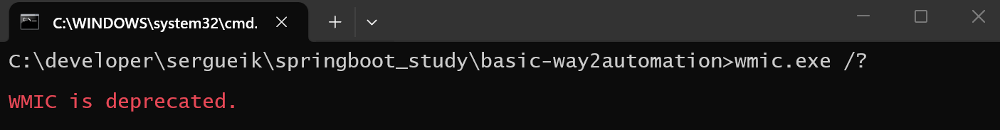

### Info

WinForms app acting as a non-elevated memory watchdog wrapper for another executable.
Requirement is evidence collection, not active protection.
Also Powershell version hosting the `Thread` dependent control in a Windows Form

So the watchdog app behaves like a passive observer:


```text
type %temp%\loadaverage.csv
```
```csv
TimeStamp,Value
2026-03-31 20:42:11,2128171008.00
2026-03-31 20:44:30,2316846592.00
2026-03-31 20:47:08,2336112640.00
2026-03-31 20:47:18,2316656640.00
2026-03-31 20:47:28,2159769600.00
2026-03-31 20:47:38,2071382272.00
```


the curve proves

From the timestamps:

21:22:51 → 21:27:53
Available memory falls from 7.67 GB → 647 MB
21:27:53 → 21:29:03
Rapid recovery back to ~1.97 GB
21:29:03 → 21:31:04
Stable plateau around 1.9ΓÇô2.0 GB
21:31:14 onward
Strong recovery to 8.77 GB

This is a textbook workload signature

this took only 58 samples (technically more, because some averaging performed but still ):

```cmd
type %temp%\loadaverage.csv | c:\Windows\system32\find.exe /v /c ""
```
```text
58
```
### Background Info
Background Info

Given that Microsoft Windows continuously performs the heavy lifting every minute of every hour, collecting an log structurd set of performance counters ΓÇö both global system metrics and per-instance process data ΓÇö the telemetry foundation is already present before a single line of application code is written.

#### Available Counters

`Process.Explorer`   |
---------------------|
`% Processor Time` |
`% User Time`|
`% Privileged Time`|
`Virtual Bytes Peak`|
`Virtual Bytes`|
`Page Faults/sec`|
`Working Set Peak`|
`Working Set`|
`Page File Bytes Peak`|
`Page File Bytes`|
`Private Bytes`|
`Thread Count`|
`Priority Base`|
`Elapsed Time`|
`ID Process`|
`Creating Process ID`|
`Pool Paged Bytes`|
`Pool Nonpaged Bytes`|
`Handle Count`|
`IO Read Operations/sec`|
`IO Write Operations/sec`|
`IO Data Operations/sec`|
`IO Other Operations/sec`|
`IO Read Bytes/sec`|
`IO Write Bytes/sec`|
`IO Data Bytes/sec`|
`IO Other Bytes/sec`|
`Working Set - Private`|


Counter Category `Process` |
-------------------------- |
`% Processor Time`         |
`% User Time`              |
`% Privileged Time`|
`Virtual Bytes Peak`|
`Virtual Bytes`|
`Page Faults/sec`|
`Working Set Peak`|
`Working Set`|
`Page File Bytes Peak`|
`Page File Bytes`|
`Private Bytes`|
`Thread Count`|
`Priority Base`|
`Elapsed Time`|
`ID Process`|
`Creating Process ID`|
`Pool Paged Bytes`|
`Pool Nonpaged Bytes`|
`Handle Count`|
`IO Read Operations/sec`|
`IO Write Operations/sec`|
`IO Data Operations/sec`|
`IO Other Operations/sec`|
`IO Read Bytes/sec`|
`IO Write Bytes/sec`|
`IO Data Bytes/sec`|
`IO Other Bytes/sec`|
`Working Set - Private`|


Coupled with Microsoft's own architectural decision to ship the __.NET Framework__ __4.5+__ as a Windows component for as long as that Windows version is supported - a very strong promise by Microsoft standards - and to include a trusted, fully-featured assembly repository under the __Global Assembly Cache__ (__GAC__) on every installation -  something that shipped is effectively immortal.

One can rhetorically ask: can we not take advantage of an operating system that already offers mature instrumentation primitives and a pre-established trusted deployment substrate

Borrowing from a certain unforgettable cinematic farewell: it is important to always try new things.

__Fusion__ (managed and unmanaged) isnΓÇÖt just assembly binding  which it is on the surface ΓÇö in the managed/unmanaged context of .NET Framework, it also serves as a gatekeeper: it enforces code trust and licensing, and ensures that assemblies (and the OS/runtime) wonΓÇÖt function if licensing checks fail.
__WPA__ (__Windows Product Activation__) is part of the same concept at the OS level: making the system refuse to run if it wasnΓÇÖt properly licensed.

This move is contrary to almost every other decision Microsoft made, before or after:
Historically, they monetized and controlled access via licensing, Fusion, WPA, IE bundling, etc.
Suddenly, the GAC becomes free infrastructure ΓÇö no gate, no enforcement, no direct profit.

So what youΓÇÖre highlighting is a truly exceptional paradox in Microsoft history: they accidentally (or perhaps naively) created something ΓÇ£as open as UnixΓÇ¥ inside Windows, but without any financial benefit ΓÇö a rare crack in the otherwise highly controlled ecosystem.
### Usage

* rebuild the complex project in the IDE or commandline
> NOTE - is *script execution policy* is tight, still can paste individual command in the console


```powershell
remove-item -recurse -force Utils/obj,Utils/bin/,Program/bin/,Program/obj/,Test/bin/,Test/obj/ -erroraction SilentlyContinue
```
```powershell
$buildfile = 'basic-countermonitor.sln'
$framework_path = 'c:\Windows\Microsoft.NET\Framework\v4.0.30319'
$env:path="${env:path};${framework_path}"
msbuild.exe -p:FrameworkPathOverride="${framework_path}" $buildfile /p:Configuration=Release /p:Platform="Any CPU" /t:"Clean,Build"
```
> NOTE without the `/v:diag` flag __MSbuild__ may silently abort executions when there are problems creaing the illusion it has run but nothing is produced

See [stackoverflow](https://stackoverflow.com/questions/3155492/how-do-i-specify-the-platform-for-msbuild) discussion
alternatively
```powershell
$buildfile = 'basic-countermonitor.sln'
$framework_path = 'c:\Windows\Microsoft.NET\Framework\v4.0.30319'
$msbuild = "${framework_path}\MSBuild.exe"
invoke-expression -command "$msbuild -p:FrameworkPathOverride=""${framework_path}"" $buildfile  /p:Configuration=Release /p:Platform=""Any CPU"" /t:Clean,Build"
```
```powershell
cmd %%-/c tree.com
```
```text
Γö£ΓöÇΓöÇΓöÇpackages
Γöé   ΓööΓöÇΓöÇΓöÇNUnit.2.6.4
Γöé       ΓööΓöÇΓöÇΓöÇlib
Γö£ΓöÇΓöÇΓöÇProgram
Γö£ΓöÇΓöÇΓöÇscreenshots
Γö£ΓöÇΓöÇΓöÇTest
Γö£ΓöÇΓöÇΓöÇTestUtils
ΓööΓöÇΓöÇΓöÇUtils
```
- the exact  path to `msbuild.exe` may vary with Windows release. To find, inspect the output of


```powershell
get-childitem -path 'C:\Windows\Microsoft.NET' -name 'msbuild.exe' -recurse
```

will get something like

```text

assembly\GAC_32\MSBuild\v4.0_4.0.0.0__b03f5f7f11d50a3a\MSBuild.exe
assembly\GAC_64\MSBuild\v4.0_4.0.0.0__b03f5f7f11d50a3a\MSBuild.exe
Framework\v2.0.50727\MSBuild.exe
Framework\v3.5\MSBuild.exe
Framework\v4.0.30319\MSBuild.exe
Framework64\v2.0.50727\MSBuild.exe
Framework64\v3.5\MSBuild.exe
Framework64\v4.0.30319\MSBuild.exe
```

### Client


when subject application is launched via maven and not direcrtly as a jar it becomes a little messy:
```cmd
mvn spring-boot:run
```
runs `java.exa` somewhat differently - with a very long `classpath` argument including the project `target\classes` path, and all application dependencies paths from `$HOME\.m2\repository` and the jar main class invoked explicilty:


to find out explore it using the available tools in console:

```cmd
set LOG=%TEMP%\output.txt
wmic.exe /output:%LOG% path win32_process where (commandline like "%java.exe%" and name != "wmic.exe") get processid,name,commandlinewmic.exe /output:%LOG% path win32_process where (commandline like "%java.exe%" and name != "wmic.exe") get processid,name,commandline
```
> NOTE: there isn't native `/noheaders` or `/output:noheaders` switch `wmic.exe` would recognize. The stabdard hack is to use
```cmd
more.com +1 %LOG%
```
To inspect the `java` command line it is key to know the subject application Main Application class (for __Spring Framework__ apps)
or the project directory

```cmd
set MAIN_CLASS=example.Application
more.com +1 %LOG% | findstr -i %MAIN_CLASS%
```

```cmd
set PROJECT_DIR=basic-way2automation
more.com +1 %LOG% | findstr -i %PROJECT_DIR%\target
```
when __Spring Boot__ application is run via `java.exe -jar`, naturally to filter by the application jar name:

```cmd
set APPLICATION_JAR=example.way2automation.jar
more.com +1 %LOG% | findstr -i %APPLICATION_JAR%
```

> NOTE:  the `wmic.exe` does not honor the column order requsted




### Note

Unfortunately __Windows 11__ normal idle state already behaves like low-resource mode. The machine immediately displays some of
  * 80–90% RAM "used"
  * multiple background services
  * continuous indexing
  * Defender scans
  * browser tab persistence
  * telemetry
  * shell experience host churn
  * GPU process accumulation
  * updater tasks

That is why the machine feels weak. In other words, with __Windows 11__ the "underpowered" is often observed an OS baseline condition, not a machine classification.

### TODO

capture target `Process` instance `private memory` property instead of performance counter which is stored in Registry


```c#
process.PrivateMemorySize64
```

### Push to Docker Hosted Promethus

```cmd
mkdir -p grafana/provisioning/{datasources,dashboards}
touch grafana/provisioning/datasources/prometheus.yml
touch grafana/provisioning/dashboards/provider.yml
touch grafana/provisioning/dashboards/windows-process.json
```
```cmd
docker-compose up -d`
```
```cmd
docker-compose ps
```

```text
        Name                 Command             State              Ports       
--------------------------------------------------------------------------------
monitoring-grafana     /run.sh                Up             0.0.0.0:3000-      
                                                             >3000/tcp,:::3000- 
                                                             >3000/tcp          
monitoring-            /bin/prometheus        Up (healthy)   0.0.0.0:9090-      
prometheus             --config.f ...                        >9090/tcp,:::9090- 
                                                             >9090/tcp          
monitoring-            /bin/pushgateway       Up (healthy)   0.0.0.0:9091-      
pushgateway            --persist ...                         >9091/tcp,:::9091-                                                              >9091/tcp    
```
### Troubleshooting
```sh
docker pull prom/pushgateway:v1.10.0
```


> NOTE: if the image or tag is incorrect Docker Toolbox wll print a misleading error message:
```text
error during connect: Post https://192.168.99.100:2376/v1.40/images/create?fromImage=prom%2Fprometheus&tag=v3.4.0: dial tcp 192.168.99.100:2376: connectex: No connection could be made because the target machine actively refused it.
```

while Docker will print  a misleading error message:
```text
Error response from daemon: pull access denied for prom/pushateway, repository does not exist or may require 'docker login': denied: requested access to the resource is denied
```

```text
ERROR: yaml.parser.ParserError: while parsing a flow sequence
  in "./docker-compose.yaml", line 30, column 13
expected ',' or ']', but got '<scalar>'
  in "./docker-compose.yaml", line 30, column 35
```
```text
ERROR: The Compose file './docker-compose.yaml' is invalid because:
services.prometheus.healthcheck.test contains {"CMD": "wget"}, which is an invalid type, it should be a string
```
```sh
docker-compose logs pushgateway
```
> NOTE: not the 
```text
Attaching to monitoring-pushgateway
monitoring-pushgateway | ts=2026-06-30T00:52:23.679Z caller=main.go:87 level=info msg="starting pushgateway" version="(version=1.10.0, branch=HEAD, revision=17dd0704c6595396b8ca2550884bd9f0d66990bb)"
monitoring-pushgateway | ts=2026-06-30T00:52:23.679Z caller=main.go:88 level=info build_context="(go=go1.23.1, platform=linux/amd64, user=root@ef8599d2814a, date=20240919-21:18:11, tags=unknown)"
monitoring-pushgateway | ts=2026-06-30T00:52:23.680Z caller=tls_config.go:348 level=info msg="Listening on" address=[::]:9091
monitoring-pushgateway | ts=2026-06-30T00:52:23.681Z caller=tls_config.go:351 level=info msg="TLS is disabled." http2=false address=[::]:9091

```

```cmd
docker-compose ps
```

```text
       Name                 Command             State               Ports
--------------------------------------------------------------------------------
monitoring-           /bin/pushgateway      Up (unhealthy)   0.0.0.0:9091-
pushgateway           --persist ...                          >9091/tcp,:::9091-
                                                             >9091/tcp
```
### See Also:
   * example code from [Updating Your Form from Another Thread without Creating Delegates for Every Type of Update](https://www.codeproject.com/Articles/52752/Updating-Your-Form-from-Another-Thread-without-Cre)

  * https://stackoverflow.com/questions/661561/how-do-i-update-the-gui-from-another-thread
  * [effective way to wrire](https://www.codeproject.com/Articles/37642/Avoiding-InvokeRequired) `InvokeRequired` delegates
  * [how to use InvokeRequired](https://stackoverflow.com/questions/15580494)
  * https://learn.microsoft.com/en-us/dotnet/desktop/winforms/how-to-change-the-borders-of-windows-forms?view=netframework-4.5
  * https://learn.microsoft.com/en-us/dotnet/api/system.windows.forms.textbox?view=netframework-4.5

### Author
[Serguei Kouzmine](kouzmine_serguei@yahoo.com)
