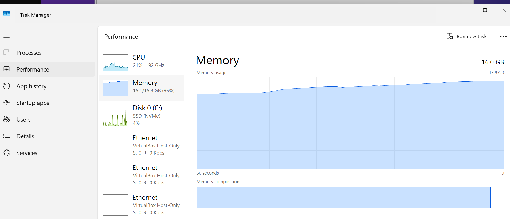
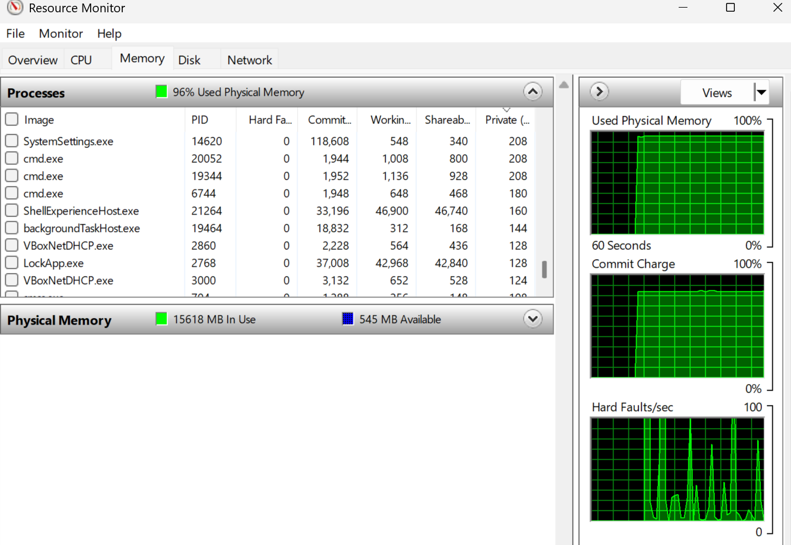
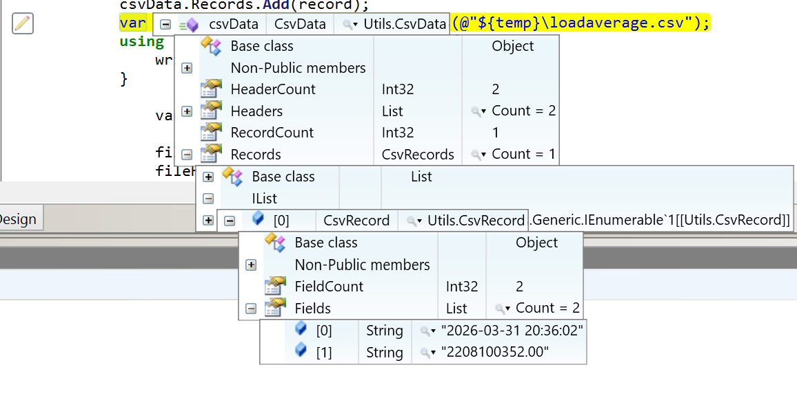
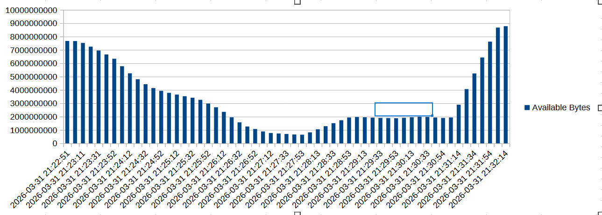

### Info

```text
type %temp%\loadaverage.csv
```
```csv
TimeStamp,Value
2026-03-31 20:42:11,2128171008.00
2026-03-31 20:44:30,2316846592.00
2026-03-31 20:47:08,2336112640.00
2026-03-31 20:47:18,2316656640.00
2026-03-31 20:47:28,2159769600.00
2026-03-31 20:47:38,2071382272.00
```








```cmd
type %temp%\loadaverage.csv | c:\Windows\system32\find.exe /v /c ""
```
```text
58
```
### Background Info
Background Info

Given that Microsoft Windows continuously performs the heavy lifting every minute of every hour, collecting an log structurd set of performance counters — both global system metrics and per-instance process data — the telemetry foundation is already present before a single line of application code is written.

#### Available Counters 

`Process.Explorer`   |
---------------------|
`% Processor Time` |
`% User Time`|
`% Privileged Time`|
`Virtual Bytes Peak`|
`Virtual Bytes`|
`Page Faults/sec`|
`Working Set Peak`|
`Working Set`|
`Page File Bytes Peak`|
`Page File Bytes`|
`Private Bytes`|
`Thread Count`|
`Priority Base`|
`Elapsed Time`|
`ID Process`|
`Creating Process ID`|
`Pool Paged Bytes`|
`Pool Nonpaged Bytes`|
`Handle Count`|
`IO Read Operations/sec`|
`IO Write Operations/sec`|
`IO Data Operations/sec`|
`IO Other Operations/sec`|
`IO Read Bytes/sec`|
`IO Write Bytes/sec`|
`IO Data Bytes/sec`|
`IO Other Bytes/sec`|
`Working Set - Private`|


Counter Category `Process` |
-------------------------- |
`% Processor Time`         |
`% User Time`              |
`% Privileged Time`|
`Virtual Bytes Peak`|
`Virtual Bytes`|
`Page Faults/sec`|
`Working Set Peak`|
`Working Set`|
`Page File Bytes Peak`|
`Page File Bytes`|
`Private Bytes`|
`Thread Count`|
`Priority Base`|
`Elapsed Time`|
`ID Process`|
`Creating Process ID`|
`Pool Paged Bytes`|
`Pool Nonpaged Bytes`|
`Handle Count`|
`IO Read Operations/sec`|
`IO Write Operations/sec`|
`IO Data Operations/sec`|
`IO Other Operations/sec`|
`IO Read Bytes/sec`|
`IO Write Bytes/sec`|
`IO Data Bytes/sec`|
`IO Other Bytes/sec`|
`Working Set - Private`|


Coupled with Microsoft’s own architectural decision to ship .NET Framework 4.x as a Windows component for as long as that Windows version is supported — a very strong promise by Microsoft standards — and to include a trusted, fully-featured assembly repository under the Global Assembly Cache (GAC) on every installation -  something that shiped is effectively immortal.

One can rhetorically ask: can we not take advantage of an operating system that already offers mature instrumentation primitives and a pre-established trusted deployment substrate

Borrowing from a certain unforgettable cinematic farewell: it is important to always try new things.

__Fusion__ (managed and unmanaged) isn’t just assembly binding  which it is on the surface — in the managed/unmanaged context of .NET Framework, it also serves as a gatekeeper: it enforces code trust and licensing, and ensures that assemblies (and the OS/runtime) won’t function if licensing checks fail.
__WPA__ (__Windows Product Activation__) is part of the same concept at the OS level: making the system refuse to run if it wasn’t properly licensed.

This move is contrary to almost every other decision Microsoft made, before or after:
Historically, they monetized and controlled access via licensing, Fusion, WPA, IE bundling, etc.
Suddenly, the GAC becomes free infrastructure — no gate, no enforcement, no direct profit.

So what you’re highlighting is a truly exceptional paradox in Microsoft history: they accidentally (or perhaps naively) created something “as open as Unix” inside Windows, but without any financial benefit — a rare crack in the otherwise highly controlled ecosystem.

### See Also:
   * example code from [Updating Your Form from Another Thread without Creating Delegates for Every Type of Update](https://www.codeproject.com/Articles/52752/Updating-Your-Form-from-Another-Thread-without-Cre)

  * https://stackoverflow.com/questions/661561/how-do-i-update-the-gui-from-another-thread
  * [effective way to wrire](https://www.codeproject.com/Articles/37642/Avoiding-InvokeRequired) `InvokeRequired` delegates
  * [how to use InvokeRequired](https://stackoverflow.com/questions/15580494)


### Author
[Serguei Kouzmine](kouzmine_serguei@yahoo.com)
