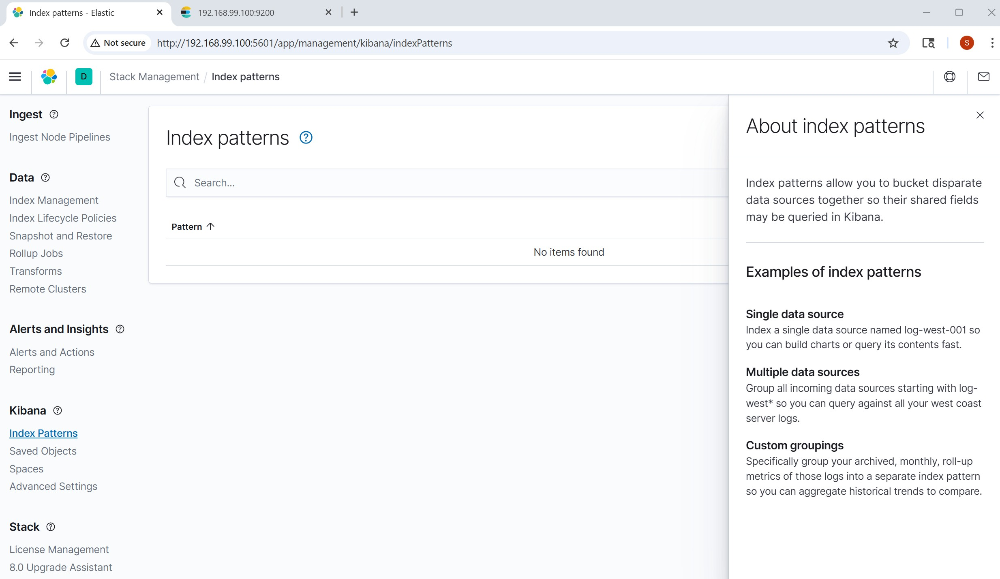
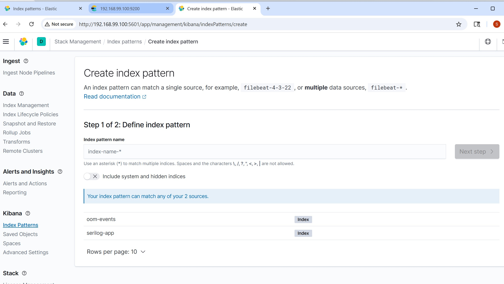
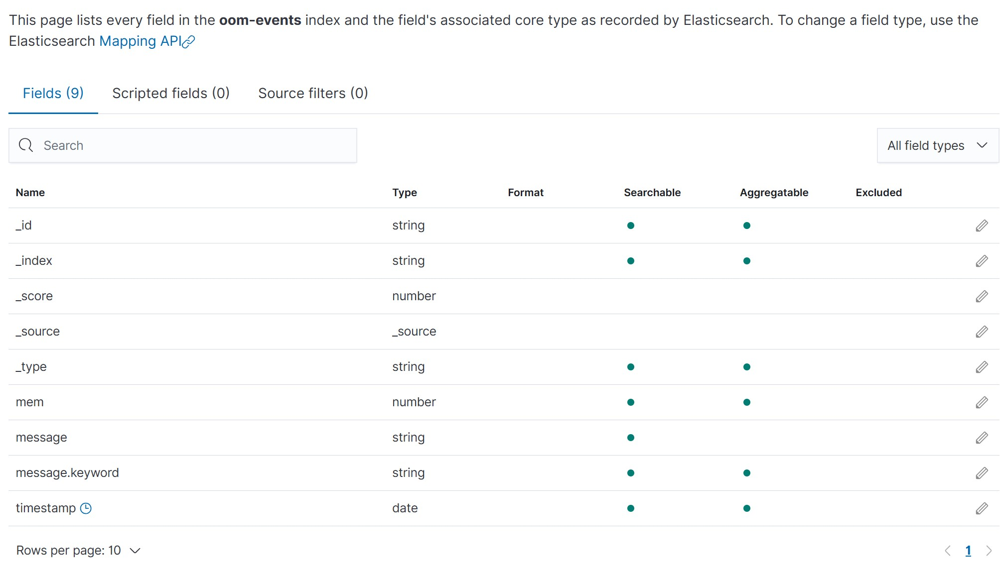
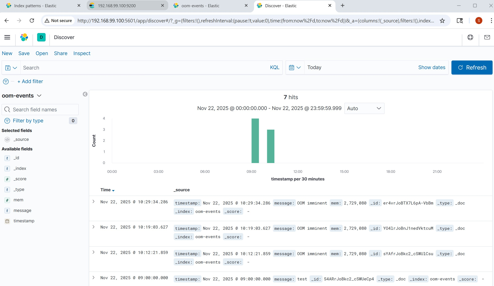
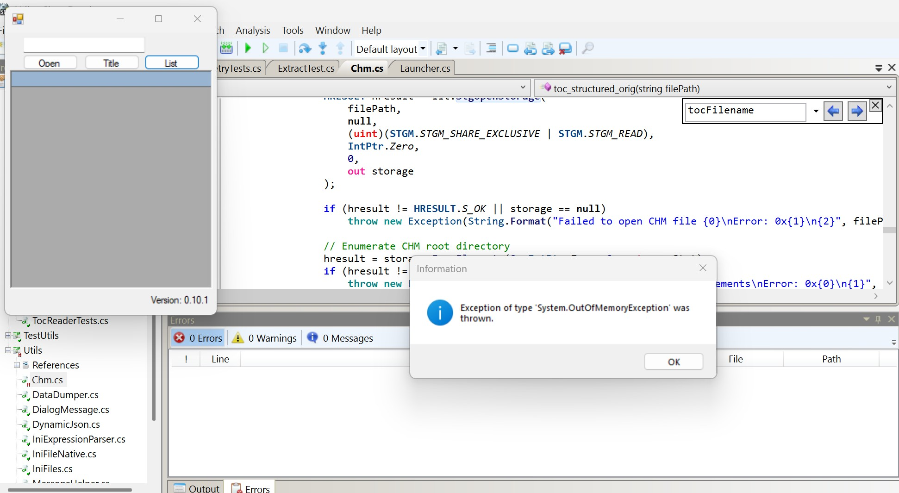

### Info

This program examines the contents of a compiled help file (CHM) without fully extracting it, based on the [Get CHM Title](https://learn.microsoft.com/en-us/answers/questions/1358539/get-chm-title) snippet by *Castorix31*.

It uses the **Microsoft InfoTech IStorage System** COM server `{5D02926A-212E-11D0-9DF9-00A0C922E6EC}` to read storage directly without extracting the compiled HTML archive. **MSITFS** is the HTML Help/CHM runtime’s storage implementation (`itss.dll`).


Free tool like [7-Zip](https://www.7-zip.org) can unpack/extract CHM files (listed as an “unpacking only” format). 7-Zip can  create or repack CHM files.

---

### Status

* **Implemented**
  * Reading the title of the compiled help file and listing component HTML files via `StgOpenStorage` and `7z.exe` commands
  * Loading the file list into a `DataGrid` for selection of files to extract   
  * Reading the CHM *table of contents* (`toc.hhc' by default) and building a title–filename map. This is crucial for enterprise-grade help files containing  many thousands of documents


* **Work in progress**
  * Extracting selected files


---

### Out Of Memory Exception


Earlier revision [f261436](https://github.com/sergueik/powershell_samples/commit/f261436579455ba52c05872e0a086287fb077b8e) of the server has been throwing exception during 

extraction of data from Structured Storage, due to unsafe implementation of the method `toc_structured` 

attempting to read an entire storage stream into memory without checking the number of bytes actually returned.

This led to `OutOfMemoryException`
 at
[Chm.cs#L391](https://github.com/sergueik/powershell_samples/blob/debug-oom/csharp/chm_inspector/Utils/Chm.cs#L391)
This happened because the code attempted to read the entire storage stream into memory using a fixed-size buffer without checking how many bytes were actually read, causing the loop to repeatedly append unbounded data to the `MemoryStream` until the process exhausted its available contiguous virtual memory segment.

```c#
public static List<TocEntry> toc_structured(string filePath) {
  logger.Info("toc_structured: starting");
    object obj = null;
    IITStorage iit = null;
    IStorage storage = null;
    IEnumSTATSTG enumStat = null;
    IStream stream = null;

    var result = new List<TocEntry>();

    try {
        obj = Activator.CreateInstance(Type.GetTypeFromCLSID(CLSID_ITStorage, true));
        iit = (IITStorage)obj;

        HRESULT hresult = iit.StgOpenStorage(filePath, null, (uint)(STGM.STGM_SHARE_EXCLUSIVE | STGM.STGM_READ), IntPtr.Zero, 0, out storage);
        if (hresult != HRESULT.S_OK || storage == null)
        throw new Exception(String.Format("Failed to open CHM file\nError: 0x{0}\n{1}", hresult.ToString("X"), MessageHelper.Msg(hresult)));

        hresult = storage.EnumElements(0, IntPtr.Zero, 0, out enumStat);
        if (hresult != HRESULT.S_OK || enumStat == null)
        throw new Exception(String.Format("Failed to enumerate CHM elements\nError: 0x{0}\n{1}", hresult.ToString("X"), MessageHelper.Msg(hresult)));

        var stat = new System.Runtime.InteropServices.ComTypes.STATSTG[1];
        uint fetched;

        while (enumStat.Next(1, stat, out fetched) == HRESULT.S_OK && fetched == 1) {
            // We are looking for "toc.hhc"
            if (string.Equals(stat[0].pwcsName, "toc.hhc", StringComparison.OrdinalIgnoreCase)) {
                hresult = storage.OpenStream(stat[0].pwcsName, IntPtr.Zero, (uint)(STGM.STGM_SHARE_EXCLUSIVE | STGM.STGM_READ), 0, out stream);
                if (hresult != HRESULT.S_OK || stream == null)
                  throw new Exception(String.Format("Failed to open toc.hhc stream,\nError: 0x{0}\n{1}", hresult.ToString("X"), MessageHelper.Msg(hresult)));

                // Read full stream
                MemoryStream ms = new MemoryStream();
                byte[] buffer = new byte[4096];
                IntPtr pcb = IntPtr.Zero;
        // NOTE: do not be logging every iteration of the read loop
        int loopCounter = 0;
                while (true) {
                    stream.Read(buffer, buffer.Length, pcb);
                    loopCounter++;
            if (loopCounter % 500 == 0)
                      logger.Info(String.Format( "Memory {0} MB", GC.GetTotalMemory(false) / (1024 * 1024)));
                    // Assume buffer fully read; could refine with actual bytes read
                    ms.Write(buffer, 0, buffer.Length);
                    // For simplicity, break when less than buffer size (optional refinement)
                    if (buffer.Length < 4096) break;
                }

                string tocContent = Encoding.UTF8.GetString(ms.ToArray());

                // Regex parse OBJECT nodes
                var matches = Regex.Matches(tocContent,
                    @"<OBJECT[^>]*>.*?<param name=""Name"" value=""(.*?)"">.*?<param name=""Local"" value=""(.*?)"">.*?</OBJECT>",
                    RegexOptions.Singleline);

                foreach (Match m in matches) {
                    result.Add(new TocEntry {
                        Name = m.Groups[1].Value,
                        Local = m.Groups[2].Value
                    });
                }

                break; // done with toc.hhc
            }
        }
    } finally {
        if (stream != null) Marshal.ReleaseComObject(stream);
        if (enumStat != null) Marshal.ReleaseComObject(enumStat);
        if (storage != null) Marshal.ReleaseComObject(storage);
        if (iit != null) Marshal.ReleaseComObject(iit);
        if (obj != null) Marshal.ReleaseComObject(obj);
    }

    return result;

  }
```
Note: Although the MemoryStream appeared to grow without bounds, we cannot conclusively prove an actual global memory shortage occurred. 
The failure is consistent with a *segmentation-related* allocation failure — meaning the runtime could not obtain a sufficiently large contiguous block of virtual memory — rather than true exhaustion of total system RAM.

A more resilient approach achieved in the commit [37fa6dbfe](https://github.com/sergueik/powershell_samples/commit/37fa6dbfe44d94856ec0fa8c35aed558a10f01b6) involves:

  * Checking the exact number of bytes returned by `IStream.Read`,
  * Stopping when fewer than `buffer.Length` bytes are read,
  * processing the stream incrementally to avoid building a full in-memory copy.


Memory allocation and segmentation ensure that your process only receives a limited, contiguous block of usable RAM/virtual memory, and an `OutOfMemoryException` simply means the system could not reserve a sufficiently large continuous segment for your in-memory buffer—even if total free memory still existed.

#### Telemetry and Log Collection

The sample includes optional instrumentation through
periodic `GC.GetTotalMemory()`
[metric](https://learn.microsoft.com/en-us/dotnet/api/system.gc.gettotalmemory?view=netframework-4.5) logging that is highly configurable
and can be forwarded to a
log collector such as [Seq](https://datalust.co/), and eventually to telemetry stacks such as [Prometheus](https://prometheus.io/download/)/ [Grafana](https://grafana.com/grafana/download) to observe memory pressure and stream read behavior

By examining this metric, whose values typically spike sharply just before failure,

```c#
logger.Info(String.Format( "Memory {0} MB", GC.GetTotalMemory(false) / (1024 * 1024)));
```


one can clearly visualize heap exhaustion and the conditions leading up to an impending `OutOfMemoryException`	.

NOTE: Seq is primarily a lightweight
fine-grained, application-level log collection and indexing platform,
not a telemetry indicator or metrics system, and it does not provide
built-in capabilities for transforming log message content.


In an ideal setup for collecting and rendering application telemetry, the Seq event stream—received via a __Serilog__ sink—would be forwarded to __Grafana__ for visualization.
The other option is to use [ECS Logging .NET](https://www.elastic.co/docs/reference/ecs/logging/dotnet/setup)
This, however, requires a compatible Seq-JSON data source or
Grafana plugin, which is still under investigation and not yet fully supported.

Another viable option is to integrate the ELK stack,
using the [Elastic.Serilog.Sinks](https://www.nuget.org/packages/Elastic.Serilog.Sinks/8.11.0) (the ackage is compatible with downplatform .NET Framework __4.6.1__) or the legacy `Serilog.Sinks.Elasticsearch`
[NuGet package](https://www.nuget.org/packages/Serilog.Sinks.Elasticsearch) for .NET, or
the [Logback ECS Encoder](https://mvnrepository.com/artifact/co.elastic.logging/logback-ecs-encoder)/[Logstash Logback Encoder](https://mvnrepository.com/artifact/net.logstash.logback/logstash-logback-encoder)
dependencies for Java, allowing log events
to be indexed directly into Elasticsearch and transformed and visualized through Kibana.


---

### TOC

Information about the topics covered in individual files is stored in the table of contents  file named `toc.hhc` as a set of `<OBJECT>` objects:

```html
<OBJECT type="text/sitemap">
  <param name="Name" value="Starting a new VM for the first time">
  <param name="Local" value="ch01s09.html#idp8051664">
</OBJECT>

The table of content index (named by default `toc.hhc`) is a plain HTML file inside the CHM (MS ITSS) archive. For a selection helper grid, the relevant attributes to extract are `Name` and `Local`.

### Processing `toc.hhc` 
#### Using `7-Zip`

```cmd
7z.exe e ${chm_file} toc.hhc -o${output_folder}
```

#### Via MSITFS COM Server COM API

Using the **COM** **API** allows accessing the file directly from within the `CHM` archive without extracting:
```c#
IStorage storage;
HRESULT hr = StgOpenStorage(
    "myfile.chm",
    null,
    STGM_READ | STGM_SHARE_EXCLUSIVE,
    IntPtr.Zero,
    0,
    out storage
);

```
This is the same approach used internally by **MS HTML Help Workshop** or libraries such as **ChmLib**.

#### Parsing `toc.hhc`


`OBJECT` nodes can be parsed using a lightweight DOM parser, e.g., standalone [embedded DOM parser](https://github.com/sergueik/powershell_samples/tree/master/csharp/standalone_embedded_parser)
or even a plain regex:

```c#
var matches = Regex.Matches(
    tocContent,
    @"<OBJECT[^>]*>.*?<param name=""Name"" value=""(.*?)"">.*?<param name=""Local"" value=""(.*?)"">.*?</OBJECT>",
    RegexOptions.Singleline
);

foreach(Match match in matches) {
    string name = match.Groups[1].Value;
    string local = match.Groups[2].Value;
    // add to Dictionary<string, string> or a List<TocEntry> for the grid datasource
}

```
This regex approach avoids **DOM** parsing overhead, and can be used for small `toc.hhc`. However it does not scale and extracting a few hundreds of items from the `toc.hhc` may take a minute. The realistic help files, e.g. describing legacy Mainframe model bank teller screens, may easily contain tens of thousands of component files.


---

### Elastic Search

Adding ElasticSearh packages through `packages.config` for .Net Framework __4.5__ 
```xml
<?xml version="1.0" encoding="utf-8"?>

<packages>
  <package id="NUnit" version="2.6.4" targetFramework="net45" />
	<!-- NOTE: old versions chosen to make install through SharpDevelop 5.1 embeddd nuget possible -->
	<package id="Serilog.Sinks.Elasticsearch" version="8.0.0" targetFramework="net45" />
	<package id="Elasticsearch.Net" version="7.0.0" targetFramework="net45" />
	<package id="Serilog.Sinks.File" version="3.1.1" targetFramework="net45" />
	<package id="Serilog.Sinks.Console" version="2.0.0" targetFramework="net45" />
		<!--
 have to install manually extracting the Serilog 2.0.0 nuget package -->
	<!--
	<package id="Serilog" version="2.0.0" targetFramework="net452" /> -->
  <package id="FluentAssertions" version="4.4.0" targetFramework="net45" />
  <package id="Newtonsoft.Json" version="6.0.6" targetFramework="net45" />
</packages>

```
leads to compilation error:
```text
The type 'System.Object' is defined in an assembly that is not referenced.
You must add a reference to assembly 'System.Runtime, Version=4.0.0.0, Culture=neutral, PublicKeyToken=b03f5f7f11d50a3a'. (CS0012)

```
switching to older .Net Framework version __4.0__ 
leads to compilation error:
```text
Assembly 'Serilog.Sinks.Elasticsearch, Version=4.1.0.0, Culture=neutral, PublicKeyToken=24c2f752a8e58a10' uses 'Serilog, Version=2.0.0.0, Culture=neutral, PublicKeyToken=24c2f752a8e58a10' which has a higher version than referenced assembly 'Serilog, Version=1.5.0.0, Culture=neutral, PublicKeyToken=24c2f752a8e58a10' (CS1705)
```
installing `Serilog 2.0.0` via ShareDevelop __5.1__ embedded nuget leads to  an error with **Restore Packages** step:
```text
	Installing 'Serilog 2.0.0'.
	'Serilog' already has a dependency defined for 'Microsoft.CSharp'.
	Exited with code: 1
```
```sh
curl -sO ~/Downloads/serilog.2.12.0.nupkg https://www.nuget.org/api/v2/package/Serilog/2.12.0
mkdir -p packages/serilog.2.12.0
unzip ~/Downloads/serilog.2.12.0.nupkg -d packages/serilog.2.12.0
```
and

similar for  `Serilog.Sinks.PeriodicBatching`:

```sh
curl -sO ~/Downloads/serilog.sinks.periodicbatching.2.3.0 https://www.nuget.org/api/v2/package/Serilog.Sinks.Console/2.3.0
mkdir -p packages/serilog.sinks.periodicbatching.2.3.0
unzip ~/Downloads/serilog.sinks.periodicbatching.2.3.0.nupkg -d packages/serilog.sinks.periodicbatching.2.3.0

```

```sh
curl -s -v -L -o ~/Downloads/serilog.formatting.elasticsearch.8.4.1.nupkg https://www.nuget.org/api/v2/package/Serilog.Formatting.Elasticsearch/8.4.1

test -f ~/Downloads/serilog.formatting.elasticsearch.8.4.1.nupkg              
$ echo $?

mkdir -p packages/serilog.formatting.elasticsearch/8.4.1
unzip ~/Downloads/serilog.formatting.elasticsearch.8.4.1.nupkg -d packages/serilog.formatting.elasticsearch/8.4.1

0

```

and manually updating c# project files with the reference


There are still errors thrown in runtime:
```text
SetUp : System.MissingMethodException : Method not found: 'Void Serilog.Sinks.PeriodicBatching.PeriodicBatchingSink..ctor(Int32, System.TimeSpan, Int32)'.
```
---

These are solved by collecting the matching set of versions in `Serilog` dependency set:

```txt
packages/serilog.2.12.0/lib/net45/Serilog.dll
packages/serilog.2.12.0/lib/net46/Serilog.dll
packages/serilog.formatting.elasticsearch/8.4.1/lib/net45/Serilog.Formatting.Elasticsearch.dll
packages/Serilog.Sinks.Console.2.0.0/lib/net45/Serilog.Sinks.Console.dll
packages/Serilog.Sinks.Elasticsearch.8.4.1/lib/net461/Serilog.Sinks.Elasticsearch.dll
packages/Serilog.Sinks.File.3.1.1/lib/net45/Serilog.Sinks.File.dll
packages/serilog.sinks.periodicbatching.2.3.0/lib/net45/Serilog.Sinks.PeriodicBatching.dll

```

run elasticsearch standalone
```cmd
pushd C:\java\elasticsearch-9.2.1\bin>
elasticsearch.bat

```

this will produce massive amount of logs after a little bit:
```txt
...
[2025-11-22T12:34:41,814][INFO ][o.e.n.Node               ] [SERGUEIK23] JVM arguments [-Des.networkaddress.cache.ttl=60, -Des.networkaddress.cache.negative.ttl=10, -XX:+AlwaysPreTouch, -Xss1m, -Djava.awt.headless=true, -Dfile.encoding=UTF-8, -Djna.nosys=true, -XX:-OmitStackTraceInFastThrow, -XX:+ShowCodeDetailsInExceptionMessages, -Dio.netty.noUnsafe=true, -Dio.netty.noKeySetOptimization=true, -Dio.netty.recycler.maxCapacityPerThread=0, -Dio.netty.allocator.numDirectArenas=0, -Dlog4j.shutdownHookEnabled=false, -Dlog4j2.disable.jmx=true, -Djava.locale.providers=SPI,COMPAT, -Xms1g, -Xmx1g, -XX:+UseG1GC, -XX:G1ReservePercent=25, -XX:InitiatingHeapOccupancyPercent=30, -Djava.io.tmpdir=C:\Users\kouzm\AppData\Local\Temp\elasticsearch, -XX:+HeapDumpOnOutOfMemoryError, -XX:HeapDumpPath=data, -XX:ErrorFile=logs/hs_err_pid%p.log, -Xlog:gc*,gc+age=trace,safepoint:file=logs/gc.log:utctime,pid,tags:filecount=32,filesize=64m, -XX:MaxDirectMemorySize=536870912, -Delasticsearch, -Des.path.home=C:\java\elasticsearch-7.9.1, -Des.path.conf=C:\java\elasticsearch-7.9.1\config, -Des.distribution.flavor=default, -Des.distribution.type=zip, -Des.bundled_jdk=true]
...
[2025-11-22T12:34:41,814][INFO ][o.e.n.Node               ] [SERGUEIK23] JVM arguments [-Des.networkaddress.cache.ttl=60, -Des.networkaddress.cache.negative.ttl=10, -XX:+AlwaysPreTouch, -Xss1m, -Djava.awt.headless=true, -Dfile.encoding=UTF-8, -Djna.nosys=true, -XX:-OmitStackTraceInFastThrow, -XX:+ShowCodeDetailsInExceptionMessages, -Dio.netty.noUnsafe=true, -Dio.netty.noKeySetOptimization=true, -Dio.netty.recycler.maxCapacityPerThread=0, -Dio.netty.allocator.numDirectArenas=0, -Dlog4j.shutdownHookEnabled=false, -Dlog4j2.disable.jmx=true, -Djava.locale.providers=SPI,COMPAT, -Xms1g, -Xmx1g, -XX:+UseG1GC, -XX:G1ReservePercent=25, -XX:InitiatingHeapOccupancyPercent=30, -Djava.io.tmpdir=C:\Users\kouzm\AppData\Local\Temp\elasticsearch, -XX:+HeapDumpOnOutOfMemoryError, -XX:HeapDumpPath=data, -XX:ErrorFile=logs/hs_err_pid%p.log, -Xlog:gc*,gc+age=trace,safepoint:file=logs/gc.log:utctime,pid,tags:filecount=32,filesize=64m, -XX:MaxDirectMemorySize=536870912, -Delasticsearch, -Des.path.home=C:\java\elasticsearch-7.9.1, -Des.path.conf=C:\java\elasticsearch-7.9.1\config, -Des.distribution.flavor=default, -Des.distribution.type=zip, -Des.bundled_jdk=true]
```
Note, if a  later version is installed it will also initialize the security, which is what we specifically try to avoid in this demo.
probe there is no data ingested yet
```sh
 curl -k https://localhost:9200/serilog-test/_search?pretty
```
```json
{
  "error" : {
    "root_cause" : [
      {
        "type" : "security_exception",
        "reason" : "missing authentication credentials for REST request [/serilog-test/_search?pretty]",
        "header" : {
          "WWW-Authenticate" : [
            "Basic realm=\"security\", charset=\"UTF-8\"",
            "Bearer realm=\"security\"",
            "ApiKey"
          ]
        }
      }
    ],
    "type" : "security_exception",
    "reason" : "missing authentication credentials for REST request [/serilog-test/_search?pretty]",
    "header" : {
      "WWW-Authenticate" : [
        "Basic realm=\"security\", charset=\"UTF-8\"",
        "Bearer realm=\"security\"",
        "ApiKey"
      ]
    }
  },
  "status" : 401
}

```
login interactively on `https://localhost:9200/` with the credentials read from `elasticsearch` console
```text
ℹ️  Password for the elastic user (reset with `bin/elasticsearch-reset-password -u elastic`):
  5mOz5+0BJKzXNyxHcZ*D
```
you will see
```json

  "name" : "SERGUEIK23",
  "cluster_name" : "elasticsearch",
  "cluster_uuid" : "FFVaFMDnRSWrMeLsfESquw",
  "version" : {
    "number" : "9.2.1",
    "build_flavor" : "default",
    "build_type" : "zip",
    "build_hash" : "4ad0ef0e98a2e72fafbd79a19fa5cae2f026117d",
    "build_date" : "2025-11-06T22:07:39.673130621Z",
    "build_snapshot" : false,
    "lucene_version" : "10.3.1",
    "minimum_wire_compatibility_version" : "8.19.0",
    "minimum_index_compatibility_version" : "8.0.0"
  },
  "tagline" : "You Know, for Search"
}
```
run test and repeat the log check. 

In browser console after authenticating to ELK, see 
```json
```
in console authenticate with header
```
export U=elastic
export P='5mOz5+0BJKzXNyxHcZ*D'
curl -kLu "$U:$P -X GET https://localhost:9200/serilog-test/_search?pretty
```
```json
{
  "error" : {
    "root_cause" : [
      {
        "type" : "index_not_found_exception",
        "reason" : "no such index [serilog-test]",
        "resource.type" : "index_or_alias",
        "resource.id" : "serilog-test",
        "index_uuid" : "_na_",
        "index" : "serilog-test"
      }
    ],
    "type" : "index_not_found_exception",
    "reason" : "no such index [serilog-test]",
    "resource.type" : "index_or_alias",
    "resource.id" : "serilog-test",
    "index_uuid" : "_na_",
    "index" : "serilog-test"
  },
  "status" : 404
}

```

add the index:
```sh
curl -kLu "$U:$P" -X PUT https://localhost:9200/serilog-test
```
```json
{"acknowledged":true,"shards_acknowledged":true,"index"index:"serilog-test"}
```
update the test with credentials (hardcode for test run):

```c#
		[TestFixtureSetUp]
		public void Setup() {
			var elasticsearchSinkOptions = new ElasticsearchSinkOptions(new Uri("http://localhost:9200"));
			elasticsearchSinkOptions.DetectElasticsearchVersion = false;
			elasticsearchSinkOptions.AutoRegisterTemplate = true;
			elasticsearchSinkOptions.AutoRegisterTemplateVersion = AutoRegisterTemplateVersion.ESv7;
			elasticsearchSinkOptions.IndexFormat = "serilog-test";
			elasticsearchSinkOptions.ModifyConnectionSettings = conn => conn.BasicAuthentication("elastic", "5mOz5+0BJKzXNyxHcZ*D");

			loggerConfiguration = new LoggerConfiguration().MinimumLevel.Debug().WriteTo.Elasticsearch(elasticsearchSinkOptions);

	    	Log.Logger = loggerConfiguration.CreateLogger();

	    }

```
repeat the data check

```
            
```
```json
{
  "took" : 49,
  "timed_out" : false,
  "_shards" : {
    "total" : 1,
    "successful" : 1,
    "skipped" : 0,
    "failed" : 0
  },
  "hits" : {
    "total" : {
      "value" : 0,
      "relation" : "eq"
    },
    "max_score" : null,
    "hits" : [ ]
  }
}
    
```

if the runtime error is observed
```txt
System.TypeInitializationException: The type initializer for 'Elasticsearch.Net.DiagnosticsSerializerProxy' threw an exception. ---> System.IO.FileNotFoundException: Could not load file or assembly 'System.Diagnostics.DiagnosticSource, Version=4.0.3.1, Culture=neutral, PublicKeyToken=cc7b13ffcd2ddd51' or one of its dependencies. The system cannot find the file specified.

   at Elasticsearch.Net.DiagnosticsSerializerProxy..cctor()
   --- End of inner exception stack trace ---
   at Elasticsearch.Net.DiagnosticsSerializerProxy..ctor(IElasticsearchSerializer serializer, String purpose)
   at Elasticsearch.Net.ConnectionConfiguration`1..ctor(IConnectionPool connectionPool, IConnection connection, IElasticsearchSerializer requestResponseSerializer)
   at Elasticsearch.Net.ConnectionConfiguration..ctor(IConnectionPool connectionPool, IConnection connection, IElasticsearchSerializer serializer)
   at Serilog.Sinks.Elasticsearch.ElasticsearchSinkState..ctor(ElasticsearchSinkOptions options)
   at Serilog.Sinks.Elasticsearch.ElasticsearchSinkState.Create(ElasticsearchSinkOptions options)
   at Serilog.Sinks.Elasticsearch.ElasticsearchSink..ctor(ElasticsearchSinkOptions options)
   at Serilog.LoggerConfigurationElasticsearchExtensions.Elasticsearch(LoggerSinkConfiguration loggerSinkConfiguration, ElasticsearchSinkOptions options)
   at Program.Control.Main() in c:\developer\sergueik\powershell_samples\csharp\chm_inspector\Program\Launcher.cs:line 62

```
need to update
```sh
curl -s -v -L -o ~/Downloads/system.diagnostics.diagnosticSource.4.7.1.nupkg https://www.nuget.org/api/v2/package/Serilog.Formatting.Elasticsearch/4.7.1

test -f ~/Downloads/system.diagnostics.diagnosticSource.4.7.1.nupkg              
$ echo $?

mkdir -p packages/system.diagnostics.diagnosticSource/4.7.1
unzip ~/Downloads/system.diagnostics.diagnosticSource.4.7.1.nupkg -d packages/system.diagnostics.diagnosticSource/4.7.1

```
```sh
curl -s -v -L -o ~/Downloads/system.buffers.4.5.1.nupkg https://www.nuget.org/api/v2/package/system.buffers/4.5.1

test -f ~/Downloads/system.buffers.4.5.1.nupkg              
$ echo $?

mkdir -p packages/system.buffers.4.5.1
unzip ~/Downloads/system.buffers.4.5.1.nupkg -d packages/system.buffers.4.5.1

```
```sh
curl -s -v -L -o ~/Downloads/system.diagnostics.diagnosticSource.4.0.3.1.nupkg https://www.nuget.org/api/v2/package/Serilog.Formatting.Elasticsearch/4.0.3.1

test -f ~/Downloads/system.diagnostics.diagnosticSource.4.0.3.1.nupkg              
$ echo $?

mkdir -p packages/system.diagnostics.diagnosticSource/4.0.3.1
unzip ~/Downloads/system.diagnostics.diagnosticSource.4.0.3.1.nupkg -d packages/system.diagnostics.diagnosticSource/4.0.3.1

```

```poweshell
pushd 'packages\system.diagnostics.diagnosticSource\4.7.1\lib\net45'
Add-Type -AssemblyName System.Reflection

$path = (resolve-path -path 'System.Diagnostics.DiagnosticSource.dll').path
$assembly = [System.Reflection.AssemblyName]::GetAssemblyName($path)
write-output $assembly.Version

```
if it shows a mismatched version, create `App.config`


check the `elasticsearch.log`
```txt
[2025-11-20T00:12:17,025][WARN ][o.e.h.AbstractHttpServerTransport] [SERGUEIK23] caught exception while handling client http traffic, closing connection Netty4HttpChannel{localAddress=/[0:0:0:0:0:0:0:1]:9200, remoteAddress=/[0:0:0:0:0:0:0:1]:62871}
io.netty.handler.codec.DecoderException: javax.net.ssl.SSLHandshakeException: (certificate_unknown) Received fatal alert: certificate_unknown
        at io.netty.handler.codec.ByteToMessageDecoder.callDecode(ByteToMessageDecoder.java:500) ~[?:?]
        at io.netty.handler.codec.ByteToMessageDecoder.channelRead(ByteToMessageDecoder.java:290) ~[?:?]
        at io.netty.channel.AbstractChannelHandlerContext.invokeChannelRead(AbstractChannelHandlerContext.java:444) ~[?:?]
        at io.netty.channel.AbstractChannelHandlerContext.invokeChannelRead(AbstractChannelHandlerContext.java:420) ~[?:?]
        at io.netty.channel.AbstractChannelHandlerContext.fireChannelRead(AbstractChannelHandlerContext.java:412) ~[?:?]
        at io.netty.channel.DefaultChannelPipeline$HeadContext.channelRead(DefaultChannelPipeline.java:1357) ~[?:?]
        at io.netty.channel.AbstractChannelHandlerContext.invokeChannelRead(AbstractChannelHandlerContext.java:440) ~[?:?]
        at io.netty.channel.AbstractChannelHandlerContext.invokeChannelRead(AbstractChannelHandlerContext.java:420) ~[?:?]
420
```
### See Also
* [Original snippet](https://learn.microsoft.com/en-us/answers/questions/1358539/get-chm-title)
* [CodeProject example](https://www.codeproject.com/articles/Decompiling-CHM-help-files-with-C-) of decompiling CHM files with C# by [Yuriy Maksymenko](https://forum.codeproject.com/user/yuriy-maksymenko) (source code appears to be missing). Possible LinkedIn profile: [Yuriy Maksymenko](https://www.linkedin.com/in/yuri-canada/?originalSubdomain=ca)
* [StackOverflow discussion](https://stackoverflow.com/questions/9391424/how-to-get-a-list-of-topics-from-a-chm-file-in-c-sharp)
* [MSDN: IStorage and the compound file (structured storage) model](https://learn.microsoft.com/en-us/windows/win32/api/objidl/nn-objidl-istorage)
* [Open-source CHM spec and practical decompiler examples](https://www.nongnu.org/chmspec/latest/Miscellaneous.html) — CHM is a compound/LZX/LIT-style archive containing HTML/MHT, LZX compression, and index structures
* Partial implementation of `itss.dll` in [Wine](https://bugs.winehq.org/show_bug.cgi?id=7517)
* `IStorage` compound file implementation (`StgOpenStorageEx` / `StgCreateStorageEx`) — [MSDN](https://learn.microsoft.com/en-us/windows/win32/stg/istorage-compound-file-implementation)
* Wine [source tree](https://gitlab.winehq.org/skitt/wine/-/tree/master/dlls/itss) for `itss` implementation
* sample [chm file](https://submain.com/ghostdoc/samples/PowerCollections/CHM/PowerCollectionsCHM.zip) from PowerCollections
* [download](http://web.archive.org/web/20160201063255/http://download.microsoft.com/download/0/A/9/0A939EF6-E31C-430F-A3DF-DFAE7960D564/htmlhelp.exe) `htmlhelp.exe`
* [download](http://web.archive.org/web/20160314043751/http://download.microsoft.com/download/0/A/9/0A939EF6-E31C-430F-A3DF-DFAE7960D564/helpdocs.zip) `helpdocs.zip`
* Serilog sink [repository](https://github.com/serilog-contrib/serilog-sinks-elasticsearch)   - writes events to Elasticsearch

* ElasticSearch __7.9.1__ [source](https://github.com/elastic/elasticsearch/archive/refs/tags/v7.9.1.zip)
[docker image](https://hub.docker.com/layers/library/elasticsearch/7.9.1/images/sha256-1fdbaa46df0e39c4a29412092e7c4ea0754b3c18071e2d30fd866b975d8124ab)

* ElasticSearch *past releases* [link](https://www.elastic.co/downloads/past-releases) - loading dynamically, would take forever to click 2025 through 2020. one can guess the release link for __7.9.1__ to be
`https://www.elastic.co/downloads/past-releases/elasticsearch-7-9-1` - it is autogenerated page and the actual release is on [link](https://artifacts.elastic.co/downloads/elasticsearch/elasticsearch-7.9.1-windows-x86_64.zip)
* Elastic requires exact version alignment between Kibana and Elastic. The Kibana release [link](https://artifacts.elastic.co/downloads/kibana/kibana-7.9.1-windows-x86_64.zip)
* For Elasticsearch 6.x the TLS is not enforced by default, only when the **Security** X-Pack is installed, and is relaxed if the said X-Pack explicitly disabled

#### Disabling HTTPS

after exploding the archives into custom directory e.g. `c:\java\elasticsearch-7.9.1`
run the install and start commands from elevated prompt

```cmd
cd c:\java\elasticsearch-7.9.1

call bin\elasticsearch-service.bat install
```
wait for the console message
```txt
Installing service      :  "elasticsearch-service-x64"    
    
```
allow the common daemon service runner to make the registry changes 
if a failure mesage is printed
```text
Failed installing 'elasticsearch-service-x64' service
```


and simply run it in foreground
```cmd
call bin\elasticsearch.bat
```
verify that the version info is printed on
```sh
curl -k http://localhost:9200/
```
```json
{
  "name" : "SERGUEIK23",
  "cluster_name" : "elasticsearch",
  "cluster_uuid" : "h0bn9caOQEOevahUE6HlFQ",
  "version" : {
    "number" : "7.9.1",
    "build_flavor" : "default",
    "build_type" : "zip",
    "build_hash" : "083627f112ba94dffc1232e8b42b73492789ef91",
    "build_date" : "2020-09-01T21:22:21.964974Z",
    "build_snapshot" : false,
    "lucene_version" : "8.6.2",
    "minimum_wire_compatibility_version" : "6.8.0",
    "minimum_index_compatibility_version" : "6.0.0-beta1"
  },
  "tagline" : "You Know, for Search"
}

```
update the code to use http.
run the test, it must pass.
check the data:
 ```sh
 curl -k http://localhost:9200/serilog-test/_search?pretty
 ```
it will return
```json
{
  "took" : 36,
  "timed_out" : false,
  "_shards" : {
    "total" : 1,
    "successful" : 1,
    "skipped" : 0,
    "failed" : 0
  },
  "hits" : {
    "total" : {
      "value" : 1,
      "relation" : "eq"
    },
    "max_score" : 1.0,
    "hits" : [
      {
        "_index" : "serilog-test",
        "_type" : "_doc",
        "_id" : "KixEpJoB4Z89cI0YVw9S",
        "_score" : 1.0,
        "_source" : {
          "@timestamp" : "2025-11-20T21:35:32.9043200-05:00",
          "level" : "Information",
          "messageTemplate" : "Hello, elastic! at {Time}",
          "message" : "Hello, elastic! at 11/21/2025 02:35:32",
          "fields" : {
            "Time" : "2025-11-21T02:35:32.9043200Z"
          }
        }
      }
    ]
  }
}

```
For posting data directly to [InfluxDB]() from c#, use `HttpClient`:
```cs

using (var httpClient = new HttpClient()) {
    var payload = "app_telemetry,host=myhost mem=" + GC.GetTotalMemory(false);
    var content = new StringContent(payload);
    httpClient.PostAsync("http://localhost:8086/api/v2/write?bucket=app_metrics&org=myorg&precision=ns", content).Wait();
}
```
or 
```cs
using System.Net.Http;

public static class Influx
{
    public static void PushMem()
    {
        try
        {
            var mem = GC.GetTotalMemory(false);
            var payload = $"oomdemo mem={mem}";

            new HttpClient()
                .PostAsync(
                    "http://localhost:8086/api/v2/write?bucket=app_metrics&org=myorg&precision=ns",
                    new StringContent(payload)
                ).Wait();
        }
        catch { }
    }
}

```
---
### Docker

```sh
docker image pull docker.elastic.co/kibana/kibana:7.9.1
docker image pull docker.elastic.co/elasticsearch/elasticsearch:7.9.1
```
```sh
docker exec -it elasticsearch \
  bin/elasticsearch-setup-passwords auto | tee a.txt
```
collect the new password from
```text
Changed password for user elastic
PASSWORD elastic = wN3lQh7VKG9kRuMDG0kB
```
```sh
grep "PASSWORD elastic" a.txt | awk '{print $4}'

```

wait while
```sh
docker-compose ps
```
output
```text
NAME                COMMAND                  SERVICE             STATUS
      PORTS
elasticsearch       "/tini -- /usr/local…"   elasticsearch       running (starting)   0.0.0.0:9200->9200/tcp, 9300/tcp
kibana              "/usr/local/bin/dumb…"   kibana              created

```

to become
```txt
```
and the `docker-compose` console to show

```
NAME                COMMAND                  SERVICE             STATUS
     PORTS
elasticsearch       "/tini -- /usr/local…"   elasticsearch       running (healthy)   0.0.0.0:9200->9200/tcp, 9300/tcp
kibana              "/usr/local/bin/dumb…"   kibana              running (healthy)   0.0.0.0:5601->5601/tcp

```

if observe instead 
```txt
NAME                COMMAND                  SERVICE             STATUS
       PORTS
elasticsearch       "/tini -- /usr/local…"   elasticsearch       running (healthy)     0.0.0.0:9200->9200/tcp, 9300/tcp
kibana              "/usr/local/bin/dumb…"   kibana              running (unhealthy)   0.0.0.0:5601->5601/tcp


```
perform a manual recheck:
```sh
docker inspect --format='{{json .State.Health}}' kibana |jq
```
this command specifically
  * Shows Status: healthy / unhealthy
  * Shows Log of last attempt

when healthy it will show
```json
{
  "Status": "healthy",
  "FailingStreak": 0,
  "Log": [
    {
      "Start": "2025-11-22T14:00:40.692108783Z",
      "End": "2025-11-22T14:00:40.944612871Z",
      "ExitCode": 0,
      "Output": "  % Total    % Received % Xferd  Average Speed   Time    Time
   Time  Current\n                                 Dload  Upload   Total   Spent    Left  Speed\n\r  0     0    0     0    0     0      0      0 --:--:-- --:--:-- --:--:--     0\r100  2497  100  2497    0     0  88823      0 --:--:-- --:--:-- --:--:-- 92481\n"
    },
    {
      "Start": "2025-11-22T14:00:50.96451635Z",
      "End": "2025-11-22T14:00:51.186497761Z",
      "ExitCode": 0,
      "Output": "  % Total    % Received % Xferd  Average Speed   Time    Time     Time  Current\n                                 Dload  Upload   Total   Spent    Left  Speed\n\r  0     0    0     0    0     0      0      0 --:--:-- --:--:-- --:--:--     0\r100  2497  100  2497    0     0  75147      0 --:--:-- --:--:-- --:--:-- 75666\n"
    },
    {
      "Start": "2025-11-22T14:01:01.20130209Z",
      "End": "2025-11-22T14:01:01.45849209Z",
      "ExitCode": 0,
      "Output": "  % Total    % Received % Xferd  Average Speed   Time    Time     Time  Current\n                                 Dload  Upload   Total   Spent    Left  Speed\n\r  0     0    0     0    0     0      0      0 --:--:-- --:--:-- --:--:--     0\r100  2496  100  2496    0     0  64718      0 --:--:-- --:--:-- --:--:-- 65684\n"
    },
    {
      "Start": "2025-11-22T14:01:11.477593486Z",
      "End": "2025-11-22T14:01:11.71594389Z",
      "ExitCode": 0,
      "Output": "  % Total    % Received % Xferd  Average Speed   Time    Time     Time  Current\n                                 Dload  Upload   Total   Spent    Left  Speed\n\r  0     0    0     0    0     0      0      0 --:--:-- --:--:-- --:--:--     0\r100  2498  100  2498    0     0  74078      0 --:--:-- --:--:-- --:--:-- 75696\n"
    },
    {
      "Start": "2025-11-22T14:01:21.732925953Z",
      "End": "2025-11-22T14:01:22.017454566Z",
      "ExitCode": 0,
      "Output": "  % Total    % Received % Xferd  Average Speed   Time    Time     Time  Current\n                                 Dload  Upload   Total   Spent    Left  Speed\n\r  0     0    0     0    0     0      0      0 --:--:-- --:--:-- --:--:--     0\r100  2497  100  2497    0     0  56835      0 --:--:-- --:--:-- --:--:-- 58069\n"
    }
  ]
}


```
when just starting it will show

```json
docker inspect --format='{{json .State.Health}}' kibana |jq
{
  "Status": "starting",
  "FailingStreak": 0,
  "Log": [
    {
      "Start": "2025-11-22T14:42:53.635944225Z",
      "End": "2025-11-22T14:42:53.865481234Z",
      "ExitCode": 1,
      "Output": "  % Total    % Received % Xferd  Average Speed   Time    Time     Time  Current\n                                 Dload  Upload   Total   Spent    Left  Speed\n\r  0     0    0     0    0     0      0      0 --:--:-- --:--:-- --:--:--     0curl: (7) Failed to connect to ::1: Cannot assign requested address\n"
    }
  ]
}
```
runn the telemetry test class in IDE
verify explicitly
```sh
 curl -sX POST "http://192.168.99.100:9200/oom-events/_doc" -H "Content-Type: application/json" -d '{"timestamp":"2025-11-22T14:00:00Z","message":"test"}' |jq
`

curl -X POST "http://192.168.99.100:9200/oom-events/_doc" -H "Content-Type: application/json" -d { "_index": "oom-events", "_type": "_doc", "_id": "VYARrJoBkc2_cSWUxiro", "_version": 1, "result": "created", "_shards": { "total": 2, "successful": 1, "failed": 0 }, "_seq_no": 2, "_primary_term": 1 }
```
```json
{
  "_index": "oom-events",
  "_type": "_doc",
  "_id": "04AWrJoBkc2_cSWUxyq7",
  "_version": 1,
  "result": "created",
  "_shards": {
    "total": 2,
    "successful": 1,
    "failed": 0
  },
  "_seq_no": 3,
  "_primary_term": 1
}

```

### Kibana

Do __not__ try to explore Kibana UI. It is complex.

One can bypass the UI maze entirely by using direct urls:



__Stack Management__  __Index Patterns__: `http://192.168.99.100:5601/app/management/kibana/indexPatterns`. Note, help tab on the right hides the `Create index pattern` button.


Since we have already indexed few sources, the Kibana UI will suggest to select one of those

Enter `oom-events` into  index pattern name input and click `Next step`.
Select `timestamp` time field and click the create button.


Observe the fields on the **oom-events** index match the indexed `doc` data type defined in the application:

```c#
var doc = new {
    timestamp = DateTime.UtcNow,
    message = "OOM imminent",
    mem = GC.GetTotalMemory(false)
};
```

__Discover__ (to view logs): `http://192.168.99.100:5601/app/discover` - on a vanlla install, redirects to the above with the message:
`http://192.168.99.100:5601/app/management/kibana/indexPatterns?bannerMessage=In%20order%20to%20visualize%20and%20explore%20data%20in%20Kibana,%20you%27ll%20need%20to%20create%20an%20index%20pattern%20to%20retrieve%20data%20from%20Elasticsearch.`



If index was created, the discover page will allow reading it.
Switch from the default time-based “document count” bars to health indicator visualization.

__Kibana__ lets one create a visualization from a numeric field like `mem` instead of just showing log counts.

Go to __Visualize__ Library: `http://192.168.99.100:5601/app/visualize`
and click `Create new visualization` button


select `oom-events` and

Set Y-axis → Aggregation:

Average → Field: mem


X-axis → Aggregation: Date Histogram

Field: timestamp

Interval: auto 

Merge with/cherry pick the OOM broken commit to produce dramatic result
```c#
tokens = Chm.toc_structured_oom(file);
// tokens = Chm.toc_structured(file);

```
save visualization and run application. 




###  Cleanup of Locally Installed ElasticSearch
to terminate elasticsearch zip-installed locally earlier
```cmd
netstat -ano |  findstr -i 9200
```
```txt
  TCP    127.0.0.1:9200         0.0.0.0:0              LISTENING       11768
  TCP    [::1]:9200             [::]:0                 LISTENING       11768
```
use the process id  in the following commands

```cmd
tasklist.exe | findstr -i 11768 
```
```text
java.exe 11768 Console 1 256,672 K 
```
```cmd
wmic path win32_process where (processid = 11768) get commandline
``` 
```text
"c:\java\elasticsearch-7.9.1\jdk\bin\java.exe" -Des.networkaddress.cache.ttl=60 -Des.networkaddress.cache.negative.ttl=10 -XX:+AlwaysPreTouch -Xss1m -Djava.awt.headless=true -Dfile.encoding=UTF-8 -Djna.nosys=true -XX:-OmitStackTraceInFastThrow -XX:+ShowCodeDetailsInExceptionMessages -Dio.netty.noUnsafe=true -Dio.netty.noKeySetOptimization=true -Dio.netty.recycler.maxCapacityPerThread=0 -Dio.netty.allocator.numDirectArenas=0 -Dlog4j.shutdownHookEnabled=false -Dlog4j2.disable.jmx=true -Djava.locale.providers=SPI,COMPAT -Xms1g -Xmx1g -XX:+UseG1GC -XX:G1ReservePercent=25 -XX:InitiatingHeapOccupancyPercent=30 -Djava.io.tmpdir=C:\Users\kouzm\AppData\Local\Temp\elasticsearch -XX:+HeapDumpOnOutOfMemoryError -XX:HeapDumpPath=data -XX:ErrorFile=logs/hs_err_pid%p.log -Xlog:gc*,gc+age=trace,safepoint:file=logs/gc.log:utctime,pid,tags:filecount=32,filesize=64m -XX:MaxDirectMemorySize=536870912 -Delasticsearch -Des.path.home="c:\java\elasticsearch-7.9.1" -Des.path.conf="c:\java\elasticsearch-7.9.1\config" -Des.distribution.flavor="default" -Des.distribution.type="zip" -Des.bundled_jdk="true" -cp "c:\java\elasticsearch-7.9.1\lib\*" "org.elasticsearch.bootstrap.Elasticsearch"

```
```cmd
taskkill.exe /PID 11768 /F
```
alternatively in one shot
```ps
get-process -Name java | Where-Object { $_.Path -like "*elasticsearch*" } | Stop-Process -Force

```
or a paranoid version
```ps
# Find the process listening on TCP 9200, show PID and name, then terminate it
get-nettcpconnection -localport 9200 | foreach-object {
    $pid = $_.OwningProcess
    $proc = get-process -Id $pid
    write-host "Terminating process $($proc.ProcessName) with PID $pid listening on port 9200"
    stop-process -id $pid -force
}

```
### Author


[Serguei Kouzmine](mailto:kouzmine_serguei@yahoo.com)
