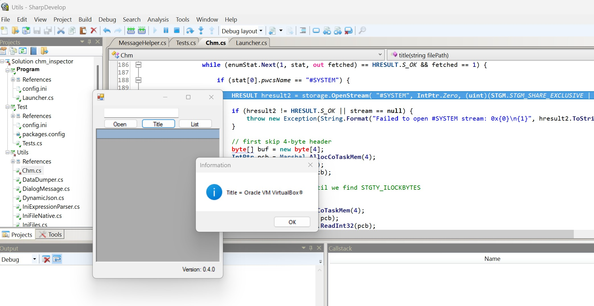
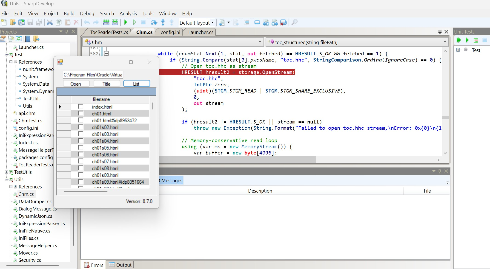
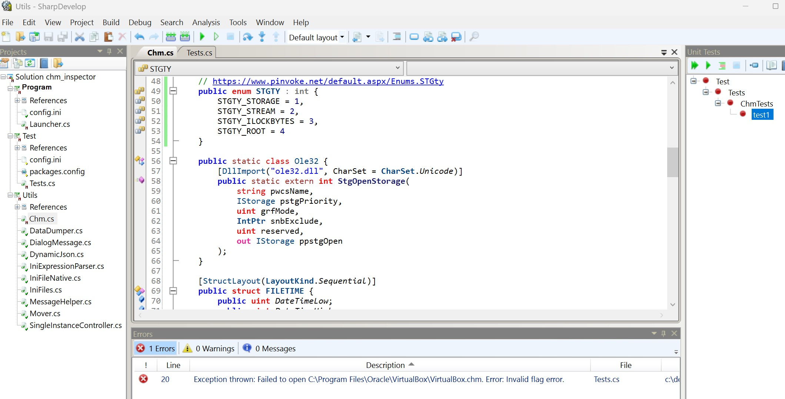
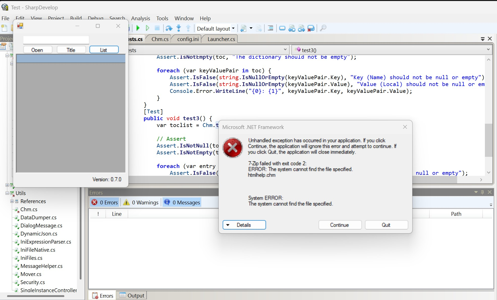
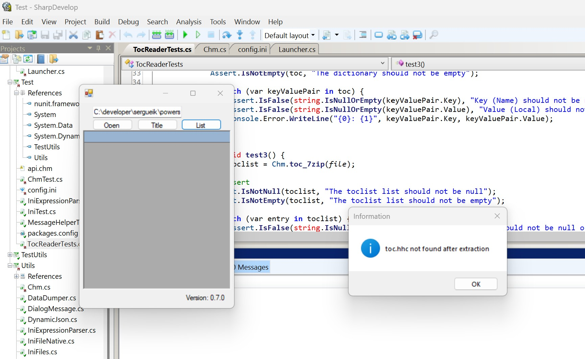
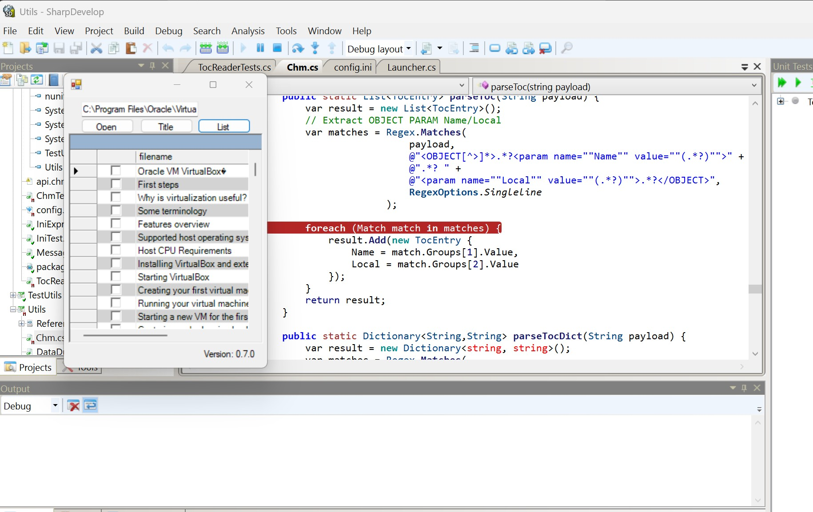

### Info

Program to examine the contents of a compiled help file (CHM) without fully extracting it, based on the [Get CHM Title](https://learn.microsoft.com/en-us/answers/questions/1358539/get-chm-title) snippet by *Castorix31*.

Uses the **Microsoft InfoTech IStorage System** COM server `{5D02926A-212E-11D0-9DF9-00A0C922E6EC}` to read storage directly without extracting the compiled HTML archive. **MSITFS** is the HTML Help/CHM runtime’s storage implementation (`itss.dll`).

Notably, [7-Zip](https://www.7-zip.org) can unpack/extract CHM files (listed as an “unpacking only” format). 7-Zip does **not** provide CHM creation or repacking functionality. Source code and downloads are available from the official 7-Zip site.

---

### Status

* **Implemented**
  * Reading the title of the compiled help file and listing component HTML files via `StgOpenStorage` and `7z.exe` commands
  * Loading the file list into a `DataGrid` for selection of files to extract

* **Work in progress**
  * Extracting selected files
  * Peeking for additional metadata to help select files — useful for large business-grade help files with tens of thousands of component documents








---
### Testing


Minimal dummy CHM generation using official, free [HTML Help Workshop](https://learn.microsoft.com/en-us/previous-versions/windows/desktop/htmlhelp/microsoft-html-help-downloads)


Steps:

  * Add 2–3 HTML files (topic1.htm, topic2.htm)
  
  
  * Create `dummy.hhp` project file with:
```ini
[OPTIONS]
Title=Dummy CHM
Default Topic=topic1.htm

[FILES]
topic1.htm
topic2.htm
```


* Compile with 
```cmd
hhc.exe dummy.hhp
```

this produces `dummy.chm` with __Titles__ in `#STRINGS` and __URL__ list in `#URLSTR`


---

### TOC

Information about the topics covered in individual files is stored in the file named `toc.hhc` as a set of objects:

```html
<OBJECT type="text/sitemap">
  <param name="Name" value="Starting a new VM for the first time">
  <param name="Local" value="ch01s09.html#idp8051664">
</OBJECT>

The toc.hhc is a plain HTML-like file inside the CHM (MS ITSS) archive. For a selection helper grid, the relevant attributes are Name and Local.

#### Extracting toc.hhc with `7-Zip`

```cmd
7z.exe e ${chm_file} toc.hhc -o${output_folder}
```

#### Reading `toc.hhc` via MSITFS COM Server

Using the **COM** **API** allows reading the file directly from the `CHM` archive without extracting:
```c#
IStorage storage;
HRESULT hr = StgOpenStorage(
    "myfile.chm",
    null,
    STGM_READ | STGM_SHARE_EXCLUSIVE,
    IntPtr.Zero,
    0,
    out storage
);

```
This is the same approach used internally by **MS HTML Help Workshop** or libraries such as **ChmLib**.

#### Parsing `toc.hhc`


`OBJECT` nodes can be parsed using a lightweight DOM parser (e.g., standalone [embedded DOM parser]() ) or even a simple regex:

```c#
var matches = Regex.Matches(
    tocContent,
    @"<OBJECT[^>]*>.*?<param name=""Name"" value=""(.*?)"">.*?<param name=""Local"" value=""(.*?)"">.*?</OBJECT>",
    RegexOptions.Singleline
);

foreach(Match match in matches) {
    string name = match.Groups[1].Value;
    string local = match.Groups[2].Value;
    // add to Dictionary<string, string> or a List<TocEntry> for the grid datasource
}

```
This regex approach avoids **DOM** parsing overhead, which is typically unnecessary since `toc.hhc` is usually very small.

### TODO

For full CHM introspection (beyond listing HTML filenames), `#URLSTR` alone is insufficient.  
The CHM internal structure requires cross-referencing several internal streams to reconstruct:

* Topic filenames
* Topic numeric IDs
* Topic titles
* Table of Contents (TOC)
* Index associations
* “Home” page
* Window definitions

---

### See Also

* [Original snippet](https://learn.microsoft.com/en-us/answers/questions/1358539/get-chm-title)
* [CodeProject example](https://www.codeproject.com/articles/Decompiling-CHM-help-files-with-C-) of decompiling CHM files with C# by [Yuriy Maksymenko](https://forum.codeproject.com/user/yuriy-maksymenko) (source code appears to be missing). Possible LinkedIn profile: [Yuriy Maksymenko](https://www.linkedin.com/in/yuri-canada/?originalSubdomain=ca)
* [StackOverflow discussion](https://stackoverflow.com/questions/9391424/how-to-get-a-list-of-topics-from-a-chm-file-in-c-sharp)
* [MSDN: IStorage and the compound file (structured storage) model](https://learn.microsoft.com/en-us/windows/win32/api/objidl/nn-objidl-istorage)
* [Open-source CHM spec and practical decompiler examples](https://www.nongnu.org/chmspec/latest/Miscellaneous.html) — CHM is a compound/LZX/LIT-style archive containing HTML/MHT, LZX compression, and index structures
* Partial implementation of `itss.dll` in [Wine](https://bugs.winehq.org/show_bug.cgi?id=7517)  
* `IStorage` compound file implementation (`StgOpenStorageEx` / `StgCreateStorageEx`) — [MSDN](https://learn.microsoft.com/en-us/windows/win32/stg/istorage-compound-file-implementation)
* Wine [source tree](https://gitlab.winehq.org/skitt/wine/-/tree/master/dlls/itss) for `itss` implementation
* sample [chm file](https://submain.com/ghostdoc/samples/PowerCollections/CHM/PowerCollectionsCHM.zip) from PowerCollections 
* [download](http://web.archive.org/web/20160201063255/http://download.microsoft.com/download/0/A/9/0A939EF6-E31C-430F-A3DF-DFAE7960D564/htmlhelp.exe) `htmlhelp.exe`
* [download](http://web.archive.org/web/20160314043751/http://download.microsoft.com/download/0/A/9/0A939EF6-E31C-430F-A3DF-DFAE7960D564/helpdocs.zip) `helpdocs.zip`

---

### Author

[Serguei Kouzmine](mailto:kouzmine_serguei@yahoo.com)
