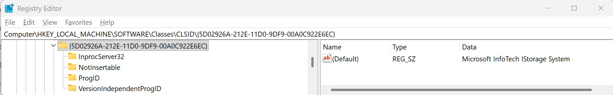
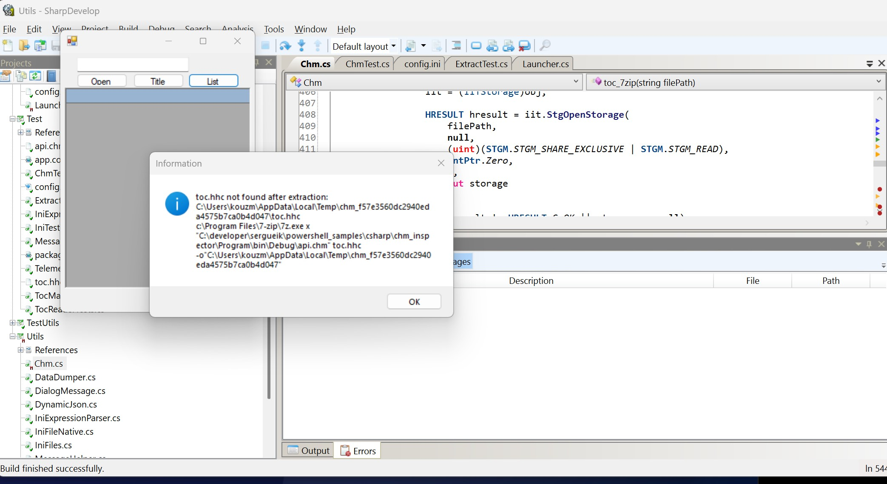
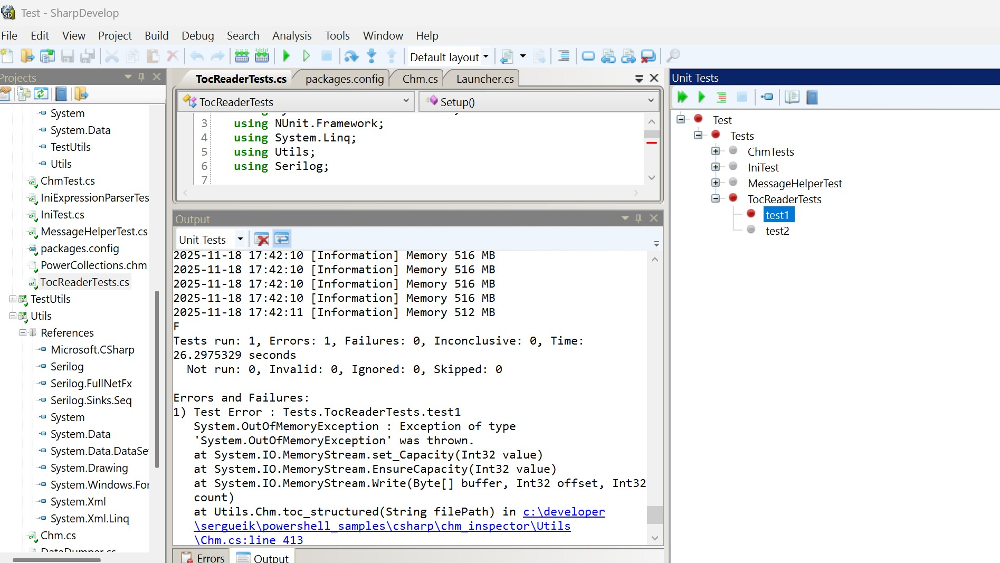
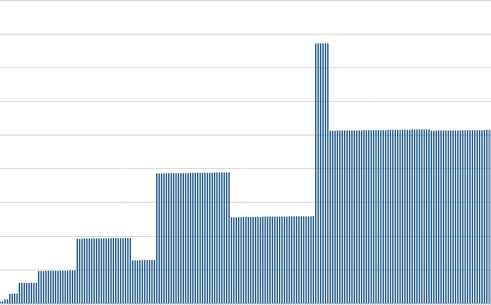
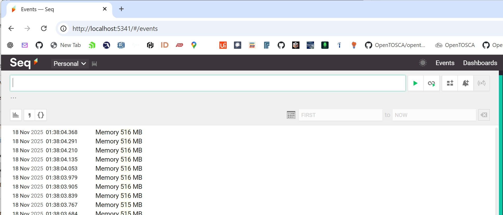

### Info

This program examines the contents of a compiled help file (CHM) without fully extracting it, based on the [Get CHM Title](https://learn.microsoft.com/en-us/answers/questions/1358539/get-chm-title) snippet by *Castorix31*.

It uses the **Microsoft InfoTech IStorage System** COM server `{5D02926A-212E-11D0-9DF9-00A0C922E6EC}` to read storage directly without extracting the compiled HTML archive. **MSITFS** is the HTML Help/CHM runtime’s storage implementation (`itss.dll`).



Free tool like [7-Zip](https://www.7-zip.org) can unpack/extract CHM files (listed as an “unpacking only” format). 7-Zip can  create or repack CHM files.

---

### Status

* **Implemented**
  * Reading the title of the compiled help file and listing component HTML files via `StgOpenStorage` and `7z.exe` commands
  * Loading the file list into a `DataGrid` for selection of files to extract   
  * Reading the CHM *table of contents* (`toc.hhc' by default) and building a title–filename map. This is crucial for enterprise-grade help files containing  many thousands of documents


* **Work in progress**
  * Extracting selected files





---

### Out Of Memory Exception


Earlier revision [f261436](https://github.com/sergueik/powershell_samples/commit/f261436579455ba52c05872e0a086287fb077b8e) of the server has been throwing exception during 

extraction of data from Structured Storage, due to unsafe implementation of the method `toc_structured` 

attempting to read an entire storage stream into memory without checking the number of bytes actually returned.

This led to `OutOfMemoryException`
 at
[Chm.cs#L391](https://github.com/sergueik/powershell_samples/blob/debug-oom/csharp/chm_inspector/Utils/Chm.cs#L391)
This happened because the code attempted to read the entire storage stream into memory using a fixed-size buffer without checking how many bytes were actually read, causing the loop to repeatedly append unbounded data to the `MemoryStream` until the process exhausted its available contiguous virtual memory segment.

```c#
public static List<TocEntry> toc_structured(string filePath) {
  logger.Info("toc_structured: starting");
    object obj = null;
    IITStorage iit = null;
    IStorage storage = null;
    IEnumSTATSTG enumStat = null;
    IStream stream = null;

    var result = new List<TocEntry>();

    try {
        obj = Activator.CreateInstance(Type.GetTypeFromCLSID(CLSID_ITStorage, true));
        iit = (IITStorage)obj;

        HRESULT hresult = iit.StgOpenStorage(filePath, null, (uint)(STGM.STGM_SHARE_EXCLUSIVE | STGM.STGM_READ), IntPtr.Zero, 0, out storage);
        if (hresult != HRESULT.S_OK || storage == null)
        throw new Exception(String.Format("Failed to open CHM file\nError: 0x{0}\n{1}", hresult.ToString("X"), MessageHelper.Msg(hresult)));

        hresult = storage.EnumElements(0, IntPtr.Zero, 0, out enumStat);
        if (hresult != HRESULT.S_OK || enumStat == null)
        throw new Exception(String.Format("Failed to enumerate CHM elements\nError: 0x{0}\n{1}", hresult.ToString("X"), MessageHelper.Msg(hresult)));

        var stat = new System.Runtime.InteropServices.ComTypes.STATSTG[1];
        uint fetched;

        while (enumStat.Next(1, stat, out fetched) == HRESULT.S_OK && fetched == 1) {
            // We are looking for "toc.hhc"
            if (string.Equals(stat[0].pwcsName, "toc.hhc", StringComparison.OrdinalIgnoreCase)) {
                hresult = storage.OpenStream(stat[0].pwcsName, IntPtr.Zero, (uint)(STGM.STGM_SHARE_EXCLUSIVE | STGM.STGM_READ), 0, out stream);
                if (hresult != HRESULT.S_OK || stream == null)
                  throw new Exception(String.Format("Failed to open toc.hhc stream,\nError: 0x{0}\n{1}", hresult.ToString("X"), MessageHelper.Msg(hresult)));

                // Read full stream
                MemoryStream ms = new MemoryStream();
                byte[] buffer = new byte[4096];
                IntPtr pcb = IntPtr.Zero;
        // NOTE: do not be logging every iteration of the read loop
        int loopCounter = 0;
                while (true) {
                    stream.Read(buffer, buffer.Length, pcb);
                    loopCounter++;
            if (loopCounter % 500 == 0)
                      logger.Info(String.Format( "Memory {0} MB", GC.GetTotalMemory(false) / (1024 * 1024)));
                    // Assume buffer fully read; could refine with actual bytes read
                    ms.Write(buffer, 0, buffer.Length);
                    // For simplicity, break when less than buffer size (optional refinement)
                    if (buffer.Length < 4096) break;
                }

                string tocContent = Encoding.UTF8.GetString(ms.ToArray());

                // Regex parse OBJECT nodes
                var matches = Regex.Matches(tocContent,
                    @"<OBJECT[^>]*>.*?<param name=""Name"" value=""(.*?)"">.*?<param name=""Local"" value=""(.*?)"">.*?</OBJECT>",
                    RegexOptions.Singleline);

                foreach (Match m in matches) {
                    result.Add(new TocEntry {
                        Name = m.Groups[1].Value,
                        Local = m.Groups[2].Value
                    });
                }

                break; // done with toc.hhc
            }
        }
    } finally {
        if (stream != null) Marshal.ReleaseComObject(stream);
        if (enumStat != null) Marshal.ReleaseComObject(enumStat);
        if (storage != null) Marshal.ReleaseComObject(storage);
        if (iit != null) Marshal.ReleaseComObject(iit);
        if (obj != null) Marshal.ReleaseComObject(obj);
    }

    return result;

  }
```
Note: Although the MemoryStream appeared to grow without bounds, we cannot conclusively prove an actual global memory shortage occurred. 
The failure is consistent with a *segmentation-related* allocation failure — meaning the runtime could not obtain a sufficiently large contiguous block of virtual memory — rather than true exhaustion of total system RAM.

A more resilient approach achieved in the commit [37fa6dbfe](https://github.com/sergueik/powershell_samples/commit/37fa6dbfe44d94856ec0fa8c35aed558a10f01b6) involves:

  * Checking the exact number of bytes returned by `IStream.Read`,
  * Stopping when fewer than `buffer.Length` bytes are read,
  * processing the stream incrementally to avoid building a full in-memory copy.


Memory allocation and segmentation ensure that your process only receives a limited, contiguous block of usable RAM/virtual memory, and an `OutOfMemoryException` simply means the system could not reserve a sufficiently large continuous segment for your in-memory buffer—even if total free memory still existed.

#### Telemetry and Log Collection

The sample includes optional instrumentation through
periodic `GC.GetTotalMemory()`
[metric](https://learn.microsoft.com/en-us/dotnet/api/system.gc.gettotalmemory?view=netframework-4.5) logging that is highly configurable
and can be forwarded to a
log collector such as [Seq](https://datalust.co/), and eventually to telemetry stacks such as [Prometheus](https://prometheus.io/download/)/ [Grafana](https://grafana.com/grafana/download) to observe memory pressure and stream read behavior

By examining this metric, whose values typically spike sharply just before failure,

```c#
logger.Info(String.Format( "Memory {0} MB", GC.GetTotalMemory(false) / (1024 * 1024)));
```





one can clearly visualize heap exhaustion and the conditions leading up to an impending `OutOfMemoryException`	.

NOTE: Seq is primarily a lightweight
fine-grained, application-level log collection and indexing platform,
not a telemetry indicator or metrics system, and it does not provide
built-in capabilities for transforming log message content.


In an ideal setup for collecting and rendering application telemetry, the Seq event stream—received via a __Serilog__ sink—would be forwarded to __Grafana__ for visualization.
The other option is to use [ECS Logging .NET](https://www.elastic.co/docs/reference/ecs/logging/dotnet/setup)
This, however, requires a compatible Seq-JSON data source or
Grafana plugin, which is still under investigation and not yet fully supported.

Another viable option is to integrate the ELK stack,
using the [Elastic.Serilog.Sinks](https://www.nuget.org/packages/Elastic.Serilog.Sinks/8.11.0) (the ackage is compatible with downplatform .NET Framework __4.6.1__) or the legacy `Serilog.Sinks.Elasticsearch`
[NuGet package](https://www.nuget.org/packages/Serilog.Sinks.Elasticsearch) for .NET, or
the [Logback ECS Encoder](https://mvnrepository.com/artifact/co.elastic.logging/logback-ecs-encoder)/[Logstash Logback Encoder](https://mvnrepository.com/artifact/net.logstash.logback/logstash-logback-encoder)
dependencies for Java, allowing log events
to be indexed directly into Elasticsearch and transformed and visualized through Kibana.


---

### TOC

Information about the topics covered in individual files is stored in the table of contents  file named `toc.hhc` as a set of `<OBJECT>` objects:

```html
<OBJECT type="text/sitemap">
  <param name="Name" value="Starting a new VM for the first time">
  <param name="Local" value="ch01s09.html#idp8051664">
</OBJECT>

The table of content index (named by default `toc.hhc`) is a plain HTML file inside the CHM (MS ITSS) archive. For a selection helper grid, the relevant attributes to extract are `Name` and `Local`.

### Processing `toc.hhc` 
#### Using `7-Zip`

```cmd
7z.exe e ${chm_file} toc.hhc -o${output_folder}
```

#### Via MSITFS COM Server COM API

Using the **COM** **API** allows accessing the file directly from within the `CHM` archive without extracting:
```c#
IStorage storage;
HRESULT hr = StgOpenStorage(
    "myfile.chm",
    null,
    STGM_READ | STGM_SHARE_EXCLUSIVE,
    IntPtr.Zero,
    0,
    out storage
);

```
This is the same approach used internally by **MS HTML Help Workshop** or libraries such as **ChmLib**.

#### Parsing `toc.hhc`


`OBJECT` nodes can be parsed using a lightweight DOM parser, e.g., standalone [embedded DOM parser](https://github.com/sergueik/powershell_samples/tree/master/csharp/standalone_embedded_parser)
or even a plain regex:

```c#
var matches = Regex.Matches(
    tocContent,
    @"<OBJECT[^>]*>.*?<param name=""Name"" value=""(.*?)"">.*?<param name=""Local"" value=""(.*?)"">.*?</OBJECT>",
    RegexOptions.Singleline
);

foreach(Match match in matches) {
    string name = match.Groups[1].Value;
    string local = match.Groups[2].Value;
    // add to Dictionary<string, string> or a List<TocEntry> for the grid datasource
}

```
This regex approach avoids **DOM** parsing overhead, and can be used for small `toc.hhc`. However it does not scale and extracting a few hundreds of items from the `toc.hhc` may take a minute. The realistic help files, e.g. describing legacy Mainframe model bank teller screens, may easily contain tens of thousands of component files.


---

### Elastic Search

Adding ElasticSearh packages through `packages.config` for .Net Framework __4.5__ 
```xml
<?xml version="1.0" encoding="utf-8"?>

<packages>
  <package id="NUnit" version="2.6.4" targetFramework="net45" />
	<!-- NOTE: old versions chosen to make install through SharpDevelop 5.1 embeddd nuget possible -->
	<package id="Serilog.Sinks.Elasticsearch" version="8.0.0" targetFramework="net45" />
	<package id="Elasticsearch.Net" version="7.0.0" targetFramework="net45" />
	<package id="Serilog.Sinks.File" version="3.1.1" targetFramework="net45" />
	<package id="Serilog.Sinks.Console" version="2.0.0" targetFramework="net45" />
		<!--
 have to install manually extracting the Serilog 2.0.0 nuget package -->
	<!--
	<package id="Serilog" version="2.0.0" targetFramework="net452" /> -->
  <package id="FluentAssertions" version="4.4.0" targetFramework="net45" />
  <package id="Newtonsoft.Json" version="6.0.6" targetFramework="net45" />
</packages>

```
leads to compilation error:
```text
The type 'System.Object' is defined in an assembly that is not referenced.
You must add a reference to assembly 'System.Runtime, Version=4.0.0.0, Culture=neutral, PublicKeyToken=b03f5f7f11d50a3a'. (CS0012)

```
switching to older .Net Framework version __4.0__ 
leads to compilation error:
```text
Assembly 'Serilog.Sinks.Elasticsearch, Version=4.1.0.0, Culture=neutral, PublicKeyToken=24c2f752a8e58a10' uses 'Serilog, Version=2.0.0.0, Culture=neutral, PublicKeyToken=24c2f752a8e58a10' which has a higher version than referenced assembly 'Serilog, Version=1.5.0.0, Culture=neutral, PublicKeyToken=24c2f752a8e58a10' (CS1705)
```
installing `Serilog 2.0.0` via ShareDevelop __5.1__ embedded nuget leads to  an error with **Restore Packages** step:
```text
	Installing 'Serilog 2.0.0'.
	'Serilog' already has a dependency defined for 'Microsoft.CSharp'.
	Exited with code: 1
```
```sh
curl -sO ~/Downloads/serilog.2.12.0.nupkg https://www.nuget.org/api/v2/package/Serilog/2.12.0
mkdir -p packages/serilog.2.12.0
unzip ~/Downloads/serilog.2.12.0.nupkg -d packages/serilog.2.12.0
```
and

similar for  `Serilog.Sinks.PeriodicBatching`:

```sh
curl -sO ~/Downloads/serilog.sinks.periodicbatching.2.3.0 https://www.nuget.org/api/v2/package/Serilog.Sinks.Console/2.3.0
mkdir -p packages/serilog.sinks.periodicbatching.2.3.0
unzip ~/Downloads/serilog.sinks.periodicbatching.2.3.0.nupkg -d packages/serilog.sinks.periodicbatching.2.3.0

```

```sh
curl -s -v -L -o ~/Downloads/serilog.formatting.elasticsearch.8.4.1.nupkg https://www.nuget.org/api/v2/package/Serilog.Formatting.Elasticsearch/8.4.1

test -f ~/Downloads/serilog.formatting.elasticsearch.8.4.1.nupkg              
$ echo $?

mkdir -p packages/serilog.formatting.elasticsearch/8.4.1
unzip ~/Downloads/serilog.formatting.elasticsearch.8.4.1.nupkg -d packages/serilog.formatting.elasticsearch/8.4.1

0

```

and manually updating c# project files with the reference


There are still errors thrown in runtime:
```text
SetUp : System.MissingMethodException : Method not found: 'Void Serilog.Sinks.PeriodicBatching.PeriodicBatchingSink..ctor(Int32, System.TimeSpan, Int32)'.
```
---

These are solved by collecting the matching set of versions in `Serilog` dependency set:

```txt
packages/serilog.2.12.0/lib/net45/Serilog.dll
packages/serilog.2.12.0/lib/net46/Serilog.dll
packages/serilog.formatting.elasticsearch/8.4.1/lib/net45/Serilog.Formatting.Elasticsearch.dll
packages/Serilog.Sinks.Console.2.0.0/lib/net45/Serilog.Sinks.Console.dll
packages/Serilog.Sinks.Elasticsearch.8.4.1/lib/net461/Serilog.Sinks.Elasticsearch.dll
packages/Serilog.Sinks.File.3.1.1/lib/net45/Serilog.Sinks.File.dll
packages/serilog.sinks.periodicbatching.2.3.0/lib/net45/Serilog.Sinks.PeriodicBatching.dll

```

run elasticsearch standalone
```cmd
pushd C:\java\elasticsearch-9.2.1\bin>
elasticsearch.bat

```

this will produce amount of logs after a little bit:
```txt
[2025-11-19T22:07:13,620][INFO ][o.e.b.Elasticsearch      ] [SERGUEIK23] version[9.2.1], pid[28596], build[zip/4ad0ef0e98a2e72fafbd79a19fa5cae2f026117d/2025-11-06T22:07:39.673130621Z], OS[Windows 11/10.0/amd64], JVM[Oracle Corporation/OpenJDK 64-Bit Server VM/25.0.1/25.0.1+8-27]
[2025-11-19T22:07:13,634][INFO ][o.e.b.Elasticsearch      ] [SERGUEIK23] JVM home [C:\java\elasticsearch-9.2.1\jdk], using bundled JDK [true]
[2025-11-19T22:07:13,636][INFO ][o.e.b.Elasticsearch      ] [SERGUEIK23] JVM arguments [-Des.networkaddress.cache.ttl=60, -Des.networkaddress.cache.negative.ttl=10, -XX:+AlwaysPreTouch, -Xss1m, -Djava.awt.headless=true, -Dfile.encoding=UTF-8, -Djna.nosys=true, -XX:-OmitStackTraceInFastThrow, -Dio.netty.noUnsafe=true, -Dio.netty.noKeySetOptimization=true, -Dio.netty.recycler.maxCapacityPerThread=0, --add-opens=org.apache.lucene.core/org.apache.lucene.codecs.lucene99=org.elasticsearch.server, --add-opens=org.apache.lucene.core/org.apache.lucene.internal.vectorization=org.elasticsearch.server, -Dlog4j.shutdownHookEnabled=false, -Dlog4j2.disable.jmx=true, -Dlog4j2.formatMsgNoLookups=true, -Djava.locale.providers=CLDR, -Dorg.apache.lucene.vectorization.upperJavaFeatureVersion=25, -Des.path.home=C:\java\elasticsearch-9.2.1, -Des.distribution.type=zip, -Des.java.type=bundled JDK, --enable-native-access=org.elasticsearch.nativeaccess,org.apache.lucene.core, --enable-native-access=ALL-UNNAMED, --illegal-native-access=deny, -XX:ReplayDataFile=logs/replay_pid%p.log, -XX:+EnableDynamicAgentLoading, -Djdk.attach.allowAttachSelf=true, --patch-module=java.base=C:\java\elasticsearch-9.2.1\lib\entitlement-bridge\elasticsearch-entitlement-bridge-9.2.1.jar, --add-exports=java.base/org.elasticsearch.entitlement.bridge=org.elasticsearch.entitlement,java.logging,java.net.http,java.naming,jdk.net, -XX:+UseG1GC, -Djava.io.tmpdir=C:\Users\kouzm\AppData\Local\Temp\elasticsearch, --add-modules=jdk.incubator.vector, -Dorg.apache.lucene.store.defaultReadAdvice=normal, -Dorg.apache.lucene.store.MMapDirectory.sharedArenaMaxPermits=1, -XX:+HeapDumpOnOutOfMemoryError, -XX:+ExitOnOutOfMemoryError, -XX:ErrorFile=hs_err_pid%p.log, -Xlog:gc*,gc+age=trace,safepoint:file=gc.log:utctime,level,pid,tags:filecount=32,filesize=64m, -Xms8083m, -Xmx8083m, -XX:MaxDirectMemorySize=4238344192, -XX:G1HeapRegionSize=4m, -XX:InitiatingHeapOccupancyPercent=30, -XX:G1ReservePercent=15, --module-path=C:\java\elasticsearch-9.2.1\lib, --add-modules=jdk.net, --add-modules=jdk.management.agent, --add-modules=ALL-MODULE-PATH, -Djdk.module.main=org.elasticsearch.server]
[2025-11-19T22:07:13,637][INFO ][o.e.b.Elasticsearch      ] [SERGUEIK23] Default Locale [en_US]
[2025-11-19T22:07:15,104][INFO ][o.e.n.NativeAccess       ] [SERGUEIK23] Using [jdk] native provider and native methods for [Windows]
[2025-11-19T22:07:16,464][INFO ][o.a.l.i.v.PanamaVectorizationProvider] [SERGUEIK23] Java vector incubator API enabled; uses preferredBitSize=512; FMA enabled
[2025-11-19T22:07:16,684][INFO ][o.e.b.Elasticsearch      ] [SERGUEIK23] Bootstrapping Entitlements
[2025-11-19T22:08:29,099][WARN ][o.e.x.g.GPUSupport       ] [SERGUEIK23] GPU based vector indexing is not supported on this platform; cuvs-java supports only Linux
[2025-11-19T22:08:30,019][INFO ][o.e.p.PluginsService     ] [SERGUEIK23] loaded module [repository-url]
[2025-11-19T22:08:30,020][INFO ][o.e.p.PluginsService     ] [SERGUEIK23] loaded module [rest-root]
[2025-11-19T22:08:30,021][INFO ][o.e.p.PluginsService     ] [SERGUEIK23] loaded module [x-pack-core]
[2025-11-19T22:08:30,021][INFO ][o.e.p.PluginsService     ] [SERGUEIK23] loaded module [x-pack-redact]
[2025-11-19T22:08:30,022][INFO ][o.e.p.PluginsService     ] [SERGUEIK23] loaded module [ingest-user-agent]
[2025-11-19T22:08:30,023][INFO ][o.e.p.PluginsService     ] [SERGUEIK23] loaded module [x-pack-async-search]
[2025-11-19T22:08:30,024][INFO ][o.e.p.PluginsService     ] [SERGUEIK23] loaded module [x-pack-monitoring]
[2025-11-19T22:08:30,025][INFO ][o.e.p.PluginsService     ] [SERGUEIK23] loaded module [repository-s3]
[2025-11-19T22:08:30,026][INFO ][o.e.p.PluginsService     ] [SERGUEIK23] loaded module [x-pack-analytics]
[2025-11-19T22:08:30,027][INFO ][o.e.p.PluginsService     ] [SERGUEIK23] loaded module [x-pack-esql-core]
[2025-11-19T22:08:30,028][INFO ][o.e.p.PluginsService     ] [SERGUEIK23] loaded module [search-business-rules]
[2025-11-19T22:08:30,029][INFO ][o.e.p.PluginsService     ] [SERGUEIK23] loaded module [x-pack-ent-search]
[2025-11-19T22:08:30,029][INFO ][o.e.p.PluginsService     ] [SERGUEIK23] loaded module [x-pack-autoscaling]
[2025-11-19T22:08:30,029][INFO ][o.e.p.PluginsService     ] [SERGUEIK23] loaded module [lang-painless]
[2025-11-19T22:08:30,029][INFO ][o.e.p.PluginsService     ] [SERGUEIK23] loaded module [x-pack-ml]
[2025-11-19T22:08:30,030][INFO ][o.e.p.PluginsService     ] [SERGUEIK23] loaded module [lang-mustache]
[2025-11-19T22:08:30,031][INFO ][o.e.p.PluginsService     ] [SERGUEIK23] loaded module [legacy-geo]
[2025-11-19T22:08:30,032][INFO ][o.e.p.PluginsService     ] [SERGUEIK23] loaded module [logsdb]
[2025-11-19T22:08:30,032][INFO ][o.e.p.PluginsService     ] [SERGUEIK23] loaded module [x-pack-ql]
[2025-11-19T22:08:30,033][INFO ][o.e.p.PluginsService     ] [SERGUEIK23] loaded module [rank-rrf]
[2025-11-19T22:08:30,034][INFO ][o.e.p.PluginsService     ] [SERGUEIK23] loaded module [analysis-common]
[2025-11-19T22:08:30,035][INFO ][o.e.p.PluginsService     ] [SERGUEIK23] loaded module [health-shards-availability]
[2025-11-19T22:08:30,035][INFO ][o.e.p.PluginsService     ] [SERGUEIK23] loaded module [transport-netty4]
[2025-11-19T22:08:30,036][INFO ][o.e.p.PluginsService     ] [SERGUEIK23] loaded module [aggregations]
[2025-11-19T22:08:30,037][INFO ][o.e.p.PluginsService     ] [SERGUEIK23] loaded module [ingest-common]
[2025-11-19T22:08:30,037][INFO ][o.e.p.PluginsService     ] [SERGUEIK23] loaded module [frozen-indices]
[2025-11-19T22:08:30,039][INFO ][o.e.p.PluginsService     ] [SERGUEIK23] loaded module [x-pack-identity-provider]
[2025-11-19T22:08:30,040][INFO ][o.e.p.PluginsService     ] [SERGUEIK23] loaded module [x-pack-shutdown]
[2025-11-19T22:08:30,042][INFO ][o.e.p.PluginsService     ] [SERGUEIK23] loaded module [x-pack-text-structure]
[2025-11-19T22:08:30,045][INFO ][o.e.p.PluginsService     ] [SERGUEIK23] loaded module [snapshot-repo-test-kit]
[2025-11-19T22:08:30,046][INFO ][o.e.p.PluginsService     ] [SERGUEIK23] loaded module [ml-package-loader]
[2025-11-19T22:08:30,046][INFO ][o.e.p.PluginsService     ] [SERGUEIK23] loaded module [kibana]
[2025-11-19T22:08:30,047][INFO ][o.e.p.PluginsService     ] [SERGUEIK23] loaded module [constant-keyword]
[2025-11-19T22:08:30,048][INFO ][o.e.p.PluginsService     ] [SERGUEIK23] loaded module [x-pack-logstash]
[2025-11-19T22:08:30,049][INFO ][o.e.p.PluginsService     ] [SERGUEIK23] loaded module [x-pack-ccr]
[2025-11-19T22:08:30,050][INFO ][o.e.p.PluginsService     ] [SERGUEIK23] loaded module [x-pack-graph]
[2025-11-19T22:08:30,050][INFO ][o.e.p.PluginsService     ] [SERGUEIK23] loaded module [rank-vectors]
[2025-11-19T22:08:30,051][INFO ][o.e.p.PluginsService     ] [SERGUEIK23] loaded module [x-pack-esql]
[2025-11-19T22:08:30,052][INFO ][o.e.p.PluginsService     ] [SERGUEIK23] loaded module [parent-join]
[2025-11-19T22:08:30,052][INFO ][o.e.p.PluginsService     ] [SERGUEIK23] loaded module [counted-keyword]
[2025-11-19T22:08:30,053][INFO ][o.e.p.PluginsService     ] [SERGUEIK23] loaded module [x-pack-enrich]
[2025-11-19T22:08:30,054][INFO ][o.e.p.PluginsService     ] [SERGUEIK23] loaded module [repositories-metering-api]
[2025-11-19T22:08:30,055][INFO ][o.e.p.PluginsService     ] [SERGUEIK23] loaded module [transform]
[2025-11-19T22:08:30,056][INFO ][o.e.p.PluginsService     ] [SERGUEIK23] loaded module [repository-azure]
[2025-11-19T22:08:30,056][INFO ][o.e.p.PluginsService     ] [SERGUEIK23] loaded module [dot-prefix-validation]
[2025-11-19T22:08:30,057][INFO ][o.e.p.PluginsService     ] [SERGUEIK23] loaded module [repository-gcs]
[2025-11-19T22:08:30,058][INFO ][o.e.p.PluginsService     ] [SERGUEIK23] loaded module [spatial]
[2025-11-19T22:08:30,058][INFO ][o.e.p.PluginsService     ] [SERGUEIK23] loaded module [x-pack-otel-data]
[2025-11-19T22:08:30,059][INFO ][o.e.p.PluginsService     ] [SERGUEIK23] loaded module [apm]
[2025-11-19T22:08:30,060][INFO ][o.e.p.PluginsService     ] [SERGUEIK23] loaded module [mapper-extras]
[2025-11-19T22:08:30,061][INFO ][o.e.p.PluginsService     ] [SERGUEIK23] loaded module [mapper-version]
[2025-11-19T22:08:30,061][INFO ][o.e.p.PluginsService     ] [SERGUEIK23] loaded module [x-pack-rollup]
[2025-11-19T22:08:30,062][INFO ][o.e.p.PluginsService     ] [SERGUEIK23] loaded module [percolator]
[2025-11-19T22:08:30,062][INFO ][o.e.p.PluginsService     ] [SERGUEIK23] loaded module [x-pack-migrate]
[2025-11-19T22:08:30,062][INFO ][o.e.p.PluginsService     ] [SERGUEIK23] loaded module [data-streams]
[2025-11-19T22:08:30,063][INFO ][o.e.p.PluginsService     ] [SERGUEIK23] loaded module [x-pack-stack]
[2025-11-19T22:08:30,065][INFO ][o.e.p.PluginsService     ] [SERGUEIK23] loaded module [rank-eval]
[2025-11-19T22:08:30,065][INFO ][o.e.p.PluginsService     ] [SERGUEIK23] loaded module [reindex]
[2025-11-19T22:08:30,066][INFO ][o.e.p.PluginsService     ] [SERGUEIK23] loaded module [streams]
[2025-11-19T22:08:30,066][INFO ][o.e.p.PluginsService     ] [SERGUEIK23] loaded module [x-pack-security]
[2025-11-19T22:08:30,066][INFO ][o.e.p.PluginsService     ] [SERGUEIK23] loaded module [blob-cache]
[2025-11-19T22:08:30,066][INFO ][o.e.p.PluginsService     ] [SERGUEIK23] loaded module [searchable-snapshots]
[2025-11-19T22:08:30,066][INFO ][o.e.p.PluginsService     ] [SERGUEIK23] loaded module [gpu]
[2025-11-19T22:08:30,067][INFO ][o.e.p.PluginsService     ] [SERGUEIK23] loaded module [x-pack-slm]
[2025-11-19T22:08:30,067][INFO ][o.e.p.PluginsService     ] [SERGUEIK23] loaded module [x-pack-geoip-enterprise-downloader]
[2025-11-19T22:08:30,067][INFO ][o.e.p.PluginsService     ] [SERGUEIK23] loaded module [snapshot-based-recoveries]
[2025-11-19T22:08:30,067][INFO ][o.e.p.PluginsService     ] [SERGUEIK23] loaded module [x-pack-watcher]
[2025-11-19T22:08:30,067][INFO ][o.e.p.PluginsService     ] [SERGUEIK23] loaded module [old-lucene-versions]
[2025-11-19T22:08:30,068][INFO ][o.e.p.PluginsService     ] [SERGUEIK23] loaded module [x-pack-ilm]
[2025-11-19T22:08:30,068][INFO ][o.e.p.PluginsService     ] [SERGUEIK23] loaded module [x-pack-inference]
[2025-11-19T22:08:30,068][INFO ][o.e.p.PluginsService     ] [SERGUEIK23] loaded module [x-pack-voting-only-node]
[2025-11-19T22:08:30,068][INFO ][o.e.p.PluginsService     ] [SERGUEIK23] loaded module [x-pack-deprecation]
[2025-11-19T22:08:30,069][INFO ][o.e.p.PluginsService     ] [SERGUEIK23] loaded module [x-pack-fleet]
[2025-11-19T22:08:30,069][INFO ][o.e.p.PluginsService     ] [SERGUEIK23] loaded module [x-pack-aggregate-metric]
[2025-11-19T22:08:30,069][INFO ][o.e.p.PluginsService     ] [SERGUEIK23] loaded module [x-pack-downsample]
[2025-11-19T22:08:30,070][INFO ][o.e.p.PluginsService     ] [SERGUEIK23] loaded module [x-pack-profiling]
[2025-11-19T22:08:30,070][INFO ][o.e.p.PluginsService     ] [SERGUEIK23] loaded module [ingest-geoip]
[2025-11-19T22:08:30,070][INFO ][o.e.p.PluginsService     ] [SERGUEIK23] loaded module [x-pack-write-load-forecaster]
[2025-11-19T22:08:30,070][INFO ][o.e.p.PluginsService     ] [SERGUEIK23] loaded module [exponential-histogram]
[2025-11-19T22:08:30,071][INFO ][o.e.p.PluginsService     ] [SERGUEIK23] loaded module [ingest-attachment]
[2025-11-19T22:08:30,071][INFO ][o.e.p.PluginsService     ] [SERGUEIK23] loaded module [wildcard]
[2025-11-19T22:08:30,071][INFO ][o.e.p.PluginsService     ] [SERGUEIK23] loaded module [x-pack-apm-data]
[2025-11-19T22:08:30,072][INFO ][o.e.p.PluginsService     ] [SERGUEIK23] loaded module [unsigned-long]
[2025-11-19T22:08:30,072][INFO ][o.e.p.PluginsService     ] [SERGUEIK23] loaded module [x-pack-sql]
[2025-11-19T22:08:30,073][INFO ][o.e.p.PluginsService     ] [SERGUEIK23] loaded module [runtime-fields-common]
[2025-11-19T22:08:30,073][INFO ][o.e.p.PluginsService     ] [SERGUEIK23] loaded module [x-pack-async]
[2025-11-19T22:08:30,073][INFO ][o.e.p.PluginsService     ] [SERGUEIK23] loaded module [vector-tile]
[2025-11-19T22:08:30,074][INFO ][o.e.p.PluginsService     ] [SERGUEIK23] loaded module [x-pack-kql]
[2025-11-19T22:08:30,074][INFO ][o.e.p.PluginsService     ] [SERGUEIK23] loaded module [lang-expression]
[2025-11-19T22:08:30,075][INFO ][o.e.p.PluginsService     ] [SERGUEIK23] loaded module [ingest-otel]
[2025-11-19T22:08:30,075][INFO ][o.e.p.PluginsService     ] [SERGUEIK23] loaded module [x-pack-eql]
[2025-11-19T22:08:32,593][WARN ][stderr                   ] [SERGUEIK23] SLF4J: No SLF4J providers were found.
[2025-11-19T22:08:32,596][WARN ][stderr                   ] [SERGUEIK23] SLF4J: Defaulting to no-operation (NOP) logger implementation
[2025-11-19T22:08:32,597][WARN ][stderr                   ] [SERGUEIK23] SLF4J: See https://www.slf4j.org/codes.html#noProviders for further details.
[2025-11-19T22:08:35,757][INFO ][o.e.e.NodeEnvironment    ] [SERGUEIK23] using [1] data paths, mounts [[Windows-SSD (C:)]], net usable_space [218.4gb], net total_space [951.6gb], types [NTFS]
[2025-11-19T22:08:35,759][INFO ][o.e.e.NodeEnvironment    ] [SERGUEIK23] heap size [7.8gb], compressed ordinary object pointers [true]
[2025-11-19T22:08:35,795][INFO ][o.e.n.Node               ] [SERGUEIK23] node name [SERGUEIK23], node ID [hB7aICvERy2ki30OoKjURQ], cluster name [elasticsearch], roles [ml, data_frozen, ingest, data_cold, data, remote_cluster_client, master, data_warm, data_content, transform, data_hot]
[2025-11-19T22:08:44,306][INFO ][o.e.f.FeatureService     ] [SERGUEIK23] Registered local node features [ES_V_8, ES_V_9, cluster.reroute.ignores_metric_param, cluster.stats.source_modes, data_stream.failure_store, inference.endpoint.cache, ingest.field_access_pattern, linear_retriever_supported, lucene_10_1_upgrade, lucene_10_upgrade, resolve_index_returns_mode, security.queryable_built_in_roles, security_stats_endpoint, simulate.ignored.fields, snapshots.get.state_parameter]
[2025-11-19T22:08:45,090][INFO ][o.e.i.r.RecoverySettings ] [SERGUEIK23] using rate limit [40mb] with [default=40mb, read=0b, write=0b, max=0b]
[2025-11-19T22:08:45,656][INFO ][o.e.c.m.DataStreamGlobalRetentionSettings] [SERGUEIK23] Updated global default retention to [null]
[2025-11-19T22:08:45,658][INFO ][o.e.c.m.DataStreamGlobalRetentionSettings] [SERGUEIK23] Updated global max retention to [null]
[2025-11-19T22:08:45,661][INFO ][o.e.c.m.DataStreamGlobalRetentionSettings] [SERGUEIK23] Updated failures default retention to [30d]
[2025-11-19T22:08:45,665][INFO ][o.e.c.m.DataStreamFailureStoreSettings] [SERGUEIK23] Updated data stream name patterns for enabling failure store to [[]]
[2025-11-19T22:08:47,377][INFO ][o.e.x.m.p.l.CppLogMessageHandler] [SERGUEIK23] [controller/21976] [Main.cc@123] controller (64 bit): Version 9.2.1 (Build 5b1f3417ee0e02) Copyright (c) 2025 Elasticsearch BV
[2025-11-19T22:08:48,731][INFO ][o.e.x.o.OTelPlugin       ] [SERGUEIK23] OTel ingest plugin is enabled
[2025-11-19T22:08:48,820][INFO ][o.e.x.c.t.YamlTemplateRegistry] [SERGUEIK23] OpenTelemetry index template registry is enabled
[2025-11-19T22:08:48,832][INFO ][o.e.t.a.APM              ] [SERGUEIK23] Sending apm metrics is disabled
[2025-11-19T22:08:48,833][INFO ][o.e.t.a.APM              ] [SERGUEIK23] Sending apm tracing is disabled
[2025-11-19T22:08:48,945][INFO ][o.e.x.s.Security         ] [SERGUEIK23] Security is enabled
[2025-11-19T22:08:50,449][INFO ][o.e.x.s.a.s.FileRolesStore] [SERGUEIK23] parsed [0] roles from file [C:\java\elasticsearch-9.2.1\config\roles.yml]

[2025-11-19T22:08:51,929][INFO ][o.e.x.w.Watcher          ] [SERGUEIK23] Watcher initialized components at 2025-11-20T03:08:51.926Z
[2025-11-19T22:08:52,325][INFO ][o.e.x.p.ProfilingPlugin  ] [SERGUEIK23] Profiling is enabled
[2025-11-19T22:08:52,379][INFO ][o.e.x.p.ProfilingPlugin  ] [SERGUEIK23] profiling index templates will not be installed or reinstalled
[2025-11-19T22:08:52,399][INFO ][o.e.x.a.APMPlugin        ] [SERGUEIK23] APM ingest plugin is enabled
[2025-11-19T22:08:52,521][INFO ][o.e.x.c.t.YamlTemplateRegistry] [SERGUEIK23] apm index template registry is enabled
[2025-11-19T22:08:53,910][WARN ][stderr                   ] [SERGUEIK23] SLF4J: No SLF4J providers were found.
[2025-11-19T22:08:53,911][WARN ][stderr                   ] [SERGUEIK23] SLF4J: Defaulting to no-operation (NOP) logger implementation
[2025-11-19T22:08:53,911][WARN ][stderr                   ] [SERGUEIK23] SLF4J: See https://www.slf4j.org/codes.html#noProviders for further details.
[2025-11-19T22:08:53,912][WARN ][stderr                   ] [SERGUEIK23] SLF4J: Class path contains SLF4J bindings targeting slf4j-api versions 1.7.x or earlier.
[2025-11-19T22:08:53,913][WARN ][stderr                   ] [SERGUEIK23] SLF4J: Ignoring binding found at [jar:file:///C:/java/elasticsearch-9.2.1/modules/x-pack-core/log4j-slf4j-impl-2.19.0.jar!/org/slf4j/impl/StaticLoggerBinder.class]
[2025-11-19T22:08:53,915][WARN ][stderr                   ] [SERGUEIK23] SLF4J: See https://www.slf4j.org/codes.html#ignoredBindings for an explanation.
[2025-11-19T22:08:54,036][INFO ][o.e.t.n.NettyAllocator   ] [SERGUEIK23] creating NettyAllocator with the following configs: [name=elasticsearch_configured, chunk_size=1mb, suggested_max_allocation_size=1mb, factors={es.unsafe.use_netty_default_chunk_and_page_size=false, g1gc_enabled=true, g1gc_region_size=4mb}]
[2025-11-19T22:08:54,206][INFO ][o.e.d.DiscoveryModule    ] [SERGUEIK23] using discovery type [multi-node] and seed hosts providers [settings]
[2025-11-19T22:08:58,272][INFO ][o.e.n.Node               ] [SERGUEIK23] initialized
[2025-11-19T22:08:58,274][INFO ][o.e.n.Node               ] [SERGUEIK23] starting ...
[2025-11-19T22:08:59,277][INFO ][o.e.x.s.c.f.PersistentCache] [SERGUEIK23] persistent cache index loaded
[2025-11-19T22:08:59,279][INFO ][o.e.x.d.l.DeprecationIndexingComponent] [SERGUEIK23] deprecation component started
[2025-11-19T22:08:59,576][INFO ][o.e.t.TransportService   ] [SERGUEIK23] publish_address {127.0.0.1:9300}, bound_addresses {[::1]:9300}, {127.0.0.1:9300}
[2025-11-19T22:09:00,094][INFO ][o.e.c.c.ClusterBootstrapService] [SERGUEIK23] this node has not joined a bootstrapped cluster yet; [cluster.initial_master_nodes] is set to [SERGUEIK23]
[2025-11-19T22:09:00,115][INFO ][o.e.c.c.Coordinator      ] [SERGUEIK23] setting initial configuration to VotingConfiguration{hB7aICvERy2ki30OoKjURQ}
[2025-11-19T22:09:00,686][INFO ][o.e.c.s.MasterService    ] [SERGUEIK23] elected-as-master ([1] nodes joined in term 1)[_FINISH_ELECTION_, {SERGUEIK23}{hB7aICvERy2ki30OoKjURQ}{KJG5pFMKSLKh33YN6GKphw}{SERGUEIK23}{127.0.0.1}{127.0.0.1:9300}{cdfhilmrstw}{9.2.1}{8000099-9039001} completing election], term: 1, version: 1, delta: master node changed {previous [], current [{SERGUEIK23}{hB7aICvERy2ki30OoKjURQ}{KJG5pFMKSLKh33YN6GKphw}{SERGUEIK23}{127.0.0.1}{127.0.0.1:9300}{cdfhilmrstw}{9.2.1}{8000099-9039001}]}
[2025-11-19T22:09:00,971][INFO ][o.e.c.c.CoordinationState] [SERGUEIK23] cluster UUID set to [FFVaFMDnRSWrMeLsfESquw]
[2025-11-19T22:09:01,261][INFO ][o.e.c.s.ClusterApplierService] [SERGUEIK23] master node changed {previous [], current [{SERGUEIK23}{hB7aICvERy2ki30OoKjURQ}{KJG5pFMKSLKh33YN6GKphw}{SERGUEIK23}{127.0.0.1}{127.0.0.1:9300}{cdfhilmrstw}{9.2.1}{8000099-9039001}]}, term: 1, version: 1, reason: Publication{term=1, version=1}
[2025-11-19T22:09:01,401][INFO ][o.e.c.c.NodeJoinExecutor ] [SERGUEIK23] node-join: [{SERGUEIK23}{hB7aICvERy2ki30OoKjURQ}{KJG5pFMKSLKh33YN6GKphw}{SERGUEIK23}{127.0.0.1}{127.0.0.1:9300}{cdfhilmrstw}{9.2.1}{8000099-9039001}] with reason [completing election]
[2025-11-19T22:09:01,407][INFO ][o.e.h.AbstractHttpServerTransport] [SERGUEIK23] publish_address {192.168.12.178:9200}, bound_addresses {[::]:9200}
[2025-11-19T22:09:01,436][INFO ][o.e.n.Node               ] [SERGUEIK23] started {SERGUEIK23}{hB7aICvERy2ki30OoKjURQ}{KJG5pFMKSLKh33YN6GKphw}{SERGUEIK23}{127.0.0.1}{127.0.0.1:9300}{cdfhilmrstw}{9.2.1}{8000099-9039001}{ml.allocated_processors_double=8.0, ml.allocated_processors=8, ml.machine_memory=16952647680, transform.config_version=10.0.0, xpack.installed=true, ml.config_version=12.0.0, ml.max_jvm_size=8476688384}
[2025-11-19T22:09:01,640][INFO ][o.e.x.m.MlIndexRollover  ] [SERGUEIK23] ML legacy indices rolled over
[2025-11-19T22:09:01,642][INFO ][o.e.x.m.MlAnomaliesIndexUpdate] [SERGUEIK23] legacy ml anomalies indices rolled over and aliases updated
[2025-11-19T22:09:01,709][INFO ][o.e.c.f.AbstractFileWatchingService] [SERGUEIK23] starting file watcher ...
[2025-11-19T22:09:01,726][INFO ][o.e.c.f.AbstractFileWatchingService] [SERGUEIK23] file settings service up and running [tid=106]
[2025-11-19T22:09:01,729][INFO ][o.e.r.s.FileSettingsService] [SERGUEIK23] setting file [C:\java\elasticsearch-9.2.1\config\operator\settings.json] not found, initializing [file_settings] as empty
[2025-11-19T22:09:01,768][INFO ][o.e.x.s.s.SecurityIndexManager] [SERGUEIK23] security index does not exist, creating [.security-7] with alias [.security] in project [default]
[2025-11-19T22:09:01,777][INFO ][o.e.g.GatewayService     ] [SERGUEIK23] recovered [0] indices into cluster_state
[2025-11-19T22:09:02,547][INFO ][o.e.c.m.MetadataIndexTemplateService] [SERGUEIK23] adding template [.monitoring-logstash] for index patterns [.monitoring-logstash-7-*]
[2025-11-19T22:09:02,596][INFO ][o.e.c.m.MetadataIndexTemplateService] [SERGUEIK23] adding template [.monitoring-alerts-7] for index patterns [.monitoring-alerts-7]
[2025-11-19T22:09:02,664][INFO ][o.e.c.m.MetadataIndexTemplateService] [SERGUEIK23] adding template [.monitoring-beats] for index patterns [.monitoring-beats-7-*]
[2025-11-19T22:09:02,681][INFO ][o.e.c.m.MetadataIndexTemplateService] [SERGUEIK23] adding template [.monitoring-kibana] for index patterns [.monitoring-kibana-7-*]
[2025-11-19T22:09:02,725][INFO ][o.e.c.m.MetadataIndexTemplateService] [SERGUEIK23] adding template [.monitoring-es] for index patterns [.monitoring-es-7-*]
[2025-11-19T22:09:02,824][INFO ][o.e.c.m.MetadataIndexTemplateService] [SERGUEIK23] adding index template [.monitoring-beats-mb] for index patterns [.monitoring-beats-8-*]
[2025-11-19T22:09:02,866][INFO ][o.e.c.m.MetadataIndexTemplateService] [SERGUEIK23] adding index template [.monitoring-ent-search-mb] for index patterns [.monitoring-ent-search-8-*]
[2025-11-19T22:09:02,890][INFO ][o.e.c.m.MetadataIndexTemplateService] [SERGUEIK23] adding index template [.monitoring-logstash-mb] for index patterns [.monitoring-logstash-8-*]
[2025-11-19T22:09:02,963][INFO ][o.e.c.m.MetadataIndexTemplateService] [SERGUEIK23] adding index template [.monitoring-es-mb] for index patterns [.monitoring-es-8-*]
[2025-11-19T22:09:03,011][INFO ][o.e.c.m.MetadataIndexTemplateService] [SERGUEIK23] adding component template [behavioral_analytics-events-mappings]
[2025-11-19T22:09:03,020][INFO ][o.e.c.m.MetadataIndexTemplateService] [SERGUEIK23] adding component template [elastic-connectors-sync-jobs-settings]
[2025-11-19T22:09:03,048][INFO ][o.e.c.m.MetadataIndexTemplateService] [SERGUEIK23] adding component template [elastic-connectors-mappings]
[2025-11-19T22:09:03,091][INFO ][o.e.c.m.MetadataIndexTemplateService] [SERGUEIK23] adding index template [.ml-anomalies-] for index patterns [.ml-anomalies-*, .reindexed-v7-ml-anomalies-*]
[2025-11-19T22:09:03,129][INFO ][o.e.c.m.MetadataIndexTemplateService] [SERGUEIK23] adding index template [.monitoring-kibana-mb] for index patterns [.monitoring-kibana-8-*]
[2025-11-19T22:09:03,135][INFO ][o.e.c.m.MetadataIndexTemplateService] [SERGUEIK23] adding component template [elastic-connectors-settings]
[2025-11-19T22:09:03,147][INFO ][o.e.c.m.MetadataIndexTemplateService] [SERGUEIK23] adding component template [elastic-connectors-sync-jobs-mappings]
[2025-11-19T22:09:03,157][INFO ][o.e.c.m.MetadataIndexTemplateService] [SERGUEIK23] adding index template [.ml-state] for index patterns [.ml-state*]
[2025-11-19T22:09:03,175][INFO ][o.e.c.m.MetadataIndexTemplateService] [SERGUEIK23] adding index template [.ml-stats] for index patterns [.ml-stats-*]
[2025-11-19T22:09:03,185][INFO ][o.e.c.m.MetadataIndexTemplateService] [SERGUEIK23] adding index template [search-acl-filter] for index patterns [.search-acl-filter-*]
[2025-11-19T22:09:03,198][INFO ][o.e.c.m.MetadataIndexTemplateService] [SERGUEIK23] adding index template [.ml-notifications-000002] for index patterns [.ml-notifications-*]
[2025-11-19T22:09:03,209][INFO ][o.e.c.m.MetadataIndexTemplateService] [SERGUEIK23] adding component template [metrics-otel@mappings]
[2025-11-19T22:09:03,215][INFO ][o.e.c.m.MetadataIndexTemplateService] [SERGUEIK23] adding component template [otel@settings]
[2025-11-19T22:09:03,226][INFO ][o.e.c.m.MetadataIndexTemplateService] [SERGUEIK23] adding component template [semconv-resource-to-ecs@mappings]
[2025-11-19T22:09:03,237][INFO ][o.e.c.m.MetadataIndexTemplateService] [SERGUEIK23] adding component template [ecs-tsdb@mappings]
[2025-11-19T22:09:03,286][INFO ][o.e.c.m.MetadataIndexTemplateService] [SERGUEIK23] adding component template [traces-otel@mappings]
[2025-11-19T22:09:03,311][INFO ][o.e.c.m.MetadataIndexTemplateService] [SERGUEIK23] adding component template [otel@mappings]
[2025-11-19T22:09:03,346][INFO ][o.e.c.m.MetadataIndexTemplateService] [SERGUEIK23] adding component template [logs-otel@mappings]
[2025-11-19T22:09:03,354][INFO ][o.e.c.m.MetadataIndexTemplateService] [SERGUEIK23] adding component template [logs-mappings]
[2025-11-19T22:09:03,363][INFO ][o.e.c.m.MetadataIndexTemplateService] [SERGUEIK23] adding component template [metrics-mappings]
[2025-11-19T22:09:03,367][INFO ][o.e.c.m.MetadataIndexTemplateService] [SERGUEIK23] adding component template [metrics-tsdb-settings]
[2025-11-19T22:09:03,374][INFO ][o.e.c.m.MetadataIndexTemplateService] [SERGUEIK23] adding component template [synthetics-mappings]
[2025-11-19T22:09:03,385][INFO ][o.e.c.m.MetadataIndexTemplateService] [SERGUEIK23] adding component template [data-streams-mappings]
[2025-11-19T22:09:03,392][INFO ][o.e.c.m.MetadataIndexTemplateService] [SERGUEIK23] adding component template [metrics-settings]
[2025-11-19T22:09:03,398][INFO ][o.e.c.m.MetadataIndexTemplateService] [SERGUEIK23] adding component template [synthetics-settings]
[2025-11-19T22:09:03,406][INFO ][o.e.c.m.MetadataIndexTemplateService] [SERGUEIK23] adding component template [data-streams@mappings]
[2025-11-19T22:09:03,416][INFO ][o.e.c.m.MetadataIndexTemplateService] [SERGUEIK23] adding component template [traces@mappings]
[2025-11-19T22:09:03,424][INFO ][o.e.c.m.MetadataIndexTemplateService] [SERGUEIK23] adding component template [logs@mappings]
[2025-11-19T22:09:03,432][INFO ][o.e.c.m.MetadataIndexTemplateService] [SERGUEIK23] adding component template [agentless@settings]
[2025-11-19T22:09:03,437][INFO ][o.e.c.m.MetadataIndexTemplateService] [SERGUEIK23] adding component template [metrics@settings]
[2025-11-19T22:09:03,443][INFO ][o.e.c.m.MetadataIndexTemplateService] [SERGUEIK23] adding component template [traces@settings]
[2025-11-19T22:09:03,451][INFO ][o.e.c.m.MetadataIndexTemplateService] [SERGUEIK23] adding component template [synthetics@mappings]
[2025-11-19T22:09:03,459][INFO ][o.e.c.m.MetadataIndexTemplateService] [SERGUEIK23] adding component template [synthetics@settings]
[2025-11-19T22:09:03,465][INFO ][o.e.c.m.MetadataIndexTemplateService] [SERGUEIK23] adding component template [kibana-reporting@settings]
[2025-11-19T22:09:03,471][INFO ][o.e.c.m.MetadataIndexTemplateService] [SERGUEIK23] adding component template [metrics@tsdb-settings]
[2025-11-19T22:09:03,482][INFO ][o.e.c.m.MetadataIndexTemplateService] [SERGUEIK23] adding component template [ecs@dynamic_templates]
[2025-11-19T22:09:03,497][INFO ][o.e.c.m.MetadataIndexTemplateService] [SERGUEIK23] adding index template [.slm-history-7] for index patterns [.slm-history-7*]
[2025-11-19T22:09:03,523][INFO ][o.e.c.m.MetadataIndexTemplateService] [SERGUEIK23] adding index template [.watch-history-17] for index patterns [.watcher-history-17*]
[2025-11-19T22:09:03,537][INFO ][o.e.c.m.MetadataIndexTemplateService] [SERGUEIK23] adding index template [ilm-history-7] for index patterns [ilm-history-7*]
[2025-11-19T22:09:03,545][INFO ][o.e.c.m.MetadataIndexTemplateService] [SERGUEIK23] adding component template [metrics@mappings]
[2025-11-19T22:09:03,552][INFO ][o.e.c.m.MetadataIndexTemplateService] [SERGUEIK23] adding component template [agentless@mappings]
[2025-11-19T22:09:03,567][INFO ][o.e.c.m.MetadataIndexTemplateService] [SERGUEIK23] adding component template [ecs@mappings]
[2025-11-19T22:09:03,577][INFO ][o.e.c.m.MetadataIndexTemplateService] [SERGUEIK23] adding component template [.deprecation-indexing-mappings]
[2025-11-19T22:09:03,583][INFO ][o.e.c.m.MetadataIndexTemplateService] [SERGUEIK23] adding component template [.deprecation-indexing-settings]
[2025-11-19T22:09:03,593][INFO ][o.e.c.m.MetadataIndexTemplateService] [SERGUEIK23] adding index template [.fleet-fileds-fromhost-meta] for index patterns [.fleet-fileds-fromhost-meta-*]
[2025-11-19T22:09:03,601][INFO ][o.e.c.m.MetadataIndexTemplateService] [SERGUEIK23] adding index template [.fleet-fileds-tohost-meta] for index patterns [.fleet-fileds-tohost-meta-*]
[2025-11-19T22:09:03,613][INFO ][o.e.c.m.MetadataIndexTemplateService] [SERGUEIK23] adding index template [.fleet-fileds-fromhost-data] for index patterns [.fleet-fileds-fromhost-data-*]
[2025-11-19T22:09:03,626][INFO ][o.e.c.m.MetadataIndexTemplateService] [SERGUEIK23] adding index template [.fleet-fileds-tohost-data] for index patterns [.fleet-fileds-tohost-data-*]
[2025-11-19T22:09:03,633][INFO ][o.e.c.m.MetadataIndexTemplateService] [SERGUEIK23] adding component template [traces-apm.sampled-fallback@ilm]
[2025-11-19T22:09:03,639][INFO ][o.e.c.m.MetadataIndexTemplateService] [SERGUEIK23] adding component template [apm-10d@lifecycle]
[2025-11-19T22:09:03,644][INFO ][o.e.c.m.MetadataIndexTemplateService] [SERGUEIK23] adding component template [apm@settings]
[2025-11-19T22:09:03,648][INFO ][o.e.c.m.MetadataIndexTemplateService] [SERGUEIK23] adding component template [metrics-apm.service_destination.60m-fallback@ilm]
[2025-11-19T22:09:03,654][INFO ][o.e.c.m.MetadataIndexTemplateService] [SERGUEIK23] adding component template [apm-180d@lifecycle]
[2025-11-19T22:09:03,660][INFO ][o.e.c.m.MetadataIndexTemplateService] [SERGUEIK23] adding component template [metrics-apm.service_summary.1m-fallback@ilm]
[2025-11-19T22:09:03,691][INFO ][o.e.c.m.MetadataIndexTemplateService] [SERGUEIK23] adding component template [metrics-apm.transaction@mappings]
[2025-11-19T22:09:03,698][INFO ][o.e.c.m.MetadataIndexTemplateService] [SERGUEIK23] adding component template [metrics-apm.transaction.1m-fallback@ilm]
[2025-11-19T22:09:03,703][INFO ][o.e.c.m.MetadataIndexTemplateService] [SERGUEIK23] adding component template [apm-90d@lifecycle]
[2025-11-19T22:09:03,707][INFO ][o.e.c.m.MetadataIndexTemplateService] [SERGUEIK23] adding component template [traces-apm.rum-fallback@ilm]
[2025-11-19T22:09:03,714][INFO ][o.e.c.m.MetadataIndexTemplateService] [SERGUEIK23] adding component template [traces-apm.rum@mappings]
[2025-11-19T22:09:03,722][INFO ][o.e.c.m.MetadataIndexTemplateService] [SERGUEIK23] adding component template [metrics-apm.service_summary@mappings]
[2025-11-19T22:09:03,728][INFO ][o.e.c.m.MetadataIndexTemplateService] [SERGUEIK23] adding component template [metrics-apm.service_transaction.10m-fallback@ilm]
[2025-11-19T22:09:03,734][INFO ][o.e.c.m.MetadataIndexTemplateService] [SERGUEIK23] adding component template [logs-apm.app-fallback@ilm]
[2025-11-19T22:09:03,738][INFO ][o.e.c.m.MetadataIndexTemplateService] [SERGUEIK23] adding component template [metrics-apm.transaction.10m-fallback@ilm]
[2025-11-19T22:09:03,743][INFO ][o.e.c.m.MetadataIndexTemplateService] [SERGUEIK23] adding component template [metrics-apm.internal-fallback@ilm]
[2025-11-19T22:09:03,755][INFO ][o.e.c.m.MetadataIndexTemplateService] [SERGUEIK23] adding component template [traces-apm@mappings]
[2025-11-19T22:09:03,764][INFO ][o.e.c.m.MetadataIndexTemplateService] [SERGUEIK23] adding component template [metrics-apm.service_transaction@mappings]
[2025-11-19T22:09:03,769][INFO ][o.e.c.m.MetadataIndexTemplateService] [SERGUEIK23] adding component template [metrics-apm.service_destination.1m-fallback@ilm]
[2025-11-19T22:09:03,773][INFO ][o.e.c.m.MetadataIndexTemplateService] [SERGUEIK23] adding component template [metrics-apm.service_transaction.60m-fallback@ilm]
[2025-11-19T22:09:03,777][INFO ][o.e.c.m.MetadataIndexTemplateService] [SERGUEIK23] adding component template [metrics-apm.service_transaction.1m-fallback@ilm]
[2025-11-19T22:09:03,782][INFO ][o.e.c.m.MetadataIndexTemplateService] [SERGUEIK23] adding component template [metrics-apm.app-fallback@ilm]
[2025-11-19T22:09:03,788][INFO ][o.e.c.m.MetadataIndexTemplateService] [SERGUEIK23] adding component template [traces-apm-fallback@ilm]
[2025-11-19T22:09:03,794][INFO ][o.e.c.m.MetadataIndexTemplateService] [SERGUEIK23] adding component template [metrics-apm.service_summary.10m-fallback@ilm]
[2025-11-19T22:09:03,800][INFO ][o.e.c.m.MetadataIndexTemplateService] [SERGUEIK23] adding component template [metrics-apm.service_summary.60m-fallback@ilm]
[2025-11-19T22:09:03,926][INFO ][o.e.c.m.MetadataIndexTemplateService] [SERGUEIK23] adding component template [logs-apm.error@mappings]
[2025-11-19T22:09:03,932][INFO ][o.e.c.m.MetadataIndexTemplateService] [SERGUEIK23] adding component template [metrics-apm@settings]
[2025-11-19T22:09:03,937][INFO ][o.e.c.m.MetadataIndexTemplateService] [SERGUEIK23] adding component template [logs-apm.error-fallback@ilm]
[2025-11-19T22:09:03,941][INFO ][o.e.c.m.MetadataIndexTemplateService] [SERGUEIK23] adding component template [metrics-apm.transaction.60m-fallback@ilm]
[2025-11-19T22:09:03,948][INFO ][o.e.c.m.MetadataIndexTemplateService] [SERGUEIK23] adding component template [logs-apm@settings]
[2025-11-19T22:09:03,955][INFO ][o.e.c.m.MetadataIndexTemplateService] [SERGUEIK23] adding component template [metrics-apm.service_destination@mappings]
[2025-11-19T22:09:03,962][INFO ][o.e.c.m.MetadataIndexTemplateService] [SERGUEIK23] adding component template [apm@mappings]
[2025-11-19T22:09:03,967][INFO ][o.e.c.m.MetadataIndexTemplateService] [SERGUEIK23] adding component template [apm-390d@lifecycle]
[2025-11-19T22:09:03,970][INFO ][o.e.c.m.MetadataIndexTemplateService] [SERGUEIK23] adding component template [metrics-apm.service_destination.10m-fallback@ilm]
[2025-11-19T22:09:03,976][INFO ][o.e.c.m.MetadataIndexTemplateService] [SERGUEIK23] adding component template [metrics-apm@mappings]
[2025-11-19T22:09:04,847][INFO ][o.e.c.m.MetadataCreateIndexService] [SERGUEIK23] creating index [.security-7] in project [default], cause [api], templates [], shards [1]/[1]
[2025-11-19T22:09:04,885][INFO ][o.e.c.r.a.AllocationService] [SERGUEIK23] in project [default] updating number_of_replicas to [0] for indices [.security-7]
[2025-11-19T22:09:04,891][INFO ][o.e.x.w.LicensedWriteLoadForecaster] [SERGUEIK23] license state changed, now [valid]
[2025-11-19T22:09:05,280][INFO ][o.e.c.m.MetadataIndexTemplateService] [SERGUEIK23] adding index template [elastic-connectors-sync-jobs] for index patterns [.elastic-connectors-sync-jobs-v1]
[2025-11-19T22:09:05,300][INFO ][o.e.c.m.MetadataIndexTemplateService] [SERGUEIK23] adding index template [elastic-connectors] for index patterns [.elastic-connectors-v1]
[2025-11-19T22:09:05,357][INFO ][o.e.c.m.MetadataIndexTemplateService] [SERGUEIK23] adding index template [metrics-service_summary.60m.otel@template] for index patterns [metrics-service_summary.60m.otel-*]
[2025-11-19T22:09:05,396][INFO ][o.e.c.m.MetadataIndexTemplateService] [SERGUEIK23] adding index template [metrics-otel@template] for index patterns [metrics-*.otel-*]
[2025-11-19T22:09:05,436][INFO ][o.e.c.m.MetadataIndexTemplateService] [SERGUEIK23] adding index template [metrics-service_destination.10m.otel@template] for index patterns [metrics-service_destination.10m.otel-*]
[2025-11-19T22:09:05,480][INFO ][o.e.c.m.MetadataIndexTemplateService] [SERGUEIK23] adding index template [metrics-service_transaction.10m.otel@template] for index patterns [metrics-service_transaction.10m.otel-*]
[2025-11-19T22:09:05,517][INFO ][o.e.c.m.MetadataIndexTemplateService] [SERGUEIK23] adding index template [metrics-service_destination.1m.otel@template] for index patterns [metrics-service_destination.1m.otel-*]
[2025-11-19T22:09:05,543][INFO ][o.e.c.m.MetadataIndexTemplateService] [SERGUEIK23] adding index template [traces-otel@template] for index patterns [traces-*.otel-*]
[2025-11-19T22:09:05,579][INFO ][o.e.c.m.MetadataIndexTemplateService] [SERGUEIK23] adding index template [metrics-transaction.60m.otel@template] for index patterns [metrics-transaction.60m.otel-*]
[2025-11-19T22:09:05,613][INFO ][o.e.c.m.MetadataIndexTemplateService] [SERGUEIK23] adding index template [metrics-service_transaction.1m.otel@template] for index patterns [metrics-service_transaction.1m.otel-*]
[2025-11-19T22:09:05,647][INFO ][o.e.c.m.MetadataIndexTemplateService] [SERGUEIK23] adding index template [metrics-transaction.10m.otel@template] for index patterns [metrics-transaction.10m.otel-*]
[2025-11-19T22:09:05,684][INFO ][o.e.c.m.MetadataIndexTemplateService] [SERGUEIK23] adding index template [metrics-service_summary.1m.otel@template] for index patterns [metrics-service_summary.1m.otel-*]
[2025-11-19T22:09:05,716][INFO ][o.e.c.m.MetadataIndexTemplateService] [SERGUEIK23] adding index template [metrics-service_transaction.60m.otel@template] for index patterns [metrics-service_transaction.60m.otel-*]
[2025-11-19T22:09:05,745][INFO ][o.e.c.m.MetadataIndexTemplateService] [SERGUEIK23] adding index template [metrics-service_summary.10m.otel@template] for index patterns [metrics-service_summary.10m.otel-*]
[2025-11-19T22:09:05,772][INFO ][o.e.c.m.MetadataIndexTemplateService] [SERGUEIK23] adding index template [metrics-apm.service_destination.1m@template] for index patterns [metrics-apm.service_destination.1m-*]
[2025-11-19T22:09:05,804][INFO ][o.e.c.m.MetadataIndexTemplateService] [SERGUEIK23] adding index template [metrics-transaction.1m.otel@template] for index patterns [metrics-transaction.1m.otel-*]
[2025-11-19T22:09:05,840][INFO ][o.e.c.m.MetadataIndexTemplateService] [SERGUEIK23] adding index template [metrics-service_destination.60m.otel@template] for index patterns [metrics-service_destination.60m.otel-*]
[2025-11-19T22:09:05,851][INFO ][o.e.c.m.MetadataIndexTemplateService] [SERGUEIK23] adding index template [metrics] for index patterns [metrics-*-*]
[2025-11-19T22:09:05,864][INFO ][o.e.c.m.MetadataIndexTemplateService] [SERGUEIK23] adding index template [agentless] for index patterns [agentless-*-*]
[2025-11-19T22:09:05,883][INFO ][o.e.c.m.MetadataIndexTemplateService] [SERGUEIK23] adding index template [metrics-apm.service_summary.1m@template] for index patterns [metrics-apm.service_summary.1m-*]
[2025-11-19T22:09:05,904][INFO ][o.e.c.m.MetadataIndexTemplateService] [SERGUEIK23] adding index template [.kibana-reporting] for index patterns [.kibana-reporting*]
[2025-11-19T22:09:05,917][INFO ][o.e.c.m.MetadataIndexTemplateService] [SERGUEIK23] adding index template [synthetics] for index patterns [synthetics-*-*]
[2025-11-19T22:09:05,932][INFO ][o.e.c.m.MetadataIndexTemplateService] [SERGUEIK23] adding index template [metrics-apm.transaction.1m@template] for index patterns [metrics-apm.transaction.1m-*]
[2025-11-19T22:09:05,951][INFO ][o.e.c.m.MetadataIndexTemplateService] [SERGUEIK23] adding index template [metrics-apm.service_transaction.1m@template] for index patterns [metrics-apm.service_transaction.1m-*]
[2025-11-19T22:09:05,963][INFO ][o.e.c.m.MetadataIndexTemplateService] [SERGUEIK23] adding index template [.deprecation-indexing-template] for index patterns [.logs-deprecation.*]
[2025-11-19T22:09:05,984][INFO ][o.e.c.m.MetadataIndexTemplateService] [SERGUEIK23] adding index template [metrics-apm.service_summary.60m@template] for index patterns [metrics-apm.service_summary.60m-*]
[2025-11-19T22:09:06,002][INFO ][o.e.c.m.MetadataIndexTemplateService] [SERGUEIK23] adding index template [logs-apm.error@template] for index patterns [logs-apm.error-*]
[2025-11-19T22:09:06,020][INFO ][o.e.c.m.MetadataIndexTemplateService] [SERGUEIK23] adding index template [traces-apm.rum@template] for index patterns [traces-apm.rum-*]
[2025-11-19T22:09:06,041][INFO ][o.e.c.m.MetadataIndexTemplateService] [SERGUEIK23] adding index template [metrics-apm.service_summary.10m@template] for index patterns [metrics-apm.service_summary.10m-*]
[2025-11-19T22:09:06,060][INFO ][o.e.c.m.MetadataIndexTemplateService] [SERGUEIK23] adding index template [metrics-apm.internal@template] for index patterns [metrics-apm.internal-*]
[2025-11-19T22:09:06,082][INFO ][o.e.c.m.MetadataIndexTemplateService] [SERGUEIK23] adding index template [metrics-apm.transaction.10m@template] for index patterns [metrics-apm.transaction.10m-*]
[2025-11-19T22:09:06,101][INFO ][o.e.c.m.MetadataIndexTemplateService] [SERGUEIK23] adding index template [metrics-apm.service_destination.60m@template] for index patterns [metrics-apm.service_destination.60m-*]
[2025-11-19T22:09:06,122][INFO ][o.e.c.m.MetadataIndexTemplateService] [SERGUEIK23] adding index template [metrics-apm.service_destination.10m@template] for index patterns [metrics-apm.service_destination.10m-*]
[2025-11-19T22:09:06,141][INFO ][o.e.c.m.MetadataIndexTemplateService] [SERGUEIK23] adding index template [metrics-apm.transaction.60m@template] for index patterns [metrics-apm.transaction.60m-*]
[2025-11-19T22:09:06,158][INFO ][o.e.c.m.MetadataIndexTemplateService] [SERGUEIK23] adding index template [metrics-apm.app@template] for index patterns [metrics-apm.app.*-*]
[2025-11-19T22:09:06,170][INFO ][o.e.c.m.MetadataIndexTemplateService] [SERGUEIK23] adding index template [.deprecation-indexing-template-9] for index patterns [.logs-elasticsearch.deprecation-*]
[2025-11-19T22:09:06,189][INFO ][o.e.c.m.MetadataIndexTemplateService] [SERGUEIK23] adding index template [metrics-apm.service_transaction.60m@template] for index patterns [metrics-apm.service_transaction.60m-*]
[2025-11-19T22:09:06,206][INFO ][o.e.c.m.MetadataIndexTemplateService] [SERGUEIK23] adding index template [traces-apm@template] for index patterns [traces-apm-*]
[2025-11-19T22:09:06,231][INFO ][o.e.c.m.MetadataIndexTemplateService] [SERGUEIK23] adding index template [metrics-apm.service_transaction.10m@template] for index patterns [metrics-apm.service_transaction.10m-*]
[2025-11-19T22:09:06,276][INFO ][o.e.c.m.MetadataIndexTemplateService] [SERGUEIK23] adding index template [traces-apm.sampled@template] for index patterns [traces-apm.sampled-*]
[2025-11-19T22:09:06,294][INFO ][o.e.c.m.MetadataIndexTemplateService] [SERGUEIK23] adding index template [logs-apm.app@template] for index patterns [logs-apm.app.*-*]
[2025-11-19T22:09:07,101][INFO ][o.e.x.i.PutLifecycleMetadataService] [SERGUEIK23] adding index lifecycle policy [.monitoring-8-ilm-policy]
[2025-11-19T22:09:07,102][INFO ][o.e.x.i.PutLifecycleMetadataService] [SERGUEIK23] adding index lifecycle policy [ml-size-based-ilm-policy]
[2025-11-19T22:09:07,103][INFO ][o.e.x.i.PutLifecycleMetadataService] [SERGUEIK23] adding index lifecycle policy [logs]
[2025-11-19T22:09:07,105][INFO ][o.e.x.i.PutLifecycleMetadataService] [SERGUEIK23] adding index lifecycle policy [30-days-default]
[2025-11-19T22:09:07,106][INFO ][o.e.x.i.PutLifecycleMetadataService] [SERGUEIK23] adding index lifecycle policy [synthetics]
[2025-11-19T22:09:07,107][INFO ][o.e.x.i.PutLifecycleMetadataService] [SERGUEIK23] adding index lifecycle policy [90-days-default]
[2025-11-19T22:09:07,108][INFO ][o.e.x.i.PutLifecycleMetadataService] [SERGUEIK23] adding index lifecycle policy [metrics@lifecycle]
[2025-11-19T22:09:07,110][INFO ][o.e.x.i.PutLifecycleMetadataService] [SERGUEIK23] adding index lifecycle policy [traces@lifecycle]
[2025-11-19T22:09:07,111][INFO ][o.e.x.i.PutLifecycleMetadataService] [SERGUEIK23] adding index lifecycle policy [90-days@lifecycle]
[2025-11-19T22:09:07,112][INFO ][o.e.x.i.PutLifecycleMetadataService] [SERGUEIK23] adding index lifecycle policy [180-days@lifecycle]
[2025-11-19T22:09:07,113][INFO ][o.e.x.i.PutLifecycleMetadataService] [SERGUEIK23] adding index lifecycle policy [metrics]
[2025-11-19T22:09:07,114][INFO ][o.e.x.i.PutLifecycleMetadataService] [SERGUEIK23] adding index lifecycle policy [7-days-default]
[2025-11-19T22:09:07,115][INFO ][o.e.x.i.PutLifecycleMetadataService] [SERGUEIK23] adding index lifecycle policy [slm-history-ilm-policy]
[2025-11-19T22:09:07,116][INFO ][o.e.x.i.PutLifecycleMetadataService] [SERGUEIK23] adding index lifecycle policy [watch-history-ilm-policy-16]
[2025-11-19T22:09:07,117][INFO ][o.e.x.i.PutLifecycleMetadataService] [SERGUEIK23] adding index lifecycle policy [ilm-history-ilm-policy]
[2025-11-19T22:09:07,117][INFO ][o.e.x.i.PutLifecycleMetadataService] [SERGUEIK23] adding index lifecycle policy [180-days-default]
[2025-11-19T22:09:07,118][INFO ][o.e.x.i.PutLifecycleMetadataService] [SERGUEIK23] adding index lifecycle policy [synthetics@lifecycle]
[2025-11-19T22:09:07,119][INFO ][o.e.x.i.PutLifecycleMetadataService] [SERGUEIK23] adding index lifecycle policy [7-days@lifecycle]
[2025-11-19T22:09:07,119][INFO ][o.e.x.i.PutLifecycleMetadataService] [SERGUEIK23] adding index lifecycle policy [365-days-default]
[2025-11-19T22:09:07,121][INFO ][o.e.x.i.PutLifecycleMetadataService] [SERGUEIK23] adding index lifecycle policy [logs@lifecycle]
[2025-11-19T22:09:07,121][INFO ][o.e.x.i.PutLifecycleMetadataService] [SERGUEIK23] adding index lifecycle policy [30-days@lifecycle]
[2025-11-19T22:09:07,122][INFO ][o.e.x.i.PutLifecycleMetadataService] [SERGUEIK23] adding index lifecycle policy [365-days@lifecycle]
[2025-11-19T22:09:07,123][INFO ][o.e.x.i.PutLifecycleMetadataService] [SERGUEIK23] adding index lifecycle policy [.fleet-actions-results-ilm-policy]
[2025-11-19T22:09:07,125][INFO ][o.e.x.i.PutLifecycleMetadataService] [SERGUEIK23] adding index lifecycle policy [.fleet-file-tohost-data-ilm-policy]
[2025-11-19T22:09:07,127][INFO ][o.e.x.i.PutLifecycleMetadataService] [SERGUEIK23] adding index lifecycle policy [.fleet-file-tohost-meta-ilm-policy]
[2025-11-19T22:09:07,129][INFO ][o.e.x.i.PutLifecycleMetadataService] [SERGUEIK23] adding index lifecycle policy [.deprecation-indexing-ilm-policy]
[2025-11-19T22:09:07,130][INFO ][o.e.x.i.PutLifecycleMetadataService] [SERGUEIK23] adding index lifecycle policy [.fleet-file-fromhost-data-ilm-policy]
[2025-11-19T22:09:07,131][INFO ][o.e.x.i.PutLifecycleMetadataService] [SERGUEIK23] adding index lifecycle policy [.fleet-file-fromhost-meta-ilm-policy]
[2025-11-19T22:09:07,132][INFO ][o.e.x.i.PutLifecycleMetadataService] [SERGUEIK23] adding index lifecycle policy [logs-apm.app_logs-default_policy]
[2025-11-19T22:09:07,133][INFO ][o.e.x.i.PutLifecycleMetadataService] [SERGUEIK23] adding index lifecycle policy [logs-apm.error_logs-default_policy]
[2025-11-19T22:09:07,136][INFO ][o.e.x.i.PutLifecycleMetadataService] [SERGUEIK23] adding index lifecycle policy [metrics-apm.app_metrics-default_policy]
[2025-11-19T22:09:07,137][INFO ][o.e.x.i.PutLifecycleMetadataService] [SERGUEIK23] adding index lifecycle policy [metrics-apm.service_destination_1m_metrics-default_policy]
[2025-11-19T22:09:07,137][INFO ][o.e.x.i.PutLifecycleMetadataService] [SERGUEIK23] adding index lifecycle policy [metrics-apm.internal_metrics-default_policy]
[2025-11-19T22:09:07,138][INFO ][o.e.x.i.PutLifecycleMetadataService] [SERGUEIK23] adding index lifecycle policy [metrics-apm.service_destination_10m_metrics-default_policy]
[2025-11-19T22:09:07,139][INFO ][o.e.x.i.PutLifecycleMetadataService] [SERGUEIK23] adding index lifecycle policy [metrics-apm.service_destination_60m_metrics-default_policy]
[2025-11-19T22:09:07,139][INFO ][o.e.x.i.PutLifecycleMetadataService] [SERGUEIK23] adding index lifecycle policy [metrics-apm.service_summary_10m_metrics-default_policy]
[2025-11-19T22:09:07,140][INFO ][o.e.x.i.PutLifecycleMetadataService] [SERGUEIK23] adding index lifecycle policy [metrics-apm.service_summary_1m_metrics-default_policy]
[2025-11-19T22:09:07,142][INFO ][o.e.x.i.PutLifecycleMetadataService] [SERGUEIK23] adding index lifecycle policy [metrics-apm.service_transaction_10m_metrics-default_policy]
[2025-11-19T22:09:07,142][INFO ][o.e.x.i.PutLifecycleMetadataService] [SERGUEIK23] adding index lifecycle policy [metrics-apm.service_transaction_1m_metrics-default_policy]
[2025-11-19T22:09:07,143][INFO ][o.e.x.i.PutLifecycleMetadataService] [SERGUEIK23] adding index lifecycle policy [metrics-apm.service_summary_60m_metrics-default_policy]
[2025-11-19T22:09:07,144][INFO ][o.e.x.i.PutLifecycleMetadataService] [SERGUEIK23] adding index lifecycle policy [metrics-apm.service_transaction_60m_metrics-default_policy]
[2025-11-19T22:09:07,145][INFO ][o.e.x.i.PutLifecycleMetadataService] [SERGUEIK23] adding index lifecycle policy [metrics-apm.transaction_10m_metrics-default_policy]
[2025-11-19T22:09:07,147][INFO ][o.e.x.i.PutLifecycleMetadataService] [SERGUEIK23] adding index lifecycle policy [metrics-apm.transaction_1m_metrics-default_policy]
[2025-11-19T22:09:07,147][INFO ][o.e.x.i.PutLifecycleMetadataService] [SERGUEIK23] adding index lifecycle policy [metrics-apm.transaction_60m_metrics-default_policy]
[2025-11-19T22:09:07,148][INFO ][o.e.x.i.PutLifecycleMetadataService] [SERGUEIK23] adding index lifecycle policy [traces-apm.rum_traces-default_policy]
[2025-11-19T22:09:07,150][INFO ][o.e.x.i.PutLifecycleMetadataService] [SERGUEIK23] adding index lifecycle policy [traces-apm.sampled_traces-default_policy]
[2025-11-19T22:09:07,151][INFO ][o.e.x.i.PutLifecycleMetadataService] [SERGUEIK23] adding index lifecycle policy [traces-apm.traces-default_policy]
[2025-11-19T22:09:07,607][INFO ][o.e.c.r.a.AllocationService] [SERGUEIK23] current.health="GREEN" message="Cluster health status changed from [YELLOW] to [GREEN] (reason: [shards started [[.security-7][0]]])." previous.health="YELLOW" reason="shards started [[.security-7][0]]"
[2025-11-19T22:09:07,958][INFO ][o.e.c.m.MetadataCreateIndexService] [SERGUEIK23] creating index [.ds-.logs-elasticsearch.deprecation-default-2025.11.20-000001] in project [default], cause [initialize_data_stream], templates [provided in request], shards [1]/[1]
[2025-11-19T22:09:07,966][INFO ][o.e.c.m.MetadataCreateDataStreamService] [SERGUEIK23] adding data stream [.logs-elasticsearch.deprecation-default] with write index [.ds-.logs-elasticsearch.deprecation-default-2025.11.20-000001], backing indices [], and aliases []
[2025-11-19T22:09:07,970][INFO ][o.e.c.r.a.AllocationService] [SERGUEIK23] in project [default] updating number_of_replicas to [0] for indices [.ds-.logs-elasticsearch.deprecation-default-2025.11.20-000001]
[2025-11-19T22:09:08,547][INFO ][o.e.x.c.t.IndexTemplateRegistry] [SERGUEIK23] adding ingest pipeline behavioral_analytics-events-final_pipeline
[2025-11-19T22:09:08,547][INFO ][o.e.x.c.t.IndexTemplateRegistry] [SERGUEIK23] adding ingest pipeline reindex-data-stream-pipeline
[2025-11-19T22:09:08,549][INFO ][o.e.x.c.t.IndexTemplateRegistry] [SERGUEIK23] adding ingest pipeline logs-default-pipeline
[2025-11-19T22:09:08,549][INFO ][o.e.x.c.t.IndexTemplateRegistry] [SERGUEIK23] adding ingest pipeline logs@default-pipeline
[2025-11-19T22:09:08,550][INFO ][o.e.x.c.t.IndexTemplateRegistry] [SERGUEIK23] adding ingest pipeline logs-apm.app@default-pipeline
[2025-11-19T22:09:08,550][INFO ][o.e.x.c.t.IndexTemplateRegistry] [SERGUEIK23] adding ingest pipeline metrics-apm.app@default-pipeline
[2025-11-19T22:09:08,550][INFO ][o.e.x.c.t.IndexTemplateRegistry] [SERGUEIK23] adding ingest pipeline logs-apm.error@default-pipeline
[2025-11-19T22:09:08,550][INFO ][o.e.x.c.t.IndexTemplateRegistry] [SERGUEIK23] adding ingest pipeline metrics-apm.service_destination@default-pipeline
[2025-11-19T22:09:08,556][INFO ][o.e.x.c.t.IndexTemplateRegistry] [SERGUEIK23] adding ingest pipeline metrics-apm.service_summary@default-pipeline
[2025-11-19T22:09:08,557][INFO ][o.e.x.c.t.IndexTemplateRegistry] [SERGUEIK23] adding ingest pipeline apm@pipeline
[2025-11-19T22:09:08,557][INFO ][o.e.x.c.t.IndexTemplateRegistry] [SERGUEIK23] adding ingest pipeline metrics-apm.service_transaction@default-pipeline
[2025-11-19T22:09:08,558][INFO ][o.e.x.c.t.IndexTemplateRegistry] [SERGUEIK23] adding ingest pipeline metrics-apm.transaction@default-pipeline
[2025-11-19T22:09:08,558][INFO ][o.e.x.c.t.IndexTemplateRegistry] [SERGUEIK23] adding ingest pipeline traces-apm@default-pipeline
[2025-11-19T22:09:08,558][INFO ][o.e.x.c.t.IndexTemplateRegistry] [SERGUEIK23] adding ingest pipeline traces-apm.rum@default-pipeline
[2025-11-19T22:09:08,558][INFO ][o.e.x.c.t.IndexTemplateRegistry] [SERGUEIK23] adding ingest pipeline search-default-ingestion
[2025-11-19T22:09:08,558][INFO ][o.e.x.c.t.IndexTemplateRegistry] [SERGUEIK23] adding ingest pipeline logs@json-message
[2025-11-19T22:09:08,558][INFO ][o.e.x.c.t.IndexTemplateRegistry] [SERGUEIK23] adding ingest pipeline logs@json-pipeline
[2025-11-19T22:09:08,559][INFO ][o.e.c.r.a.AllocationService] [SERGUEIK23] current.health="GREEN" message="Cluster health status changed from [YELLOW] to [GREEN] (reason: [shards started [[.ds-.logs-elasticsearch.deprecation-default-2025.11.20-000001][0]]])." previous.health="YELLOW" reason="shards started [[.ds-.logs-elasticsearch.deprecation-default-2025.11.20-000001][0]]"
[2025-11-19T22:09:09,266][INFO ][o.e.c.m.MetadataIndexTemplateService] [SERGUEIK23] adding component template [behavioral_analytics-events-settings]
[2025-11-19T22:09:09,269][INFO ][o.e.c.m.MetadataIndexTemplateService] [SERGUEIK23] adding component template [logs-settings]
[2025-11-19T22:09:09,274][INFO ][o.e.c.m.MetadataIndexTemplateService] [SERGUEIK23] adding component template [logs@settings]
[2025-11-19T22:09:09,593][INFO ][o.e.c.m.MetadataIndexTemplateService] [SERGUEIK23] adding index template [behavioral_analytics-events-default] for index patterns [behavioral_analytics-events-*]
[2025-11-19T22:09:09,618][INFO ][o.e.c.m.MetadataIndexTemplateService] [SERGUEIK23] adding index template [logs-otel@template] for index patterns [logs-*.otel-*]
[2025-11-19T22:09:09,631][INFO ][o.e.c.m.MetadataIndexTemplateService] [SERGUEIK23] adding index template [logs] for index patterns [logs-*-*]
[2025-11-19T22:09:09,960][INFO ][o.e.c.m.MetadataMappingService] [SERGUEIK23] [.ds-.logs-elasticsearch.deprecation-default-2025.11.20-000001/9rD_iHWVTZ2RXlV_qHhTSQ] update_mapping [_doc]
[2025-11-19T22:09:10,649][INFO ][o.e.x.s.InitialNodeSecurityAutoConfiguration] [SERGUEIK23] HTTPS has been configured with automatically generated certificates, and the CA's hex-encoded SHA-256 fingerprint is [ad8e027d2997fa068a78d393c86ac6758af8f7742332ba10e8612e19e1823fee]
[2025-11-19T22:09:10,674][INFO ][o.e.x.s.e.InternalEnrollmentTokenGenerator] [SERGUEIK23] Will not generate node enrollment token because node is only bound on localhost for transport and cannot connect to nodes from other hosts
[2025-11-19T22:09:11,368][INFO ][o.e.h.n.s.HealthNodeTaskExecutor] [SERGUEIK23] Node [{SERGUEIK23}{hB7aICvERy2ki30OoKjURQ}] is selected as the current health node.


ΓöüΓöüΓöüΓöüΓöüΓöüΓöüΓöüΓöüΓöüΓöüΓöüΓöüΓöüΓöüΓöüΓöüΓöüΓöüΓöüΓöüΓöüΓöüΓöüΓöüΓöüΓöüΓöüΓöüΓöüΓöüΓöüΓöüΓöüΓöüΓöüΓöüΓöüΓöüΓöüΓöüΓöüΓöüΓöüΓöüΓöüΓöüΓöüΓöüΓöüΓöüΓöüΓöüΓöüΓöüΓöüΓöüΓöüΓöüΓöüΓöüΓöüΓöüΓöüΓöüΓöüΓöüΓöüΓöüΓöüΓöüΓöüΓöüΓöüΓöüΓöüΓöüΓöüΓöüΓöü
✅ Elasticsearch security features have been automatically configured!
✅ Authentication is enabled and cluster connections are encrypted.

ℹ️  Password for the elastic user (reset with `bin/elasticsearch-reset-password -u elastic`):
  5mOz5+0BJKzXNyxHcZ*D

ℹ️  HTTP CA certificate SHA-256 fingerprint:
  ad8e027d2997fa068a78d393c86ac6758af8f7742332ba10e8612e19e1823fee

ℹ️  Configure Kibana to use this cluster:
ΓÇó Run Kibana and click the configuration link in the terminal when Kibana starts.
ΓÇó Copy the following enrollment token and paste it into Kibana in your browser (valid for the next 30 minutes):
  eyJ2ZXIiOiI4LjE0LjAiLCJhZHIiOlsiMTkyLjE2OC4xMi4xNzg6OTIwMCJdLCJmZ3IiOiJhZDhlMDI3ZDI5OTdmYTA2OGE3OGQzOTNjODZhYzY3NThhZjhmNzc0MjMzMmJhMTBlODYxMmUxOWUxODIzZmVlIiwia2V5IjoiWXNrOG41b0JQLVVoY3ZFZ3dqREM6OUU0bnBUUElPbHVDVm1Qa0hsdkZldyJ9

ℹ️  Configure other nodes to join this cluster:
ΓÇó On this node:
  Γüâ Create an enrollment token with `bin/elasticsearch-create-enrollment-token -s node`.
  Γüâ Uncomment the transport.host setting at the end of config/elasticsearch.yml.
  Γüâ Restart Elasticsearch.
ΓÇó On other nodes:
  Γüâ Start Elasticsearch with `bin/elasticsearch --enrollment-token <token>`, using the enrollment token that you generated.
ΓöüΓöüΓöüΓöüΓöüΓöüΓöüΓöüΓöüΓöüΓöüΓöüΓöüΓöüΓöüΓöüΓöüΓöüΓöüΓöüΓöüΓöüΓöüΓöüΓöüΓöüΓöüΓöüΓöüΓöüΓöüΓöüΓöüΓöüΓöüΓöüΓöüΓöüΓöüΓöüΓöüΓöüΓöüΓöüΓöüΓöüΓöüΓöüΓöüΓöüΓöüΓöüΓöüΓöüΓöüΓöüΓöüΓöüΓöüΓöüΓöüΓöüΓöüΓöüΓöüΓöüΓöüΓöüΓöüΓöüΓöüΓöüΓöüΓöüΓöüΓöüΓöüΓöüΓöüΓöü


[2025-11-19T22:09:11,757][INFO ][o.e.x.s.a.Realms         ] [SERGUEIK23] license mode is [basic], currently licensed security realms are [reserved/reserved,file/default_file,native/default_native]
[2025-11-19T22:09:11,762][INFO ][o.e.l.ClusterStateLicenseService] [SERGUEIK23] license [ac19f40d-fda3-4ee8-8f39-3ec7f1f55d51] mode [basic] - valid
[2025-11-19T22:09:12,022][INFO ][o.e.x.w.LicensedWriteLoadForecaster] [SERGUEIK23] license state changed, now [not valid]
[2025-11-19T22:09:12,032][INFO ][o.e.x.i.IndexLifecycleTransition] [SERGUEIK23] moving index [.ds-.logs-elasticsearch.deprecation-default-2025.11.20-000001] from [null] to [{"phase":"new","action":"complete","name":"complete"}] in policy [.deprecation-indexing-ilm-policy]
[2025-11-19T22:09:12,509][INFO ][o.e.x.c.t.IndexTemplateRegistry] [SERGUEIK23] adding ingest pipeline logs-apm@pipeline
[2025-11-19T22:09:12,509][INFO ][o.e.x.c.t.IndexTemplateRegistry] [SERGUEIK23] adding ingest pipeline metrics-apm.internal@default-pipeline
[2025-11-19T22:09:12,509][INFO ][o.e.x.c.t.IndexTemplateRegistry] [SERGUEIK23] adding ingest pipeline metrics-apm@pipeline
[2025-11-19T22:09:12,510][INFO ][o.e.x.c.t.IndexTemplateRegistry] [SERGUEIK23] adding ingest pipeline traces-apm@pipeline
[2025-11-19T22:09:12,513][INFO ][o.e.x.i.IndexLifecycleTransition] [SERGUEIK23] moving index [.ds-.logs-elasticsearch.deprecation-default-2025.11.20-000001] from [{"phase":"new","action":"complete","name":"complete"}] to [{"phase":"hot","action":"unfollow","name":"branch-check-unfollow-prerequisites"}] in policy [.deprecation-indexing-ilm-policy]
[2025-11-19T22:09:12,751][INFO ][o.e.x.i.IndexLifecycleTransition] [SERGUEIK23] moving index [.ds-.logs-elasticsearch.deprecation-default-2025.11.20-000001] from [{"phase":"hot","action":"unfollow","name":"branch-check-unfollow-prerequisites"}] to [{"phase":"hot","action":"rollover","name":"check-rollover-ready"}] in policy [.deprecation-indexing-ilm-policy]
[2025-11-19T22:09:13,227][INFO ][o.e.x.s.s.QueryableBuiltInRolesSynchronizer] [SERGUEIK23] Successfully synced [29] built-in roles to .security index
[2025-11-19T22:09:13,473][INFO ][o.e.x.c.s.a.UpdateIndexMigrationVersionAction] [SERGUEIK23] Updated project=[default] index=[.security-7] to migration-version=[2]
[2025-11-19T22:09:13,473][INFO ][o.e.x.s.s.SecurityMigrationExecutor] [SERGUEIK23] Security migration not needed. Setting current version to: [2]
[2025-11-19T22:09:17,274][INFO ][o.e.c.m.MetadataCreateIndexService] [SERGUEIK23] creating index [.ds-ilm-history-7-2025.11.20-000001] in project [default], cause [initialize_data_stream], templates [provided in request], shards [1]/[1]
[2025-11-19T22:09:17,276][INFO ][o.e.c.m.MetadataCreateDataStreamService] [SERGUEIK23] adding data stream [ilm-history-7] with write index [.ds-ilm-history-7-2025.11.20-000001], backing indices [], and aliases []
[2025-11-19T22:09:17,278][INFO ][o.e.c.r.a.AllocationService] [SERGUEIK23] in project [default] updating number_of_replicas to [0] for indices [.ds-ilm-history-7-2025.11.20-000001]
[2025-11-19T22:09:17,986][INFO ][o.e.c.r.a.AllocationService] [SERGUEIK23] current.health="GREEN" message="Cluster health status changed from [YELLOW] to [GREEN] (reason: [shards started [[.ds-ilm-history-7-2025.11.20-000001][0]]])." previous.health="YELLOW" reason="shards started [[.ds-ilm-history-7-2025.11.20-000001][0]]"
[2025-11-19T22:13:07,428][WARN ][o.e.t.ThreadPool         ] [SERGUEIK23] timer thread slept for [2.6m/157205ms] on absolute clock which is above the warn threshold of [5000ms]
[2025-11-19T22:13:07,429][WARN ][o.e.t.ThreadPool         ] [SERGUEIK23] timer thread slept for [2.6m/157204923400ns] on relative clock which is above the warn threshold of [5000ms]
[2025-11-19T22:13:42,465][WARN ][o.e.h.n.Netty4HttpServerTransport] [SERGUEIK23] received plaintext http traffic on an https channel, closing connection Netty4HttpChannel{localAddress=/[0:0:0:0:0:0:0:1]:9200, remoteAddress=/[0:0:0:0:0:0:0:1]:61856}
[2025-11-19T22:16:39,718][WARN ][o.e.h.n.Netty4HttpServerTransport] [SERGUEIK23] received plaintext http traffic on an https channel, closing connection Netty4HttpChannel{localAddress=/[0:0:0:0:0:0:0:1]:9200, remoteAddress=/[0:0:0:0:0:0:0:1]:56863}

```
probe there is no data ingested yet
```sh
 curl -k https://localhost:9200/serilog-test/_search?pretty
```
```json
{
  "error" : {
    "root_cause" : [
      {
        "type" : "security_exception",
        "reason" : "missing authentication credentials for REST request [/serilog-test/_search?pretty]",
        "header" : {
          "WWW-Authenticate" : [
            "Basic realm=\"security\", charset=\"UTF-8\"",
            "Bearer realm=\"security\"",
            "ApiKey"
          ]
        }
      }
    ],
    "type" : "security_exception",
    "reason" : "missing authentication credentials for REST request [/serilog-test/_search?pretty]",
    "header" : {
      "WWW-Authenticate" : [
        "Basic realm=\"security\", charset=\"UTF-8\"",
        "Bearer realm=\"security\"",
        "ApiKey"
      ]
    }
  },
  "status" : 401
}

```
login interactively on `https://localhost:9200/` with the credentials read from `elasticsearch` console
```text
ℹ️  Password for the elastic user (reset with `bin/elasticsearch-reset-password -u elastic`):
  5mOz5+0BJKzXNyxHcZ*D
```
you will see
```json

  "name" : "SERGUEIK23",
  "cluster_name" : "elasticsearch",
  "cluster_uuid" : "FFVaFMDnRSWrMeLsfESquw",
  "version" : {
    "number" : "9.2.1",
    "build_flavor" : "default",
    "build_type" : "zip",
    "build_hash" : "4ad0ef0e98a2e72fafbd79a19fa5cae2f026117d",
    "build_date" : "2025-11-06T22:07:39.673130621Z",
    "build_snapshot" : false,
    "lucene_version" : "10.3.1",
    "minimum_wire_compatibility_version" : "8.19.0",
    "minimum_index_compatibility_version" : "8.0.0"
  },
  "tagline" : "You Know, for Search"
}
```
run test and repeat the log check. 

In browser console after authenticating to ELK, see 
```json
```
in console authenticate with header
```
export U=elastic
export P='5mOz5+0BJKzXNyxHcZ*D'
curl -kLu "$U:$P -X GET https://localhost:9200/serilog-test/_search?pretty
```
```json
{
  "error" : {
    "root_cause" : [
      {
        "type" : "index_not_found_exception",
        "reason" : "no such index [serilog-test]",
        "resource.type" : "index_or_alias",
        "resource.id" : "serilog-test",
        "index_uuid" : "_na_",
        "index" : "serilog-test"
      }
    ],
    "type" : "index_not_found_exception",
    "reason" : "no such index [serilog-test]",
    "resource.type" : "index_or_alias",
    "resource.id" : "serilog-test",
    "index_uuid" : "_na_",
    "index" : "serilog-test"
  },
  "status" : 404
}

```

add the index:
```sh
curl -kLu "$U:$P" -X PUT https://localhost:9200/serilog-test
```
```json
{"acknowledged":true,"shards_acknowledged":true,"index"index:"serilog-test"}
```
update the test with credentials (hardcode for test run):

```c#
		[TestFixtureSetUp]
		public void Setup() {
			var elasticsearchSinkOptions = new ElasticsearchSinkOptions(new Uri("http://localhost:9200"));
			elasticsearchSinkOptions.DetectElasticsearchVersion = false;
			elasticsearchSinkOptions.AutoRegisterTemplate = true;
			elasticsearchSinkOptions.AutoRegisterTemplateVersion = AutoRegisterTemplateVersion.ESv7;
			elasticsearchSinkOptions.IndexFormat = "serilog-test";
			elasticsearchSinkOptions.ModifyConnectionSettings = conn => conn.BasicAuthentication("elastic", "5mOz5+0BJKzXNyxHcZ*D");

			loggerConfiguration = new LoggerConfiguration().MinimumLevel.Debug().WriteTo.Elasticsearch(elasticsearchSinkOptions);

	    	Log.Logger = loggerConfiguration.CreateLogger();

	    }

```
repeat the data check

```
            
```
```json
{
  "took" : 49,
  "timed_out" : false,
  "_shards" : {
    "total" : 1,
    "successful" : 1,
    "skipped" : 0,
    "failed" : 0
  },
  "hits" : {
    "total" : {
      "value" : 0,
      "relation" : "eq"
    },
    "max_score" : null,
    "hits" : [ ]
  }
}
    
```

if the runtime error is observed
```txt
System.TypeInitializationException: The type initializer for 'Elasticsearch.Net.DiagnosticsSerializerProxy' threw an exception. ---> System.IO.FileNotFoundException: Could not load file or assembly 'System.Diagnostics.DiagnosticSource, Version=4.0.3.1, Culture=neutral, PublicKeyToken=cc7b13ffcd2ddd51' or one of its dependencies. The system cannot find the file specified.

   at Elasticsearch.Net.DiagnosticsSerializerProxy..cctor()
   --- End of inner exception stack trace ---
   at Elasticsearch.Net.DiagnosticsSerializerProxy..ctor(IElasticsearchSerializer serializer, String purpose)
   at Elasticsearch.Net.ConnectionConfiguration`1..ctor(IConnectionPool connectionPool, IConnection connection, IElasticsearchSerializer requestResponseSerializer)
   at Elasticsearch.Net.ConnectionConfiguration..ctor(IConnectionPool connectionPool, IConnection connection, IElasticsearchSerializer serializer)
   at Serilog.Sinks.Elasticsearch.ElasticsearchSinkState..ctor(ElasticsearchSinkOptions options)
   at Serilog.Sinks.Elasticsearch.ElasticsearchSinkState.Create(ElasticsearchSinkOptions options)
   at Serilog.Sinks.Elasticsearch.ElasticsearchSink..ctor(ElasticsearchSinkOptions options)
   at Serilog.LoggerConfigurationElasticsearchExtensions.Elasticsearch(LoggerSinkConfiguration loggerSinkConfiguration, ElasticsearchSinkOptions options)
   at Program.Control.Main() in c:\developer\sergueik\powershell_samples\csharp\chm_inspector\Program\Launcher.cs:line 62

```
need to update
```sh
curl -s -v -L -o ~/Downloads/system.diagnostics.diagnosticSource.4.7.1.nupkg https://www.nuget.org/api/v2/package/Serilog.Formatting.Elasticsearch/4.7.1

test -f ~/Downloads/system.diagnostics.diagnosticSource.4.7.1.nupkg              
$ echo $?

mkdir -p packages/system.diagnostics.diagnosticSource/4.7.1
unzip ~/Downloads/system.diagnostics.diagnosticSource.4.7.1.nupkg -d packages/system.diagnostics.diagnosticSource/4.7.1

```
```sh
curl -s -v -L -o ~/Downloads/system.buffers.4.5.1.nupkg https://www.nuget.org/api/v2/package/system.buffers/4.5.1

test -f ~/Downloads/system.buffers.4.5.1.nupkg              
$ echo $?

mkdir -p packages/system.buffers.4.5.1
unzip ~/Downloads/system.buffers.4.5.1.nupkg -d packages/system.buffers.4.5.1

```
```sh
curl -s -v -L -o ~/Downloads/system.diagnostics.diagnosticSource.4.0.3.1.nupkg https://www.nuget.org/api/v2/package/Serilog.Formatting.Elasticsearch/4.0.3.1

test -f ~/Downloads/system.diagnostics.diagnosticSource.4.0.3.1.nupkg              
$ echo $?

mkdir -p packages/system.diagnostics.diagnosticSource/4.0.3.1
unzip ~/Downloads/system.diagnostics.diagnosticSource.4.0.3.1.nupkg -d packages/system.diagnostics.diagnosticSource/4.0.3.1

```

```poweshell
pushd 'packages\system.diagnostics.diagnosticSource\4.7.1\lib\net45'
Add-Type -AssemblyName System.Reflection

$path = (resolve-path -path 'System.Diagnostics.DiagnosticSource.dll').path
$assembly = [System.Reflection.AssemblyName]::GetAssemblyName($path)
write-output $assembly.Version

```
if it shows a mismatched version, create `App.config`


check the `elasticsearch.log`
```txt
[2025-11-20T00:12:17,025][WARN ][o.e.h.AbstractHttpServerTransport] [SERGUEIK23] caught exception while handling client http traffic, closing connection Netty4HttpChannel{localAddress=/[0:0:0:0:0:0:0:1]:9200, remoteAddress=/[0:0:0:0:0:0:0:1]:62871}
io.netty.handler.codec.DecoderException: javax.net.ssl.SSLHandshakeException: (certificate_unknown) Received fatal alert: certificate_unknown
        at io.netty.handler.codec.ByteToMessageDecoder.callDecode(ByteToMessageDecoder.java:500) ~[?:?]
        at io.netty.handler.codec.ByteToMessageDecoder.channelRead(ByteToMessageDecoder.java:290) ~[?:?]
        at io.netty.channel.AbstractChannelHandlerContext.invokeChannelRead(AbstractChannelHandlerContext.java:444) ~[?:?]
        at io.netty.channel.AbstractChannelHandlerContext.invokeChannelRead(AbstractChannelHandlerContext.java:420) ~[?:?]
        at io.netty.channel.AbstractChannelHandlerContext.fireChannelRead(AbstractChannelHandlerContext.java:412) ~[?:?]
        at io.netty.channel.DefaultChannelPipeline$HeadContext.channelRead(DefaultChannelPipeline.java:1357) ~[?:?]
        at io.netty.channel.AbstractChannelHandlerContext.invokeChannelRead(AbstractChannelHandlerContext.java:440) ~[?:?]
        at io.netty.channel.AbstractChannelHandlerContext.invokeChannelRead(AbstractChannelHandlerContext.java:420) ~[?:?]
420
```
### See Also
* [Original snippet](https://learn.microsoft.com/en-us/answers/questions/1358539/get-chm-title)
* [CodeProject example](https://www.codeproject.com/articles/Decompiling-CHM-help-files-with-C-) of decompiling CHM files with C# by [Yuriy Maksymenko](https://forum.codeproject.com/user/yuriy-maksymenko) (source code appears to be missing). Possible LinkedIn profile: [Yuriy Maksymenko](https://www.linkedin.com/in/yuri-canada/?originalSubdomain=ca)
* [StackOverflow discussion](https://stackoverflow.com/questions/9391424/how-to-get-a-list-of-topics-from-a-chm-file-in-c-sharp)
* [MSDN: IStorage and the compound file (structured storage) model](https://learn.microsoft.com/en-us/windows/win32/api/objidl/nn-objidl-istorage)
* [Open-source CHM spec and practical decompiler examples](https://www.nongnu.org/chmspec/latest/Miscellaneous.html) — CHM is a compound/LZX/LIT-style archive containing HTML/MHT, LZX compression, and index structures
* Partial implementation of `itss.dll` in [Wine](https://bugs.winehq.org/show_bug.cgi?id=7517)
* `IStorage` compound file implementation (`StgOpenStorageEx` / `StgCreateStorageEx`) — [MSDN](https://learn.microsoft.com/en-us/windows/win32/stg/istorage-compound-file-implementation)
* Wine [source tree](https://gitlab.winehq.org/skitt/wine/-/tree/master/dlls/itss) for `itss` implementation
* sample [chm file](https://submain.com/ghostdoc/samples/PowerCollections/CHM/PowerCollectionsCHM.zip) from PowerCollections
* [download](http://web.archive.org/web/20160201063255/http://download.microsoft.com/download/0/A/9/0A939EF6-E31C-430F-A3DF-DFAE7960D564/htmlhelp.exe) `htmlhelp.exe`
* [download](http://web.archive.org/web/20160314043751/http://download.microsoft.com/download/0/A/9/0A939EF6-E31C-430F-A3DF-DFAE7960D564/helpdocs.zip) `helpdocs.zip`
* Serilog sink [repository](https://github.com/serilog-contrib/serilog-sinks-elasticsearch)   - writes events to Elasticsearch

* ElasticSearch __7.9.1__ [source](https://github.com/elastic/elasticsearch/archive/refs/tags/v7.9.1.zip)
[docker image](https://hub.docker.com/layers/library/elasticsearch/7.9.1/images/sha256-1fdbaa46df0e39c4a29412092e7c4ea0754b3c18071e2d30fd866b975d8124ab)

* ElasticSearch *past releases* [link](https://www.elastic.co/downloads/past-releases) - loading dynamically, would take forever to click 2025 through 2020. one can guess the release link for __7.9.1__ to be
`https://www.elastic.co/downloads/past-releases/elasticsearch-7-9-1` - it is autogenerated page and the actual release is on [link](https://artifacts.elastic.co/downloads/elasticsearch/elasticsearch-7.9.1-windows-x86_64.zip)
* Elastic requires exact version alignment between Kibana and Elastic. The Kibana release [link](https://artifacts.elastic.co/downloads/kibana/kibana-7.9.1-windows-x86_64.zip)
* For Elasticsearch 6.x the TLS is not enforced by default, only when the **Security** X-Pack is installed, and is relaxed if the said X-Pack explicitly disabled

#### Disabling HTTPS

after exploding the archives into custom directory e.g. `c:\java\elasticsearch-7.9.1`
run the install and start commands from elevated prompt

```cmd
cd c:\java\elasticsearch-7.9.1

call bin\elasticsearch-service.bat install
```
wait for the console message
```txt
Installing service      :  "elasticsearch-service-x64"    
    
```
allow the common daemon service runner to make the registry changes 
if a failure mesage is printed
```text
Failed installing 'elasticsearch-service-x64' service
```


and simply run it in foreground
```cmd
call bin\elasticsearch.bat
```
verify that the version info is printed on
```sh
curl -k http://localhost:9200/
```
```json
{
  "name" : "SERGUEIK23",
  "cluster_name" : "elasticsearch",
  "cluster_uuid" : "h0bn9caOQEOevahUE6HlFQ",
  "version" : {
    "number" : "7.9.1",
    "build_flavor" : "default",
    "build_type" : "zip",
    "build_hash" : "083627f112ba94dffc1232e8b42b73492789ef91",
    "build_date" : "2020-09-01T21:22:21.964974Z",
    "build_snapshot" : false,
    "lucene_version" : "8.6.2",
    "minimum_wire_compatibility_version" : "6.8.0",
    "minimum_index_compatibility_version" : "6.0.0-beta1"
  },
  "tagline" : "You Know, for Search"
}

```
update the code to use http.
run the test, it must pass.
check the data:
 ```sh
 curl -k http://localhost:9200/serilog-test/_search?pretty
 ```
it will return
```json
{
  "took" : 36,
  "timed_out" : false,
  "_shards" : {
    "total" : 1,
    "successful" : 1,
    "skipped" : 0,
    "failed" : 0
  },
  "hits" : {
    "total" : {
      "value" : 1,
      "relation" : "eq"
    },
    "max_score" : 1.0,
    "hits" : [
      {
        "_index" : "serilog-test",
        "_type" : "_doc",
        "_id" : "KixEpJoB4Z89cI0YVw9S",
        "_score" : 1.0,
        "_source" : {
          "@timestamp" : "2025-11-20T21:35:32.9043200-05:00",
          "level" : "Information",
          "messageTemplate" : "Hello, elastic! at {Time}",
          "message" : "Hello, elastic! at 11/21/2025 02:35:32",
          "fields" : {
            "Time" : "2025-11-21T02:35:32.9043200Z"
          }
        }
      }
    ]
  }
}

```
For posting data directly to [InfluxDB]() from c#, use `HttpClient`:
```cs

using (var httpClient = new HttpClient()) {
    var payload = "app_telemetry,host=myhost mem=" + GC.GetTotalMemory(false);
    var content = new StringContent(payload);
    httpClient.PostAsync("http://localhost:8086/api/v2/write?bucket=app_metrics&org=myorg&precision=ns", content).Wait();
}
```
or 
```cs
using System.Net.Http;

public static class Influx
{
    public static void PushMem()
    {
        try
        {
            var mem = GC.GetTotalMemory(false);
            var payload = $"oomdemo mem={mem}";

            new HttpClient()
                .PostAsync(
                    "http://localhost:8086/api/v2/write?bucket=app_metrics&org=myorg&precision=ns",
                    new StringContent(payload)
                ).Wait();
        }
        catch { }
    }
}

```
---


### Author

[Serguei Kouzmine](mailto:kouzmine_serguei@yahoo.com)
