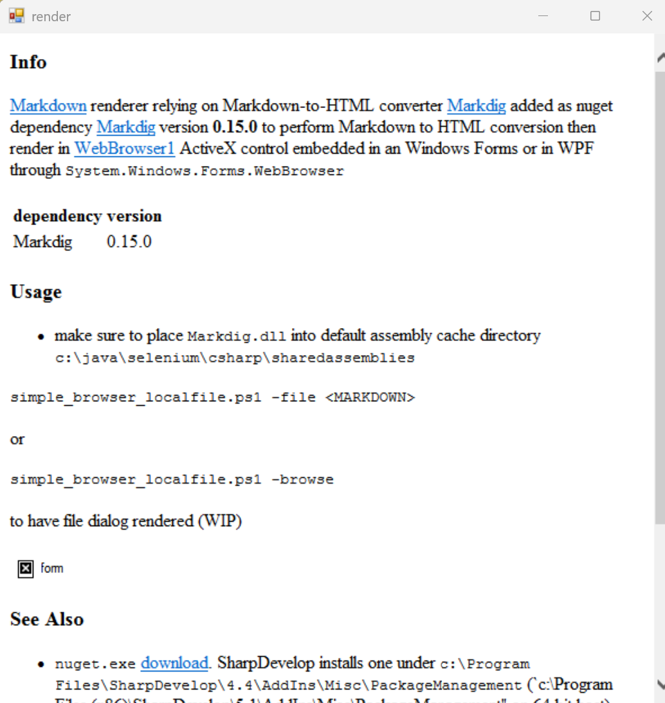

### Info


The [Markdown](https://www.markdownguide.org/basic-syntax/) renderer relying on Markdown-to-HTML converter [Markdig](https://github.com/xoofx/markdig) added as nuget dependency [Markdig](https://www.nuget.org/packages/Markdig) version __0.15.0__ to perform Markdown to HTML conversion then render in
 [WebBrowser1](https://learn.microsoft.com/en-us/dotnet/desktop/winforms/controls/webbrowser-control-overview) ActiveX control embedded in an Windows Forms or in WPF through `System.Windows.Forms.WebBrowser` component


| dependency  | version  |
| ----------- | -------- |
| Markdig     | 0.15.0   |

### Tool Usage

* make sure  to place `Markdig.dll` into default assembly cache directory `c:\java\selenium\csharp\sharedassemblies`
```powershell
.\render_markdown.ps1 -file <MARKDOWN>
```
or

```powershell
.\render_markdown.ps1 -browse
```
or

```powershell
.\render_markdown.ps1 -file ''
```
to have openfile dialog rendered



### See Also
   * `nuget.exe` [download](https://dist.nuget.org/win-x86-commandline/v2.8.6/nuget.exe). SharpDevelop installs one under `c:\Program Files\SharpDevelop\4.4\AddIns\Misc\PackageManagement`/`c:\Program Files (x86)\SharpDevelop\5.1\AddIns\Misc\PackageManagement` on 32/64 bit host.
  * tls 1.2 issue  (*The request was aborted: Could not create SSL/TLS secure channel.*) [fix](https://stackoverflow.com/questions/58993743/could-not-create-ssl-tls-secure-channel-while-trying-to-search-for-nuget-package)
  * [CommonMark.NET](https://github.com/Knagis/CommonMark.NET) nuget dependency [CommonMark.NET](https://www.nuget.org/packages/CommonMark.NET) - lacks table support
  * https://learn.microsoft.com/en-us/dotnet/api/system.windows.forms.webbrowser?view=netframework-4.8
 * [Markdown to RTF converter](https://github.com/sergueik/powershell_samples/tree/master/external/csharp/rtfviewer2) using custom [Markdown RTF Rich](https://github.com/snjo/MarkdownToRtf) processor using __Windows Forms__ `RichTextBox` rendring control backed by native RTF edit controls 


### Author
[Serguei Kouzmine](kouzmine_serguei@yahoo.com)


### Example

| Syntax      | Description |
| ----------- | ----------- |
| Header      | Title       |
| Paragraph   | Text        |
