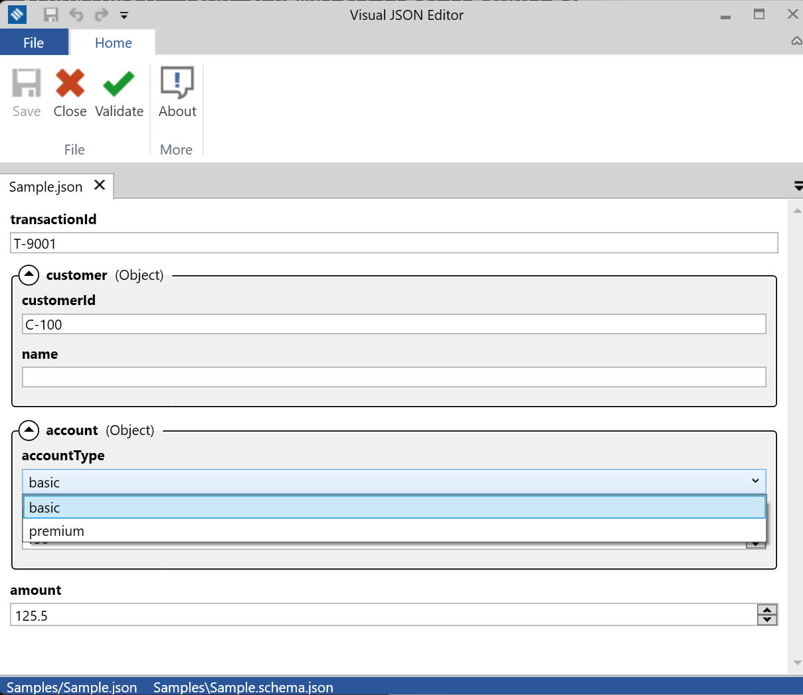
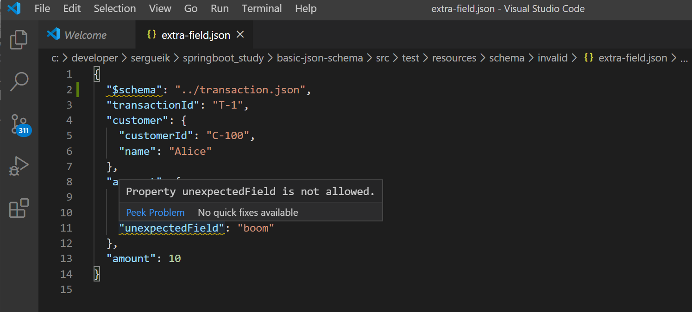
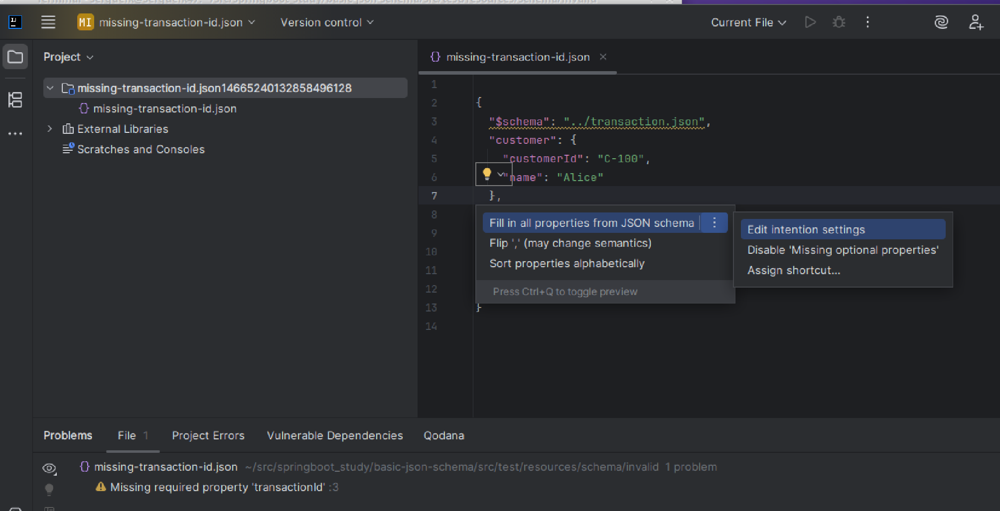

### Info

replica of [Visual JSON Editor](https://github.com/RicoSuter/VisualJsonEditor) by [Rico Suter](http://rsuter.com) - a JSON schema based file editor for Windows. Tuned some aggressive MVVM expression-based APIs as mechanically replaceable legacy constructs. Removed Localization resources due to lack of `AL.exe` or WinSDK-NetFx40Tools.

it uses a [C# implementation](https://github.com/RicoSuter/NJsonSchema) of JSON Schema named [NJsonSchema](http://njsonschema.org/) as key dependency

The project also uses subtle extension libraries
[MyToolkit](https://github.com/RicoSuter/MyToolkit)
[Namotion.Reflection](https://www.nuget.org/api/v2/package/Namotion.Reflection/2.0.5)


### Usage
```sh
export VERSION=10.5.0
curl -skLo ~/Downloads/njsonschema.zip https://www.nuget.org/api/v2/package/NJsonSchema/$VERSION
```
```sh
unzip -ql ~/Downloads/njsonschema.zip
mkdir -p packages/NJsonSchema.10.5.2/lib/net45
unzip -xj -d packages/NJsonSchema.10.5.2/lib/net45  ~/Downloads/njsonschema.zip lib/net45/*
```

```sh
curl -skLo ~/Downloads/namotion.zip https://www.nuget.org/api/v2/package/Namotion.Reflection/2.0.5

```

```
mkdir -p packages/Namotion.Reflection.2.0.5/lib/net45
unzip -xj -d packages/Namotion.Reflection.2.0.5/lib/net45 ~/Downloads/namotion.zip lib/net45/*
```

When opening a __JSON__ file, the application auto-generates an editor GUI based on the provided __JSON schema__. The goal is to make __JSON__ authoring more effective and easier


### Summary

There is one imporant detail to check:
Revision of __JSON Schema__ __draft__ support (__Draft-04__ vs __Draft-07__ vs *custom*)

This may lead to divergence:

  * Java validator marks JSON invalid
  * .NET UI accepts it

### Authoring

It is true that Visual Studio Code has essentially first-class __JSON Schema__ support built-in (__Draft-07__).

The key driving components are:

  * built-in JSON Language Service
  * schema store integration
  * __Monaco__ editor validation engine
The JSON element
```json
{
  "$schema": "http://json-schema.org/draft-07/schema#",

```

one automatically gets:

  * autocomplete
  * validation
  * hover help
  * enum suggestions
  * `required-property` diagnostics
  * `$ref` resolution
  * schema-aware navigation
  
without installing anything.


For newer drafts:
```json
{
  "$schema": "https://json-schema.org/draft/2020-12/schema"
```


support is decent but not as mature as __Draft-07__.
Recommended extensions:
  * [JSON Schema Validator extension](https://marketplace.visualstudio.com/items?itemName=tberman.json-schema-validator)
  

The same is true with __IntelliJ IDEA__ has very strong __JSON Schema__ support built-in. The

  * __Draft-04__ ✅
  * __Draft-06__ ✅
  * __Draft-07__ ✅
  * __2019-09__ ✅
  * __2020-12__

are all supported.



One normally does not need plugins for

  * validation
  * autocomplete
  * schema association
  * `$ref`
  * hover docs
  * schema store integration

The most useful built-in features are:

  * schema-aware completion
  * "Add missing properties"
  * "Fill in all properties from JSON schema"
  * live validation
  * schema mapping UI
  * automatic SchemaStore download

### See Also

  * [microsoft/jschema](https://github.com/microsoft/jschema) - Microsodt implementation of __JSON Schema__ __Draft 4__, an implementation of __JSON__ pointer, and a __JSON-schema-to-C#__ code generator

  * [RicoSuter/NSwag](https://github.com/RicoSuter/NSwag) - a Microsoft toolchain based __Swagger__/__OpenAPI__ toolchain for __.NET__, __ASP.NET__ __Core__ and __TypeScript__
  * https://blog.rsuter.com/about/


---

### Author
[Serguei Kouzmine](kouzmine_serguei@yahoo.com)

