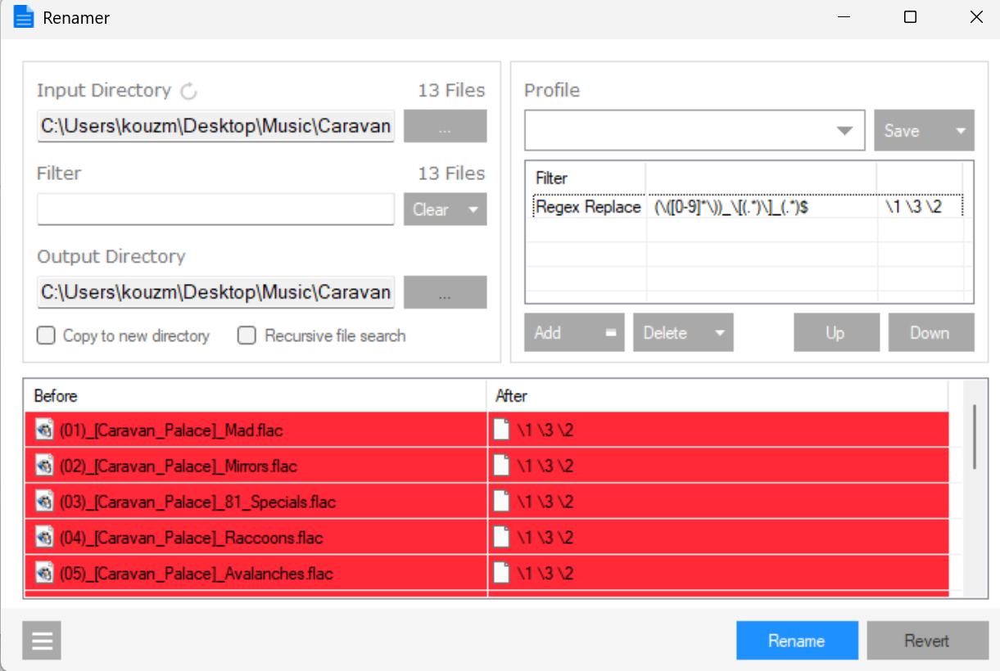

### Info 

replica of [renamer](https://github.com/SetsunaF/Renamer)
an  easy to use massive file renamer with custom  Windows Form like UI.
useful for mormalizing media filenames for a constrained playback/display device


The scenario


```
(05) - Art Farmer, Donald Byrd, Idrees Sulieman - Three Trumpets (1957, 1992, Prestige-OJC) - [You Gotta Dig It to Dig It]. mp3
    │
    ▼
05 - You Gotta Dig It - Art Farmer…Three Trumpets.mp3
```
explains why the regex/capture-group approach is attractive: the filename itself contains semi-structured metadata, but the device doesn't need all of it

After the capturing and reordering retained groups, an additional transformation is performed, e.g. 
* artist/album information is compressed, remains distinct 
* resulting alias fits on a small-screen / weak-display playback device

PS/C# point. The interesting proposition isn't merely “C# can rename files.” It's that the toolchain gives you a nice incremental engineering environment:

That is quite different from the Python/Perl experience of:
* populate directory with files with funny names.
* compose command line
* run script
* examine files
i

I'd keep it almost exactly as you have it:

populate directory with files with funny names
compose command line
run script
examine files

The phrase “files with funny names” is particularly effective here. It makes the problem concrete and slightly playful, while also describing exactly what the test fixture is.
i

he key distinction is that the filesystem becomes merely the input/output boundary. The actual rename logic can be tested entirely in memory:

                    JUnit
                      │
              ┌───────┴────────┐
              │                │
          test fixture      test case
          (string)          (string)
              │                │
              ▼                ▼
        "funny filename" → transformation
                                │
                                ▼
                         expected alias

So instead of:

populate directory
    ↓
invoke script
    ↓
look at renamed files
    ↓
decide whether it worked

you get atomic tests such as:

@Test
void extractsTrackTitle() {
    assertEquals(
        "05 - You Gotta Dig It - Art Farmer…Three Trumpets.mp3",
        transform(
            "(05) - Art Farmer, Donald Byrd, Idrees Sulieman - " +
            "Three Trumpets (1957, 1992, Prestige-OJC) - " +
            "[You Gotta Dig It to Dig It].mp3"
        )
    );
}

And then separately:

@Test
void removesCatalogMetadata() { ... }

@Test
void preservesTrackNumber() { ... }

@Test
void preservesExtension() { ... }

@Test
void compressesArtistList() { ... }

@Test
void rejectsAliasTooLongForDevice() { ... }

That's a very different development model.

And yes, JUnit is particularly attractive here because this isn't some home-grown test harness. You're standing on decades of established machinery: lifecycle annotations, assertions, parameterized tests, fixtures, IDE integration, failure reporting, etc.

The really nice conceptual progression is:

First make the transformation deterministic. Then make it testable. Only then make it touch the filesystem.

That would also make the PowerShell/C# choice more compelling: PowerShell can remain the operational shell, while C# contains a small, strongly testable transformation library.

### Note

The Unicode __horizontal ellipsis__ (`HORIZONTAL ELLIPSIS`) character …  is `U+2026`, it is also known as __HTML Entity__ `&hellip;` or `&#8230;`

the app heavily uses custom UX



```text
Program/bin/Debug/DropdownButton.dll
Program/bin/Debug/MediaInfo.dll
Program/bin/Debug/MediaInfo64.dll
Program/bin/Debug/MetroFramework.dll
Program/bin/Debug/ModernFolderBrowserDialog.dll
Program/bin/Debug/Newtonsoft.Json.dll
Program/bin/Debug/ObjectListView.dll
```
#### Refactoring
```sh
grep -lr ..\\\\Resources ./Program
grep -lr \.\.\\\\Resources ./Program

```
```text
./Program/Program.csproj
./Program/Properties/Resources.resx
```
```sh
grep -lr \.\.\\\\Resources ./Program | xargs -IX sed -i 's|\.\.\\Resources|Resources|g' X

```
copy the depednencies which the original project does not describe as nuget dependncies from original project `Resource/References`
```sh
mkdir Program/Resources/References
pushd Program/Resources
for F in MediaInfo.dll MediaInfo64.dll;  do curl -skLO https://github.com/SetsunaF/Renamer/raw/refs/heads/master/Renamer/$F ;done
cd References
for F in DropdownButton.dll MetroFramework.dll MetroFramework.Design.dll ModernFolderBrowserDialog.dll Newtonsoft.Json.dll ObjectListView.dll ;  do curl -skLO https://github.com/SetsunaF/Renamer/raw/refs/heads/master/Resources/References/$F ;done
popd
```

```powershell
pushd Program/Resources
get-childitem -path '.' -filter '*dll' -file | select-object -expandproperty VersionInfo | select-object -property OriginalFilename,FileVersion | format-list
cd References
get-childitem -path '.' -filter '*dll' -file | select-object -expandproperty VersionInfo | select-object -property OriginalFilename,FileVersion | format-list
popd
```

```text

OriginalFilename : MediaInfo.dll
FileVersion      : 0.7.72.0

OriginalFilename : MediaInfo.dll
FileVersion      : 0.7.72.0


OriginalFilename : DropdownButton.dll
FileVersion      : 1.2.0.0

OriginalFilename : MetroFramework.Design.dll
FileVersion      : 1.3.0.0

OriginalFilename : MetroFramework.dll
FileVersion      : 1.3.0.0

OriginalFilename : ModernFolderBrowserDialog.dll
FileVersion      : 1.0.0.0

OriginalFilename : Newtonsoft.Json.dll
FileVersion      : 6.0.8.18111

OriginalFilename : ObjectListView.dll
FileVersion      : 2.8.0.0
```
### TODO

```
"\\((?<index>[AB0-9][0-9]+)\\)\\s+(?<artist>)\\s+(?<title>)","<index> - <title> - <artist>"

```
### NOTE:

the app heavily uses custom UX


#### Refactoring
```sh
grep -lr ..\\\\Resources ./Program
grep -lr \.\.\\\\Resources ./Program

```
```text
./Program/Program.csproj
./Program/Properties/Resources.resx
```
```sh
grep -lr \.\.\\\\Resources ./Program | xargs -IX sed -i 's|\.\.\\Resources|Resources|g' X

```
### TODO

```
"\\((?<index>[AB0-9][0-9]+)\\)\\s+(?<artist>)\\s+(?<title>)","<index> - <title> - <artist>"

```

### See Also 

  * https://www.nuget.org/packages/MediaInfoDLL
  * https://www.nuget.org/packages/FolderBrowserEx
  * https://www.nuget.org/packages/BetterFolderBrowser
