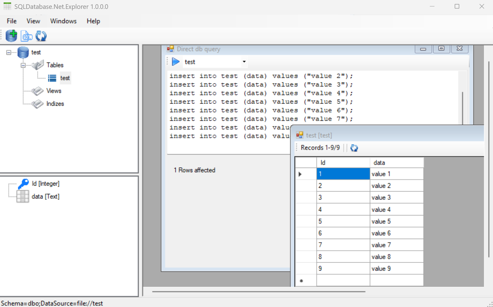

### Info

Replica  of [SQLDatabase.Net.Explorer](https://github.com/MenNoWar/SQLDatabase.Net.Explorer) a simple gui for `SQLDatabase.Net`

### Background
The `SQLDatabase.Net` package is an embedded SQL database provided as a single DLL that requires zero configuration
### NOTE

The [project website](https://sqldatabase.net/) is HTTP Error 503 down

### Usage

On some nodes, the nuget does not fail:
```cmd
"C:\Program Files\SharpDevelop\5.0\AddIns\Misc\PackageManagement\NuGet.exe" restore C:\developer\sergueik\powershell_samples\external\csharp\basic-sqldb-explorer\basic-sqlite-explorer.sln
Installing 'SQLDatabase.Net 2.0.1.0'.
Successfully installed 'SQLDatabase.Net 2.0.1.0'.
Exited with code: 0
```

```cmd
"C:\Program Files\SharpDevelop\5.1\AddIns\Misc\PackageManagement\NuGet.exe" restore C:\developer\sergueik\powershell_samples\external\csharp\basic-sqldb-explorer\basic-sqlite-explorer.sln
Installing 'SQLDatabase.Net 2.0.1.0'.
Successfully installed 'SQLDatabase.Net 2.0.1.0'.
```
> NOTE it installs the dll into a different directory than what one would guess from filename

but on some nodes Nuget __2.6.4__ is unable to restore package on its own
```cmd
C:\developer\sergueik\powershell_samples\external\csharp\basic-sqldb-explorer> "C:\Program Files (x86)\SharpDevelop\5.1\AddIns\Misc\PackageManagement\NuGet.exe" restore C:\developer\sergueik\powershell_samples\external\csharp\basic-sqldb-explorer\basic-sqldb-explorer.sln
Unable to find version '2.0.1.0' of package 'SQLDatabase.Net'.
Exited with code: 1

```
download and install package:

```sh
curl -skLo ~/Downloads/sqldatabase.net.2.0.1.nupkg https://www.nuget.org/api/v2/package/SQLDatabase.Net/2.0.1
```
```
mkdir -p packages/SQLDatabase.Net.2.0.1.0
```
```sh
unzip -ql ~/Downloads/sqldatabase.net.2.0.1.nupkg | grep dll
```
```text
  1145856  2017-10-23 20:44   lib/net40-client/SQLDatabase.Net.dll
  1145856  2017-10-23 20:44   lib/net45/SQLDatabase.Net.dll
  1145856  2017-10-23 20:44   lib/net46/SQLDatabase.Net.dll
```
```sh
unzip -x ~/Downloads/sqldatabase.net.2.0.1.nupkg  lib/net45/SQLDatabase.Net.dll -d packages/SQLDatabase.Net.2.0.1.0
```
```text
Archive:  /c/Users/kouzm/Downloads/sqldatabase.net.2.0.1.nupkg
  inflating: packages/lib/net45/SQLDatabase.Net.dll
```

update dependencies in `Project.csproj`, `Utils.csproj`



### See Also

  * [SQLDatabaseServerClient](https://github.com/sqldatabase/SQLDatabaseServerClient) net 4.5 client library code to access database and cache server.
  * `CSVFile.cs` [source](https://github.com/sqldatabase/embedded-dotnetcore20/blob/master/SQLDatabase.Net.Core.Examples/SQLDatabase.Net.Core.Examples/CSVFile.cs)

### Author
[Serguei Kouzmine](kouzmine_serguei@yahoo.com)

