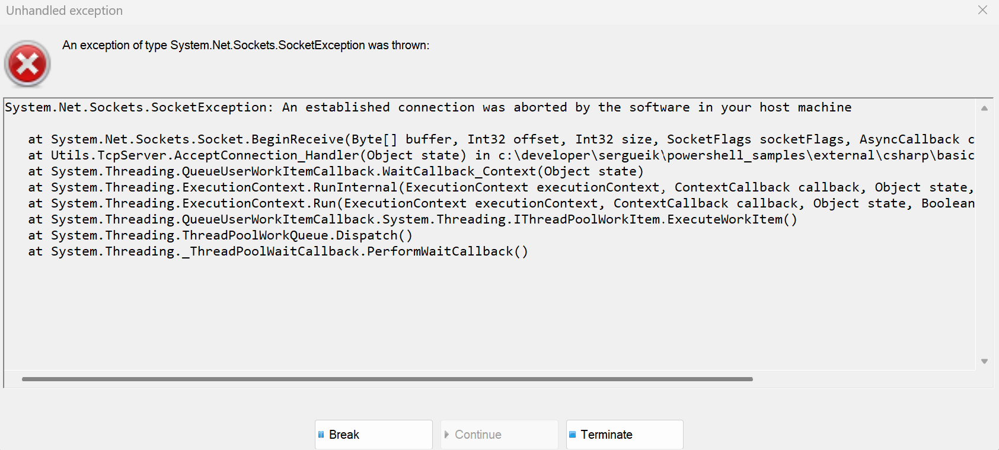

### Info


Code from [very basic TCP server written in C#](https://www.codeproject.com/articles/A-very-basic-TCP-server-written-in-C-)

### Usage

```cmd
netstat.exe -ant -p TCP -b
```
> NOTE: need elevated prompt to run with `-b` flag

find __TCP__ port `15555`:

```text
  TCP    127.0.0.1:15555        0.0.0.0:0              LISTENING
 [TcpServer.exe]
```
```powershell
test-NetConnection -ComputerName 127.0.0.1 -port 15555
```
```text
ComputerName     : 127.0.0.1
RemoteAddress    : 127.0.0.1
RemotePort       : 15555
InterfaceAlias   : Loopback Pseudo-Interface 1
SourceAddress    : 127.0.0.1
TcpTestSucceeded : True
```
```powershell
targethost = '127.0.0.1';$port = 15555; $tcpClient.Connect($targethost, $port);if ($tcpClient.Connected) { $tcpClient.Close(); Write-Host "Connected to $targethost on port $port." } else { Write-Host "Connection failed."}
```
```text
Connected to 127.0.0.1 on port 15555.

```
>NOTE: after this probe application will terminate with error:



### Troubleshooting

```text
Can not start process. The debugger's protocol is incompatible with the debuggee. (Exception from HRESULT: 0x8013134B)
```
is probably because the project targets the incorrect version of .Net Framework (__4.0__ insted of __4.5__)
### See Also

  * [perjahn/simplesource](https://github.com/perjahn/simplesource) - simple Grafana data source, in C# - uses using `Microsoft.AspNetCore.Hosting`, `Microsoft.Extensions.Hosting` etc. presumably for routing   
  * [Galileo9517/GrafanaGenericSimpleJsonDataSource](https://github.com/Galileo9517/GrafanaGenericSimpleJsonDataSource) .NET Core sample for JSON DataSource for Grafana - depends heavily on aspnetcore assemblies
  * [techtoniq/GrafanaSimpleJsonDataSourceExample](https://github.com/techtoniq/GrafanaSimpleJsonDataSourceExample) - C# Azure Function data source providing data to the SimpleJson plugin for Grafana
  * [JSON API Grafana Datasource](https://grafana.com/grafana/plugins/simpod-json-datasource) 
  * [SimpleJson](https://grafana.com/grafana/plugins/grafana-simple-json-datasource) Simple JSON Datasource - a generic backend datasource - *__DEPRECATED and NO LONGER MAINTAINED__ by the Grafana team*

### Author

[Serguei Kouzmine](mailto:kouzmine_serguei@yahoo.com)
