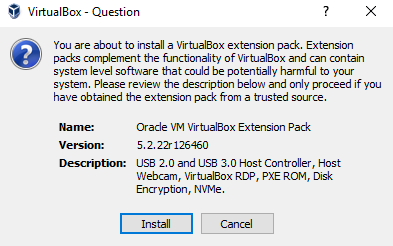
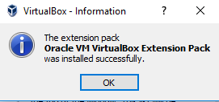
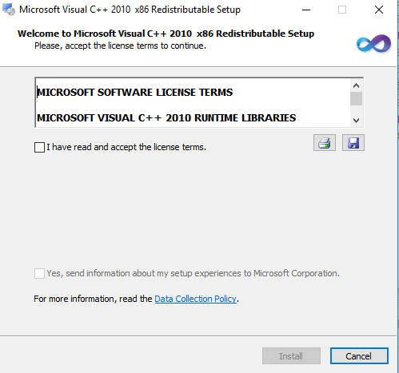
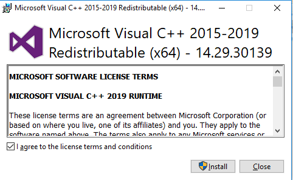
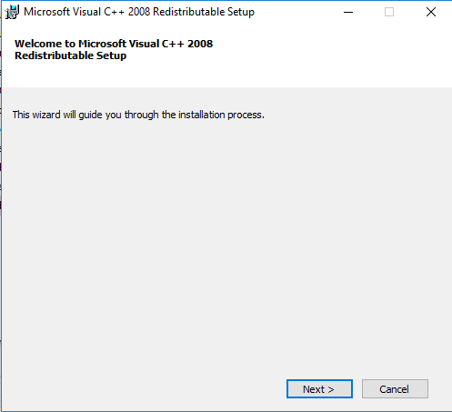
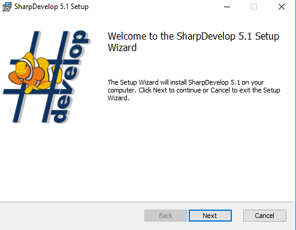
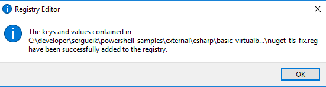

### VM Appliance Docker Login Flow (VirtualBox Guest Script Model)


#### Goal

```cmd
VBoxManage.exe list runningvms
```
```text

"XPSP3" {91047a20-5df0-4b68-b11d-1abd36738105}
"Xubuntu 22.04" {7e261a39-d356-4eb1-a8ed-75675b149241}
"default" {59c3df8a-e359-4211-8e7c-74ec5dd3e51d}
"Windows 7" {55d01a4a-4656-480f-bccb-e6838f5df285}
"Windows 10 x64 ru" {184f37d0-8529-474c-962d-6fd6781d9757}
"Xubuntu VS Code" {0b64d785-4228-4357-83bc-2b6a436f81bf}

```

Provide a deterministic, non-interactive mechanism to perform Docker authentication inside a Linux VM appliance, triggered from a Windows host via:


- `VBoxManage guestcontrol`
- a VM-resident shell script
- optional mocked registry endpoint for testing


This design avoids:

- interactive login sessions
- GUI dependencies
- state inference on the host


---


#### 1. VM-side script: `/opt/appliance/docker-login.sh`


### Purpose

Performs a non-interactive Docker login and returns a clear exit code.


##### Script


```bash

#!/bin/bash

set -euo pipefail


REGISTRY="${1:-registry.mock.local}"

USERNAME="${2:-testuser}"

PASSWORD\_FILE="${3:-/run/secrets/docker\_password}"


echo "[INFO] Starting Docker login for ${REGISTRY}"


if [[ ! -f "$PASSWORD\_FILE" ]]; then

&#x20; echo "[ERROR] Password file not found: $PASSWORD\_FILE"

&#x20; exit 2

fi


PASSWORD="$(cat "$PASSWORD\_FILE")"


# Non-interactive login

echo "$PASSWORD" | docker login "$REGISTRY" \\

&#x20; -u "$USERNAME" \\

&#x20; --password-stdin


RC=$?


if [[ $RC -eq 0 ]]; then

&#x20; echo "[INFO] Docker login successful"

&#x20; echo "authenticated" > /tmp/docker\_auth\_state

else

&#x20; echo "[ERROR] Docker login failed"

&#x20; echo "failed" > /tmp/docker\_auth\_state

fi


exit $RC


```


### Execution Checkpoints


- Accept parameters (future: credentials)

- Simulate Docker login execution

- Optionally call real `docker login`

- Sleep for controlled delay

- Exit with provided status code


### Troubleshooting


```text

---------------------------

SharpDevelop

---------------------------

Can not start process. The application has failed to start because its side-by-side configuration is incorrect.

Please see the application event log or use the command-line sxstrace.exe tool for more detail.

(Exception from HRESULT: 0x800736B1)


---------------------------

OK

---------------------------


```

```text

Activation context generation failed for "C:\\developer\\sergueik\\powershell\_samples\\external\\csharp\\basic-virtualbox-longrunningcommand\\Program\\bin\\Debug\\VboxManageSystemTrayApp.exe".Error in manifest or policy file "C:\\developer\\sergueik\\powershell\_samples\\external\\csharp\\basic-virtualbox-longrunningcommand\\Program\\bin\\Debug\\VboxManageSystemTrayApp.exe.Config" on line 9. Invalid Xml syntax.

```


```

&#x20;xml fo app.config

app.config:10.27: Entity 'qquot' not defined

&#x20;   <add key="VM" value="\&qquot;Xubuntu 22.04\&qquot; {7e261a39-d356-4eb1-a8ed-75

&#x20;                               ^

app.config:10.47: Entity 'qquot' not defined

&#x20;   <add key="VM" value="\&qquot;Xubuntu 22.04\&qquot; {7e261a39-d356-4eb1-a8ed-75

&#x20;                                                   ^

app.config:15.102: Entity 'qquot' not defined

stcontrol %VM% run --username root --password secret --exe /bin/sh -- -c \&qquot;

&#x20;                                                                              ^

app.config:15.117: Entity 'qquot' not defined

run --username root --password secret --exe /bin/sh -- -c \&qquot;uname -a\&qquot;

&#x20;

```


HTML historically accumulated hundreds and eventually thousands of named entities:


* `&copy;`
* `&nbsp;`
* `&eacute;`
* `&rdquo;`
* `&ldquo;`
* `&hellip;`


but XML 1.0 the only allowed are:

|entity  |symbol  |
|--------|--------|
|`&amp;` |  &amp; |
|`&lt;`  |&lt;    |
|`&gt;`  |&gt;    |
|`&quot;`|"       |
|`&apos;`|'       |


### Building and Running in Console

```powershell
$env:PATH="${env:PATH};c:\windows\microsoft.net\Framework\v4.0.30319"
msbuild.exe .\basic-virtualbox-longrunningcommand.sln "/p:Platform=Any CPU"
```

```powershell
.\Program\bin\Debug\VboxManageSystemTrayApp.exe
```

```powershell
type $env:temp\v*txt
```

```text
STDERR: "Exception: The system cannot find the file specified"
```
```
[System.Reflection.AssemblyName]::GetAssemblyName('VboxManageSystemTrayApp.exe')
```
```txt
Exception calling "GetAssemblyName" with "1" argument(s): "Could not load file or assembly 'VboxManageSystemTrayApp.exe' or one of its dependencies. The system cannot find the file specified."
```

```powershell
..\..\..\binary_check.ps1 -filename VboxManageSystemTrayApp.exe
```
```
x86 (32-bit)
```


```powershell
$env:PATH="${env:PATH};C:\Windows\Microsoft.NET\Framework64\v4.0.30319"
```
```powershell
cd C:\developer\sergueik\powershell_samples\external\csharp\basic-virtualbox-longrunningcommand
msbuild.exe .\basic-virtualbox-longrunningcommand.sln "/p:Platform=x64" /detailedsummary /t:clean,build
```
```powershell
..\..\..\binary_check.ps1 -filename VboxManageSystemTrayApp.exe
```
```
x86 (32-bit)
```
```
 .\binary_check.ps1 .\Program\bin\x64\Debug\VboxManageSystemTrayApp.exe
```
```
Unknown machine type: -31132
```


### Script Execution

```cmd
pushd "c:\Program Files\Oracle\VirtualBox"
set PASSWORD=...
set VM={7e261a39-d356-4eb1-a8ed-75675b149241}
VBoxManage.exe guestcontrol %VM% run --username sergueik --password %PASSWORD% --exe /bin/sh -- -c "uname -a"
```
- trouble composing command to test:
```text
/bin/sh: 0: cannot open uname -a: No such file
```
```cmd
set VM={7e261a39-d356-4eb1-a8ed-75675b149241}
set PASSWORD=...
VBoxManage.exe guestcontrol %VM% run --username sergueik --password %PASSWORD% --exe /bin/sh -- -c ""uname -a""
```
```text
/bin/sh: 0: cannot open uname: No such file
```
```powershell
.\VBoxManage.exe guestcontrol $env:VM run --username sergueik --password $env:PASSWORD --exe /bin/whoami
```
```text
sergueik
```
```powershell
VBoxManage.exe guestcontrol %VM% run --username sergueik --password %PASSWORD% --exe /bin/w
```
```text
 18:14:04 up  4:12,  1 user,  load average: 0.02, 0.02, 0.00
USER     TTY      FROM             LOGIN@   IDLE   JCPU   PCPU WHAT
sergueik tty7     :0               14:02    4:12m 14.32s  0.27s xfce4-session
```
```cmd
VBoxManage.exe guestcontrol %VM% run --username sergueik --password %PASSWORD% --exe whoami
```
```text
VBoxManage.exe: error: No such file or directory on guest
VBoxManage.exe: error: Details: code VBOX_E_IPRT_ERROR (0x80bb0005), component GuestProcessWrap, interface IGuestProcess, callee IUnknown
VBoxManage.exe: error: Context: "WaitForArray(ComSafeArrayAsInParam(aWaitStartFlags), gctlRunGetRemainingTime(msStart, cMsTimeout), &waitResult)" at line 1529 of file VBoxManageGuestCtrl.cpp
```

```cmd
VBoxManage.exe guestcontrol %VM% run --username sergueik --password %PASSWORD% --exe /tmp/a.sh
```
```
this is a test
```

```cmd
VBoxManage.exe guestcontrol %VM% run --username sergueik --password %PASSWORD% --exe /tmp/a.sh sample
```
```text
this is a test with argument: none received
```

```sh
#!/bin/sh
ARG=${1:-'none received'}
echo -n 'this is a test with argument: '
echo $ARG
```

```powershell
pushd "c:\Program Files\Oracle\VirtualBox"
$env:PASSWORD=
$env:VM='{7e261a39-d356-4eb1-a8ed-75675b149241}'
.\VBoxManage.exe guestcontrol $env:VM run --username sergueik --password $env:PASSWORD --exe /bin/sh -- -c "uname -a"
```
```powershell
.\VBoxManage.exe guestcontrol $env:VM run --username sergueik --password $env:PASSWORD --exe "/bin/sh -- -c 'uname -a'"
```
```text
VBoxManage.exe: error: No such file or directory on guest
VBoxManage.exe: error: Details: code VBOX_E_IPRT_ERROR (0x80bb0005), component GuestProcessWrap, interface IGuestProcess, callee IUnknown
VBoxManage.exe: error: Context: "WaitForArray(ComSafeArrayAsInParam(aWaitStartFlags), gctlRunGetRemainingTime(msStart, cMsTimeout), &waitResult)" at line 1529 of file VBoxManageGuestCtrl.cpp
```

```cmd
VBoxManage.exe guestcontrol %VM% run --username sergueik --password %PASSWORD% --exe /bin/sh -- /bin/sh -c "/tmp/a.sh sample"
```
```text
this is a test with argument: sample
```

```powershell
.\VBoxManage.exe guestcontrol $env:VM run --username sergueik --password $env:PASSWORD  --exe /bin/sh -- /bin/sh -c "/tmp/a.sh 'sample aergument with spaces'"
```
```text
this is a test with argument: sample aergument with spaces
```

#### How this Version Works


* Layer 1: VBoxManage
```
exe = /bin/sh
argv = ["/bin/sh", "-c", "/tmp/a.sh sample"]
```
* Layer 2: Linux shell (/bin/sh)
```
-c "/tmp/a.sh sample"
```
* Layer 3: your script
```
/tmp/a.sh sample
```
So the command only works because:

/bin/sh becomes the single deterministic interpreter boundary

2. Why the “extra /bin/sh” looks redundant but is required

This part:
```cmd
--exe /bin/sh -- /bin/sh -c ...
```

is what fixes VBoxManage’s strict argument model.

__VBoxManage__ does NOT reliably infer:

* `PATH` resolution
* shell interpretation
* command concatenation

So you explicitly anchor it twice:

|Part    |	Purpose |
|--------|----------|
|--exe /bin/sh	| actual process launched in guest|
|-- /bin/sh -c ...	|argv passed to that process |

This is redundant only syntactically — not semantically.

__VBoxManage__ `guestcontrol` is not a command executor — it is a process spawner with strict argv semantics.


### NOTE

By default, Ubuntu does not set a password for the root user: root account is effectively locked to prevent direct logins

### Workaround

#### Install __32 bit__ __VirtualBox__ __5.2.x__

VirtualBox 5.2.x is no longer supported!

VirtualBox is not portable

Copying C:\Program Files (x86)\Oracle\VirtualBox alone is usually insufficient.

VirtualBox installs:

  * kernel drivers (VBoxDrv, VBoxUSB, VBoxNetFlt, etc.)
  * COM registrations
  * networking components
  * services

VirtualBox.exe often fails with messages such as:

  * Failed to create COM object
  * Kernel driver not installed
  * VT-x is not available

Therefore, merely copying the directory generally does not produce a working second installation.

VirtualBox is fundamentally not a portable application because it depends on:

  * COM registrations
  * Windows services
  * kernel-mode drivers (VBoxDrv, networking drivers, USB drivers)
  * registry entries
  * device objects created by those drivers






> NOTE 64 bit images will not be able to boot:











confirm in console
```cmd
"C:\Program Files (x86)\virtualbox\VBoxManage.exe" list vms
```
```text
"default" {bbf2aa73-2f33-468d-a45a-8d781618680c}
"Debian" {93a38cd7-ef00-47aa-9868-d291d4ed5e0a}
"centos" {a30b7f86-d30a-41b8-9dbc-cb1ea02e55c4}
```
```
"C:\Program Files (x86)\virtualbox\VBoxManage.exe" list runningvms
```
no output.
```
```
> NOTE:  needs guest additions to be installed

``cmd
type %temp%\vboxtest.txt
```
```text
STDOUT: ""default" {bbf2aa73-2f33-468d-a45a-8d781618680c} "Debian" {93a38cd7-ef00-47aa-9868-d291d4ed5e0a} "centos" {a30b7f86-d30a-41b8-9dbc-cb1ea02e55c4}"
```
https://help.ubuntu.com/community/Installation/MinimalCD#A32-bit_PC_.28i386.2C_x86.29

http://archive.ubuntu.com/ubuntu/dists/bionic/main/installer-i386/current/images/netboot/mini.iso


https://sourceforge.net/projects/debian32bitvbox/
https://sourceforge.net/projects/debian32bitvbox/files/OVA-image/vm1%5B32bit%5D.ova/download
http://nixsrv.com/llthw/ex0 [provides information about user/pass] - page no longer exists
https://sourceforge.net/projects/debian32bitvbox/files/READMD.txt
To use the box you'll need the following two users:

user1/123qwe
root/same as above
download 32 bit debiamn 11 virtualbox image
https://www.osboxes.org/debian
VirtualBox (VDI) 32bit  Size: 1.11GB
SHA256: F1C2A16A45ADB83F1E8C54D0D1417DAED7077D2D9F59D982710DF
https://www.linuxvmimages.com/how-to-use/vm-image-password/

https://download.virtualbox.org/virtualbox/5.2.22/
Username: debian

Password: debian

NOTE: image cannot boot under VirtualBo 5.2.x
For Debian VM images hosted on linuxvmimages.com, the default login credentials are:


Centos

NOTE: image is quite heavy - 5 GB - it has GUI installed. Consider smaller images

https://alpinelinux.org/downloads/
(Virtual)

https://dl-cdn.alpinelinux.org/alpine/
https://dl-cdn.alpinelinux.org/alpine/v3.12/releases/x86/alpine-standard-3.12.11-x86.iso


Visual C++ 2008 SP1 Redistributable Package
NOTE:
file:///C:/Program%20Files%20(x86)/SharpDevelop/5.1/doc/Dependencies.html

### VirtualBox Error Message Inventory


Debugging VBoxManage guestcontrol occasionally feels less like programming and more like reading
an real Agatha Christie detective novel.
Each error message is a clue rather than a conclusion:

  * VBoxManage may claim the specific machine is powered off, even though it is visibly running
  * That the guest execution service is "not ready (yet)." 
  * Insists that no registered machine exists
   * Complains about an unexpected session state. 

Individually, each message appears convincing; together, they gradually reveal what is actually happening

This investigation therefore treats each VirtualBox error as evidence rather than as the final diagnosis. The goal is not merely to display Oracle's original message, but to classify it into a more meaningful synopsis and provide practical guidance. Like a detective assembling witness statements, the application combines the command, exit code, standard output, standard error, and execution context before reaching its own conclusion.


```cmd
VBoxManage.exe guestcontrol {75a91c26-d044-423d-a438-9b72b7ab8af0} run  --username root --password alpine  --exe /bin/sh -- /bin/sh -c '/tmp/a.sh sample'"
```
```text
VBoxManage.exe: error: The guest execution service is not ready (yet)
VBoxManage.exe: error: Details: code VBOX_E_IPRT_ERROR (0x80bb0005), component GuestProcessWrap, interface IGuestProcess, callee IUnknown
VBoxManage.exe: error: Context: "WaitForArray(ComSafeArrayAsInParam(aWaitStartFlags), gctlRunGetRemainingTime(msStart, cMsTimeout), &waitResult)" at line 1529 of file VBoxManageGuestCtrl.cpp
```
> NOTE: To install VirtualBox Guest Additions on an Alpine Linux image, you must install the native alpine packages from the community repository rather than mounting the

```cmd
VBoxManage.exe list runningvms
```
may not return anything with VirtualBox 32-bit user identity mismatch

```cmd
VBoxManage.exe list vms
```
```text
"Debian" {93a38cd7-ef00-47aa-9868-d291d4ed5e0a}
"alpine" {75a91c26-d044-423d-a438-9b72b7ab8af0}
```
```sh
VBoxManage.exe guestcontrol {75a91c26-d044-423d-a438-9b72b7ab8af0} run  --username root --password alpine  --exe /bin/sh -- /bin/sh -c '/tmp/a.sh sample'"
```
```text
VBoxManage.exe: error: Machine "{75a91c26-d044-423d-a438-9b72b7ab8af0}" is not running (currently powered off)!
```

```cmd

VBoxManage.exe list vms
```
```text
Exception: The system cannot find the file specified
```
NOTE: This may indicate the Oracle Virtual Box non standard install location  

```cmd
VBoxManage.exe list vms
```
```text
"Debian" {93a38cd7-ef00-47aa-9868-d291d4ed5e0a}
"<inaccessible>" {a30b7f86-d30a-41b8-9dbc-cb1ea02e55c4}
```

```cmd
VBoxManage.exe startvm {93a38cd7-ef00-47aa-9868-d291d4ed5e0a}
```
```text
Waiting for VM "{93a38cd7-ef00-47aa-9868-d291d4ed5e0a}" to power on...
VM "{93a38cd7-ef00-47aa-9868-d291d4ed5e0a}" has been successfully started.
```

```cmd
2>nul VBoxManage.exe guestcontrol {93a38cd7-ef00-47aa-9868-d291d4ed5e0a} run  --username root --password alpine  --exe /bin/sh -- /bin/sh -c '/tmp/a.sh sample'"
```
> NOTE: the messages are printed to STDERR
```text
VBoxManage.exe: error: Could not find a registered machine with UUID {7e261a39-d356-4eb1-a8ed-75675b149241}
VBoxManage.exe: error: Details: code VBOX_E_OBJECT_NOT_FOUND (0x80bb0001), component VirtualBoxWrap, interface IVirtualBox, callee IUnknown
VBoxManage.exe: error: Context: "FindMachine(Bstr(pCtx->pszVmNameOrUuid).raw(), machine.asOutParam())" at line 842 of file VBoxManageGuestCtrl.cpp
```
```text
VBoxManage.exe: error: Machine "{93a38cd7-ef00-47aa-9868-d291d4ed5e0a}" is not running (currently powered off)!
```

```cmd
VBoxManage.exe guestcontrol {93a38cd7-ef00-47aa-9868-d291d4ed5e0a} run  --username root --password alpine  --exe /bin/sh -- /bin/sh -c '/tmp/a.sh sample'"
```
```text
VBoxManage.exe: error: Session is not in started state
VBoxManage.exe: error: Details: code E_UNEXPECTED (0x8000ffff), component GuestSessionWrap, interface IGuestSession, callee IUnknown
VBoxManage.exe: error: Context: "ProcessCreate(Bstr(pszImage).raw(), ComSafeArrayAsInParam(aArgs), ComSafeArrayAsInParam(aEnv), ComSafeArrayAsInParam(aCreateFlags), gctlRunGetRemainingTime(msStart, cMsTimeout), pProcess.asOutParam())" at line 1520 of file VBoxManageGuestCtrl.cpp
```
```cmd
VBoxManage.exe guestcontrol {93a38cd7-ef00-47aa-9868-d291d4ed5e0a} run  --username root --password alpine  --exe /bin/sh -- /bin/sh -c '/tmp/a.sh sample'"
```
```text
VBoxManage.exe: error: Invalid user/password credentials
VBoxManage.exe: error: Details: code VBOX_E_IPRT_ERROR (0x80bb0005), component GuestProcessWrap, interface IGuestProcess, callee IUnknown
VBoxManage.exe: error: Context: "WaitForArray(ComSafeArrayAsInParam(aWaitStartFlags), gctlRunGetRemainingTime(msStart, cMsTimeout), &waitResult)" at line 1529 of file VBoxManageGuestCtrl.cpp
```
```cmd
VBoxManage.exe guestcontrol {93a38cd7-ef00-47aa-9868-d291d4ed5e0a} run  --username root --password 123qwe  --exe /bin/sh -- /bin/sh -c '/tmp/a.sh sample'"
```
> NOTE: occasionaly Virtual Box 5.2.x is hanging.

This turns the straw Windows 10 machine with an unhealthy 32 bit Virtual Box stack simply a fairly good fault generator

### See Also

  * https://github.com/bitnami/minideb
  * https://www.linuxvmimages.com/images/centos-7/
  * https://download.virtualbox.org/virtualbox/5.2.22/
  * https://download.virtualbox.org/virtualbox/5.2.22/Oracle_VM_VirtualBox_Extension_Pack-5.2.22-126460.vbox-extpack

----

### Author
[Serguei Kouzmine](kouzmine_serguei@yahoo.com)


