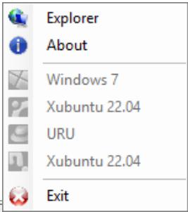
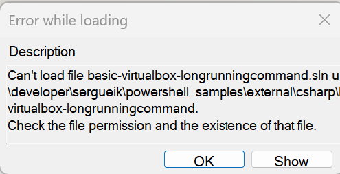
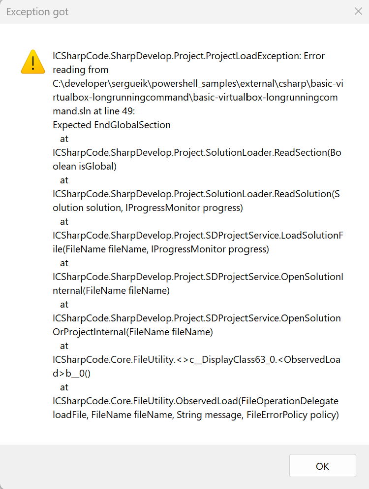
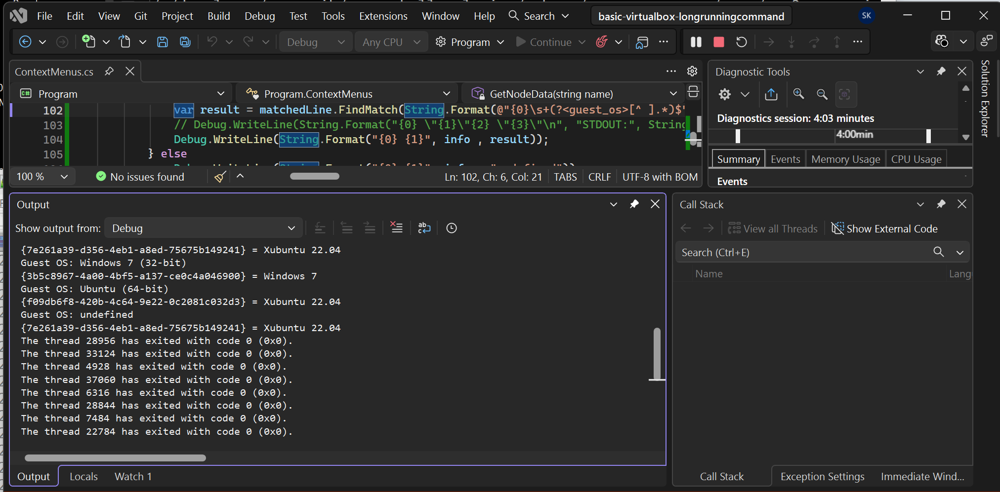

### VM Appliance Configuration (VirtualBox Guest Script Model)

#### Goal
e.g. to exercise the  Docker Login Flow by launching the shell script through
Hypervisor VM extensions bridge on a selected VM running OS-specific code on a VM.



```cmd
VBoxManage.exe list runningvms
```
```text

"XPSP3" {91047a20-5df0-4b68-b11d-1abd36738105}
"Xubuntu 22.04" {7e261a39-d356-4eb1-a8ed-75675b149241}
"default" {59c3df8a-e359-4211-8e7c-74ec5dd3e51d}
"Windows 7" {55d01a4a-4656-480f-bccb-e6838f5df285}
"Windows 10 x64 ru" {184f37d0-8529-474c-962d-6fd6781d9757}
"Xubuntu VS Code" {0b64d785-4228-4357-83bc-2b6a436f81bf}

```

Provide a deterministic, non-interactive mechanism to perform Docker authentication inside a Linux VM appliance, triggered from a Windows host via:


- `VBoxManage guestcontrol`
- a VM-resident shell script
- optional mocked registry endpoint for testing


This design avoids:

- interactive login sessions
- GUI dependencies
- state inference on the host
---

#### 1. VM-side script: `/opt/appliance/docker-login.sh`


### Purpose

Performs a non-interactive Docker login and returns a clear exit code.

##### Scripts


sample argument echo script
```sh

```

crash script:
```sh
#!/bin/bash
# This function calls itself forever. 
# It fills up the computer's memory stack until it crashes.

crash_function() {
    crash_function
}

```

```sh
#!/bin/bash

result=$(( 10 / 0 ))
```
sample docker login script
```bash
#!/bin/bash
set -euo pipefail

REGISTRY="${1:-registry.mock.local}"
USERNAME="${2:-testuser}"
PASSWORD_FILE="${3:-/run/secrets/docker_password}"

echo "[INFO] Starting Docker login for ${REGISTRY}"
if [[ ! -f "$PASSWORD_FILE" ]]; then echo "[ERROR] Password file not found: $PASSWORD_FILE"; exit 2; fi

PASSWORD="$(cat "$PASSWORD_FILE")"

# Non-interactive login
echo "$PASSWORD" | docker login "$REGISTRY" -u "$USERNAME" --password-stdin
RC=$?

if [[ $RC -eq 0 ]]; then echo "[INFO] Docker login successful"; echo "authenticated" > /tmp/docker_auth_state; else echo "[ERROR] Docker login failed"; echo "failed" > /tmp/docker_auth_state; fi
exit $RC
```

> NOTE: In Bash, keywords like `else`, `then`, and `fi` are reserved words, not standalone commands.


### Execution Checkpoints

- Accept parameters (future: credentials)
- Simulate Docker login execution
- Optionally call real `docker login`
- Sleep for controlled delay
- Exit with provided status code

### Troubleshooting

```text
Can not start process. The application has failed to start because its side-by-side configuration is incorrect.
Please see the application event log or use the command-line sxstrace.exe tool for more detail.
(Exception from HRESULT: 0x800736B1)
```
with the Event log error showing the details:
```text
Activation context generation failed for "C:\\developer\\sergueik\\powershell\_samples\\external\\csharp\\basic-virtualbox-longrunningcommand\\Program\\bin\\Debug\\VboxManageSystemTrayApp.exe".Error in manifest or policy file "C:\\developer\\sergueik\\powershell\_samples\\external\\csharp\\basic-virtualbox-longrunningcommand\\Program\\bin\\Debug\\VboxManageSystemTrayApp.exe.Config" on line 9. Invalid Xml syntax.
```


validate
```sh
xml fo app.config
app.config:10.27: Entity 'qquot' not defined
<add key="VM" value="&qquot;Xubuntu 22.04&qquot; {7e261a39-d356-4eb1-a8ed-75
app.config:10.47: Entity 'qquot' not defined
<add key="VM" value="&qquot;Xubuntu 22.04&qquot; {7e261a39-d356-4eb1-a8ed-75
...
```
unlike the HTML which historically accumulated hundreds and eventually thousands of named entities:
* `&copy;`
* `&nbsp;`
* `&eacute;`
* `&rdquo;`
* `&ldquo;`
* `&hellip;`


__XML__ __1.0__ the only allowed are very few:

|entity  |symbol  |
|--------|--------|
|`&amp;` |&amp;   |
|`&lt;`  |&lt;    |
|`&gt;`  |&gt;    |
|`&quot;`|"       |
|`&apos;`|'       |


* commenting an sensitive area in legacy Visual Studio solutuon file and accidentally leaving a blank line after the commented line:
```c#
 # old disabled configuration
 # old disabled configuration
-
 active configuration...
```
leads to
```text
---------------------------
Exception got
---------------------------
ICSharpCode.SharpDevelop.Project.ProjectLoadException: Error reading from C:\developer\sergueik\powershell_samples\external\csharp\basic-virtualbox-longrunningcommand\basic-virtualbox-longrunningcommand.sln at line 49:

Expected EndGlobalSection

   at ICSharpCode.SharpDevelop.Project.SolutionLoader.ReadSection(Boolean isGlobal)

   at ICSharpCode.SharpDevelop.Project.SolutionLoader.ReadSolution(Solution solution, IProgressMonitor progress)

   at ICSharpCode.SharpDevelop.Project.SDProjectService.LoadSolutionFile(FileName fileName, IProgressMonitor progress)

   at ICSharpCode.SharpDevelop.Project.SDProjectService.OpenSolutionInternal(FileName fileName)

   at ICSharpCode.SharpDevelop.Project.SDProjectService.OpenSolutionOrProjectInternal(FileName fileName)

   at ICSharpCode.Core.FileUtility.<>c__DisplayClass63_0.<ObservedLoad>b__0()

   at ICSharpCode.Core.FileUtility.ObservedLoad(FileOperationDelegate loadFile, FileName fileName, String message, FileErrorPolicy policy)
---------------------------
OK
---------------------------
```





### Building and Running in Console

```powershell
$env:PATH="${env:PATH};c:\windows\microsoft.net\Framework\v4.0.30319"
msbuild.exe .\basic-virtualbox-longrunningcommand.sln "/p:Platform=Any CPU"
```

```powershell
.\Program\bin\Debug\VboxManageSystemTrayApp.exe
```

```powershell
type $env:temp\v*txt
```

```text
STDERR: "Exception: The system cannot find the file specified"
```
```
[System.Reflection.AssemblyName]::GetAssemblyName('VboxManageSystemTrayApp.exe')
```
```txt
Exception calling "GetAssemblyName" with "1" argument(s): "Could not load file or assembly 'VboxManageSystemTrayApp.exe' or one of its dependencies. The system cannot find the file specified."
```

```powershell
..\..\..\binary_check.ps1 -filename VboxManageSystemTrayApp.exe
```
```
x86 (32-bit)
```
* choose 64-bit NDP explicitly
```powershell
$env:PATH="${env:PATH};C:\Windows\Microsoft.NET\Framework64\v4.0.30319"
```

```powershell
cd C:\developer\sergueik\powershell_samples\external\csharp\basic-virtualbox-longrunningcommand
msbuild.exe .\basic-virtualbox-longrunningcommand.sln "/p:Platform=x64" /detailedsummary /t:clean,build
```
```powershell
pushd Program\bin\Debug
..\..\..\binary_check.ps1 -filename VboxManageSystemTrayApp.exe
popd
```
the default `bin\Debug` are  32 bit binaries from SharpDevelop
```txt
x86 (32-bit)
```
```
pushd Program\bin\x64\Debug
..\..\..\..\binary_check.ps1 -filename VboxManageSystemTrayApp.exe
popd
```
```
Unknown machine type: -31132
```
this is an 64 bit artifact, run it to avoid `Program (x86)` path resolution
```text
C:\Program Files (x86)\Oracle\VirtualBox\VBoxManage.exe
Exception: The system cannot find the file specified"
```

```powershell
pushd Program\bin\Debug
.\VboxManageSystemTrayApp.exe
```
> NOTE: Like a Unix shell, Windows PowerShell does not load commands from the current location by default

You will not be able to use `Console.Error.WriteLine` and for `Debug.WriteLine` you will need Visual Studio or another 64 bit IDE.




The app with log in console while building the VM list:

```text
Guest OS: Windows 7 (32-bit)
{3b5c8967-4a00-4bf5-a137-ce0c4a046900} = Windows 7
Guest OS: Ubuntu (64-bit)
{f09db6f8-420b-4c64-9e22-0c2081c032d3} = Xubuntu 22.04
Guest OS: undefined
{7e261a39-d356-4eb1-a8ed-75675b149241} = Xubuntu 22.04
```
### Script Execution

```cmd
pushd "c:\Program Files\Oracle\VirtualBox"
set PASSWORD=...
set VM={7e261a39-d356-4eb1-a8ed-75675b149241}
VBoxManage.exe guestcontrol %VM% run --username sergueik --password %PASSWORD% --exe /bin/sh -- -c "uname -a"
```
- trouble composing command to test:
```text
/bin/sh: 0: cannot open uname -a: No such file
```
```cmd
set VM={7e261a39-d356-4eb1-a8ed-75675b149241}
set PASSWORD=...
VBoxManage.exe guestcontrol %VM% run --username sergueik --password %PASSWORD% --exe /bin/sh -- -c ""uname -a""
```
```text
/bin/sh: 0: cannot open uname: No such file
```
```powershell
.\VBoxManage.exe guestcontrol $env:VM run --username sergueik --password $env:PASSWORD --exe /bin/whoami
```
```text
sergueik
```
```powershell
VBoxManage.exe guestcontrol %VM% run --username sergueik --password %PASSWORD% --exe /bin/w
```
```text
 18:14:04 up  4:12,  1 user,  load average: 0.02, 0.02, 0.00
USER     TTY      FROM             LOGIN@   IDLE   JCPU   PCPU WHAT
sergueik tty7     :0               14:02    4:12m 14.32s  0.27s xfce4-session
```
```cmd
VBoxManage.exe guestcontrol %VM% run --username sergueik --password %PASSWORD% --exe whoami
```
```text
VBoxManage.exe: error: No such file or directory on guest
VBoxManage.exe: error: Details: code VBOX_E_IPRT_ERROR (0x80bb0005), component GuestProcessWrap, interface IGuestProcess, callee IUnknown
VBoxManage.exe: error: Context: "WaitForArray(ComSafeArrayAsInParam(aWaitStartFlags), gctlRunGetRemainingTime(msStart, cMsTimeout), &waitResult)" at line 1529 of file VBoxManageGuestCtrl.cpp
```

```cmd
VBoxManage.exe guestcontrol %VM% run --username sergueik --password %PASSWORD% --exe /tmp/a.sh
```
```
this is a test
```

```cmd
VBoxManage.exe guestcontrol %VM% run --username sergueik --password %PASSWORD% --exe /tmp/a.sh sample
```
```text
this is a test with argument: none received
```

```sh
#!/bin/sh
ARG=${1:-'none received'}
echo -n 'this is a test with argument: '
echo $ARG
```

```powershell
pushd "c:\Program Files\Oracle\VirtualBox"
$env:PASSWORD=
$env:VM='{7e261a39-d356-4eb1-a8ed-75675b149241}'
.\VBoxManage.exe guestcontrol $env:VM run --username sergueik --password $env:PASSWORD --exe /bin/sh -- -c "uname -a"
```
```powershell
.\VBoxManage.exe guestcontrol $env:VM run --username sergueik --password $env:PASSWORD --exe "/bin/sh -- -c 'uname -a'"
```
```text
VBoxManage.exe: error: No such file or directory on guest
VBoxManage.exe: error: Details: code VBOX_E_IPRT_ERROR (0x80bb0005), component GuestProcessWrap, interface IGuestProcess, callee IUnknown
VBoxManage.exe: error: Context: "WaitForArray(ComSafeArrayAsInParam(aWaitStartFlags), gctlRunGetRemainingTime(msStart, cMsTimeout), &waitResult)" at line 1529 of file VBoxManageGuestCtrl.cpp
```
```text
/bin/sh: 1: /tmp/a.sh: Permission denied
```

```cmd
VBoxManage.exe guestcontrol %VM% run --username sergueik --password %PASSWORD% --exe /bin/sh -- /bin/sh -c "/tmp/a.sh sample"
```
```text
this is a test with argument: sample
```

```powershell
.\VBoxManage.exe guestcontrol $env:VM run --username sergueik --password $env:PASSWORD  --exe /bin/sh -- /bin/sh -c "/tmp/a.sh 'sample aergument with spaces'"
```
```text
this is a test with argument: sample aergument with spaces
```

#### How this Version Works


* Layer 1: VBoxManage
```
exe = /bin/sh
argv = ["/bin/sh", "-c", "/tmp/a.sh sample"]
```
* Layer 2: Linux shell (/bin/sh)
```
-c "/tmp/a.sh sample"
```
* Layer 3: your script
```
/tmp/a.sh sample
```
So the command only works because:

/bin/sh becomes the single deterministic interpreter boundary

2. Why the “extra /bin/sh” looks redundant but is required

This part:
```cmd
--exe /bin/sh -- /bin/sh -c ...
```

is what fixes VBoxManage’s strict argument model.

__VBoxManage__ does NOT reliably infer:

* `PATH` resolution
* shell interpretation
* command concatenation

So you explicitly anchor it twice:

|Part    |	Purpose |
|--------|----------|
|--exe /bin/sh	| actual process launched in guest|
|-- /bin/sh -c ...	|argv passed to that process |

This is redundant only syntactically — not semantically.

__VBoxManage__ `guestcontrol` is not a command executor — it is a process spawner with strict argv semantics.


### NOTE

By default, Ubuntu does not set a password for the root user: root account is effectively locked to prevent direct logins

### Workaround

#### Install __32 bit__ __VirtualBox__ __5.2.x__

VirtualBox 5.2.x is no longer supported!

VirtualBox is not portable

Copying C:\Program Files (x86)\Oracle\VirtualBox alone is usually insufficient.

VirtualBox installs:

  * kernel drivers (VBoxDrv, VBoxUSB, VBoxNetFlt, etc.)
  * COM registrations
  * networking components
  * services

VirtualBox.exe often fails with messages such as:

  * Failed to create COM object
  * Kernel driver not installed
  * VT-x is not available

Therefore, merely copying the directory generally does not produce a working second installation.

VirtualBox is fundamentally not a portable application because it depends on:

  * COM registrations
  * Windows services
  * kernel-mode drivers (VBoxDrv, networking drivers, USB drivers)
  * registry entries
  * device objects created by those drivers


> NOTE 64 bit images will not be able to boot:


confirm in console
```cmd
"C:\Program Files (x86)\virtualbox\VBoxManage.exe" list vms
```
```text
"default" {bbf2aa73-2f33-468d-a45a-8d781618680c}
"Debian" {93a38cd7-ef00-47aa-9868-d291d4ed5e0a}
"centos" {a30b7f86-d30a-41b8-9dbc-cb1ea02e55c4}
```
```
"C:\Program Files (x86)\virtualbox\VBoxManage.exe" list runningvms
```
no output.
```
```
> NOTE:  needs guest additions to be installed

``cmd
type %temp%\vboxtest.txt
```
```text
STDOUT: ""default" {bbf2aa73-2f33-468d-a45a-8d781618680c} "Debian" {93a38cd7-ef00-47aa-9868-d291d4ed5e0a} "centos" {a30b7f86-d30a-41b8-9dbc-cb1ea02e55c4}"
```
https://help.ubuntu.com/community/Installation/MinimalCD#A32-bit_PC_.28i386.2C_x86.29

http://archive.ubuntu.com/ubuntu/dists/bionic/main/installer-i386/current/images/netboot/mini.iso


https://sourceforge.net/projects/debian32bitvbox/
https://sourceforge.net/projects/debian32bitvbox/files/OVA-image/vm1%5B32bit%5D.ova/download
http://nixsrv.com/llthw/ex0 [provides information about user/pass] - page no longer exists
https://sourceforge.net/projects/debian32bitvbox/files/READMD.txt
To use the box you'll need the following two users:

user1/123qwe
root/same as above
download 32 bit debiamn 11 virtualbox image
https://www.osboxes.org/debian
VirtualBox (VDI) 32bit  Size: 1.11GB
SHA256: F1C2A16A45ADB83F1E8C54D0D1417DAED7077D2D9F59D982710DF
https://www.linuxvmimages.com/how-to-use/vm-image-password/

https://download.virtualbox.org/virtualbox/5.2.22/
Username: debian

Password: debian

NOTE: image cannot boot under VirtualBo 5.2.x
For Debian VM images hosted on linuxvmimages.com, the default login credentials are:


Centos

NOTE: image is quite heavy - 5 GB - it has GUI installed. Consider smaller images

https://alpinelinux.org/downloads/
(Virtual)

https://dl-cdn.alpinelinux.org/alpine/
https://dl-cdn.alpinelinux.org/alpine/v3.12/releases/x86/alpine-standard-3.12.11-x86.iso


Visual C++ 2008 SP1 Redistributable Package
NOTE:
file:///C:/Program%20Files%20(x86)/SharpDevelop/5.1/doc/Dependencies.html

### VirtualBox Error Message Inventory


Debugging VBoxManage guestcontrol occasionally feels less like programming and more like reading
an real Agatha Christie detective novel.
Each error message is a clue rather than a conclusion:

  * VBoxManage may claim the specific machine is powered off, even though it is visibly running
  * That the guest execution service is "not ready (yet)." 
  * Insists that no registered machine exists
  * Complains about an unexpected session state. 

Individually, each message appears convincing; together, they gradually reveal what is actually happening

This investigation therefore treats each VirtualBox error as evidence rather than as the final diagnosis. The goal is not merely to display Oracle's original message, but to classify it into a more meaningful synopsis and provide practical guidance. Like a detective assembling witness statements, the application combines the command, exit code, standard output, standard error, and execution context before reaching its own conclusion.


```cmd
VBoxManage.exe guestcontrol {75a91c26-d044-423d-a438-9b72b7ab8af0} run  --username root --password alpine  --exe /bin/sh -- /bin/sh -c '/tmp/a.sh sample'"
```
```text
VBoxManage.exe: error: The guest execution service is not ready (yet)
VBoxManage.exe: error: Details: code VBOX_E_IPRT_ERROR (0x80bb0005), component GuestProcessWrap, interface IGuestProcess, callee IUnknown
VBoxManage.exe: error: Context: "WaitForArray(ComSafeArrayAsInParam(aWaitStartFlags), gctlRunGetRemainingTime(msStart, cMsTimeout), &waitResult)" at line 1529 of file VBoxManageGuestCtrl.cpp
```
> NOTE: To install VirtualBox Guest Additions on an Alpine Linux image, you must install the native alpine packages from the community repository rather than mounting the

```cmd
VBoxManage.exe list runningvms
```
may not return anything with VirtualBox 32-bit user identity mismatch

```cmd
VBoxManage.exe list vms
```
```text
"Debian" {93a38cd7-ef00-47aa-9868-d291d4ed5e0a}
"alpine" {75a91c26-d044-423d-a438-9b72b7ab8af0}
```
```sh
VBoxManage.exe guestcontrol {75a91c26-d044-423d-a438-9b72b7ab8af0} run  --username root --password alpine  --exe /bin/sh -- /bin/sh -c '/tmp/a.sh sample'"
```
```text
VBoxManage.exe: error: Machine "{75a91c26-d044-423d-a438-9b72b7ab8af0}" is not running (currently powered off)!
```

```cmd
VBoxManage.exe list vms
```
```text
Exception: The system cannot find the file specified
```
NOTE: This may indicate the Oracle Virtual Box non standard install location  

```cmd
VBoxManage.exe list vms
```
```text
"Debian" {93a38cd7-ef00-47aa-9868-d291d4ed5e0a}
"<inaccessible>" {a30b7f86-d30a-41b8-9dbc-cb1ea02e55c4}
```

```cmd
VBoxManage.exe startvm {93a38cd7-ef00-47aa-9868-d291d4ed5e0a}
```
```text
Waiting for VM "{93a38cd7-ef00-47aa-9868-d291d4ed5e0a}" to power on...
VM "{93a38cd7-ef00-47aa-9868-d291d4ed5e0a}" has been successfully started.
```

```cmd
2>nul VBoxManage.exe guestcontrol {93a38cd7-ef00-47aa-9868-d291d4ed5e0a} run  --username root --password alpine  --exe /bin/sh -- /bin/sh -c '/tmp/a.sh sample'"
```
> NOTE: the messages are printed to STDERR
```text
VBoxManage.exe: error: Could not find a registered machine with UUID {7e261a39-d356-4eb1-a8ed-75675b149241}
VBoxManage.exe: error: Details: code VBOX_E_OBJECT_NOT_FOUND (0x80bb0001), component VirtualBoxWrap, interface IVirtualBox, callee IUnknown
VBoxManage.exe: error: Context: "FindMachine(Bstr(pCtx->pszVmNameOrUuid).raw(), machine.asOutParam())" at line 842 of file VBoxManageGuestCtrl.cpp
```
```text
VBoxManage.exe: error: Machine "{93a38cd7-ef00-47aa-9868-d291d4ed5e0a}" is not running (currently powered off)!
```

```cmd
VBoxManage.exe guestcontrol {93a38cd7-ef00-47aa-9868-d291d4ed5e0a} run  --username root --password alpine  --exe /bin/sh -- /bin/sh -c '/tmp/a.sh sample'"
```
```text
VBoxManage.exe: error: Session is not in started state
VBoxManage.exe: error: Details: code E_UNEXPECTED (0x8000ffff), component GuestSessionWrap, interface IGuestSession, callee IUnknown
VBoxManage.exe: error: Context: "ProcessCreate(Bstr(pszImage).raw(), ComSafeArrayAsInParam(aArgs), ComSafeArrayAsInParam(aEnv), ComSafeArrayAsInParam(aCreateFlags), gctlRunGetRemainingTime(msStart, cMsTimeout), pProcess.asOutParam())" at line 1520 of file VBoxManageGuestCtrl.cpp
```
```text
VBoxManage.exe: error: Invalid user/password credentials
VBoxManage.exe: error: Details: code VBOX_E_IPRT_ERROR (0x80bb0005), component GuestProcessWrap, interface IGuestProcess, callee IUnknown
VBoxManage.exe: error: Context: "WaitForArray(ComSafeArrayAsInParam(aWaitStartFlags), gctlRunGetRemainingTime(msStart, cMsTimeout), &waitResult)" at line 1529 of file VBoxManageGuestCtrl.cpp
```
```text
/bin/sh: 1: /tmp/a.sh: Permission denied
```
```text
Segmentation fault
```
> NOTE: occasionaly Virtual Box 5.2.x is hanging on legitimate command:
```cmd
VBoxManage.exe guestcontrol {93a38cd7-ef00-47aa-9868-d291d4ed5e0a} run  --username root --password 123qwe  --exe /bin/sh -- /bin/sh -c '/tmp/a.sh sample'"
```

This turns the straw Windows 10 machine with an unhealthy 32 bit Virtual Box stack simply a fairly good fault generator

### Virtual Box OS Type Icon Resources

VirtualBox stores the image/icon data for a specific virtual machine in the `ExtraData` section of that machine's settings file
named`<VM_Name>.vbox`:

```sh
dir "c:\Users\kouzm\VirtualBox VMs"\*vbox /b/s
```
```txt
c:\Users\kouzm\VirtualBox VMs\Playwright\Playwright.vbox
c:\Users\kouzm\VirtualBox VMs\Windows 10 x64 ru\Windows 10 x64 ru.vbox
c:\Users\kouzm\VirtualBox VMs\Windows 7\Windows 7.vbox
c:\Users\kouzm\VirtualBox VMs\Windows 7 Visual Studio 2019\Windows 7 Visual Studio 2019.vbox
c:\Users\kouzm\VirtualBox VMs\Xubuntu 22.04\Xubuntu 22.04.vbox
c:\Users\kouzm\VirtualBox VMs\Xubuntu 22.04-1\Xubuntu 22.04-1.vbox
```

The icons for known OS Types in VirtualBox are not stored as separate files but are compiled directly into the application
binaries (or the `.qrc` resource files)  using C++ source code.
VirtualBox uses the OS type index you select (e.g., "Windows 10" or "Ubuntu") to dynamically map the guest to the correct
hard-coded icon resource in `https://github.com/VirtualBox/virtualbox/tree/main/src/VBox/Frontends/VirtualBox/images`:

```text
src/VBox/Frontends/VirtualBox/images/os_archlinux.png
src/VBox/Frontends/VirtualBox/images/os_cloud.png
src/VBox/Frontends/VirtualBox/images/os_debian.png
src/VBox/Frontends/VirtualBox/images/os_dos.png
src/VBox/Frontends/VirtualBox/images/os_fedora.png
src/VBox/Frontends/VirtualBox/images/os_freebsd.png
src/VBox/Frontends/VirtualBox/images/os_gentoo.png
src/VBox/Frontends/VirtualBox/images/os_jrockitve.png
src/VBox/Frontends/VirtualBox/images/os_l4.png
src/VBox/Frontends/VirtualBox/images/os_linux.png
src/VBox/Frontends/VirtualBox/images/os_linux24.png
src/VBox/Frontends/VirtualBox/images/os_linux26.png
src/VBox/Frontends/VirtualBox/images/os_macosx.png
src/VBox/Frontends/VirtualBox/images/os_mandriva.png
src/VBox/Frontends/VirtualBox/images/os_netbsd.png
src/VBox/Frontends/VirtualBox/images/os_netware.png
src/VBox/Frontends/VirtualBox/images/os_openbsd.png
src/VBox/Frontends/VirtualBox/images/os_opensuse.png
src/VBox/Frontends/VirtualBox/images/os_oracle.png
src/VBox/Frontends/VirtualBox/images/os_oraclesolaris.png
src/VBox/Frontends/VirtualBox/images/os_os2_other.png
src/VBox/Frontends/VirtualBox/images/os_os2ecs.png
src/VBox/Frontends/VirtualBox/images/os_os2warp3.png
src/VBox/Frontends/VirtualBox/images/os_os2warp4.png
src/VBox/Frontends/VirtualBox/images/os_os2warp45.png
src/VBox/Frontends/VirtualBox/images/os_other.png
src/VBox/Frontends/VirtualBox/images/os_qnx.png
src/VBox/Frontends/VirtualBox/images/os_redhat.png
src/VBox/Frontends/VirtualBox/images/os_solaris.png
src/VBox/Frontends/VirtualBox/images/os_turbolinux.png
src/VBox/Frontends/VirtualBox/images/os_ubuntu.png
src/VBox/Frontends/VirtualBox/images/os_win10.png
src/VBox/Frontends/VirtualBox/images/os_win11.png
src/VBox/Frontends/VirtualBox/images/os_win2k.png
src/VBox/Frontends/VirtualBox/images/os_win2k12.png
src/VBox/Frontends/VirtualBox/images/os_win2k16.png
src/VBox/Frontends/VirtualBox/images/os_win2k19.png
src/VBox/Frontends/VirtualBox/images/os_win2k22.png
src/VBox/Frontends/VirtualBox/images/os_win2k25.png
src/VBox/Frontends/VirtualBox/images/os_win2k3.png
src/VBox/Frontends/VirtualBox/images/os_win2k8.png
src/VBox/Frontends/VirtualBox/images/os_win31.png
src/VBox/Frontends/VirtualBox/images/os_win7.png
src/VBox/Frontends/VirtualBox/images/os_win8.png
src/VBox/Frontends/VirtualBox/images/os_win81.png
src/VBox/Frontends/VirtualBox/images/os_win95.png
src/VBox/Frontends/VirtualBox/images/os_win98.png
src/VBox/Frontends/VirtualBox/images/os_win_other.png
src/VBox/Frontends/VirtualBox/images/os_winme.png
src/VBox/Frontends/VirtualBox/images/os_winnt4.png
src/VBox/Frontends/VirtualBox/images/os_winvista.png
src/VBox/Frontends/VirtualBox/images/os_winxp.png
src/VBox/Frontends/VirtualBox/images/os_xandros.png
```
There are actually three possible storage mechanisms in the finished executable

  * ordinary `RT_RCDATA` Win32 resources
  * Qt `RCC tree` resources
  * plain C arrays `const uchar image_data[]`


WSL2 additional features
  * Hyper-V Manager	
  * Hyper-V virtual machines	
  * Windows Sandbox	
  * Group Policy Editor	
  * Domain Join
### Code Review

# Background Info: How the SCM Transition Changed Code Review Mindset

## From "Big Iron" SCM to Lean Distributed SCM

The transition from older enterprise source control systems (such as ClearCase, Perforce, and similar centralized SCM tools) to Git-style distributed source control was not only a tooling change. It changed engineering habits, assumptions, and review practices.

The older SCM systems were built around a world where:

- Workspaces were expensive to create and maintain.
- Network operations could be costly.
- Branching and switching contexts required planning.
- The workspace itself represented significant investment.
- The developer's local environment was often considered a trusted working state.

A typical workflow emphasized controlled ownership of changes:
```
```
create file
|
add file to change set
|
edit file
|
review pending change
|
submit


The source-control system actively managed the transition from "my file" to "the team's file."

---

## Git Changed the Economics

Git introduced a different model:

- Branches became cheap.
- Commits became lightweight.
- Clones became practical.
- Multiple simultaneous workspaces became normal.
- A complete repository history became available locally.

The workspace was no longer precious.

A modern Git workflow allows:


create branch
|
create independent workspace
|
experiment
|
discard if needed
|
create another workspace
|
repeat


The cost moved from protecting workspaces to validating repository state.

---

## The New Source of Truth

In older centralized SCM environments, developers often trusted:


my workspace = my reality


In Git-based workflows:


commit history = shared reality


A file existing locally is not evidence that it exists in the branch.

The relevant chain is:


working directory
|
v
staging area
|
v
commit
|
v
remote branch
|
v
reviewer / CI checkout


Only the committed state reaches reviewers and automation.

---

## Impact on Code Review Mindset

The review question changed.

Old mindset:

> "Does the developer's workspace contain everything required?"

New mindset:

> "Can the project be reconstructed from the submitted repository state?"

This changes the meaning of review.

A reviewer is not validating the author's machine.

A reviewer is validating the artifact represented by the branch.

The statement:

> "But it works on my machine"

is not a source-control argument.

The relevant question is:

> "Is the required state represented in the commit?"

---

## Clean Workspace Verification

For large or important pull requests, a clean second workspace is a simple and effective health check.

Example:


developer workspace
|
| (may contain hidden state)
|
v

clean checkout of feature branch
|
|
v

build / test


This catches:

- files created but never committed
- ignored files accidentally required
- generated files hiding missing sources
- IDE-specific artifacts
- local configuration dependencies
- differences between developer environment and CI

The clean workspace acts as a local simulation of the reviewer or build server.

---

## Cultural Transition

The difficult part of moving from older SCM systems to Git is not learning commands.

The difficult part is changing assumptions.

Old assumption:

> "Protect my workspace; it contains valuable state."

New assumption:

> "Create workspaces freely; validate that the repository contains everything needed."

The old practices were reasonable responses to older tools.

The new practices are optimized for:

- distributed teams
- pull requests
- continuous integration
- reproducible builds
- disposable environments

---

## Summary

The transition from centralized enterprise SCM to distributed SCM changed the definition of confidence.

Confidence is no longer:

> "My local environment works."

Confidence is:

> "A clean checkout of the committed branch works."

The repository, not the developer's workstation, is the product being reviewed.
i like to separatelty phrase in "executive sweet style" that with growing part of agentic code the relative value of a cude review check list bullet items  change e.g. analytical part that  was suposed to help echanging sharing  the experience though why becasue q&a  around  actual code revieed may be less relevant if reviewer B and submitter A  both "consult" with the same agent C. However the "trivial" opart capturing hunam mistake like missed files , incompelte commits, massive accidental file set removals if the submitter did not work from tip - are still relevant and leaving them to cicd makes the reputation of the team worsen - one is not supposed the leave *that basic level*  problems to be discovered by the tool... Also, a new important bullet item relevant for code reviw when submitter was solely an  "approver" of massive change actuallt agent driven - is why is it here? which is often another effect of "saving" on wornspace # dimension , but not therough exposing the old memories by  reusing the IDE session "unattended" keeping entirely unrelated context spilling throuwb mysterions code in a PR

I understand the angle: you are not arguing that AI/agentic coding makes code review unnecessary. You are arguing that it changes the relative weighting of review activities. Some review value moves toward agent-assisted analysis, while some "boring" human-process checks become more important because they represent engineering hygiene and team reputation.

Here is an executive-style formulation:

# Executive Note: Code Review Value in the Agentic Development Era

## Changing Value Distribution of Code Review

As agentic coding becomes increasingly common, the role of human code review is being rebalanced.

Historically, a significant portion of code review value came from analytical knowledge transfer:

- explaining design decisions
- identifying alternative implementations
- sharing domain experience
- teaching through discussion of the actual code change

With both the submitter and reviewer increasingly able to consult the same AI coding agents, some of this conversational value may decrease. The reviewer and author may arrive with similar AI-generated explanations and analysis.

However, this does not reduce the importance of review. It changes where human attention provides the highest value.

---

## The Value of Basic Engineering Hygiene Increases

Some review checks remain fundamentally human-process checks:

- missing files
- incomplete commits
- accidental large-scale removals
- changes created from an outdated branch state
- unintended generated artifacts
- unrelated changes included in a pull request

These issues are not difficult intellectually; they are failures of process integrity.

They should not become acceptable merely because CI can eventually detect them.

A team that repeatedly relies on CI to discover basic submission mistakes creates a perception problem:

> Automation is catching preventable errors that should have been filtered before review.

The goal is not merely to make the code correct eventually. The goal is to maintain confidence in the engineering process.

---

## New Review Question: "Why Is This Change Here?"

Agent-driven development introduces another important review dimension.

When a large portion of a change is generated or assembled by an agent, the reviewer must ask:

> "Why does this change exist?"

Traditional review often focused on:

- Is the implementation correct?
- Is the design acceptable?
- Are edge cases handled?

Agentic workflows add:

- Is this change necessary?
- Does it solve the intended problem?
- Is the scope justified?
- Did the author intentionally request this transformation?

A technically correct but unjustified change is still a review failure.

---

## The Hidden Context Problem

A new risk appears when developers reuse long-lived environments:

- persistent IDE sessions
- old agent conversations
- previously loaded files
- unrelated project context
- forgotten instructions or assumptions

This creates the possibility of context leakage:


old context
+
new request
|
v
unexpected generated change


The resulting code may compile and pass tests while containing unrelated or unexplained modifications.

Clean workspaces, fresh agent contexts, and explicit change boundaries become more valuable.

---

## Review Evolution

The reviewer's role moves from:

> "Teach me what you wrote."

toward:

> "Confirm that this change is intentional, complete, justified, and safely integrated."

Agentic development may reduce some of the explanatory burden of review, but it increases the importance of:

- provenance
- scope control
- reproducibility
- change justification
- repository hygiene

The human reviewer becomes less of a code interpreter and more of a guardian of engineering intent.

I would especially keep the phrase "Why is this change here?". It is likely to become one of the strongest review questions in an agent-assisted environment. A generated change can be syntactically excellent, logically consistent, and still be the wrong change.

---

# Executive Note: Code Review Value in the Agentic Development Era

## Changing Value Distribution of Code Review

As agentic coding becomes increasingly common, the role of human code review is being rebalanced.

Historically, a significant portion of code review value came from analytical knowledge transfer:

- explaining design decisions
- identifying alternative implementations
- sharing domain experience
- teaching through discussion of the actual code change

With both the submitter and reviewer increasingly able to consult the same AI coding agents, some of this conversational value may decrease. The reviewer and author may arrive with similar AI-generated explanations and analysis.

However, this does not reduce the importance of review. It changes where human attention provides the highest value.

---

## The Value of Basic Engineering Hygiene Increases

Some review checks remain fundamentally human-process checks:

- missing files
- incomplete commits
- accidental large-scale removals
- changes created from an outdated branch state
- unintended generated artifacts
- unrelated changes included in a pull request

These issues are not difficult intellectually; they are failures of process integrity.

They should not become acceptable merely because CI can eventually detect them.

A team that repeatedly relies on CI to discover basic submission mistakes creates a perception problem:

> Automation is catching preventable errors that should have been filtered before review.

The goal is not merely to make the code correct eventually. The goal is to maintain confidence in the engineering process.

---

## New Review Question: "Why Is This Change Here?"

Agent-driven development introduces another important review dimension.

When a large portion of a change is generated or assembled by an agent, the reviewer must ask:

> "Why does this change exist?"

Traditional review often focused on:

- Is the implementation correct?
- Is the design acceptable?
- Are edge cases handled?

Agentic workflows add:

- Is this change necessary?
- Does it solve the intended problem?
- Is the scope justified?
- Did the author intentionally request this transformation?

A technically correct but unjustified change is still a review failure.

---

## The Hidden Context Problem

A new risk appears when developers reuse long-lived environments:

- persistent IDE sessions
- old agent conversations
- previously loaded files
- unrelated project context
- forgotten instructions or assumptions

This creates the possibility of context leakage:
### Check List
### Background

* Ubuntu LTS (24.04/26.04) – fresh vintage.
* Ubuntu 20.04 – young vintage.
* Ubuntu 18.04 – well-aged port.
* Ubuntu 14.04/16.04 – classic cellar bottles.
* Ubuntu 6.06 "Dapper Drake" – museum reserve.

Ubuntu 18.04 has a reputation for being one of the more stable releases. Once a machine has run it reliably for years, it often becomes more like firmware than like a constantly evolving operating system. That's why people still happily run old CNC machines, lab equipment, audio servers, and embedded PCs on it.
### Check L`ist

```sh
lsblk -f
```

```text
NAME   FSTYPE LABEL       UUID                                 MOUNTPOINT
sda
├─sda1 ntfs   WINRE_DRV   A8BC3F8DBC3F54D2
├─sda2 vfat   SYSTEM_DRV  4841-54E2
├─sda3 vfat   LRS_ESP     5E42-9783
├─sda4
├─sda5 ntfs   Windows8_OS E80445210444F3DA
├─sda6 ntfs   LENOVO      B0444ED6444E9ECA
└─sda7 ntfs   PBR_DRV     78BA463BBA45F662
sdb
├─sdb1 vfat               4494-CFA6
├─sdb2 swap               ff0f0548-b1de-4da7-870a-61c7ee7d13db
└─sdb3 ext4               df6307c6-7f8e-4b3c-9d29-3058848f4da3 /

```

```sh
blkid
```

```text
/dev/sda1: LABEL="WINRE_DRV" UUID="A8BC3F8DBC3F54D2" TYPE="ntfs" PARTLABEL="Basic data partition" PARTUUID="9e0296a1-7eca-404b-89eb-1cac92563655"
/dev/sda2: LABEL="SYSTEM_DRV" UUID="4841-54E2" TYPE="vfat" PARTLABEL="EFI system partition" PARTUUID="f2f361e1-e967-4fa9-93b0-46519b47313f"
/dev/sda3: LABEL="LRS_ESP" UUID="5E42-9783" TYPE="vfat" PARTLABEL="Basic data partition" PARTUUID="6d28fe15-7a40-4f2f-885a-922fd8e94573"
/dev/sda5: LABEL="Windows8_OS" UUID="E80445210444F3DA" TYPE="ntfs" PARTLABEL="Basic data partition" PARTUUID="b1b74bcb-3cb9-4ab4-8afc-2d1e07b55a3e"
/dev/sda6: LABEL="LENOVO" UUID="B0444ED6444E9ECA" TYPE="ntfs" PARTLABEL="Basic data partition" PARTUUID="de2e08e7-1ba0-4fc2-9cea-fbd08e16942b"
/dev/sda7: LABEL="PBR_DRV" UUID="78BA463BBA45F662" TYPE="ntfs" PARTLABEL="Basic data partition" PARTUUID="8a20a28f-92a4-4c86-9201-68a0e3b4af9a"
/dev/sdb1: UUID="4494-CFA6" TYPE="vfat" PARTUUID="7606d6b8-01"
/dev/sdb2: UUID="ff0f0548-b1de-4da7-870a-61c7ee7d13db" TYPE="swap" PARTUUID="7606d6b8-02"
/dev/sdb3: UUID="df6307c6-7f8e-4b3c-9d29-3058848f4da3" TYPE="ext4" PARTUUID="7606d6b8-03"
```

### The event


zkSecurity's zkao AI-assisted audit of Cloudflare's CIRCL cryptographic library. The "one missing line" memory is probably referring to a class of bugs where a security invariant was assumed but a tiny validation/check was absent. The actual published story is slightly broader than one single missing line: the AI pipeline found seven real vulnerabilities in CIRCL, and several were caused by very small implementation mistakes with very large cryptographic consequences

### What Happened
Cloudflare maintains CIRCL (Cloudflare Interoperable Reusable Cryptographic Library), a Go cryptography library containing advanced primitives, including elliptic-curve, threshold cryptography, and post-quantum-related components.

A shoking one was about the following
Message encrypted with policy:
```
"Finance Department" AND "US Office"

         |
         v

Need BOTH attributes to decrypt

Key A  +  Key B  =  access
```     
the bug effectively caused:```
        Key A alone = access        
```     
        The frightening part is not that the encryption algorithm (AES, elliptic curves, etc.) was "broken." It is that the authorization logic embedded in the cryptographic scheme was broken.
        
        A normal application bug might look like:

```
if (user.isAdmin()) {
    allow();
}
```

being accidentally changed to:

```
if (true) {
    allow();
}
```

### See Also

  * https://github.com/bitnami/minideb
  * https://www.linuxvmimages.com/images/centos-7/
  * https://download.virtualbox.org/virtualbox/5.2.22/
  * https://download.virtualbox.org/virtualbox/5.2.22/Oracle_VM_VirtualBox_Extension_Pack-5.2.22-126460.vbox-extpack
  * __Atom__
    + [Home Page](https://github.blog/news-insights/product-news/sunsetting-atom) - Archievd and sunsettied on December 15, 2022 
    + [older releases](https://github.com/atom/atom/releases/tag/v1.60.0)  
 
 
----

### Author
[Serguei Kouzmine](kouzmine_serguei@yahoo.com)


