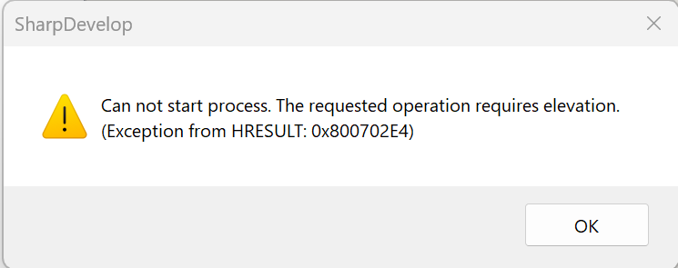
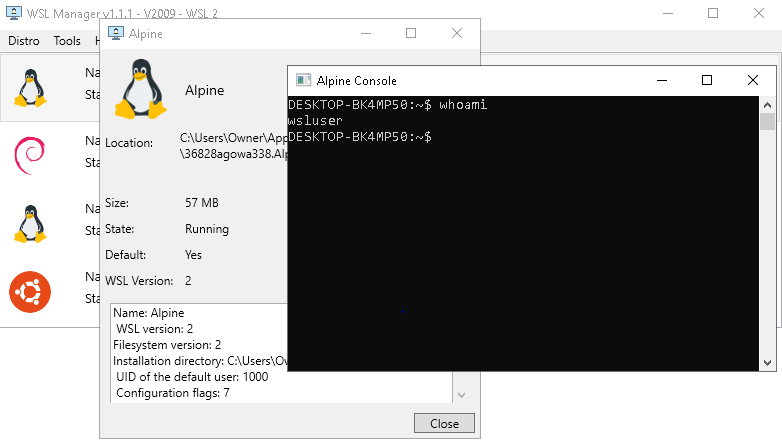

### Info

Replica of [gekkom/WSL-Manager](https://github.com/gekkom/WSL-Manager), a Windows Subsystem for Linux Manager GUI that does not require .NET Core.

> **NOTE** The original `docs.microsoft.com/dotnet/core/` URL now redirects to `https://learn.microsoft.com/en-us/dotnet/fundamentals/`:
>
> ```text
> 301 Moved Permanently
> ```
>
> There appears to be no way back.

#### History of the Original Project

> Deprecated — please use: https://github.com/bostrot/wsl2-distro-manager

The original project supported Windows 10 1803, 1809, 1903, 1909, 2004 and corresponding Windows Server versions. Older Windows versions may have limitations.

The original vendor installer is available here:

[Installer executable](https://github.com/visdauas/WSL-Manager/releases/download/v1.1.1/wsl-manager-installer-x64.exe) *(untested)*

The key WSL Manager dependency is [LxRunOffline](https://github.com/DDoSolitary/LxRunOffline) — a thin layer around the Windows Registry and `wsl.exe` calls.

LxRunOffline itself appears to be abandoned, but provides remarkably basic and useful functionality:

* Install any Linux distro to any directory on the computer.
* Move an existing installation to another directory.
* Duplicate (copy) an existing installation.
* Register an existing installation directory. This enables an installation on a USB stick to be used on different computers.
* Run arbitrary Linux commands in a specified installation.
* Configure the default user, environment variables and various flags.
* Export configuration to an XML file and import it from the file.
* Export an installation to a tar file.

> The original project appears to have been abandoned: [Old Repo](https://github.com/wslhub/WSL-DistroManager)

### Usage

The dependency is deliberately not stored under source control. Download it into the expected location:

```bash
mkdir -p Program/bin/x64/Debug/External
curl -skLo Program/bin/x64/Debug/External/LxRunOffline.exe \
  https://github.com/gekkom/WSL-Manager/raw/refs/heads/master/WSL%20Manager/External/LxRunOffline.exe
```

> **NOTE** Consider using the dependency's release location instead:
> https://github.com/DDoSolitary/LxRunOffline/releases

Build for x64 Debug:

```powershell
$env:PATH="${env:PATH};C:\Windows\Microsoft.NET\Framework64\v4.0.30319"
msbuild.exe .\basic-wsl_manager.sln "/p:Platform=x64" /detailedsummary /t:clean,build
```

> **NOTE:** The application needs to run with an **elevated process token**.



```text
Can not start process.
The requested operation requires elevation. (Exception from HRESULT: 0x800702E4)
```

The interesting part is the UAC behavior: launching the application with the normal **filtered/non-elevated token** fails, while accepting the UAC prompt switches execution to the **full/elevated token**, after which the application behaves as expected.


This is worth distinguishing from simply asking whether the user is a member of:

```text
S-1-5-32-544 = BUILTIN\Administrators
```

Under UAC, an administrator account can have a **filtered access token**. The relevant Windows terminology is therefore the **access token**, with `TokenElevation` / `TokenElevationType` used to distinguish the non-elevated and elevated process states.

> **NOTE:** The application uses `LxRunOffline.exe` for virtually everything — even to launch the shell in the WSL VM.



### See Also

* [WPF WSL Manager](https://github.com/wslhub/WslManager) — **.NET 6**
* [WSL Maui Universal](https://github.com/Forz70043/bridge) — requires the VS 2022 build environment

---

### Author

[Serguei Kouzmine](mailto:kouzmine_serguei@yahoo.com)

