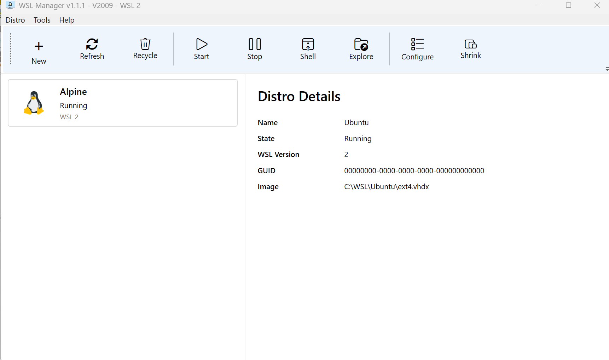
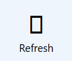

### Info

Replica of [gekkom/WSL-Manager](https://github.com/gekkom/WSL-Manager), a Windows Subsystem for Linux Manager GUI that does not require .NET Core.

> __NOTE__ The original `docs.microsoft.com/dotnet/core/` URL now redirects to `https://learn.microsoft.com/en-us/dotnet/fundamentals/`:
>
> ```text
> 301 Moved Permanently
> ```
>
> There appears to be no way back.

#### History of the Original Project

> Deprecated — please use: https://github.com/bostrot/wsl2-distro-manager

The original project supported Windows 10 1803, 1809, 1903, 1909, 2004 and corresponding Windows Server versions. Older Windows versions may have limitations.

The original vendor installer is available here:

[Installer executable](https://github.com/visdauas/WSL-Manager/releases/download/v1.1.1/wsl-manager-installer-x64.exe) *(untested)*

The key WSL Manager dependency is [LxRunOffline](https://github.com/DDoSolitary/LxRunOffline) — a thin layer around the Windows Registry and `wsl.exe` calls.

LxRunOffline itself appears to be abandoned, but provides remarkably basic and useful functionality:

* Install any Linux distro to any directory on the computer.
* Move an existing installation to another directory.
* Duplicate (copy) an existing installation.
* Register an existing installation directory. This enables an installation on a USB stick to be used on different computers.
* Run arbitrary Linux commands in a specified installation.
* Configure the default user, environment variables and various flags.
* Export configuration to an XML file and import it from the file.
* Export an installation to a tar file.

> The original project appears to have been abandoned: [Old Repo](https://github.com/wslhub/WSL-DistroManager)

### Usage

The dependency is deliberately not stored under source control. Download it into the expected location:

```bash
mkdir -p Program/bin/x64/Debug/External
curl -skLo Program/bin/x64/Debug/External/LxRunOffline.exe \
  https://github.com/gekkom/WSL-Manager/raw/refs/heads/master/WSL%20Manager/External/LxRunOffline.exe
```

> __NOTE__ Consider using the dependency's release location instead:
> https://github.com/DDoSolitary/LxRunOffline/releases

Build for x64 Debug:

```powershell
$env:PATH="${env:PATH};C:\Windows\Microsoft.NET\Framework64\v4.0.30319"
msbuild.exe .\basic-wsl_manager.sln "/p:Platform=x64" /detailedsummary /t:clean,build
```

> __NOTE:__ The application needs to run with an __elevated process token__.


```text
Can not start process.
The requested operation requires elevation. (Exception from HRESULT: 0x800702E4)
```

The interesting part is the UAC behavior: launching the application with the normal __filtered/non-elevated token__ fails, while accepting the UAC prompt switches execution to the __full/elevated token__, after which the application behaves as expected.


This is worth distinguishing from simply asking whether the user is a member of:

```text
S-1-5-32-544 = BUILTIN\Administrators
```

Under UAC, an administrator account can have a __filtered access token__. The relevant Windows terminology is therefore the __access token__, with `TokenElevation` / `TokenElevationType` used to distinguish the non-elevated and elevated process states.

> __NOTE:__ The application uses `LxRunOffline.exe` for virtually everything — even to launch the shell in the WSL VM.


### UX Development




To finish the UI without the need to operate real VM, use 
```xml
<?xml version="1.0" encoding="utf-8"?>
<configuration>
    <startup>
        <supportedRuntime version="v4.0" sku=".NETFramework,Version=v4.7.2"/>
    </startup>
  <appSettings>
    <add key="Debug" value="False"/>
    <add key="Rounds" value="1000"/>
    <add key="UseRealData" value="True"/>
    <add key="CheckUpdate" value="False"/>
    <add key="WslConsoleTimeout" value="300"/>
    <add key="Datafile" value="${temp}\loadaverage.csv"/>
   </appSettings>
</configuration>
```

and 

```xml
<?xml version="1.0" encoding="utf-8"?>
<assembly manifestVersion="1.0" xmlns="urn:schemas-microsoft-com:asm.v1">
  <assemblyIdentity version="1.0.0.0" name="Program.app"/>
   <trustInfo xmlns="urn:schemas-microsoft-com:asm.v2">
    <security>
      <requestedPrivileges xmlns="urn:schemas-microsoft-com:asm.v3">
        <requestedExecutionLevel level="requireAdministrator" uiAccess="false" />
      </requestedPrivileges>
    </security>
  </trustInfo>
  <compatibility xmlns="urn:schemas-microsoft-com:compatibility.v1">
    <application>
      <!-- Windows 10 -->
      <supportedOS Id="{8e0f7a12-bfb3-4fe8-b9a5-48fd50a15a9a}" />

    </application>
  </compatibility>
  <!-- Enable themes for Windows common controls and dialogs (Windows XP and later) -->
  <dependency>
    <dependentAssembly>
      <assemblyIdentity
          type="win32"
          name="Microsoft.Windows.Common-Controls"
          version="6.0.0.0"
          processorArchitecture="*"
          publicKeyToken="6595b64144ccf1df"
          language="*"
        />
    </dependentAssembly>
  </dependency>
</assembly>
```
You will need to completely comment the `trustInfo` in `Program/app.manifest` to suppress UAC prompt

## Legacy

important distinction is:

```text
C:\Windows\System32\bash.exe
        │
        │ Windows executable
        ▼
     WSL runtime
        │
        ▼
   /bin/bash
   inside the WSL distro
```

This `bash.exe` dates from the original **WSL** design. Microsoft explicitly documents that `bash.exe` was replaced by `wsl.exe`; modern **WSL** uses `wsl.exe` as the general launcher rather than `bash.exe`.

Historically, if one typed:

```cmd
C:\> bash.exe
```

it would silently launch the **WSL** environment and ultimately execute the Linux shell there:

```text
/bin/bash
```

And:

```cmd
C:\> bash.exe -c "ls -la /proc"
```

meant roughly:

```text
Windows cmd.exe
    |
    +-- bash.exe
          |
          +-- WSL
                |
                +-- /bin/bash -c "ls -la /proc"
```

So why is it *still* sitting in `System32`?

**Compatibility.**

There is a tremendous amount of old automation containing things like:

```cmd
bash -c "some linux command"
```

As with PrintScan, Microsoft doesn't want installing/updating **WSL** to *suddenly* break those scripts.

### Networking

**WSL2** is *technically* a VM, but Microsoft deliberately hides much of the *there is another computer over there* truth.

Hypervisors like **VirtualBox** create a computer and care about networking as one of its fundamental properties:

```text
              physical network
                    |
              [ Windows host ]
                    |
             virtual Ethernet
                    |
              [ Linux VM ]
                    |
               eth0 / IP
```

The VM is a node. You get to choose NAT, bridged, host-only, internal networking, port forwarding, etc. VirtualBox treats networking as one of the principal properties of the machine.

On the contrary, **WSL** starts more like:

```text
                 Windows
                    |
       +------------+-------------+
       |                          |
   Windows apps               WSL Linux
       |                          |
       +------ integration -------+
                    |
             "Linux applications"
```

The fact that **WSL2** underneath has a lightweight VM and a virtual NIC is almost an implementation detail.

Microsoft documents the default as NAT-based networking. The Linux instance gets its own IP, and Windows can discover it with:

```cmd
wsl.exe hostname -I
```

while Linux sees the Windows-side gateway as its host address.

But then **WSL** deliberately makes the VM boundary less visible.

Suppose a Linux application inside WSL listens on:

```text
0.0.0.0:8000
```

A traditional NAT VM would make you think:

```text
Windows
    |
    | NAT
    v
Linux VM
    |
  :8000
```

and you would normally have to think about the VM's address and port forwarding.

With WSL2, Windows can normally reach that Linux service simply as:

```text
http://localhost:8000
```

So from the Windows point of view:

```text
Windows application
        |
        | localhost:8000
        v
   WSL networking
        |
        v
Linux process :8000
```

Microsoft calls this **localhost forwarding**. The `.wslconfig` configuration even has:

```text
[wsl2]
localhostForwarding=true
```

Therefore, instead of stating the usual:

> *We have booted a Linux VM at 172.30.98.229.*

the WSL2 environment often feels more like:

> *We have a Linux process listening on port 8000.*


---
### Legacy

important distinction is:
```code
C:\Windows\System32\bash.exe
        │
        │ Windows executable
        ▼
     WSL runtime
        │
        ▼
   /bin/bash
   inside the WSL distro
```
This `bash.exe` dates from the original __WSL__ design. Microsoft explicitly documents that `bash.exe` was replaced by `wsl.exe`; modern __WSL__ uses `wsl.exe` as the general launcher, no longer the `bash.exe`.


Historically, if one typed:
```
C:\> bash.exe
```
it would silently launch the __WSL__ environment and ultimately execute the Linux shell there:
```
/bin/bash
```
And:
```cmd
C:\> bash.exe -c "ls -la /proc"
```
meant roughly
```text
Windows cmd.exe
    |
    +-- bash.exe
          |
          +-- WSL
                |
                +-- /bin/bash -c "ls -la /proc"
```
So why is it _still_ sitting in `System32` ? - __Compatibility__.

There is a tremendous amount of old automation containing verse like:
```cmd
bash -c "some linux command"
```
As with PrintScan, Microsoft doesn't want installing/updating __WSL__ to _suddenly_ break those scripts

### Networking

__WSL2__ is _technically_ a VM, but Microsoft deliberately hides much of the *there is another computer over there* truth

Hypervisors like __Virtual Box__ create computer and care about networking before everything else
```
              physical network
                    |
              [ Windows host ]
                    |
             virtual Ethernet
                    |
              [ Linux VM ]
                    |
               eth0 / IP
```
he VM is a node. You get to choose NAT, bridged, host-only, internal networking, port forwarding, etc. VirtualBox [treats](https://download.virtualbox.org/virtualbox/6.1.16/UserManual.pdf?utm_source=chatgpt.com) networking as one of the principal properties of the machine

on the contrary __WSL__ starts more like:
```
                 Windows
                    |
       +------------+-------------+
       |                          |
   Windows apps               WSL Linux
       |                          |
       +------ integration -------+
                    |
              "Linux applications"
```              
The fact that __WSL2__ underneath has a lightweight VM and a virtual NIC is almost an implementation detail.

Microsoft documents the default as NAT-based networking. The Linux instance gets its own IP, and Windows can discover it with:
```cmd
wsl.exe hostname -I
```
while Linux sees the Windows-side gateway as its host address.

The WSL inverses the NAT: __WSL__ normally lets you simply do:
```sh
curl http://localhost:8000
```

from Windows reaching the port 8000 in the VM.

Microsoft calls this __localhost forwarding__. 
The `.wslconfig` configuration even has:
```text
[wsl2]
localhostForwarding=true
```
therefore insread of stating the usual

> _we have booted an Linux VM on_ `172.30.98.229`

in WSL2 envronment it becomes often:

> _we have a Linux process listening on port_ `8000`

### Troubleshooting

Porting Widows Forms code:
```c#
// 
// imageButton5
// 
imageButton5.DialogResult = DialogResult.None;
imageButton5.DownImage = global::Utils.Properties.Resources.ExampleButtonDownA;
imageButton5.HoverImage = global::Utils.Properties.Resources.ExampleButtonHoverA;
imageButton5.Location = new Point(605, 22);
imageButton5.Margin = new Padding(6);
imageButton5.Name = "imageButton5";
imageButton5.NormalImage = null;
imageButton5.Size = new Size(100, 50);
imageButton5.SizeMode = PictureBoxSizeMode.AutoSize;
imageButton5.TabIndex = 5;
imageButton5.Tag = "Refresh WSL information";
imageButton5.TabStop = true;
imageButton5.Text = "\uE103";
imageButton5.Click += new EventHandler(imageButton5_Click);
```


to WPF:

```xml
<Button
	Width="80"
	Height="62"
	Margin="3"
	Click="Refresh_Click"
	ToolTip="Refresh WSL information">
	<StackPanel
		HorizontalAlignment="Center">
		<TextBlock
			Text="&#xE103;"
			FontSize="28"
			FontFamily="Segoe UI"
			HorizontalAlignment="Center" />
		<TextBlock
			Text="Refresh"
			HorizontalAlignment="Center" />
	</StackPanel>
</Button>

```
reveals that `FontFamily` attribute appears _not to work_:


 Windows has a font fallback mechanism
 WPF has its own font fallback behavior, and it may not choose the same font.
 Use Windows' font fallback registry

 Windows maintains fallback mappings in the registry. The important key is:
`HKEY_LOCAL_MACHINE\SOFTWARE\Microsoft\Windows NT\CurrentVersion\FontLink\SystemLink`


```powershell
get-item -path "HKLM:\SOFTWARE\Microsoft\Windows NT\CurrentVersion\FontLink\SystemLink" | select-object -property *

```
```text
Property      : {Lucida Sans Unicode, Microsoft Sans Serif, Tahoma, Segoe
                UI...}
PSPath        : Microsoft.PowerShell.Core\Registry::HKEY_LOCAL_MACHINE\SOFTWARE
                \Microsoft\Windows NT\CurrentVersion\FontLink\SystemLink
PSParentPath  : Microsoft.PowerShell.Core\Registry::HKEY_LOCAL_MACHINE\SOFTWARE
                \Microsoft\Windows NT\CurrentVersion\FontLink
PSChildName   : SystemLink
PSDrive       : HKLM
PSProvider    : Microsoft.PowerShell.Core\Registry
PSIsContainer : True
SubKeyCount   : 0
View          : Default
Handle        : Microsoft.Win32.SafeHandles.SafeRegistryHandle
ValueCount    : 83
Name          : HKEY_LOCAL_MACHINE\SOFTWARE\Microsoft\Windows
                NT\CurrentVersion\FontLink\SystemLink


```
```powershell
get-item -path "HKLM:\SOFTWARE\Microsoft\Windows NT\CurrentVersion\FontLink\SystemLink" | select-object -expandproperty property

```
```text
Lucida Sans Unicode
Microsoft Sans Serif
Tahoma
Segoe UI
Segoe UI Bold
Segoe UI Light
Segoe UI Semilight
Segoe UI Semibold
Segoe UI Variable Small
Segoe UI Variable Small Bold
Segoe UI Variable Small Light
Segoe UI Variable Small Semilig
Segoe UI Variable Small Semibol
Segoe UI Variable Text
Segoe UI Variable Text Bold
Segoe UI Variable Text Light
Segoe UI Variable Text Semiligh
Segoe UI Variable Text Semibold
Segoe UI Variable Display
Segoe UI Variable Display Bold
Segoe UI Variable Display Light
Segoe UI Variable Display Semil
Segoe UI Variable Display Semib
Ebrima
Ebrima Bold
Gadugi
Gadugi Bold
Khmer UI
Khmer UI Bold
Lao UI
Lao UI Bold
Leelawadee
Leelawadee Bold
Leelawadee UI
Leelawadee UI Bold
Nirmala UI
Nirmala UI Bold
Nirmala UI Semilight
MingLiU
PMingLiU
MingLiU_HKSCS
MingLiU-ExtB
PMingLiU-ExtB
MingLiU_HKSCS-ExtB
Microsoft JhengHei
Microsoft JhengHei Bold
Microsoft JhengHei UI
Microsoft JhengHei UI Bold
Microsoft JhengHei UI Light
SimSun
SimSun-ExtB
NSimSun
Microsoft YaHei
Microsoft YaHei Bold
Microsoft YaHei UI
Microsoft YaHei UI Bold
Microsoft YaHei UI Light
Yu Gothic UI
Yu Gothic UI Bold
Yu Gothic UI Light
Yu Gothic UI Semilight
Yu Gothic UI Semibold
Meiryo
Meiryo Bold
Meiryo UI
Meiryo UI Bold
MS Gothic
MS PGothic
MS UI Gothic
MS Mincho
MS PMincho
Batang
BatangChe
Dotum
DotumChe
Gulim
GulimChe
Gungsuh
GungsuhChe
Malgun Gothic
Malgun Gothic Bold
Malgun Gothic Semilight
SimSun-ExtG
```
```powershell
. .\glyph_finder.ps1
```
```text
=== Segoe UI ===
U+E174: difference = 24.2131
  U+E174 -> True
U+E102: difference = 20.0929
  U+E102 -> True
U+E103: difference = 22.4063
  U+E103 -> True
U+E184: difference = 23.2543
  U+E184 -> True
U+E179: difference = 26.9961
  U+E179 -> True
U+E107: difference = 21.9067
  U+E107 -> True

=== Segoe Fluent Icons ===
U+E174: difference = 12.4861
  U+E174 -> True
U+E102: difference = 17.6866
  U+E102 -> True
U+E103: difference = 22.4583
  U+E103 -> True
U+E184: difference = 25.5638
  U+E184 -> True
U+E179: difference = 21.6311
  U+E179 -> True
U+E107: difference = 22.4718
  U+E107 -> True

=== Segoe UI Symbol ===
U+E174: difference = 24.3694
  U+E174 -> True
U+E102: difference = 19.2951
  U+E102 -> True
U+E103: difference = 22.6415
  U+E103 -> True
U+E184: difference = 23.2622
  U+E184 -> True
U+E179: difference = 27.2695
  U+E179 -> True
U+E107: difference = 22.0048
  U+E107 -> True
```
### See Also

  * [WPF WSL Manager](https://github.com/wslhub/WslManager) — __.NET 6__
  * [WSL Maui Universal](https://github.com/Forz70043/bridge) — requires the VS 2022 build environment
  * https://github.com/fw867/WslManager - another WPF WSL Manager with direct calling `wsl.exe` 
  * https://github.com/Ziocash/LxssManager_Restarter/tree/master/LxssManager_Restarter - deal with 
  * https://github.com/fw867/WslManager  
  * https://github.com/tiwut/WSL-Manager - __.Net__ __8.0__ - supports(?)
    + launch or Windows File Explorer directly inside any VM root directory
    + Execute shell commands inside any target distro and view the output streamed in real-time
  * https://github.com/Pi-Bouf/Wsl-Dev-Manager
  * https://github.com/MoyashiWithDevice/WSL_Manager
  * [Native Windows desktop manager for WSL Container](https://github.com/A-Words/ExWSLC) - many features, alternative UX layout
---

### Author

[Serguei Kouzmine](mailto:kouzmine_serguei@yahoo.com)

