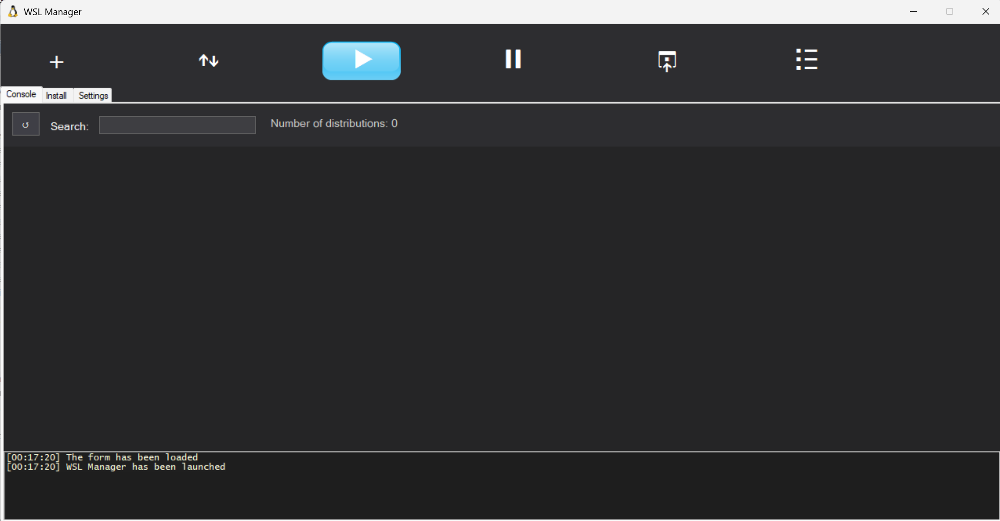
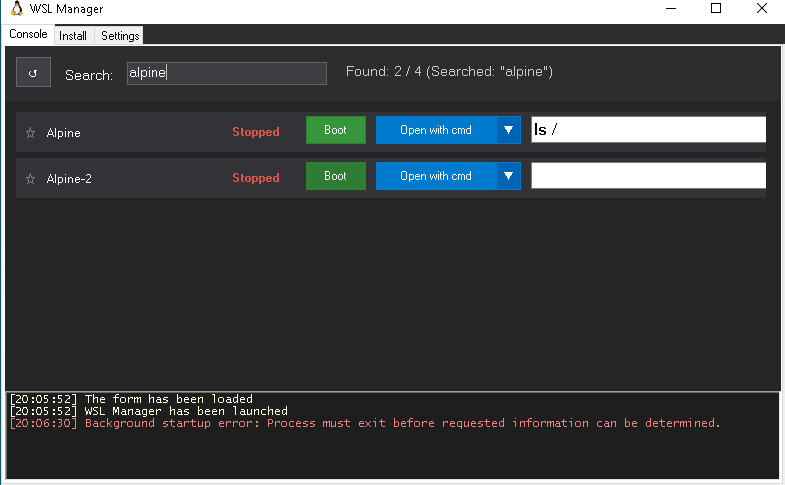
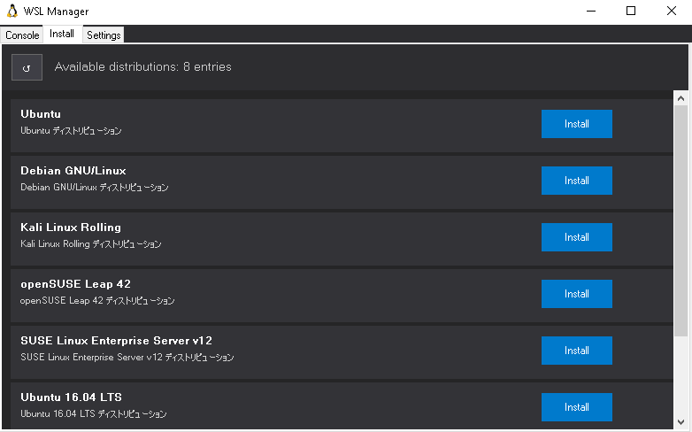
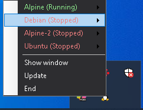
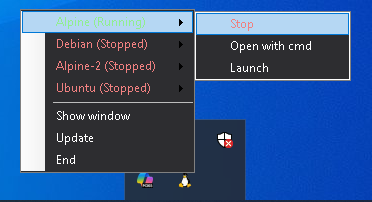
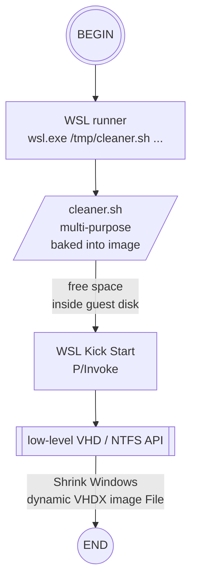
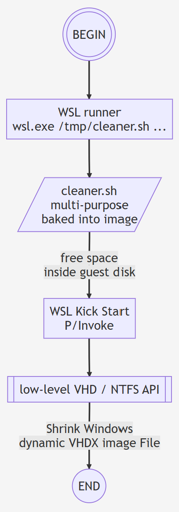
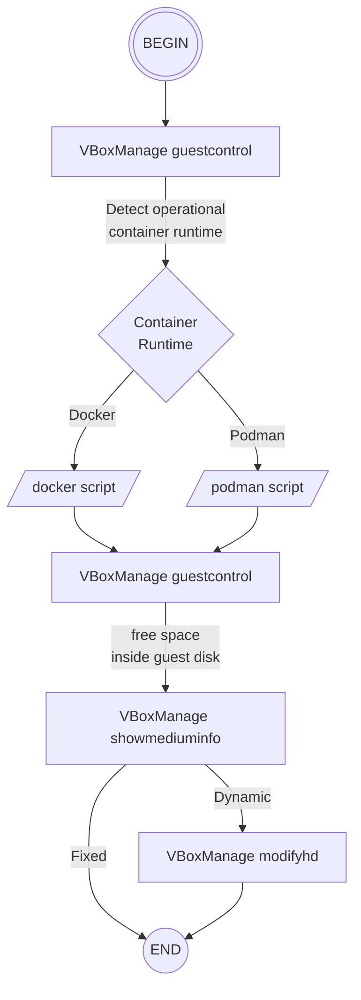
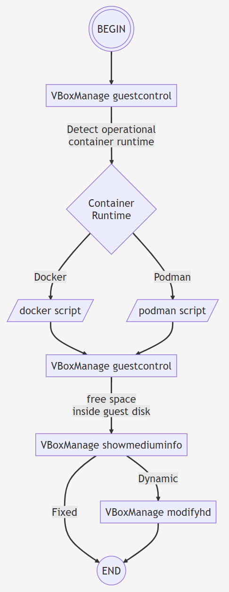

### Info
replica of [WSL Manager](https://github.com/MoyashiWithDevice/WSL_Manager)
 - Windows Form based custom shell for
Windows Subsystem for Linux (WSL)











### Usage


check - straw Registry keys can be found:


```powershell
get-childitem -path 'HKCU:\Software\Microsoft\Windows\CurrentVersion\Lxss' | select-object -expandproperty Name| select-object -first 1
```
```txt
HKEY_CURRENT_USER\Software\Microsoft\Windows\CurrentVersion\Lxss\{a7b1b735-87cb-4545-bd1b-b29b129dbc47}
```
```powershell
get-itemproperty -path 'HKCU:\Software\Microsoft\Windows\CurrentVersion\Lxss\{a7b1b735-87cb-4545-bd1b-b29b129dbc47}' -name '*'
```
```text
State             : 1
DistributionName  : Ubuntu
Version           : 2
BasePath          : C:\Users\kouzm\AppData\Local\Packages\CanonicalGroupLimited
                    .Ubuntu_79rhkp1fndgsc\LocalState
Flags             : 15
DefaultUid        : 0
PackageFamilyName : CanonicalGroupLimited.Ubuntu_79rhkp1fndgsc
PSPath            : Microsoft.PowerShell.Core\Registry::HKEY_CURRENT_USER\Softw
                    are\Microsoft\Windows\CurrentVersion\Lxss\{a7b1b735-87cb-45
                    45-bd1b-b29b129dbc47}
PSParentPath      : Microsoft.PowerShell.Core\Registry::HKEY_CURRENT_USER\Softw
                    are\Microsoft\Windows\CurrentVersion\Lxss
PSChildName       : {a7b1b735-87cb-4545-bd1b-b29b129dbc47}
PSDrive           : HKCU
PSProvider        : Microsoft.PowerShell.Core\Registry

```
```cmd
dir "%LOCALAPPDATA%\Packages\CanonicalGroupLimited.Ubuntu_79rhkp1fndgsc\LocalState"
```
```text
 Volume in drive C is Windows-SSD
 Volume Serial Number is 3C37-0A74

 Directory of C:\Users\kouzm\AppData\Local\Packages\CanonicalGroupLimited.Ubuntu_79rhkp1fndgsc\LocalState

02/13/2025  08:19 PM    <DIR>          .
02/13/2025  08:19 PM    <DIR>          ..
04/23/2023  05:16 PM     1,197,473,792 ext4.vhdx
               1 File(s)  1,197,473,792 bytes
               2 Dir(s)  150,638,940,160 bytes free
```
NOTE: the last modified date of the disk image and the directory are both in the past, but not identical.

perform Windows component inventory check (requires elevated prompt):
```posershell
Get-WindowsOptionalFeature -Online |
Where-Object FeatureName -match 'Subsystem-Linux|VirtualMachinePlatform' |
Select-Object -property FeatureName,State
```

```text
FeatureName                          State
-----------                          -----
VirtualMachinePlatform            Disabled
Microsoft-Windows-Subsystem-Linux Disabled
```

it means, it is possible for a machine to legitimately have a leftover, fully populated Microsoft Store Linux image(s) (Ubuntu in this case) __WSL2__ registration and its corresponding hard disk (`VHDX`), but the __WSL__ runtime currently isn't available.


A non-blocking status check is simple in console:
```cmd
wsl.exe --status
```
```text
The Windows Subsystem for Linux is not installed. You can install by running 'wsl.exe --install'.
For more information please visit https://aka.ms/wslinstall
```
```cmd
echo %ERRORLEVEL%
```
```text
50
```

```
The blind attempt to list resources when __WSL__ is not installed (or installed, but subsequently removed) may lead to delay with returning the error of longer than a minute:

```cmd
wsl.exe --list --running
```
```text
The Windows Subsystem for Linux is not installed. You can install by running 'wsl.exe --install'.
For more information please visit https://aka.ms/wslinstall

Press any key to install Windows Subsystem for Linux.
Press ESC or CTRL-C to cancel.
This prompt will time out in 60 seconds.
```
thenThe Windows Subsystem for Linux is not installed. You can install by running 'wsl.exe --install'.
For more information please visit https://aka.ms/wslinstall

Press any key to install Windows Subsystem for Linux.
Press ESC or CTRL-C to cancel.
This prompt will time out in 60 seconds.
```
then

```text
Operation aborted
```


The application never receives the full message:

The
```text
Press any key to install...
Press ESC or CTRL-C...
This prompt will time out...
```
is part of the *interactive fallback behavior* of the WSL stub, rather than ordinary diagnostic output that caller's processInfo `StandardError.ReadToEnd()` is guaranteed to receive

### Disk Free Space Management, Virtual Hard Disk Schrinking

#### WSL Case

```code
flowchart TB
%% Shrink Windows-visible<br/>dynamic image
BEGIN(((BEGIN)))
END((END))
API[["low-level VHD / NTFS API"]]
CLEANER[/"cleaner.sh<br/>multi-purpose<br/>baked into image"/]

BEGIN --> WSLRUN
WSLRUN["WSL runner<br/>wsl.exe /tmp/cleaner.sh ..."]
PINVOKE["WSL Kick Start<br/>P/Invoke"]
WSLRUN --> CLEANER
CLEANER  -- "free space<br/>inside guest disk" --> PINVOKE
PINVOKE--> API
API -- "Shrink Windows<br/>dynamic VHDX image File" --> END
```



#### Virtual Box and other True Hypervisors

```code
flowchart TB
  BEGIN(((BEGIN)))
  END((END))

  RUNTIME{Container<br/>Runtime}

  SCRIPT1[/"docker script"/]
  SCRIPT2[/"podman script"/]


  GUESTCTRL1["VBoxManage guestcontrol"]
  GUESTCTRL2["VBoxManage guestcontrol"]
  VBMANAGE1["VBoxManage showmediuminfo"]
  VBMANAGE2["VBoxManage modifyhd"]

  BEGIN --> GUESTCTRL1
  GUESTCTRL1 -- "Detect operational<br/>container runtime" --> RUNTIME

  RUNTIME -- Docker --> SCRIPT1
  RUNTIME -- Podman --> SCRIPT2

  SCRIPT1 --> GUESTCTRL2
  SCRIPT2 --> GUESTCTRL2

  GUESTCTRL2 -- "free space<br/>inside guest disk" --> VBMANAGE1
  VBMANAGE1 -- Fixed --> END
  VBMANAGE1 -- Dynamic --> VBMANAGE2 --> END
```




      
```cmd`
vboxmanage.exe list runningvms
```
```text
"Alpine39" {143fc8d2-8e84-4778-a58e-ae4ad83c41cc}
"Xubuntu 22.04" {7e261a39-d356-4eb1-a8ed-75675b149241}
```
```cmd
set VM={7e261a39-d356-4eb1-a8ed-75675b149241}
set USERNAME=sergueik
set PASSWORD=
```
```cmd
vboxmanage.exe guestcontrol "%VM%" run --username "%USERNAME%" --password "%PASSWORD%" --exe /bin/sh -- /bin/sh -c "C=$1; which $C >/dev/null 2>&1; if [ $? = 0 ]; then $C info > /dev/null 2>&1; echo $?; else echo 1; fi" "test" "docker"
```
```text
0
```
```cmd
vboxmanage.exe guestcontrol "%VM%" run --username "%USERNAME%" --password "%PASSWORD%" --exe /bin/sh -- /bin/sh -c "C=$1; which $C >/dev/null 2>&1; if [ $? = 0 ]; then $C info > /dev/null 2>&1; echo $?; else echo 1; fi" "test" "podman"
```
```text
1
```
```cmd
set VM={143fc8d2-8e84-4778-a58e-ae4ad83c41cc}
set USERNAME=vagrant
set PASSWORD=vagrant
```

```text
VBoxManage.exe: error: The specified user was not able to logon on guest
VBoxManage.exe: error: Details: code VBOX_E_IPRT_ERROR (0x80bb0005), component GuestSessionWrap, interface IGuestSession, callee IUnknown
VBoxManage.exe: error: Context: "WaitForArray(ComSafeArrayAsInParam(aSessionWaitFlags), 30 * 1000, &enmWaitResult)" at line 938 of file VBoxManageGuestCtrl.cpp
```

```cmd
vboxmanage.exe showvminfo %VM%
```
```text
Name:            Xubuntu 22.04
Groups:          /
Guest OS:        Ubuntu (64-bit)
UUID:            7e261a39-d356-4eb1-a8ed-75675b149241
Config file:     C:\Users\kouzm\VirtualBox VMs\Xubuntu 22.04\Xubuntu 22.04.vbox
Snapshot folder: C:\Users\kouzm\VirtualBox VMs\Xubuntu 22.04\Snapshots
Log folder:      C:\Users\kouzm\VirtualBox VMs\Xubuntu 22.04\Logs
Hardware UUID:   7e261a39-d356-4eb1-a8ed-75675b149241
Memory size:     4096MB
Page Fusion:     off
VRAM size:       21MB
CPU exec cap:    100%
HPET:            off
Chipset:         piix3
Firmware:        BIOS
Number of CPUs:  1
PAE:             on
Long Mode:       on
Triple Fault Reset: off
APIC:            on
X2APIC:          on
CPUID Portability Level: 0
CPUID overrides: None
Boot menu mode:  message and menu
Boot Device (1): DVD
Boot Device (2): HardDisk
Boot Device (3): Not Assigned
Boot Device (4): Not Assigned
ACPI:            on
IOAPIC:          on
BIOS APIC mode:  APIC
Time offset:     0ms
RTC:             UTC
Hardw. virt.ext: on
Nested Paging:   on
Large Pages:     on
VT-x VPID:       on
VT-x unr. exec.: on
Paravirt. Provider: Default
Effective Paravirt. Provider: KVM
State:           running (since 2026-09-10T00:14:37.409000000)
Monitor count:   1
3D Acceleration: off
2D Video Acceleration: off
Teleporter Enabled: off
Teleporter Port: 0
Teleporter Address:
Teleporter Password:
Tracing Enabled: off
Allow Tracing to Access VM: off
Tracing Configuration:
Autostart Enabled: off
Autostart Delay: 0
Default Frontend:
Storage Controller Name (0):            IDE
Storage Controller Type (0):            PIIX4
Storage Controller Instance Number (0): 0
Storage Controller Max Port Count (0):  2
Storage Controller Port Count (0):      2
Storage Controller Bootable (0):        on
Storage Controller Name (1):            SATA
Storage Controller Type (1):            IntelAhci
Storage Controller Instance Number (1): 0
Storage Controller Max Port Count (1):  30
Storage Controller Port Count (1):      1
Storage Controller Bootable (1):        on
IDE (1, 0): C:\Program Files\Oracle\VirtualBox\VBoxGuestAdditions.iso (UUID: ca34e2f3-e32a-45d3-a259-ff90719abe5c)
SATA (0, 0): C:\Virtual Machines\xubuntu22.04-3.vdi (UUID: e31692be-ff5c-424f-818d-07a377758041)
NIC 1:           MAC: 080027249CE8, Attachment: Bridged Interface 'Intel(R) Wi-Fi 6E AX211 160MHz', Cable connected: on, Trace: off (file: none), Type: 82540EM, Reported speed: 0 Mbps, Boot priority: 0, Promisc Policy: deny, Bandwidth group: none
NIC 2:           disabled
NIC 3:           disabled
NIC 4:           disabled
NIC 5:           disabled
NIC 6:           disabled
NIC 7:           disabled
NIC 8:           disabled210 674 0700
Pointing Device: USB Tablet
Keyboard Device: PS/2 Keyboard
UART 1:          disabled
UART 2:          disabled
UART 3:          disabled
UART 4:          disabled
LPT 1:           disabled
LPT 2:           disabled
Audio:           enabled (Driver: DSOUND, Controller: AC97, Codec: AD1980)
Audio playback:  disabled
Audio capture: enabled
Clipboard Mode:  Bidirectional
Drag and drop Mode: disabled
Session name:    GUI/Qt
Video mode:      1288x790x32 at 0,0 enabled
VRDE:            disabled
USB:             enabled
EHCI:            disabled
XHCI:            disabled

USB Device Filters:

<none>

Available remote USB devices:

<none>

Currently Attached USB Devices:

<none>

Bandwidth groups:  <none>

Shared folders:  <none>

VRDE Connection:    not active
Clients so far:     0

Capturing:          not active
Capture audio:      not active
Capture screens:    0
Capture file:       C:\Users\kouzm\VirtualBox VMs\Xubuntu 22.04\Xubuntu 22.04.webm
Capture dimensions: 1024x768
Capture rate:       512 kbps
Capture FPS:        25
Capture options:    ac_enabled=false

Guest:

Configured memory balloon size:      0 MB
OS type:                             Linux26_64
Additions run level:                 2
Additions version:                   6.0.0 r127566


Guest Facilities:

Facility "VirtualBox Base Driver": active/running (last update: 2026/09/10 00:14:51 UTC)
Facility "VirtualBox System Service": active/running (last update: 2026/09/10 00:14:58 UTC)
Facility "Seamless Mode": active/running (last update: 2026/09/10 00:14:51 UTC)
Facility "Graphics Mode": active/running (last update: 2026/09/10 00:14:59 UTC)
```
```
vboxmanage.exe showvminfo %VM% --machinereadable
name="Xubuntu 22.04"
groups="/"
ostype="Ubuntu (64-bit)"
UUID="7e261a39-d356-4eb1-a8ed-75675b149241"
CfgFile="C:\\Users\\kouzm\\VirtualBox VMs\\Xubuntu 22.04\\Xubuntu 22.04.vbox"
SnapFldr="C:\\Users\\kouzm\\VirtualBox VMs\\Xubuntu 22.04\\Snapshots"
LogFldr="C:\\Users\\kouzm\\VirtualBox VMs\\Xubuntu 22.04\\Logs"
hardwareuuid="7e261a39-d356-4eb1-a8ed-75675b149241"
memory=4096
pagefusion="off"
vram=21
cpuexecutioncap=100
hpet="off"
chipset="piix3"
firmware="BIOS"
cpus=1
pae="on"
longmode="on"
triplefaultreset="off"
apic="on"
x2apic="on"
cpuid-portability-level=0
bootmenu="messageandmenu"
boot1="dvd"
boot2="disk"
boot3="none"
boot4="none"
acpi="on"
ioapic="on"
biosapic="apic"
biossystemtimeoffset=0
rtcuseutc="on"
hwvirtex="on"
nestedpaging="on"
largepages="on"
vtxvpid="on"
vtxux="on"
paravirtprovider="default"
effparavirtprovider="kvm"
VMState="running"
VMStateChangeTime="2026-09-10T00:14:37.409000000"
monitorcount=1
accelerate3d="off"
accelerate2dvideo="off"
teleporterenabled="off"
teleporterport=0
teleporteraddress=""
teleporterpassword=""
tracing-enabled="off"
tracing-allow-vm-access="off"
tracing-config=""
autostart-enabled="off"
autostart-delay=0
defaultfrontend=""
storagecontrollername0="IDE"
storagecontrollertype0="PIIX4"
storagecontrollerinstance0="0"
storagecontrollermaxportcount0="2"
storagecontrollerportcount0="2"
storagecontrollerbootable0="on"
storagecontrollername1="SATA"
storagecontrollertype1="IntelAhci"
storagecontrollerinstance1="0"
storagecontrollermaxportcount1="30"
storagecontrollerportcount1="1"
storagecontrollerbootable1="on"
"IDE-0-0"="none"
"IDE-0-1"="none"
"IDE-1-0"="C:\Program Files\Oracle\VirtualBox\VBoxGuestAdditions.iso"
"IDE-ImageUUID-1-0"="ca34e2f3-e32a-45d3-a259-ff90719abe5c"
"IDE-tempeject"="off"
"IDE-IsEjected"="off"
"IDE-1-1"="none"
"SATA-0-0"="C:\Virtual Machines\xubuntu22.04-3.vdi"
"SATA-ImageUUID-0-0"="e31692be-ff5c-424f-818d-07a377758041"
bridgeadapter1="Intel(R) Wi-Fi 6E AX211 160MHz"
macaddress1="080027249CE8"
cableconnected1="on"
nic1="bridged"
nictype1="82540EM"
nicspeed1="0"
nic2="none"
nic3="none"
nic4="none"
nic5="none"
nic6="none"
nic7="none"
nic8="none"
hidpointing="usbtablet"
hidkeyboard="ps2kbd"
uart1="off"
uart2="off"
uart3="off"
uart4="off"
lpt1="off"
lpt2="off"
audio="dsound"
audio_in="false"
audio_out="true"
clipboard="bidirectional"
draganddrop="disabled"
SessionName="GUI/Qt"
VideoMode="1288,790,32"@0,0 1
vrde="off"
usb="on"
ehci="off"
xhci="off"
VRDEActiveConnection="off"
VRDEClients=0
videocap="off"
videocap_audio="off"
videocapscreens=0
videocapfile="C:\Users\kouzm\VirtualBox VMs\Xubuntu 22.04\Xubuntu 22.04.webm"
videocapres=1024x768
videocaprate=512
videocapfps=25
videocapopts=ac_enabled=false
GuestMemoryBalloon=0
GuestOSType="Linux26_64"
GuestAdditionsRunLevel=2
GuestAdditionsVersion="6.0.0 r127566"
GuestAdditionsFacility_VirtualBox Base Driver=50,1788999291495
GuestAdditionsFacility_VirtualBox System Service=50,1788999298549
GuestAdditionsFacility_Seamless Mode=50,1788999291413
GuestAdditionsFacility_Graphics Mode=50,1788999299634
```
```
set HDD=e31692be-ff5c-424f-818d-07a377758041
vboxmanage.exe showmediuminfo %HDD%
```
or
```cmd
vboxmanage.exe showmediuminfo 
```
```text
UUID:           e31692be-ff5c-424f-818d-07a377758041
Parent UUID:    base
State:          locked write
Type:           normal (base)
Location:       C:\Virtual Machines\xubuntu22.04-3.vdi
Storage format: VDI
Format variant: fixed default
Capacity:       22528 MBytes
Size on disk:   22530 MBytes
Encryption:     disabled
In use by VMs:  Xubuntu 22.04 (UUID: 7e261a39-d356-4eb1-a8ed-75675b149241)
```
```cmd
vboxmanage.exe list hdds
```
```text
UUID:           e31692be-ff5c-424f-818d-07a377758041
Parent UUID:    base
State:          locked write
Type:           normal (base)
Location:       C:\Virtual Machines\xubuntu22.04-3.vdi
Storage format: VDI
Capacity:       22528 MBytes
Encryption:     disabled
```
----

### Author
