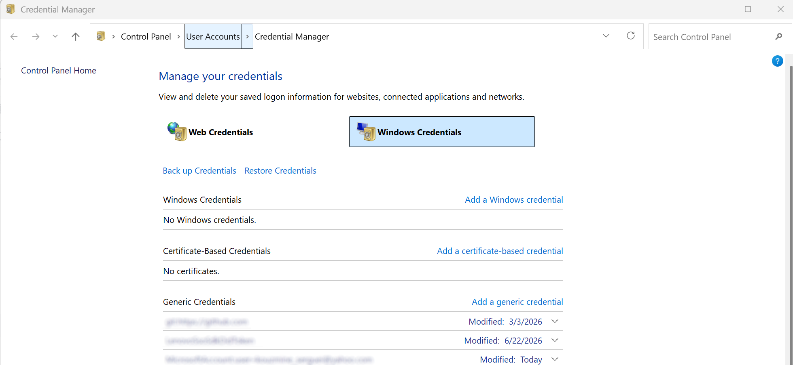
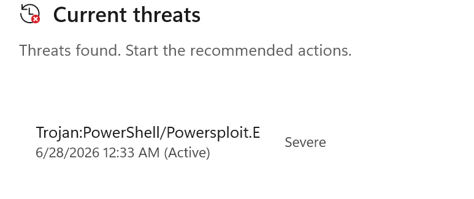

###  Info

Replica of the [gist](https://gist.github.com/meziantou/10311113)
to acccess data in [Windows Credential Manager](https://support.microsoft.com/en-au/windows/accessing-credential-manager-1b5c916a-6a16-889f-8581-fc16e8165ac0) via [p/invoke](https://www.pinvoke.net/default.aspx/advapi32/CredRead.html)
converted into Program and Test projects



### Example
```c#
foreach (var credential in CredentialManager.EnumerateCrendentials()) {

	if (credential.UserName == null) { 
		continue;
	}
	Console.WriteLine("Type: " + credential.CredentialType);
	Console.WriteLine("ApplicationName: " + credential.ApplicationName);				
	Console.WriteLine("UserName: " + credential.UserName);				 
	Console.WriteLine("Password: " +  ((credential.Password != null) ? regex.Replace (credential.Password,"?") : ""));
}	
```
### See also

  * the original author's [Meziantou.Framework SDK](https://github.com/meziantou/Meziantou.Framework)
  * another [similar helper](https://github.com/davotronic5000/PowerShell_Credential_Manager) with Powershell cmdlet
  * [](https://github.com/peewpw/Invoke-WCMDump/blob/master/Invoke-WCMDump.ps1) - PowerShell Script to Dump Windows Credentials from the Credential Manager - contains the same code (`NativeMethods.`) compiled through `add-type`. NOTE: Marked as threat `Powershell.Expolit.E` troyan and is deleted by Windows Defender on __Windows 11__

  * [spolnik/Simple.CredentialsManager](https://github.com/spolnik/Simple.CredentialsManager) - original of all the above, a C# Api for accessing Windows Credential Manager (reading, writing and removing of credentials)


### Author
[Serguei Kouzmine](kouzmine_serguei@yahoo.com)


