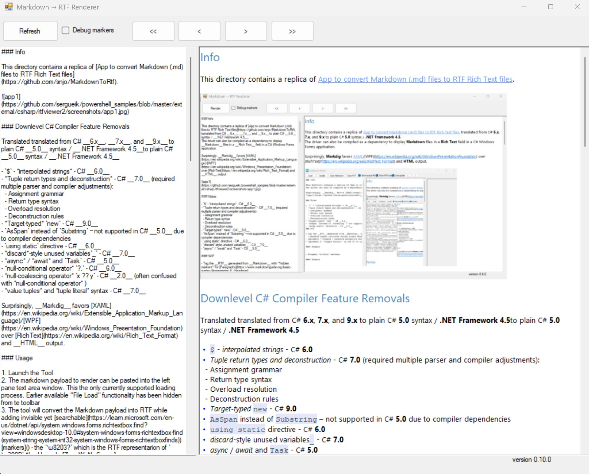

### Info
this directory contains a replica of [App to convert Markdown (.md) files to RTF Rich text files](https://github.com/snjo/MarkdownToRtf) translated __C#__ __6.x__ 7.x__, __9.x__ to plain __C# 5__ syntax / __.Net Framework__ __4.5__ . Driver can be also compiled as dependency to display __Markdown__ files in a __Rich Text__ field in a C# Windows Forms.
Surprisingly the __Markdig__ favors [XAML](https://en.wikipedia.org/wiki/Extensible_Application_Markup_Language)/[WPF](https://en.wikipedia.org/wiki/Windows_Presentation_Foundation) to [RichText](https://en.wikipedia.org/wiki/Rich_Text_Format) and __HTML__.

### Notes

  * `$` - *interpolated strings* - __C#__ __6.0__
  * *tuple return types and deconstruction* - __C#__ __7.0 (required a number of serios parser changes):

     + assignment grammar
     + return type syntax
     + overload resolution
     + deconstruction rules

  * *target-typed* `new` - __C#__ __9.0__
  * `AsSpan` instead of `Substring` - impossible to use on C# __5.0__ due to multiple compiler dependnecies

### See Also

   * [RichText Builder (StringBuilder for RTF](https://www.codeproject.com/articles/RichText-Builder-StringBuilder-for-RTF-) expected to be a relatively easy task.
    * [EXTENDED Version of Extended Rich Text Box (RichTextBoxEx)](https://www.codeproject.com/articles/EXTENDED-Version-of-Extended-Rich-Text-Box-RichTex#comments-section) - `RichTextBoxEx`, which adds to `RichTextBox` features a toolbar and ruler, allows elaborate end-user-initiated functionality in a single WinForms control

  * [MarkdownToRtf](https://github.com/ReneeHuh/MarkdownToRtf)  a static utility that converts __Markdown__ to __RTF__ using [Markdig](https://github.com/xoofx/markdig) parser [Nuget](https://www.nuget.org/packages/Markdig/) dependency - generates WordPad-compatible RTF with proper headers, font tables, and formatting codes. Supports headings, paragraphs, lists, tables, code blocks, emphasis, and hyperlinks

  * [GustavoHennig/MarkdownToRtf](https://github.com/GustavoHennig/MarkdownToRtf) - Net basic markdown to RTF converter

   * [Avalon Renderer](https://github.com/Kryptos-FR/markdig.wpf) of [Markdig](https://github.com/xoofx/markdig)

### Author

[Serguei Kouzmine](mailto:kouzmine_serguei@yahoo.com)

