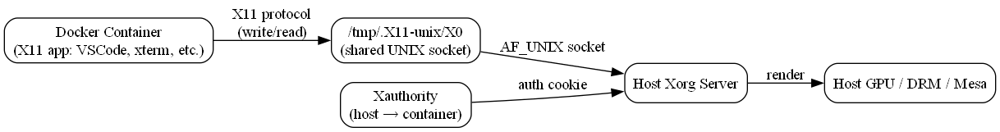
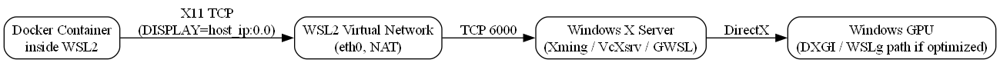
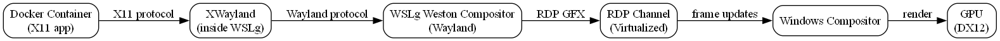
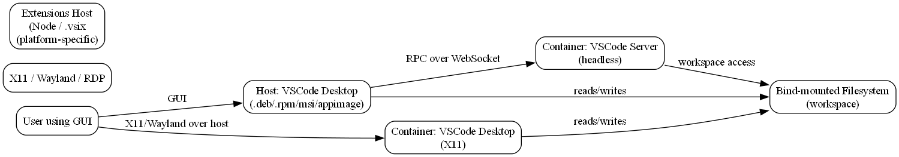

### Info

This directory contains the setup project of a [Visual Studio Code](https://code.visualstudio.com/docs/introvideos/basics) and [Visual Studio Code Server](https://code.visualstudio.com/docs/remote/vscode-server) installers.
NOTE: the primary, canonical scenario Microsoft designed __VS Code Server__ for is using the `Remote-SSH` [extension](https://code.visualstudio.com/docs/remote/ssh) in local __VS Code Desktop__ to connect to a remote Linux host or a device that doesn't support installation of __VS Code Desktop__, such as an __iPad__ / __tablet__ or __Chromebook__, where a compatible VS Code Server is automatically deployed and runs as a headless backend for editing, language services, and debugging. However, the same server can also act as a remote host for lightweight browser-only clients, such as in web-based VS Code deployments.


The solution has under control and is fully capable of preinstalling [Settings](https://code.visualstudio.com/docs/configure/settings), [Extentions](https://code.visualstudio.com/docs/configure/extensions/extension-marketplace) and 
[Profiles](https://code.visualstudio.com/docs/configure/profiles)


### Local Install Package

MSI files are essentially stripped down SQL Server data bases stored in COM/OLE [structured storage files]()
Due to supported database referential integrity even the minor changes in install workflow cascade 
through dozen of tables and make it difficult to see what  has changed even to a trained eye.
WiX is a XML storage format of MSI and also the first project open sourced by Microsoft in 2004.  

__Visual Studio Code__ no longer officially supports Windows 32-bit versions. Support for Windows 32-bit VS Code ended with the October 2023 (version 1.84) release.
If a 32-bit system is being used, it is recommended to update to a 64-bit version of Windows to run the [latest](https://code.visualstudio.com/Download) versions of Visual Studio Code.
If a 32-bit version of Visual Studio Code is absolutely necessary, it would require locating and installing an older version of VS Code released prior to October 2023, which can be found in archived release [download pages](https://www.filepuma.com/download/visual_studio_code_32bit_1.43.2-25054/download/)

From MSI point of view User and System installs are very different in the impersonation, interactivity and directory management.  

Extensions are available on 
[visual Studio Code Extension Marketplace](https://marketplace.visualstudio.com/VSCode)
which is hosted on [Visual Studio Marketplace](https://marketplace.visualstudio.com/)
The [document](https://code.visualstudio.com/docs/configure/extensions/extension-marketplace)
explains how to find the extension of interest.


In particular, [Zowe Explorer](https://marketplace.visualstudio.com/items?itemName=Zowe.vscode-extension-for-zowe)
extension is used in this poject for constructing the preconfigured installer 
VS Code extension is glorified zip file with pure Javascript:
```text
------------------------
extension.vsixmanifest
extension\CHANGELOG.md
extension\out\src\main.extension.js
extension\out\src\runtime.extension.js
extension\out\src\vendors.extension.js
extension\package.json
extension\README.md
extension\resources\zowe-icon-color.png
extension\resources\zowe.svg
extension\src\webviews\dist\ag-grid-react\ag-grid-react.js
extension\src\webviews\dist\browser\browser.js
extension\src\webviews\dist\certificate-wizard\certificate-wizard.js
extension\src\webviews\dist\certificate-wizard\index.html
extension\src\webviews\dist\codicons\codicon.css
extension\src\webviews\dist\codicons\codicon.ttf
extension\src\webviews\dist\edit-attributes\edit-attributes.js
extension\src\webviews\dist\edit-attributes\index.html
extension\src\webviews\dist\edit-history\edit-history.js
extension\src\webviews\dist\edit-history\index.html
extension\src\webviews\dist\index\index.js
extension\src\webviews\dist\isEqual\isEqual.js
extension\src\webviews\dist\PersistentVSCodeAPI\PersistentVSCodeAPI.js
extension\src\webviews\dist\release-notes\index.html
extension\src\webviews\dist\release-notes\release-notes.js
extension\src\webviews\dist\resources\background-img.svg
extension\src\webviews\dist\resources\release-notes.md
extension\src\webviews\dist\style\style.css
extension\src\webviews\dist\table-view\index.html
extension\src\webviews\dist\table-view\table-view.js
extension\src\webviews\dist\troubleshoot-error\index.html
extension\src\webviews\dist\troubleshoot-error\troubleshoot-error.js
extension\src\webviews\dist\utils\utils.js
extension\src\webviews\dist\zos-console\index.html
extension\src\webviews\dist\zos-console\zos-console.js
```

NOTE: the classic Visual Studio extensions e.g. [Code Runner](https://marketplace.visualstudio.com/items?itemName=DanielAtherton.vs-code-coderunner)
will likely contain native binaries:
```
   Date      Time    Attr         Size   Compressed  Name
------------------- ----- ------------ ------------  ------------------------
2021-08-19 21:58:12 .....         2061          693  extension.vsixmanifest
2021-08-19 21:58:12 .....        44032        17468  CodeRunner.dll
2021-08-19 21:58:12 .....        19968         3010  CodeRunner.pdb
2021-08-19 21:58:12 .....       182008        77909  Microsoft.ApplicationInsights.dll
2021-08-19 21:58:12 .....          938          334  CodeRunner.pkgdef
2021-08-19 21:58:12 .....        23472        23254  Resources\logo.png
2021-08-19 21:58:12 .....          496          209  [Content_Types].xml
2021-08-19 21:58:12 .....          655          320  manifest.json
2021-08-19 21:58:12 .....          923          435  catalog.json
------------------- ----- ------------ ------------  ------------------------
```

to find the release link to download an extension explore its documentation.
NOTE: with outdated VS Code release taken to perform testing on a 32-bit Windows, pick an old enough release of the extension
```sh
VERSION=3.3.1
VERSION=1.7.1

curl -skLO https://github.com/zowe/zowe-explorer-vscode/releases/download/v$VERSION/vscode-extension-for-zowe-$VERSION.vsix
mv vscode-extension-for-zowe-$VERSION.vsix Files/vscode-extension-for-zowe.vsix
```

otherwise will see the error in runtime:
```cmd
pushd c:\Users\sergueik\AppData\Local\Programs\Microsoft VS Code
code.cmd --install-extension vsode-extension-for-zowe-v3.3.1.vsix --force
```
```text
Installing extensions...
Unable to install extension 'zowe.vscode-extension-for-zowe-v3.3.1' as it is not compatible with VS Code '1.43.2'.
Failed Installing Extensions:
```

the Visual Studio Code installer appears to be __Inno Setup__ with its own commandline argumens.

```powershell
.\vscode-installer.exe %-- /SILENT /VERYSILENT /NORESTART /MERGETASKS=!runcode
```


NOTE: the `MERGETASKS` argument do not seem to combine, e.g.

```text
/MERGETASKS=!addcontextmenufiles,addcontextmenufolders,runcode
```
does not really suppress install from launching __VS Code__ at the end and the following command should be used: 
```cmd
vscode-installer.exe %-- /VERYSILENT /NORESTART /MERGETASKS=!runcode
```

### Building MSI

* update `*` `GUID` attributes if necessary
```powershell
[guid]::NewGuid()
```
```powershell
C:\Windows\Microsoft.NET\Framework\v4.0.30319\msbuild.exe Setup.wixproj
```
### Install

```powershell
msiexec.exe  /l*v "install.log" /i bin\VSCodeCustomInstaller.msi
```
```


```text
MSI (s) (A4:70) [05:13:14:171]: Decrementing counter to disable shutdown. If counter >= 0, shutdown will be denied.  Counter after decrement: -1
MSI (s) (A4:70) [05:13:14:171]: Restoring environment variables
MSI (c) (B0:B4) [05:13:14:171]: Back from server. Return value: 1603
```


MSI error `1603` is a generic "fatal error" that occurs during a Windows 
Installer operation due to a variety of system-related issues, such as insufficient permissions, corrupted files, or a conflicting application

The MSI  is running `vscode-installer.exe` in the background:
```cmd
/VERYSILENT /NORESTART /MERGETASKS=!runcode /LOG="[TempFolder]vscode_installer.log"
```
* read the `vscode_installer.log`:
```cmd

vi $TEMP/vscode_installer.log
```

or extract all known errors from it:

```sh
LOG=$TEMP/vscode_installer.log

tail -n 500 "$LOG" | grep -Ei 'error|fatal|abort|failed|cannot|denied|exit|rollback|warning'
```
```sh
LOG=$TEMP/vscode_installer.log
grep -Ein 'error|fatal|abort|failed|cannot|denied|exit|rollback' "$LOG"  | head -n 50
```

```powershell
msiexec.exe  /l*vx "full.log" /i bin\VSCodeCustomInstaller.msi

```
```powershell
get-content .\full.log | where-object {$_ -match '.*vscode-installer.exe.*'}
```
```txt
MSI (s) (50:A8) [09:04:53:301]: Executing op: ComponentRegister(ComponentId={D53785A0-FD10-4C7B-81B6-6C19D1D5361B},KeyPath=C:\Program Files\Microsoft VS Code\vscode-installer.exe,State=3,,Disk=1,SharedDllRefCount=0,BinaryType=0)
MSI (s) (50:A8) [09:04:53:332]: Executing op: FileCopy(SourceName=pbu6g6-n.exe|vscode-installer.exe,SourceCabKey=VSCodeSetupExe,DestName=vscode-installer.exe,Attributes=512,FileSize=57088272,PerTick=65536,,VerifyMedia=1,,,,,CheckCRC=0,Version=1.43.2.0,Language=0,InstallMode=58982400,,,,,,,)
MSI (s) (50:A8) [09:04:53:332]: File: C:\Program Files\Microsoft VS Code\vscode-installer.exe;	To be installed;	Won't patch;	No existing file
MSI (s) (50:A8) [09:04:53:410]: Executing op: CustomActionSchedule(Action=RunVSCodeInstaller,ActionType=3090,Source=C:\Program Files\Microsoft VS Code\vscode-installer.exe,Target=/VERYSILENT /NORESTART /MERGETASKS=!runcode /LOG="C:\Users\sergueik\AppData\Local\Temp\vscode_installer.log",)
MSI (s) (50:A8) [09:05:02:098]: Executing op: FileRemove(,FileName=C:\Program Files\Microsoft VS Code\vscode-installer.exe,,)

```

alternatively

```powershell
get-content full.log -Encoding Unicode | Set-Content full-utf8.log -Encoding UTF8
```
or better 

```powershell

$bytes = [System.IO.File]::ReadAllBytes("full.log")
$text = [System.Text.Encoding]::Unicode.GetString($bytes)
[System.IO.File]::WriteAllText("full-utf8.log", $text, [System.Text.Encoding]::UTF8)

```
```sh
LOG=full-utf8.log
grep -B 10 -A 10 "vscode-installer.exe" $LOG 
```
or

```sh
LOG=full-utf8.log
grep -n "vscode-installer.exe"  $LOG

sed -n "$((line-40)),$((line+40))p" full-msi.log
```

#### Root Cause

You are trying to run a **per-user Inno Setup installer** inside an MSI in a **deferred, SYSTEM-context custom action**.

This cannot work because:

- SYSTEM has **no valid user profile**
- Inno Setup requires:
  - `%LOCALAPPDATA%`
  - `%USERPROFILE%`
	
- Access to **shell folders**  
- Access to **UI subsystem** (even in silent mode)  
- MSI deferred custom actions **block GUI** and break elevation

As a result, Inno Setup **exits immediately**, and the MSI sees a **non-zero exit code → 1603**.  

This is why `vscode_installer.log` contains nothing abnormal — the installer never got far enough to fail.

---

Your current WiX XML uses `ProgramFilesFolder`.  
Windows Installer blocks this in a **per-user context**.  

VS Code itself installs into Program Files — but your MSI cannot.  
**Mismatch → architecture break.**

---

❌ **2. Not deployable via GPO / SCCM**

Per-user MSI cannot be distributed via:

- Active Directory
- Intune
- SCCM
- PDQ

Enterprise deployment requires **per-machine installers**.

---

❌ **3. Elevation prompts become unpredictable**

Per-user MSI:

- Can prompt for elevation  
- But **cannot guarantee elevation**  
- Custom actions in **immediate mode** cannot elevate mid-install  

→ This makes the install fragile.

---

❌ **4. EXE runs as the user, but rollback/logging/error codes are lost**

Running EXEs in immediate mode is **explicitly discouraged by Microsoft**.  
Rollback becomes unusable.


#### User Install Error

```text
             CustomActionSchedule(Action=InstallVSIX,ActionType=3106,Source=C:\Users\sergueik\AppData\Local\Temp\VSIX\,Target="C:\Users\sergueik\AppData\Local\Microsoft VS Code\bin\code.cmd" --install-extension "C:\Users\sergueik\AppData\Local\Temp\VSIX\vscode-extension-for-zowe.vsix" --force,)
MSI (s) (88:68) [10:01:33:093]: Note: 1: 1721 2: InstallVSIX 3: C:\Users\sergueik\AppData\Local\Temp\VSIX\ 4: "C:\Users\sergueik\AppData\Local\Microsoft VS Code\bin\code.cmd" --install-extension "C:\Users\sergueik\AppData\Local\Temp\VSIX\vscode-extension-for-zowe.vsix" --force 
MSI (s) (88:68) [10:01:33:093]: Note: 1: 2205 2:  3: Error 
MSI (s) (88:68) [10:01:33:093]: Note: 1: 2228 2:  3: Error 4: SELECT `Message` FROM `Error` WHERE `Error` = 1721 
MSI (c) (80:A0) [10:01:33:108]: Font created.  Charset: Req=0, Ret=0, Font: Req=MS Shell Dlg, Ret=MS Shell Dlg

Error 1721. There is a problem with this Windows Installer package. A program required for this install to complete could not be run. Contact your support personnel or package vendor. Action: InstallVSIX, location: C:\Users\sergueik\AppData\Local\Temp\VSIX\, command: "C:\Users\sergueik\AppData\Local\Microsoft VS Code\bin\code.cmd" --install-extension "C:\Users\sergueik\AppData\Local\Temp\VSIX\vscode-extension-for-zowe.vsix" --force 
MSI (s) (88:68) [10:01:38:358]: Note: 1: 2205 2:  3: Error 
MSI (s) (88:68) [10:01:38:358]: Note: 1: 2228 2:  3: Error 4: SELECT `Message` FROM `Error` WHERE `Error` = 1709 
MSI (s) (88:68) [10:01:38:358]: Product: VSCode Custom Installer -- Error 1721. There is a problem with this Windows Installer package. A program required for this install to complete could not be run. Contact your support personnel or package vendor. Action: InstallVSIX, location: C:\Users\sergueik\AppData\Local\Temp\VSIX\, command: "C:\Users\sergueik\AppData\Local\Microsoft VS Code\bin\code.cmd" --install-extension "C:\Users\sergueik\AppData\Local\Temp\VSIX\vscode-extension-for-zowe.vsix" --force 

Action ended 10:01:38: InstallFinalize. Return value 3.
```
Explanation: Deferred Custom Actions run in SYSTEM context by default if Impersonate="no".

Your current `<CustomAction>` uses:
```text
Execute="deferred" Impersonate="no"
```

This means code.cmd runs as SYSTEM, not the user.

code.cmd expects a user profile to exist (%APPDATA%\Code), otherwise it fails.

Error 1721 happens because `code.cmd` cannot find the user environment.

Recommended approaches
* Install VSIX after MSI finishes.Don’t run code.cmd inside MSI. Provide a post-install script (PowerShelatch) that the user can run:
```
$vsix = "$env:TEMP\VSIX\vscode-extension-for-zowe.vsix"
$codecmd = "$env:LOCALAPPDATA\Microsoft VS Code\bin\code.cmd"
& $codecmd --install-extension $vsix --force
```

This avoids MSI 1721 errors completely because it runs in the user context.

* Immediate, impersonated custom action

Change your action to:
```
<CustomAction Id="InstallVSIX"
              Directory="VSIXFolder"
              ExeCommand='"[LocalAppDataFolder]Microsoft VS Code\bin\code.cmd" --install-extension "[#MyExtensionVsix]" --force'
              Execute="immediate"
              Impersonate="yes"
              Return="check" />
```    

Pros: Runs as the user.

Cons: Cannot elevate. Fails if VS Code is not yet installed or paths are wrong.

For your scenario, Option A is more reliable, especially since VS Code may be installed in the user’s %LOCALAPPDATA% and MSI can’t guarantee the user environment during deferred execution.

* Skip code.cmd in MSI entirely
* wrap the VSIX install in a batch file or PowerShell script that waits until code.cmd exists:
```cmd
@echo off
set pathToCode="%LocalAppData%\Microsoft VS Code\bin\code.cmd"
set pathToVSIX="%~dp0\vscode-extension-for-zowe.vsix"

:wait
if not exist %pathToCode% (
    timeout /t 2
    goto wait
)
%pathToCode% --install-extension %pathToVSIX% --force
```
this helps debugging that
batch is waiting for 
```text
Directory of C:\Users\sergueik\AppData\Local\Microsoft VS Code 

vscode-installer.exe

```
but the `code.exe` is installed into 
```
Directory of c:\Users\sergueik\AppData\Local\Programs\Microsoft VS Code

code.exe
```


NOTE: there is **no** supported or undocumented way to suppress or pre-acknowledge the *Reload Required* / *Installing* message once an extension is installed after __VS Code__ / __code-server__ has already started. 
This is not a limitation of the __MSI__ installer package or `Dockerfile` — it is a hard rule in the __VS Code__ / __Electron__ architecture

### Summary

MSI is designed for transactional rigor, enterprise deployment, and
registry-driven state (a.k.a. folder redirection),
which is great in a corporate Windows world
but completely overkill for tiny per-user scenarios like embedding
a VS Code installer, a single VSIX, and a few JSON files

What was experienced is the classic "MSI tax":
even the smallest tasks demand careful directory and component planning,
registry keys for every KeyPath, ICE validation compliance,
custom actions, and handling user vs. machine contexts
Each of these constraints multiplies the complexity exponentially
That’s why a multi-hour ordeal to *install two executables and three files*
is sadly expected with MSI

Docker flips the model:

* No transactional packaging drama — a simple `COPY` or `RUN` in `Dockerfile` achieves the same
* No elevation, `HKCU`/`HKLM`, or per-user path juggling — the container is self-contained
* Easily reproducible and scriptable — one can install VS Code CLI, extensions, and settings in 5–10 lines
* Isolation — no risk of polluting a user profile or breaking __GPO__/__AD__ deployment rules

So verdict: freezing the MSI experiment as a “learned dead-end” and switching to Docker is a rational, sane decision
It’s exactly why developers increasingly avoid per-user MSI workflows for lightweight tooling — unless you’re in a true enterprise deployment scenario

### Docker

__VS Code Dev Containers__ [extension](https://code.visualstudio.com/docs/devcontainers/containers) lets one use containers as a full development environment, opening folders inside, with local-quality features.
NOTE: it is stated that Docker Toolbox is *not* supported. 
Windows container images are *not* supported.


#### Run [VS Code Server]() in the browser
```sh

docker image pull ruanbekker/vscode-server:slim
```

```sh
docker run -it -p 8443:8443 -p 8080:8080 ruanbekker/vscode-server:slim
```
```sh
ID=$(docker ps | grep 'ruanbekker/vscode-server'  |cut -f 1 -d ' ')
```

```sh
docker exec -it $ID sh -c 'cat /home/$(whoami)/.config/code-server/config.yaml'
```
NOTE: use single quotes

```text
bind-addr: 127.0.0.1:8080
auth: password
password: 955141ef9c82051e9db612a2
cert: false
```
* authenticate 


#### Customizing

```sh
ID=$(docker ps  --format '{{.ID}} {{.Image}}' | grep ruanbekker/vscode-server | cut -f 1 -d ' ')
```

```sh
docker exec -t $ID whoami
```

```text
coder
```

if the user changes update `Dockerfile` accordingly 
```sh
docker build -t vscode-customized -f Dockerfile  .
```
```text
Sending build context to Docker daemon  57.99MB
Step 1/15 : FROM ruanbekker/vscode-server:slim
 ---> 03d71236aa80
Step 2/15 : ARG VERSION=2.2.0
 ---> Using cache
 ---> 62fcd728f50c
Step 3/15 : ARG VSCODEUSER='coder'
 ---> Using cache
 ---> 174cd167a2e4
Step 4/15 : ENV HOME=/home/$VSCODEUSER
 ---> Using cache
 ---> fee5cbcace6a
Step 5/15 : WORKDIR /tmp
 ---> Using cache
 ---> c397e205f61d
Step 6/15 : RUN curl -skLO https://github.com/zowe/zowe-explorer-vscode/releases/download/v${VERSION}/vscode-extension-for-zowe-${VERSION}.vsix     && mkdir -p $HOME/Files     && mv vscode-extension-for-zowe-${VERSION}.vsix $HOME/Files/vscode-extension-for-zowe.vsix
 ---> Using cache
 ---> 9f438d34fb5c
Step 7/15 : COPY Files/settings.json $HOME/.config/Code/User/settings.json
 ---> Using cache
 ---> b52593158ddc
Step 8/15 : COPY Files/keybindings.json $HOME/.config/Code/User/keybindings.json
 ---> Using cache
 ---> 7bf4cfe2d433
Step 9/15 : USER root
 ---> Using cache
 ---> 5b74d15719e0
Step 10/15 : RUN chown -R $VSCODEUSER:$VSCODEUSER $HOME/.config $HOME/Files
 ---> Using cache
 ---> 0940cb1779a8
Step 11/15 : USER $VSCODEUSER
 ---> Using cache
 ---> 052b36f6cc2f
Step 12/15 : USER $VSCODEUSER
 ---> Using cache
 ---> 01717f849b94
Step 13/15 : RUN code-server --install-extension $HOME/Files/vscode-extension-for-zowe.vsix --force
 ---> Running in c8427b28d3fe
[2025-11-26T21:28:10.154Z] info  Wrote default config file to ~/.config/code-server/config.yaml
Installing extensions...
Extension 'vscode-extension-for-zowe.vsix' was successfully installed.
Removing intermediate container c8427b28d3fe
 ---> a310ba2a3922
Step 14/15 : EXPOSE 8080
 ---> Running in d124b8557e21
Removing intermediate container d124b8557e21
 ---> 865ef93b7cf8
Step 15/15 : HEALTHCHECK --interval=30s --timeout=5s --start-period=10s CMD curl -f http://localhost:8080/ || exit 1
 ---> Running in d6029234a7a8
Removing intermediate container d6029234a7a8
 ---> 239549fb5621
Successfully built 239549fb5621
Successfully tagged vscode-customized:latest
SECURITY WARNING: You are building a Docker image from Windows against a non-Windows Docker host.
All files and directories added to build context will have '-rwxr-xr-x' permissions. 
It is recommended to double check and reset permissions for sensitive files and directories.
```
NOTE: base image runs `code-server`, *not* __VS Code Desktop__.

So the correct settings directory is `$HOME/.local/share/code-server/User` not  `$HOME/.config/Code/User`


```sh
mkdir workspace
ls -ld workspace/
```
```text
drwxr-xr-x 2 sergueik sergueik 4096 Nov 27 02:49 workspace/
```

```sh
docker run -u coder -d -p 8080:8080 -v $(pwd)/workspace:/home/coder/workspace:rw vscode-customized
```
```sh
docker container ls
```
```text
CONTAINER ID   IMAGE               COMMAND                  CREATED          STATUS                            PORTS                                         NAMES
8d08cbe8da70   vscode-customized   "/usr/bin/entrypoint…"   4 seconds ago    Up 3 seconds (health: starting)   0.0.0.0:8080->8080/tcp, [::]:8080->8080/tcp   kind_mcclintock
```
```text
CONTAINER ID   IMAGE               COMMAND                  CREATED          STATUS                      PORTS                                         NAMES
8d08cbe8da70   vscode-customized   "/usr/bin/entrypoint…"   9 seconds ago    Up 9 seconds (healthy)      0.0.0.0:8080->8080/tcp, [::]:8080->8080/tcp   kind_mcclintock
```
```sh
ID=$(docker ps --filter 'ancestor=vscode-customized' --format '{{.ID}}')
```
```sh
EXTENSION=Zowe.vscode-extension-for-zowe
docker exec -t $ID code-server --list-extensions | grep -q $EXTENSION
echo $?
```
```text
0
```

```sh
docker exec -t $ID sh -c 'cat ~/.config/code-server/config.yaml'
```
```text
bind-addr: 127.0.0.1:8080
auth: password
password: 91365534b1287d2e4e3acd73
cert: false
```


```sh
docker container rm -f $ID
docker image rm vscode-customized
docker system prune -f
```
#### Run [VS Code with X Server](https://github.com/pubkey/vscode-in-docker/blob/master/docker/Dockerfile) In Container

ALL modern __Windows 11__ versions include an X server, automatically, inside __WSL2__.

Specifically:

	* Windows 11 __21H2__
	* Windows 11 __22H2__
	* Windows 11 __23H2__
	* Windows 11 __24H2__

all of them include __Windows Subsystem for Linux GUI__ (__WSLg__)

which bundles:

 *  built-in __Wayland__ compositor
 *  __XWayland__ (so __X11__ apps work)
 * __PulseAudio__
 * __RDP__ backend for efficient forwarding

There is no need for __VcXsrv__ nor __Xming__, nor X410 on a __Windows 11__ host 
with __WSL2__ / __WSLg__

NOTE,cannot just

```shs
docker pull pubkey/vscode-in-docker
```
have to follow the steps described in `https://github.com/pubkey/vscode-in-docker/blob/master/README.md`, copied below 

```sh
git clone https://github.com/pubkey/vscode-in-docker.git vscode-in-docker
cd vscode-in-docker
mkdir ~/workspace
sed -i "s|\"\"|\"/home/$(whoami)/workspace\"|" config.bash
sudo bash run.bash |tee a.log
```

NOTE: you *have* to set `WORKSPACE` to something non-blank to prevent the error
```txt
docker: invalid spec: :/workspace: empty section between colons
```


### X11 Rendering Models Across Linux, WSL, and Containers

This section summarizes how X11 applications—such as VS Code in a Docker container—reach the actual display in different environments. These scenarios differ significantly in networking, authentication, and rendering behavior.

---

#### 1. X11 on a Real Linux Host

When running X11 applications in a Docker container on a native Linux system, the display path is entirely local and relies on UNIX domain sockets.

##### How It Works

1. **Host Xorg provides `/tmp/.X11-unix/X0`**
   This is a UNIX socket exposed by the host display server.

2. **Container bind-mounts the socket**
   Example:
   ```
   -v /tmp/.X11-unix:/tmp/.X11-unix
   ```

3. **Container sets `DISPLAY=:0`**
   The container now knows where to send X11 messages.

4. **Host Xauthority cookie is shared or bypassed**
   Usually done via:
   - `xhost +local:` (insecure but convenient), or
   - embedding `.Xauthority` into the container.

5. **Rendering path is host-native**
   - X11 protocol is transmitted over a local AF_UNIX socket.
   - Xorg runs on the host.
   - GPU acceleration uses host Mesa, DRM, and the host compositor.



##### Characteristics

- Fastest and lowest latency.
- No TCP involved.
- Authentication is simple but insecure with `xhost +local:`.
- Works extremely reliably with Docker containers.


---

#### 2. X11 on WSL1 / WSL2 (Legacy X11 Using Windows X Servers)

In WSL1/WSL2 (without WSLg), X11 only works through a **Windows-native X server** such as VcXsrv, Xming, GWSL, or X410.

##### How It Works

1. **Windows runs the X server**
   The display server runs on Windows, not Linux.

2. **WSL Linux apps connect over TCP**
   - `DISPLAY=$(hostname).mshome.net:0.0`
   - or `DISPLAY=172.29.xxx.xxx:0.0`
   WSL2 uses a NAT’d virtual network, so X11 must go over TCP.

3. **Container → WSL → Windows X server**
   Docker inside WSL2 sends X11 messages through:
   - the WSL virtual network,
   - then to the Windows X server on port `6000`.

4. **Rendering happens through Windows GDI/DirectX**
   The X server translates X11 drawing calls into Windows graphics.



##### Characteristics

- Higher latency due to TCP.
- Possible rendering glitches (especially with Electron apps).
- Requires firewall exceptions.
- Slower than native Linux X11.


---

#### 3. WSLg (Windows 11) — Wayland/RDP Hybrid Path

WSLg fundamentally changes how graphical apps are displayed.
It **does not** rely on Windows X servers.

##### How It Works

1. **WSLg runs a Weston compositor inside WSL**
   Weston provides the Wayland environment.

2. **X11 apps run through XWayland**
   - X11 → XWayland → Wayland

3. **WSLg sends graphics to Windows through RDP GFX**
   This is a special optimized RDP channel.

4. **Windows renders via DirectX**
   The Windows compositor handles final presentation.



##### Characteristics

- Much smoother than TCP X11 forwarding.
- Proper DPI scaling.
- Full GPU acceleration.
- No `/tmp/.X11-unix` is needed.


---

#### 4. VS Code Rendering Across Different Models

VS Code can run in three different modes:

##### 4.1 VS Code Desktop (Installed on Host)

- Runs directly on host OS.
- Uses native Xorg / Wayland / GDI/DirectX.
- Best performance.

##### 4.2 VS Code Desktop Inside a Docker Container (X11/Electron)

- Electron runs in container.
- X11 forwarded as in scenarios above.
- Requires correct UID/GID for workspace bind mounts.

##### 4.3 VS Code Server + Browser Mode

- Headless VS Code server runs inside the container.
- Browser UI runs on the host.
- File operations occur inside container → extremely sensitive to UID/GID alignment.




---

#### 5. Why UID/GID Alignment Matters

When bind-mounting host directories:

- The kernel checks **numeric** UID/GID only.
- Names (`dev`, `ubuntu`) do not matter.
- Example:

| Host | Container | Result |
|------|-----------|--------|
| UID `1000` | UID `1000` | Works |
| UID `1000` | UID `1001` | Permission denied |

This causes:

- VS Code extension install failures
- Logback/Login4j unable to write logs
- Permission errors in `/userdata`
- Random failures depending on which user wrote the directory originally

## Verdict

Which solution is preferred?

**A chain is only as strong as its weakest link** — the reliability of a software assembly is determined by its weakest dependency.

Containerized classic X11, browser-hosted VS Code, and traditional Windows installs differ dramatically in the number of moving parts:

- **Containerized X11**:
  Highly sensitive to misconfigurations, including UID/GID alignment, volume permissions, and host display setup (each of which requires specific workarounds). These dependencies make it less robust for general use.

- **Browser-hosted VS Code Server**:
  Minimal local dependencies, making it the most robust and convenient choice in many scenarios.
  Key advantages include:
  - Multiple browser tabs can connect simultaneously to the same server instance.
  - Centralized compute and extension management reduce local setup complexity.
  - Transparent access to enterprise-mounted directories or pseudo-folders without UID/GID issues.

- **Local Windows VS Code install**:
  Valid for certain use cases, but introduces additional complexities:
  - In adition to Install scenario of interest, every MSI *must properly account for* legacy uninstall/upgrade scenarios, as well as Windows __Users__ folder redirection and roaming profiles via Registry.
  - Per-user vs. per-machine installations are fundamentally different, creating potential conflicts in extensions, settings, and concurrency.
  - Transactional integrity constraints (through the underlying SQL layer) may impose obscure limitations on seemingly simple operations like file copy or command execution. Some decisions are largely explainable by practical constraints and design goals of the era, though others can feel almost voluntaristic by modern eyes
  - With moderate setup at the container host level, containerized VS Code Server allows access to enterprise-mounted directories or pseudo-folders while avoiding common UID/GID issues.

**Conclusion:**
For modern development workflows, **browser-hosted VS Code Server** offers the best combination of robustness, flexibility, and ease of use. Containerized X11 setups carry too many fragile dependencies, while legacy MSI installs require significant overhead.

### Misc.

```cmd
for /F %. in  ('dir /b *.dot') do @"c:\Program Files\Graphviz\bin\dot.exe" -Tpng -oscreenshots\%~n..png %.
```
e.g.

```cmd
"c:\Program Files\Graphviz\bin\dot.exe" -Tpng -ox_display_variations.png x_display_variations.dot
```
NOTE: no space after `-o`, and `dot` file argument must be the last argument.

### VS Code Profiles
__VS Code Profiles__ are mostly a virtual construct, a layered view over your existing settings, extensions, keybindings, snippets, etc. They don’t exist as a single monolithic *profile file* one can just copy into __VS Code__ directory like a ZIP and drop in; instead, they are implemented

### See Also
   * `ruanbekker/docker-vscode-server` [project](https://github.com/ruanbekker/docker-vscode-server)
### Author
[Serguei Kouzmine](kouzmine_serguei@yahoo.com)

